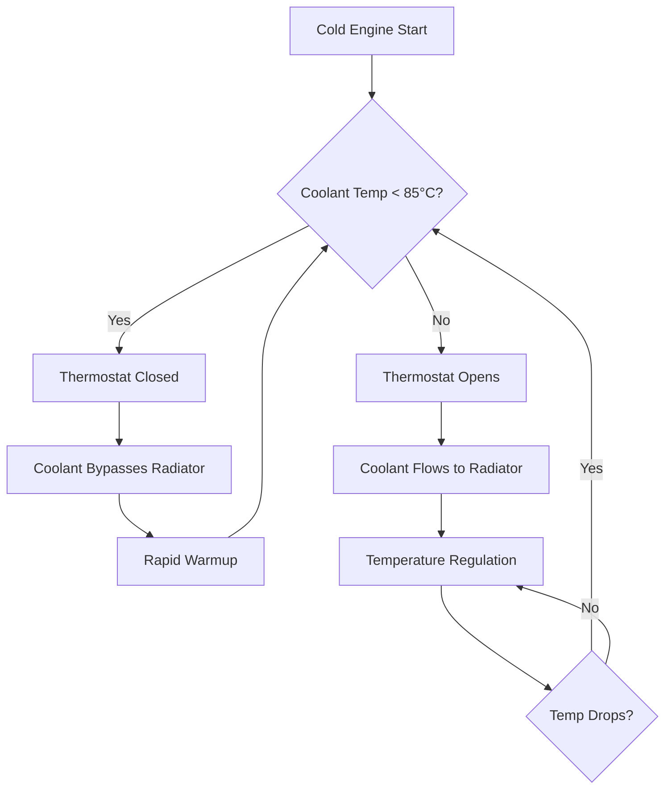
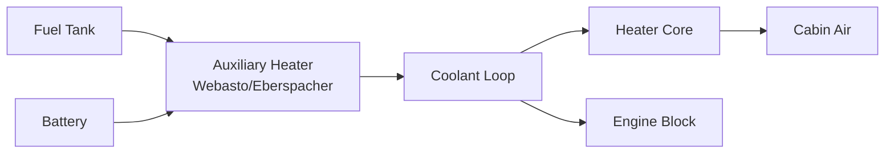

## Overview

Engine coolant heating systems recover waste heat from the internal combustion engine to provide cabin heating in automobiles. Unlike purpose-built heating systems, automotive coolant heating leverages the 60-75% of fuel energy that is rejected as waste heat through the cooling system, making it a highly efficient parasitic heat source. The system operates as a liquid-to-air heat exchanger network, transferring thermal energy from engine coolant (typically ethylene glycol/water mixture) to cabin air via the heater core.

## Thermodynamic Principles

### Waste Heat Recovery

Internal combustion engines convert only 25-35% of fuel chemical energy into mechanical work. The remainder is distributed between exhaust gas losses (30-40%) and coolant system heat rejection (30-35%). The coolant heat rejection rate can be calculated from:

$$Q_{reject} = \dot{m}_{coolant} \cdot c_p \cdot (T_{out} - T_{in})$$

where $\dot{m}_{coolant}$ is the coolant mass flow rate (typically 0.5-2.0 kg/s), $c_p$ is the specific heat of the coolant mixture (approximately 3.5 kJ/kg·K for 50/50 ethylene glycol/water), $T_{out}$ is the engine outlet temperature (85-105°C), and $T_{in}$ is the return temperature (75-90°C).

For a typical 2.0L engine at 3000 RPM producing 50 kW of mechanical power, the coolant heat rejection is approximately 20-30 kW, far exceeding typical cabin heating loads of 3-6 kW at moderate outdoor temperatures.

### Coolant-to-Air Heat Transfer

The heater core functions as a crossflow heat exchanger with coolant flowing through tubes and air passing over finned surfaces. The heat transfer rate is governed by:

$$Q = UA \cdot LMTD$$

where $U$ is the overall heat transfer coefficient (typically 200-400 W/m²·K for automotive heater cores), $A$ is the heat transfer surface area (0.5-1.5 m² for passenger vehicles), and $LMTD$ is the logarithmic mean temperature difference:

$$LMTD = \frac{(T_{c,in} - T_{a,out}) - (T_{c,out} - T_{a,in})}{\ln\left(\frac{T_{c,in} - T_{a,out}}{T_{c,out} - T_{a,in}}\right)}$$

## System Components and Control

### Thermostat Operation

The coolant thermostat serves dual purposes: maintaining optimal engine temperature (typically 85-95°C per SAE J2534) and regulating heat availability for cabin heating. Wax-pellet thermostats operate on thermal expansion principles:

The thermostat opening temperature affects cabin heating performance. A higher setpoint (90-95°C) provides greater heating capacity but may increase warm-up time by 15-25% compared to an 82-88°C thermostat.

### Coolant Flow Control

Coolant circulation is driven by either mechanical water pumps (belt-driven) or electric pumps in modern vehicles. Flow rate control strategies include:

| Control Method | Flow Regulation | Advantages | Disadvantages |
|----------------|-----------------|------------|---------------|
| Fixed Mechanical Pump | None (speed proportional to engine RPM) | Simple, reliable | Overcooling at idle, parasitic losses |
| Variable Speed Electric Pump | PWM control 0-100% | Optimized flow, reduced power consumption | Added electrical load, complexity |
| Dual-Speed Mechanical | Clutch engagement | Improved low-speed performance | Limited control resolution |

Electric pumps provide precise flow control with typical power consumption of 50-150W, enabling coolant circulation during engine-off operation for auxiliary heaters or electric vehicles.

### Heater Core Sizing

Heater core capacity must satisfy peak heating demand while minimizing pressure drop and packaging volume. Sizing calculations follow:

$$Q_{required} = \dot{m}_{air} \cdot c_{p,air} \cdot (T_{discharge} - T_{ambient})$$

For a mid-size sedan requiring 50 g/s airflow at 45°C discharge temperature in -20°C conditions:

$$Q_{required} = 0.05 \times 1.006 \times (45 - (-20)) = 3.27 \text{ kW}$$

With coolant inlet temperature of 90°C and a design outlet of 70°C (20°C drop), the required coolant flow rate is:

$$\dot{m}_{coolant} = \frac{Q_{required}}{c_p \cdot \Delta T} = \frac{3270}{3500 \times 20} = 0.047 \text{ kg/s}$$

## Warmup Time Analysis

Cold start warmup time critically affects passenger comfort and defrosting performance. The warmup transient can be modeled as:

$$M_{coolant} \cdot c_p \cdot \frac{dT}{dt} = Q_{combustion} - Q_{radiator} - Q_{heatercore} - Q_{losses}$$

where $M_{coolant}$ is the total coolant mass (4-8 kg typical). For a simplified case with thermostat closed (no radiator flow) and heater core off:

$$t_{warmup} = \frac{M_{coolant} \cdot c_p \cdot \Delta T}{P_{engine} \cdot \eta_{heating}}$$

For a 5 kg coolant system warming from 0°C to 85°C with a 30 kW engine at 40% heating efficiency:

$$t_{warmup} = \frac{5 \times 3500 \times 85}{30000 \times 0.4} = 124 \text{ seconds} \approx 2.1 \text{ minutes}$$

Actual warmup times extend to 5-10 minutes due to cabin heating loads, radiator losses, and variable engine power during driving.

## Auxiliary Heating Systems

Modern vehicles employ auxiliary heaters to reduce cold-start discomfort:

Auxiliary fuel-fired heaters (per SAE J2757) provide 2-5 kW heating capacity independent of engine operation, consuming 0.2-0.5 L/hr of fuel. These systems pre-warm the coolant loop, reducing warmup time by 50-70% and improving cold-start emissions.

## Performance Considerations

Coolant-to-air heating effectiveness depends on multiple factors:

- **Coolant temperature**: Each 10°C increase in coolant temperature yields approximately 15-20% increase in heating capacity at constant airflow
- **Airflow rate**: Heating capacity increases nearly linearly with airflow up to the point where air-side thermal resistance dominates
- **Altitude effects**: Reduced air density at altitude decreases mass flow rate by approximately 3% per 1000 ft elevation
- **Glycol concentration**: Higher glycol content (>50%) reduces specific heat and thermal conductivity, decreasing heat transfer by 5-10%

## Standards and Testing

SAE J2765 defines test procedures for automotive HVAC systems, including:
- Steady-state heating capacity measurement at -18°C, 0°C, and 20°C ambient
- Transient warmup performance from cold start
- Coolant flow rate and pressure drop characterization
- Heater core effectiveness rating
