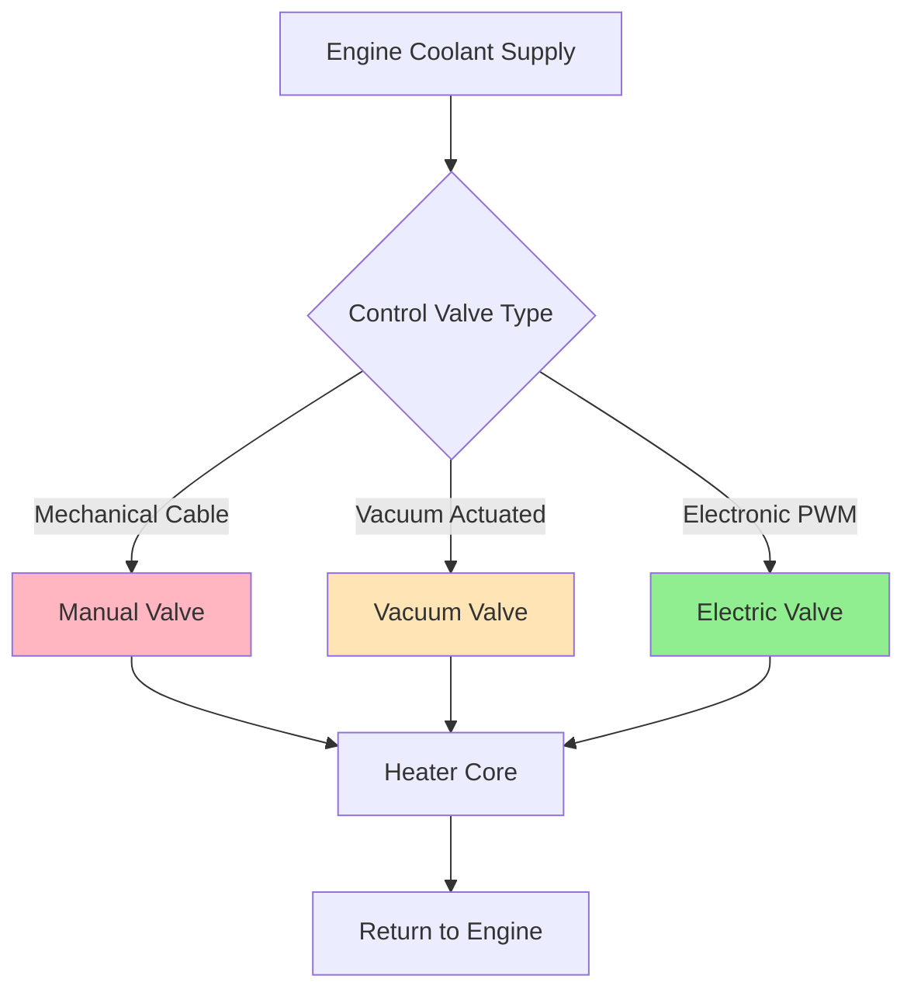
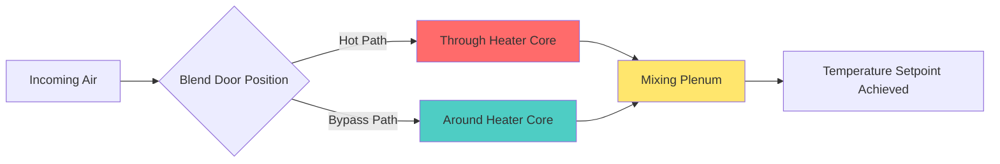

Automotive heater core systems function as liquid-to-air heat exchangers that transfer thermal energy from engine coolant to cabin air. The heater core represents the primary heat source for passenger compartment heating and windshield defrost operations in most conventional vehicles.

## Heat Exchanger Construction

### Tube-and-Fin Architecture

Modern heater cores utilize two primary construction methodologies: copper-brass and aluminum designs. The fundamental architecture consists of parallel coolant tubes with secondary heat transfer surfaces (fins) to enhance air-side performance.

**Design parameters:**

| Parameter | Copper-Brass | Aluminum |
|-----------|--------------|----------|
| Tube wall thickness | 0.3-0.4 mm | 0.2-0.3 mm |
| Fin density | 8-12 FPI | 10-16 FPI |
| Core depth | 25-40 mm | 20-35 mm |
| Operating pressure | 138-207 kPa | 138-207 kPa |

The overall heat transfer coefficient depends on both liquid-side and air-side thermal resistances:

$$\frac{1}{UA} = \frac{1}{h_{\text{coolant}} A_{\text{tube}}} + \frac{t_{\text{wall}}}{k_{\text{wall}} A_{\text{avg}}} + \frac{1}{\eta_{\text{fin}} h_{\text{air}} A_{\text{total}}}$$

where $\eta_{\text{fin}}$ represents fin efficiency, typically 0.75-0.85 for automotive applications.

Aluminum cores provide 45-50% mass reduction compared to copper-brass while maintaining equivalent thermal performance due to higher fin density and improved fin efficiency from superior thermal conductivity.

## Coolant-Side Heat Transfer

Engine coolant enters the heater core at temperatures ranging from 80-95°C during normal operation. Flow rate through the core depends on heater control valve position and system pressure differential.

The liquid-side heat transfer coefficient follows the Dittus-Boelter correlation for turbulent flow:

$$Nu_D = 0.023 Re_D^{0.8} Pr^{0.4}$$

$$h_{\text{coolant}} = \frac{Nu_D \cdot k_{\text{coolant}}}{D_h}$$

Typical coolant-side Reynolds numbers range from 2000-8000 depending on flow rate and tube diameter. The hydraulic diameter $D_h$ for rectangular tubes:

$$D_h = \frac{4 \cdot A_c}{P_{\text{wetted}}}$$

### Coolant Flow Control

Three primary control valve technologies regulate coolant flow:

**Control valve comparison:**

| Type | Response Time | Control Resolution | Power Consumption |
|------|---------------|-------------------|-------------------|
| Mechanical cable | 2-5 s | Step (on/off) | 0 W |
| Vacuum actuated | 1-3 s | Variable | 0 W |
| Electronic PWM | 0.5-1.5 s | Continuous | 15-30 W |

Electronic valves provide superior temperature control through pulse-width modulation, enabling precise flow modulation according to SAE J2765 climate control protocols.

## Air-Side Heat Transfer

Cabin air flows across the finned surface, creating convective heat transfer. The blower motor forces air through the HVAC case at volumetric flow rates of 150-400 CFM (4.2-11.3 m³/min) depending on fan speed selection.

Air-side heat transfer coefficient:

$$h_{\text{air}} = \frac{Nu \cdot k_{\text{air}}}{D_h}$$

The Nusselt number for compact heat exchangers with louvered fins:

$$Nu = C \cdot Re^m \cdot Pr^{1/3}$$

where constants $C$ and $m$ depend on fin geometry (typically $C = 0.3-0.5$, $m = 0.6-0.7$).

Total heat transfer rate from the heater core:

$$\dot{Q} = \dot{m}_{\text{coolant}} c_{p,\text{coolant}} (T_{\text{in}} - T_{\text{out}}) = \dot{m}_{\text{air}} c_{p,\text{air}} (T_{\text{out}} - T_{\text{in}})$$

For a typical mid-size vehicle, heater core capacity ranges from 5-8 kW at maximum coolant flow and blower speed.

## Temperature Blend Door Control

Temperature regulation occurs through air flow modulation using blend doors rather than exclusively through coolant flow control. The blend door diverts varying proportions of air through or around the heater core.

The discharge air temperature as a function of blend door position $\theta$ (0° = full cold, 90° = full hot):

$$T_{\text{discharge}} = T_{\text{ambient}} + \left(\frac{\theta}{90°}\right) \cdot \frac{\dot{Q}_{\text{core}}}{\dot{m}_{\text{air}} c_{p,\text{air}}}$$

Electronic actuators position blend doors with accuracy of ±2° to maintain cabin temperature within ±1°C of setpoint per SAE J2765 requirements.

## Defrost Mode Integration

Defrost operation directs maximum heat output to the windshield. This mode activates specific operational parameters:

**Defrost mode settings:**
- Blend door: Full hot position (maximum heater core flow)
- Blower speed: High or medium-high
- Air distribution: 100% to windshield outlets
- Recirculation door: Fresh air position
- A/C compressor: Activated (for dehumidification)

The defrost heat flux requirement follows SAE J902 test procedures:

$$\dot{q}_{\text{defrost}} = \frac{\dot{Q}_{\text{total}} \cdot \alpha_{\text{windshield}}}{A_{\text{windshield}}}$$

where $\alpha_{\text{windshield}}$ represents the fraction of total airflow directed to windshield outlets (typically 0.85-0.95 in defrost mode).

For frost removal, the required heat flux to the windshield typically exceeds 200 W/m² to achieve clearing within 10-15 minutes per SAE J902 standards.

## Performance Degradation Factors

Heater core effectiveness decreases due to:

1. **Coolant-side fouling:** Scale deposits reduce internal flow area and increase thermal resistance
2. **Air-side blockage:** Debris accumulation between fins reduces airflow by 15-30%
3. **Fin corrosion:** Oxidation degrades fin efficiency from 0.80 to 0.60
4. **Coolant flow restriction:** Partial valve failure limits flow to 40-60% of design value

The effectiveness reduction:

$$\varepsilon_{\text{degraded}} = \varepsilon_{\text{design}} \cdot (1 - f_{\text{fouling}}) \cdot (1 - f_{\text{blockage}})$$

Regular coolant system maintenance and cabin air filter replacement preserve heater core performance throughout vehicle service life.

## Components

- Heater Core Construction
- Copper Brass Heater Core
- Aluminum Heater Core
- Tube And Fin Design
- Coolant Flow Heater Core
- Heater Control Valve
- Electric Heater Control Valve
- Vacuum Heater Control Valve
- Coolant Temperature Blend
- Heater Core Capacity
