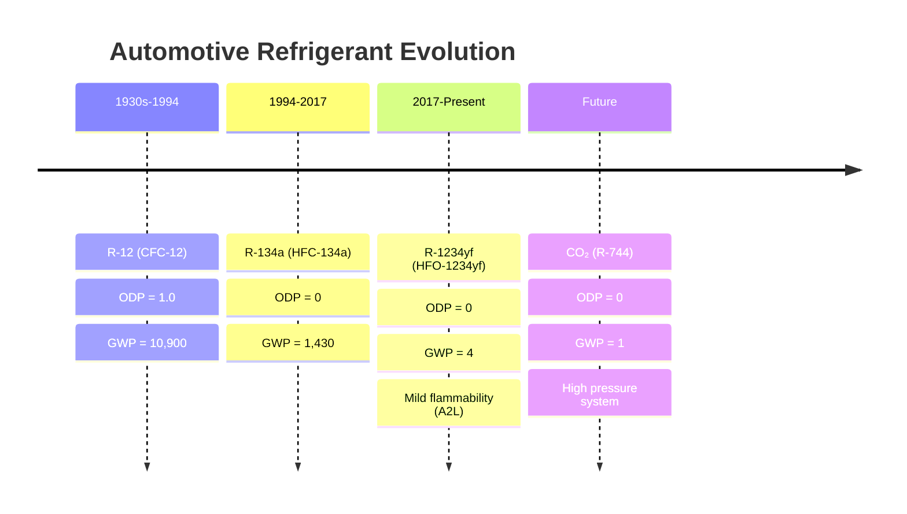
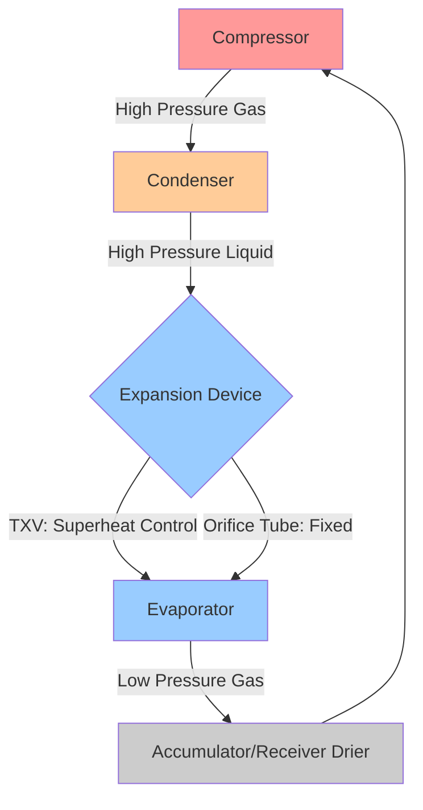

Automotive refrigerant systems employ vapor compression cycles adapted to the unique constraints of mobile applications, including variable speed operation, high ambient temperatures, limited packaging space, and stringent weight requirements. The evolution of refrigerants used in mobile air conditioning (MAC) systems reflects the industry's response to environmental concerns while maintaining thermal performance.

## Refrigerant Evolution Timeline

The transition from CFC-based to low-GWP refrigerants represents one of the most significant engineering challenges in automotive HVAC history.

## Refrigerant Properties Comparison

The selection of automotive refrigerants balances thermodynamic performance, environmental impact, safety, and compatibility with existing infrastructure.

| Property | R-12 | R-134a | R-1234yf | CO₂ (R-744) |
|----------|------|--------|----------|-------------|
| **Molecular Formula** | CCl₂F₂ | CH₂FCF₃ | CF₃CF=CH₂ | CO₂ |
| **Molecular Weight** | 120.9 | 102.0 | 114.0 | 44.0 |
| **Boiling Point (°C)** | -29.8 | -26.1 | -29.4 | -78.4 (sublimation) |
| **Critical Temp (°C)** | 112.0 | 101.1 | 94.7 | 31.1 |
| **Critical Press (bar)** | 41.4 | 40.6 | 33.8 | 73.8 |
| **ODP** | 1.0 | 0 | 0 | 0 |
| **GWP (100-yr)** | 10,900 | 1,430 | 4 | 1 |
| **ASHRAE Safety** | A1 | A1 | A2L | A1 |
| **Specific Volume (L/kW)** | 100% | 112% | 107% | 8% |
| **Discharge Temp (°C)** | 65-75 | 70-80 | 65-75 | 90-120 |

## Thermodynamic Performance Analysis

The vapor compression cycle efficiency in automotive applications depends on compressor displacement, refrigerant properties, and operating conditions.

### Coefficient of Performance

The theoretical COP for a vapor compression cycle operating between evaporator temperature $T_e$ and condenser temperature $T_c$ is:

$$\text{COP}_{\text{ideal}} = \frac{T_e}{T_c - T_e}$$

For typical automotive conditions ($T_e = 5°C = 278K$, $T_c = 55°C = 328K$):

$$\text{COP}_{\text{ideal}} = \frac{278}{328 - 278} = \frac{278}{50} = 5.56$$

Actual automotive AC systems achieve COP values between 1.5 and 2.5 due to:
- Compressor inefficiencies (mechanical and volumetric)
- Pressure drops in heat exchangers and lines
- Heat transfer irreversibilities
- Variable speed operation
- Non-ideal refrigerant behavior

### Cooling Capacity Calculation

The refrigeration effect per unit mass of refrigerant is:

$$q_e = h_1 - h_4$$

Where $h_1$ is the enthalpy leaving the evaporator and $h_4$ is the enthalpy entering the evaporator after expansion.

Total cooling capacity depends on mass flow rate:

$$\dot{Q}_e = \dot{m} \cdot (h_1 - h_4) = \dot{m} \cdot q_e$$

For a variable displacement compressor, mass flow rate varies with:

$$\dot{m} = \frac{\eta_v \cdot V_d \cdot N \cdot \rho_{\text{suction}}}{60}$$

Where:
- $\eta_v$ = volumetric efficiency (0.70-0.85)
- $V_d$ = displacement volume per revolution (cm³/rev)
- $N$ = compressor speed (RPM)
- $\rho_{\text{suction}}$ = refrigerant density at compressor inlet (kg/m³)

### Compressor Power Requirement

Compressor power consumption directly affects fuel economy and vehicle emissions:

$$\dot{W}_{\text{comp}} = \dot{m} \cdot (h_2 - h_1) = \dot{m} \cdot \frac{h_{2s} - h_1}{\eta_{\text{isen}}}$$

Where $h_{2s}$ is the isentropic discharge enthalpy and $\eta_{\text{isen}}$ is isentropic efficiency (0.60-0.75 for automotive compressors).

## System Component Requirements

Automotive refrigerant systems must withstand extreme operating conditions while minimizing weight and cost.

### High-Side Pressure Ranges

| Refrigerant | Idle (bar) | Highway (bar) | Max Design (bar) | SAE Standard |
|-------------|------------|---------------|------------------|--------------|
| R-12 | 10-12 | 14-16 | 24.8 | SAE J639 |
| R-134a | 8-10 | 12-15 | 31.7 | SAE J2064 |
| R-1234yf | 8-10 | 12-15 | 31.0 | SAE J2843 |
| CO₂ | 75-85 | 90-110 | 140 | SAE J2842 |

### Component Material Compatibility

The transition to R-1234yf required evaluation of material compatibility, particularly with elastomers and lubricants.

**Elastomer Compatibility:**
- EPDM (ethylene propylene diene monomer) seals
- HNBR (hydrogenated nitrile butadiene rubber) for high-temperature applications
- Fluoroelastomers for compressor shaft seals

**Lubricant Requirements:**
- R-12: Mineral oil
- R-134a: PAG (polyalkylene glycol) or POE (polyol ester)
- R-1234yf: PAG oil (ISO 46 or ISO 100 viscosity)
- CO₂: PAG or POE with enhanced lubricity additives

## Environmental Regulations

### EPA SNAP Program

The EPA Significant New Alternatives Policy (SNAP) program evaluates refrigerant acceptability based on:
- Ozone depletion potential (ODP)
- Global warming potential (GWP)
- Flammability and toxicity
- Energy efficiency impact

As of 2017, R-134a is unacceptable for new passenger vehicles in the United States, driving adoption of R-1234yf (40 CFR Part 82).

### European MAC Directive

EU Directive 2006/40/EC mandates that refrigerants in new vehicle types have GWP < 150, effectively requiring R-1234yf or CO₂ systems for vehicles type-approved after January 1, 2017.

### SAE Standards for Low-GWP Refrigerants

**SAE J2843** - R-1234yf Service Hose Fittings
- Specifies unique fittings (16mm ACME thread) to prevent cross-contamination with R-134a
- Requires service equipment compatibility testing

**SAE J2851** - R-1234yf Refrigerant Purity and Container Requirements
- Minimum purity: 99.5% by weight
- Maximum moisture content: 10 ppm
- Air and non-condensables: <1.5% by volume

**SAE J3030** - Automotive Refrigerant System Flushing Procedure
- Critical for preventing cross-contamination during service
- Specifies flushing fluid types and procedures

## Performance Testing Requirements

### SAE J2765 - MAC System Performance Testing

Standard test conditions for capacity and COP measurement:
- Ambient temperature: 35°C (95°F)
- Relative humidity: 50%
- Vehicle speed: 48 km/h (30 mph)
- Engine speed: 1500 RPM
- Blower: High speed
- Recirculation: 100%

Cooling capacity at standard conditions typically ranges from 3.5 to 6.5 kW for passenger vehicles.

### Leak Detection and Refrigerant Loss

Automotive systems experience higher leak rates than stationary systems due to vibration, thermal cycling, and flexible connections. SAE J2727 specifies maximum allowable leak rates:

$$\text{Leak Rate} < 14 \text{ g/year (0.5 oz/year)}$$

This corresponds to less than 3% annual charge loss for typical systems (450-650g charge).

## System Architecture Comparison

**TXV Systems (Thermal Expansion Valve):**
- Better superheat control (5-8°C)
- Improved efficiency at varying loads
- Receiver-drier on high side
- Higher cost and complexity

**Orifice Tube Systems:**
- Fixed metering restriction
- Accumulator on low side prevents liquid slugging
- Lower cost, higher reliability
- Less efficient at part-load conditions

## R-1234yf Implementation Challenges

### Mild Flammability Considerations

R-1234yf has ASHRAE A2L classification (lower flammability, lower toxicity). The lower flammability limit (LFL) is 6.2% by volume in air.

**Safety measures implemented:**
- Reduced refrigerant charge (typically 450-600g vs 600-800g for R-134a)
- Enhanced leak detection
- Compressor shaft seal improvements
- Proper service procedures per SAE J2845

### Cost and Service Infrastructure

Initial R-1234yf implementation challenges included:
- Refrigerant cost: $50-70/lb vs $5-8/lb for R-134a (2018 prices)
- Dedicated service equipment required (no cross-contamination)
- Technician training and certification
- Unique fittings and color-coding (light blue vs R-134a dark blue)

## Future Trends: CO₂ Systems

Transcritical CO₂ systems operate above the critical point (31.1°C, 73.8 bar) during hot ambient conditions, requiring different heat rejection strategies.

**Advantages:**
- Lowest GWP (GWP = 1)
- Non-flammable, non-toxic
- Excellent heat transfer properties
- Can provide heating via gas cooler

**Challenges:**
- High operating pressures (up to 140 bar)
- Complex controls required
- Higher component costs
- Lower efficiency at high ambient temperatures without ejector or parallel compression

The thermodynamic disadvantage at high ambient temperatures drives development of advanced cycle modifications, including internal heat exchangers, ejectors, and two-stage compression with intercooling.

---

**References:**
- SAE J2843: R-1234yf (HFO-1234yf) Service Hose Fittings
- SAE J2765: Procedure for Measuring System COP of Mobile A/C Systems
- SAE J2851: R-1234yf Refrigerant Purity and Container Requirements
- EPA 40 CFR Part 82: Protection of Stratospheric Ozone
- EU Directive 2006/40/EC: MAC Directive on Mobile Air Conditioning Systems
