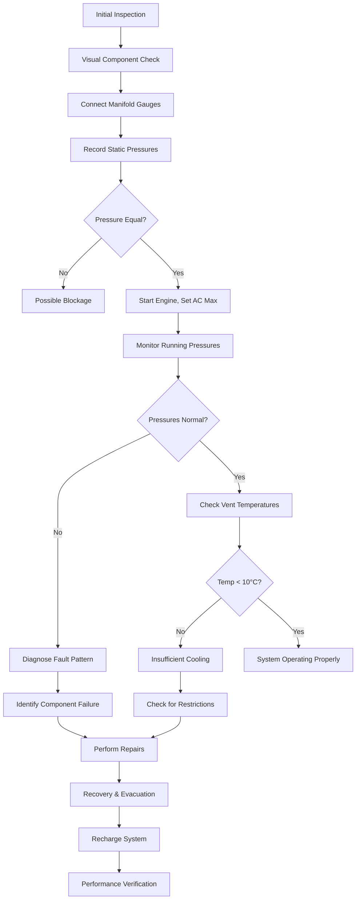

Automotive air conditioning diagnostics and service require systematic procedures combining pressure-temperature analysis, leak detection techniques, and refrigerant handling protocols. The physics of vapor compression dictates specific pressure relationships that reveal system health, while proper service procedures maintain refrigerant purity and system integrity per SAE J2788 standards.

## Manifold Gauge Diagnostics

### Pressure-Temperature Relationships

The saturated vapor pressure of refrigerant in the evaporator and condenser provides diagnostic information. For R-134a, the saturation pressure follows the Clausius-Clapeyron relationship:

$$\frac{dP}{dT} = \frac{h_{fg}}{T \cdot v_{fg}}$$

where $h_{fg}$ is the latent heat of vaporization and $v_{fg}$ is the specific volume change during phase transition.

Typical operating pressures at 35°C (95°F) ambient conditions:

| System Condition | Low Side (kPa) | High Side (kPa) | Diagnosis |
|-----------------|----------------|-----------------|-----------|
| Normal Operation | 170-240 | 1380-1720 | Proper charge, functioning components |
| Low Refrigerant | 100-140 | 1100-1380 | Insufficient charge, possible leak |
| Overcharge | 280-340 | 1900-2410 | Excess refrigerant, reduced efficiency |
| Restricted Orifice | 70-100 | 1550-1900 | Low evaporator flow, high superheat |
| Blocked Condenser | 210-280 | 2070-2760 | Insufficient heat rejection |
| Compressor Failure | 140-210 | 1030-1380 | Poor compression, low pressure ratio |

### Superheat and Subcooling Analysis

Superheat in the evaporator outlet indicates complete vaporization:

$$\Delta T_{superheat} = T_{outlet} - T_{sat,evap}$$

Proper superheat ranges from 5-8°C for thermal expansion valve (TXV) systems and 10-15°C for orifice tube systems. Subcooling at the condenser outlet confirms complete condensation:

$$\Delta T_{subcool} = T_{sat,cond} - T_{outlet}$$

Target subcooling is 8-12°C, ensuring liquid refrigerant reaches the expansion device without flash gas formation.

## Diagnostic Service Workflow

## Leak Detection Methods

### Electronic Leak Detection

Halogen-specific electronic detectors sense refrigerant molecules at concentrations as low as 3-5 grams per year leak rate. The sensing element operates on heated diode or corona discharge principles, where refrigerant molecules alter electrical conductivity.

Detection sensitivity:

$$S_{detector} = \frac{\Delta R}{R_0} \cdot \frac{1}{C_{refrigerant}}$$

where $\Delta R$ is resistance change and $C_{refrigerant}$ is refrigerant concentration in ppm.

### UV Dye Leak Detection

Fluorescent dye injected into the refrigerant circuit concentrates at leak points. Under UV illumination (365 nm wavelength), the dye fluoresces, revealing leaks invisible to other methods. Dye concentration is typically 7-14 ml per system, with no impact on thermal properties.

### Pressure Decay Testing

Static pressure testing quantifies leak rate by monitoring pressure drop over time. For a system at temperature $T$ with volume $V$:

$$\dot{m}_{leak} = -\frac{V}{RT} \cdot \frac{dP}{dt}$$

A properly sealed system exhibits pressure decay less than 35 kPa over 30 minutes.

## Recovery and Evacuation Procedures

### Refrigerant Recovery

SAE J2788 mandates recovery to 102 mm Hg (13.6 kPa) vacuum or lower within 5 minutes to minimize refrigerant release. Recovery machines employ a compressor and condenser to transfer refrigerant from the vehicle system to a storage cylinder.

Recovery efficiency:

$$\eta_{recovery} = \frac{m_{recovered}}{m_{initial}} \times 100\%$$

Modern equipment achieves 95-98% recovery efficiency, with residual refrigerant trapped in compressor oil.

### System Evacuation

Deep vacuum removes moisture and non-condensables. The vapor pressure of water decreases exponentially with vacuum depth:

| Vacuum Depth (mm Hg) | Water Boiling Point (°C) | Evaporation Rate |
|---------------------|--------------------------|------------------|
| 760 (atmospheric) | 100 | Baseline |
| 200 | 66 | 3.8× faster |
| 50 | 38 | 15× faster |
| 2 | 5 | 380× faster |

Target vacuum is 500 microns (0.5 mm Hg) maintained for 10-30 minutes. Moisture content must remain below 50 ppm to prevent system corrosion and acid formation.

## Recharge Procedures

### Refrigerant Quantity Determination

Charging by weight ensures accurate refrigerant quantity per manufacturer specifications. Overcharge by 10% increases high-side pressure by approximately 200 kPa and reduces cooling capacity by 5-8% due to condenser flooding.

Charge accuracy requirement:

$$\Delta m_{charge} \leq \pm 25 \text{ grams}$$

for systems with nominal charges of 400-900 grams.

### Subcooling Method Charging

For systems without sight glass, charging to proper subcooling ensures optimal performance:

1. Add refrigerant in 25-gram increments
2. Allow 2-3 minutes stabilization between additions
3. Measure liquid line temperature and high-side pressure
4. Calculate subcooling and compare to target (8-12°C)
5. Stop when subcooling reaches specification

## System Performance Verification

### Temperature Differential Testing

Center vent discharge temperature at maximum cooling and recirculation mode should achieve:

$$T_{vent} = T_{ambient} - \Delta T_{performance}$$

where $\Delta T_{performance}$ ranges from 22-28°C at 35°C ambient, 50% relative humidity, and 1500 RPM engine speed.

### Compressor Capacity Verification

Compressor swept volume determines theoretical mass flow:

$$\dot{m}_{theoretical} = \frac{V_{swept} \cdot N \cdot \rho_{suction}}{60}$$

where $V_{swept}$ is displacement per revolution, $N$ is compressor RPM, and $\rho_{suction}$ is refrigerant density at suction conditions. Actual mass flow is reduced by volumetric efficiency (typically 75-85%).

### System COP Measurement

Coefficient of performance relates cooling output to compressor work:

$$COP = \frac{Q_{evap}}{W_{comp}} = \frac{\dot{m} \cdot (h_{evap,out} - h_{evap,in})}{T_{comp} \cdot \dot{m} \cdot (h_{comp,out} - h_{comp,in})}$$

Automotive systems achieve COP values of 1.8-2.5 at design conditions, lower than stationary equipment due to variable speed operation and packaging constraints.

## Refrigerant Purity Testing

### Contamination Detection

Refrigerant identifiers analyze composition using infrared spectroscopy or thermal conductivity. SAE J2788 requires purity greater than 98% for R-134a and 99% for R-1234yf. Common contaminants include:

- Air (non-condensable): Increases high-side pressure, reduces capacity
- Moisture: Forms acids, corrodes components
- Other refrigerants: Alters pressure-temperature relationships
- Oil carryover: Acceptable up to 4000 ppm by weight

### Oil Separation and Measurement

During recovery, compressor oil is separated and measured. Oil loss exceeding 60 ml indicates system leakage requiring oil replacement to maintain proper lubrication levels of 100-150 ml total system charge.

## Service Equipment Requirements

Professional automotive AC service requires:

- Recovery/recycling/recharging (RRR) machine meeting SAE J2788
- Manifold gauge set with 0.1 bar resolution
- Electronic leak detector with 5 g/year sensitivity
- Vacuum pump achieving 50 microns
- Refrigerant scale with ±5 gram accuracy
- Thermometer with ±0.5°C accuracy
- Refrigerant identifier

All equipment must be calibrated annually to maintain diagnostic accuracy and ensure proper system service per manufacturer and regulatory requirements.

---

## Components

- Refrigerant Leak Detection
- Electronic Leak Detector
- Uv Dye Leak Detection
- Pressure Testing System
- Vacuum Testing Procedure
- Evacuation Procedure
- Charging Procedure Automotive
- Refrigerant Identifier
- Purity Testing Refrigerant
- Ac Service Equipment
