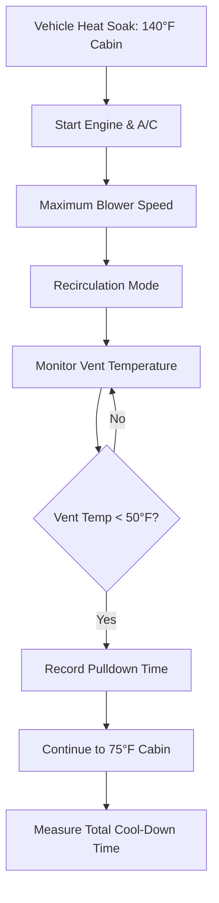
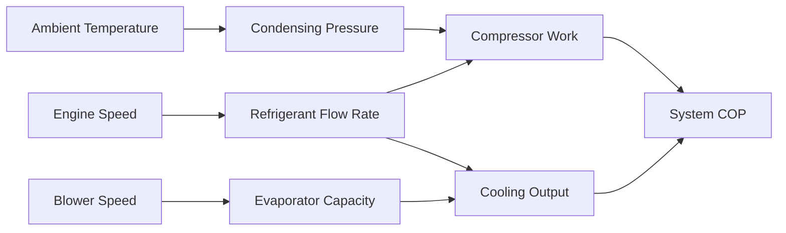

## Overview

Automotive refrigerant system performance testing quantifies the cooling capacity, efficiency, and thermal response characteristics of mobile air conditioning systems under controlled conditions. Unlike stationary HVAC systems, automotive applications face unique challenges including variable engine speeds, extreme ambient conditions, solar loading, and dynamic airflow patterns that demand specialized testing protocols.

## SAE J2765 Cooling Capacity Test

SAE J2765 establishes the standard methodology for measuring steady-state cooling capacity in automotive climate control systems. The test quantifies total heat removal rate under specified operating conditions.

### Test Setup Requirements

The vehicle is placed in an environmental chamber with precise control over:

| Parameter | Specification | Tolerance |
|-----------|---------------|-----------|
| Ambient Temperature | 95°F (35°C) | ±2°F |
| Relative Humidity | 40% | ±5% |
| Solar Load | 850 W/m² | ±50 W/m² |
| Vehicle Speed Simulation | 30 mph equivalent | ±2 mph |

Engine speed is stabilized at manufacturer-specified idle or 1500 RPM, maintaining constant refrigerant compressor displacement. The system operates for minimum 30 minutes to achieve thermal equilibrium before measurements begin.

### Cooling Capacity Calculation

Total cooling capacity combines sensible and latent heat removal:

$$Q_{total} = Q_{sensible} + Q_{latent}$$

where:

$$Q_{sensible} = \dot{m}_{air} \cdot c_{p,air} \cdot (T_{in} - T_{out})$$

$$Q_{latent} = \dot{m}_{air} \cdot (W_{in} - W_{out}) \cdot h_{fg}$$

Variables defined:
- $\dot{m}_{air}$ = mass flow rate of air (kg/s)
- $c_{p,air}$ = specific heat of air at constant pressure = 1.006 kJ/(kg·K)
- $T_{in}$, $T_{out}$ = inlet and outlet air temperatures (K)
- $W_{in}$, $W_{out}$ = inlet and outlet humidity ratios (kg water/kg dry air)
- $h_{fg}$ = latent heat of vaporization = 2501 kJ/kg at 0°C

Air mass flow rate determination uses nozzle chamber methodology per SAE J1487:

$$\dot{m}_{air} = C_d \cdot A_{nozzle} \cdot \sqrt{2 \rho_{air} \Delta P}$$

where $C_d$ is the discharge coefficient (typically 0.98-0.99), $A_{nozzle}$ is total nozzle area, and $\Delta P$ is pressure differential across the nozzle bank.

## Pulldown Time Testing

Pulldown testing characterizes the transient thermal response of the vehicle cabin from extreme heat soak conditions. This metric directly correlates with customer satisfaction during vehicle entry on hot days.

### Heat Soak Procedure

The vehicle undergoes thermal saturation at ambient temperature of 95-110°F with:
- All windows closed
- Solar simulation lamps providing 1000 W/m² irradiance
- Soak duration: 2-4 hours until cabin reaches equilibrium

Interior thermal mass stores substantial energy:

$$Q_{stored} = \sum m_i \cdot c_{p,i} \cdot \Delta T_i$$

summed over all cabin components (seats, dashboard, headliner, trim panels), where $m_i$ and $c_{p,i$ represent mass and specific heat of each component.

### Pulldown Performance Metrics

Standard measurement points:

| Metric | Target | Evaluation Point |
|--------|--------|------------------|
| Time to 50°F vent temperature | < 90 seconds | Maximum cooling demand |
| Time to 75°F cabin average | < 15 minutes | Occupant comfort threshold |
| Time to 72°F cabin average | < 30 minutes | Thermal comfort zone |

The exponential decay of cabin temperature follows:

$$T_{cabin}(t) = T_{ambient} + (T_{initial} - T_{ambient}) \cdot e^{-t/\tau}$$

where $\tau$ is the thermal time constant dependent on cooling capacity and cabin thermal mass.

## Coefficient of Performance Measurement

Automotive A/C system COP quantifies refrigeration efficiency as the ratio of cooling capacity to compressor power input:

$$COP = \frac{Q_{cooling}}{W_{compressor}}$$

### Compressor Power Determination

Mechanical power consumed by the belt-driven compressor:

$$W_{compressor} = \frac{T_{engine} \cdot \omega \cdot r_{pulley}}{r_{compressor}}$$

where $T_{engine}$ is engine torque increase with A/C engaged, $\omega$ is rotational speed, and $r_{pulley}/r_{compressor}$ is the pulley ratio.

Alternatively, refrigerant-side calculation:

$$W_{compressor} = \dot{m}_{ref} \cdot (h_{discharge} - h_{suction}) / \eta_{compressor}$$

where:
- $\dot{m}_{ref}$ = refrigerant mass flow rate (kg/s)
- $h_{discharge}$, $h_{suction}$ = specific enthalpies at compressor outlet and inlet (kJ/kg)
- $\eta_{compressor}$ = combined volumetric and isentropic efficiency (0.65-0.75 typical)

### COP Variation with Operating Conditions

Typical automotive A/C COP ranges from 1.5-2.5, significantly lower than stationary systems due to:
- Variable compressor speed operation
- Size and weight constraints limiting heat exchanger effectiveness
- Higher condensing temperatures from limited airflow at idle
- Non-optimized refrigerant charge across operating range

## Refrigerant Charge Optimization

System performance exhibits strong sensitivity to refrigerant charge mass. Both undercharge and overcharge degrade capacity and efficiency.

### Charge Optimization Test Matrix

| Charge Level | Suction Pressure | Discharge Pressure | Subcooling | Superheat | Capacity |
|--------------|------------------|--------------------|-----------|-----------| ---------|
| -20% | Low | Low | Low | High | 75% |
| -10% | Below nominal | Below nominal | 3-5°F | 15-20°F | 88% |
| Optimal | Nominal | Nominal | 10-15°F | 8-12°F | 100% |
| +10% | Above nominal | High | 18-25°F | 5-8°F | 95% |
| +20% | High | Very high | 30+°F | 2-5°F | 85% |

### Thermodynamic Effects of Charge Deviation

**Undercharge:** Insufficient liquid refrigerant at evaporator outlet causes excessive superheat. The two-phase region shortens, reducing heat transfer area. Suction pressure drops, decreasing refrigerant density and mass flow rate:

$$\dot{m}_{ref} = \rho_{suction} \cdot V_{displacement} \cdot \eta_{volumetric}$$

**Overcharge:** Excess refrigerant floods the condenser, reducing effective condensing area. High subcooling increases condensing pressure, raising compression ratio and compressor work while providing minimal capacity benefit.

## System Efficiency at Various Ambient Conditions

Automotive A/C performance degrades significantly at elevated ambient temperatures due to thermodynamic and heat transfer limitations.

### Ambient Temperature Impact

Capacity reduction with rising ambient temperature:

$$\frac{Q_{actual}}{Q_{rated}} = 1 - k \cdot (T_{ambient} - T_{rated})$$

where $k \approx 0.015-0.020$ per °F for typical R-134a systems.

Physical mechanisms:
- **Higher condensing temperature:** Reduces refrigerant density and enthalpy difference across evaporator
- **Increased compression ratio:** $(P_{discharge}/P_{suction})$ rises exponentially, increasing compressor work
- **Reduced condenser effectiveness:** Smaller temperature differential between refrigerant and ambient air

### Performance Envelope Testing

Test matrix per SAE J2765:

| Ambient Temp | RH | Expected Capacity | Expected COP |
|--------------|-----|-------------------|--------------|
| 75°F (24°C) | 40% | 115-125% of rated | 2.3-2.6 |
| 95°F (35°C) | 40% | 100% (rated) | 2.0-2.3 |
| 110°F (43°C) | 20% | 80-85% of rated | 1.6-1.9 |
| 125°F (52°C) | 10% | 60-70% of rated | 1.3-1.6 |

At extreme conditions (125°F+), system high-pressure cutout switches may cycle compressor operation to prevent damage, further reducing effective cooling capacity.

## Instrumentation and Measurement Precision

Accurate performance testing requires calibrated instrumentation:

- **Temperature sensors:** RTD or thermocouples, ±0.5°F accuracy, time constant < 5 seconds
- **Pressure transducers:** ±0.5% full scale, 0-500 psi range
- **Humidity sensors:** Capacitive or chilled mirror, ±2% RH accuracy
- **Flow measurement:** Nozzle bank system with ±2% uncertainty
- **Power measurement:** Torque transducer or current/voltage sensors, ±1% accuracy

All instruments require calibration traceable to NIST standards with documentation per ISO 17025 requirements.
