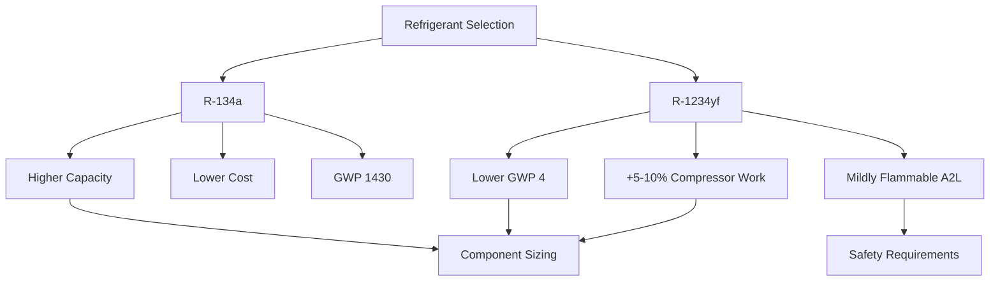

## System Design Fundamentals

Automotive refrigerant system design requires integration of thermodynamic cycle optimization with severe packaging constraints, variable speed operation, and ambient temperature extremes from -40°F to 130°F. The design process balances cooling capacity, coefficient of performance (COP), weight, packaging volume, and cost while meeting SAE J2765 performance standards.

The fundamental cooling capacity equation governs component sizing:

$$Q_c = \dot{m}_r (h_1 - h_4)$$

Where $Q_c$ is cooling capacity (BTU/hr), $\dot{m}_r$ is refrigerant mass flow rate (lbm/hr), $h_1$ is enthalpy at evaporator outlet, and $h_4$ is enthalpy at expansion device outlet. Design point conditions typically use 95°F ambient, 80°F cabin air at 50% RH, and idle speed operation to ensure adequate performance under worst-case scenarios.

## Component Selection Methodology

### Compressor Selection

Variable displacement swash plate compressors dominate passenger vehicle applications due to continuous capacity modulation from 2% to 100% displacement. The compressor must satisfy the maximum heat load while maintaining acceptable NVH characteristics across the engine speed range of 600-6000 RPM.

Compressor displacement sizing follows:

$$V_d = \frac{Q_c \times 60}{RPM_{design} \times \eta_v \times \rho_{suction} \times (h_2 - h_1)}$$

Where $V_d$ is displacement (in³/rev), $\eta_v$ is volumetric efficiency (0.65-0.75 typical), and $\rho_{suction}$ is refrigerant density at compressor inlet. Electric compressors for hybrid and EV applications eliminate engine speed dependency, allowing optimization at single operating points (3000-6000 RPM equivalent).

| Compressor Type | Displacement Range | Pressure Ratio | Weight | Application |
|-----------------|-------------------|----------------|---------|-------------|
| Swash Plate Variable | 100-250 cc/rev | 2.0-4.5:1 | 10-14 lbs | Passenger vehicles |
| Scroll Fixed | 30-80 cc/rev | 2.5-5.0:1 | 8-12 lbs | Electric vehicles |
| Wobble Plate Variable | 150-300 cc/rev | 2.0-4.0:1 | 12-16 lbs | Light trucks |
| Electric Scroll | 40-100 cc/rev | 2.5-5.5:1 | 14-18 lbs | Hybrid/EV |

### Condenser Design

Parallel flow microchannel condensers provide maximum heat rejection per unit frontal area and refrigerant charge. Heat rejection capacity must exceed cooling capacity by compressor work input:

$$Q_h = Q_c + W_{comp} = \dot{m}_r (h_2 - h_3)$$

Condenser sizing requires UA (overall heat transfer coefficient × area) calculations based on log mean temperature difference:

$$Q_h = UA \times LMTD = UA \times \frac{(T_2 - T_{amb}) - (T_3 - T_{amb})}{\ln\left(\frac{T_2 - T_{amb}}{T_3 - T_{amb}}\right)}$$

Typical automotive condensers achieve UA values of 150-250 BTU/hr-°F with face areas of 200-400 in². Subcooling of 10-20°F at the condenser outlet ensures liquid refrigerant delivery to the expansion device under all operating conditions.

### Evaporator Sizing

Evaporator capacity directly determines cabin cooling performance. Plate-fin designs with 12-16 fins per inch balance heat transfer effectiveness (0.70-0.85) against air-side pressure drop (0.3-0.6 in H₂O). The sensible heat ratio (SHR) typically ranges from 0.65 to 0.75:

$$SHR = \frac{Q_{sensible}}{Q_{total}} = \frac{Q_{sensible}}{Q_{sensible} + Q_{latent}}$$

Evaporator superheat of 8-15°F at design conditions prevents liquid refrigerant return to the compressor while maximizing capacity utilization. Automotive evaporators operate at 28-40°F saturated suction temperature to avoid coil frosting while maintaining adequate dehumidification.

### Expansion Device Selection

Thermal expansion valves (TXV) provide superior control compared to orifice tubes, modulating refrigerant flow to maintain constant superheat. The valve capacity rating must match the system design point:

$$\dot{m}_r = C \sqrt{\rho_l \Delta P}$$

Where $C$ is the valve flow coefficient and $\Delta P$ is pressure drop across the valve (typically 150-250 psi). Electronic expansion valves (EXV) offer precise control for variable capacity systems and enable optimal superheat across all operating conditions.

## Refrigerant Charge Calculation

Accurate refrigerant charge is critical for performance and reliability. The total system charge equals the sum of refrigerant mass in each component:

$$m_{total} = m_{comp} + m_{cond} + m_{lines} + m_{evap} + m_{acc/dry}$$

Charge mass for heat exchangers depends on internal volume and refrigerant quality:

$$m_{HX} = \int_V \rho(x) \, dV$$

Where $\rho(x)$ is density as a function of vapor quality. Condenser charge typically represents 40-50% of total charge, while evaporator holds 15-25%. Lines and accumulator account for the remainder.

**Charge Specification Tolerances:**
- Optimal charge: ±1 oz (±28 g) from design specification
- Undercharge effects: Reduced capacity, high superheat, compressor overheating
- Overcharge effects: High discharge pressure, reduced subcooling, liquid slugging risk

SAE J2099 specifies refrigerant purity requirements (99.5% minimum) and contaminant limits for moisture (<50 ppm), air (<2% by weight), and non-condensables.

## System Pressure Analysis

### High-Side Design

High-side design pressure per SAE J639 must withstand maximum ambient soak conditions (160°F) with safety factor. R-134a systems use 400-450 psi design pressure, while R-1234yf systems require similar ratings due to comparable pressure-temperature relationships.

Discharge pressure at 95°F ambient typically reaches:
- R-134a: 235-265 psia (saturated condensing at 115-125°F)
- R-1234yf: 245-275 psia (saturated condensing at 115-125°F)

High-side pressure drops must remain below 15 psi to avoid capacity losses. Line sizing follows:

$$\Delta P = f \frac{L}{D} \frac{\rho v^2}{2g_c}$$

Where friction factor $f$ depends on Reynolds number and relative roughness. Discharge line velocities of 1500-2500 fpm prevent excessive pressure drop while maintaining oil entrainment.

### Low-Side Design

Suction line design balances pressure drop against oil return velocity. Minimum vapor velocities of 1000 fpm ensure oil circulation to the compressor. Suction line pressure drops should not exceed 3-5 psi equivalent:

$$\Delta T_{equiv} = \frac{\partial T_{sat}}{\partial P} \Delta P \approx 2\text{°F per psi}$$

Excessive suction pressure drop reduces compressor mass flow capacity and increases compression ratio, degrading COP.

## R-134a vs R-1234yf System Considerations

### Performance Comparison

| Property | R-134a | R-1234yf | Impact |
|----------|--------|----------|--------|
| Molecular Weight | 102.03 | 114.04 | +11.8% refrigerant mass |
| Critical Temperature | 213.9°F | 203.3°F | Reduced high-temp performance |
| Vapor Pressure @ 77°F | 73.1 psia | 79.5 psia | +8.7% system pressures |
| Liquid Density @ 77°F | 75.1 lbm/ft³ | 71.3 lbm/ft³ | -5.1% charge density |
| Latent Heat @ 40°F | 89.4 BTU/lbm | 78.3 BTU/lbm | -12.4% capacity per lbm |
| Safety Class | A1 | A2L | Flammability considerations |

R-1234yf systems require leak detection per SAE J2927 due to mild flammability. Component specifications remain largely compatible, with primary differences in service equipment and handling procedures per SAE J2843.

### Design Modifications for R-1234yf

Conversion from R-134a requires minimal hardware changes:
- Internal heat exchanger (IHX) recommended for efficiency recovery (+3-5% COP)
- Compressor oil change from PAG to POE-compatible formulations
- Enhanced leak prevention (brazed joints preferred over mechanical connections)
- Service port labeling per SAE J2844

The refrigerant charge typically increases 8-12% by mass for R-1234yf to compensate for lower volumetric capacity, while maintaining identical system pressures and temperatures.

## System Integration and Performance Validation

Final system validation follows SAE J2765 calorimeter testing at multiple ambient and vehicle speed conditions. Performance metrics include:

**Capacity targets:**
- Pulldown time: 80°F to 72°F in <10 minutes at 95°F ambient
- Steady-state capacity: >12,000 BTU/hr at idle, >18,000 BTU/hr at cruise
- COP: 2.0-2.8 depending on operating conditions

Refrigerant circuit layout must account for vehicle vibration isolation (SAE J1455), hose permeation limits (SAE J2064), and service accessibility. Barrier hoses with nitrile inner liner reduce refrigerant permeation to <0.5 oz/year per SAE J2064 requirements.
