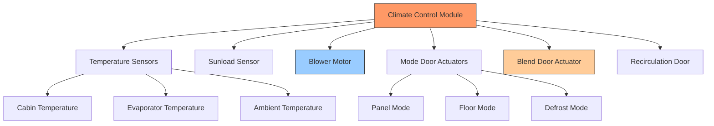

# Automotive Ventilation Systems Design & Operation

Automotive ventilation systems deliver conditioned air to the vehicle cabin through controlled fresh air intake, recirculation pathways, and multi-zone distribution networks. These systems must satisfy occupant comfort, defogging requirements, and air quality standards while minimizing energy consumption and noise.

## Fresh Air Intake Fundamentals

**Fresh air entry** occurs through the cowl plenum, a pressurized region at the windshield base where ram air pressure develops during vehicle motion.

**Ram air pressure:**

$$\Delta P_{ram} = \frac{\rho v^2}{2} = \frac{1.225 \times v^2}{2}$$

Where:
- $\Delta P_{ram}$ = ram air pressure (Pa)
- $\rho$ = air density (1.225 kg/m³ at sea level)
- $v$ = vehicle velocity (m/s)

At 100 km/h (27.8 m/s), ram pressure reaches approximately 473 Pa, providing supplemental airflow without blower energy.

### Fresh Air vs. Recirculation Modes

**Mode selection** affects cabin air quality, thermal load, and system efficiency:

| Parameter | Fresh Air Mode | Recirculation Mode | Mixed Mode |
|-----------|---------------|-------------------|------------|
| **Outside air %** | 100% | 0-10% | 20-80% |
| **Cooling capacity** | Lower (hot OA) | Higher (cooler RA) | Moderate |
| **Heating capacity** | Higher (more air) | Lower (limited flow) | Moderate |
| **Air quality** | Best (dilution) | Degrades over time | Acceptable |
| **Compressor load** | 100% | 60-70% | 75-85% |
| **Defog capability** | Excellent | Poor (humidity buildup) | Fair |

**Recirculation efficiency:**

$$\eta_{recirc} = \frac{Q_{saved}}{Q_{total}} = \frac{\dot{m} c_p (T_{OA} - T_{RA})}{Q_{cooling}}$$

For cooling from 95°F OA to 75°F cabin at 150 CFM:

$$Q_{fresh} = 150 \times 1.08 \times (95-55) = 6,480 \text{ BTU/hr}$$
$$Q_{recirc} = 150 \times 1.08 \times (75-55) = 3,240 \text{ BTU/hr}$$

**Energy savings:** 50% reduction in cooling load with 100% recirculation.

## Blower Motor Performance

**Centrifugal blower** characteristics determine airflow delivery across system pressure drop:

$$\dot{V} = \dot{V}_{max} - k \sqrt{\Delta P_{system}}$$

Where:
- $\dot{V}$ = actual airflow (CFM)
- $\dot{V}_{max}$ = free delivery airflow
- $k$ = blower constant
- $\Delta P_{system}$ = total pressure drop (Pa)

**Typical automotive blower speeds:**
- Low: 150-200 CFM
- Medium: 250-300 CFM
- High: 350-450 CFM
- Maximum: 500-600 CFM (performance vehicles)

**System pressure drop components:**

**Total system pressure:** 125-220 Pa at design airflow

## Cabin Air Filtration

**Particulate filtration** removes dust, pollen, and pollutants before air enters the cabin.

### Filter Types

**Standard particulate filters:**
- Efficiency: 85-95% at 3 μm particles
- Pressure drop: 50-80 Pa (clean)
- Service life: 12,000-15,000 miles

**HEPA filters:**
- Efficiency: 99.97% at 0.3 μm particles
- Pressure drop: 100-150 Pa (clean)
- Service life: 8,000-12,000 miles

**Activated carbon filters:**
- Particulate efficiency: 90-95%
- Odor/VOC removal: 60-80%
- Pressure drop: 80-120 Pa (clean)

### Filter Pressure Drop

**Clean filter:**

$$\Delta P_{filter} = K_{filter} \times \left(\frac{\dot{V}}{A_{filter}}\right)^n$$

Where $n$ = 1.5-1.8 for most automotive filters

**Dust loading effect:**

$$\Delta P_{dirty} = \Delta P_{clean} \times \left(1 + \frac{m_{dust}}{m_{filter}}\right)^{1.5}$$

**Example:** Filter with 60 Pa clean pressure drop reaches 180 Pa after collecting dust mass equal to 50% of filter media weight.

**SAE J1669** specifies cabin air filter test procedures and minimum efficiency requirements.

## Defrost and Defogging Systems

**Windshield defogging** requires high airflow velocity and moisture removal capacity to maintain driver visibility.

### Defrost Airflow Requirements

**SAE J902** defrost standard requires:
- Minimum 300 CFM total airflow to windshield
- Air temperature 125-145°F at outlets
- Clear 80% of windshield area within 10 minutes
- Clear driver vision area within 3 minutes

**Convective heat transfer:**

$$q = h A (T_{air} - T_{glass})$$

**Typical values:**
- $h$ = 15-25 W/m²·K (forced convection)
- $A$ = 1.2-1.8 m² (windshield area)
- $\Delta T$ = 40-60°C (air-glass temperature difference)

**Defrost capacity:** 1,500-2,500 W thermal delivery to windshield

### Humidity Removal

**Defogging effectiveness** depends on air temperature and moisture removal:

$$\dot{m}_{condensate} = \dot{m}_{air} (\omega_{in} - \omega_{out})$$

Where:
- $\omega$ = humidity ratio (kg water/kg dry air)
- $\dot{m}_{air}$ = air mass flow rate (kg/s)

**Evaporator-based dehumidification:**
1. Air cooled below dew point (typically 40-45°F)
2. Moisture condenses on evaporator fins
3. Reheated to 125-145°F via heater core
4. Delivered to windshield at low humidity

**Moisture removal rate:** 0.5-1.0 lb/hr water at maximum defrost

## Air Distribution Patterns

**Multi-zone distribution** directs airflow to panel (face), floor, and defrost outlets through mode door actuators.

### Distribution Modes

| Mode | Panel % | Floor % | Defrost % | Application |
|------|---------|---------|-----------|-------------|
| **MAX A/C** | 100 | 0 | 0 | Maximum cooling |
| **Panel** | 80-90 | 10-20 | 0 | Moderate cooling |
| **Bi-Level** | 40-50 | 50-60 | 0 | Comfort cooling |
| **Floor** | 0-10 | 80-90 | 10-20 | Heating |
| **Floor/Defrost** | 0 | 50-60 | 40-50 | Heating + visibility |
| **Defrost** | 0-10 | 0-10 | 80-100 | Maximum defogging |

### Outlet Velocity and Temperature

**Panel outlets** (face level):
- Velocity: 3-5 m/s (600-1000 ft/min)
- Temperature (cooling): 40-50°F
- Temperature (heating): 100-120°F
- Throw distance: 2-3 ft

**Floor outlets:**
- Velocity: 2-3 m/s (400-600 ft/min)
- Temperature (heating): 120-140°F
- Stratification: Higher temperature at floor level

**Defrost outlets:**
- Velocity: 5-7 m/s (1000-1400 ft/min)
- Temperature: 125-145°F
- Distribution: Uniform across windshield base

### Air Distribution Effectiveness

**Ventilation effectiveness:**

$$\varepsilon_v = \frac{C_{exhaust} - C_{supply}}{C_{zone} - C_{supply}}$$

Where $C$ = contaminant concentration

**Ideal automotive mixing:** $\varepsilon_v$ = 0.95-1.05 (well-mixed cabin)

**Stratification with floor heating:**

$$\Delta T_{vertical} = \frac{q_{floor}}{h A_{cabin}} = 2-4°C$$

## System Integration and Control

**Modern automotive HVAC control** integrates multiple sensors and actuators:

**Automatic climate control logic:**
1. Calculate thermal load based on temperature deviation and sunload
2. Determine required airflow (blower speed)
3. Select distribution mode based on load magnitude
4. Modulate blend door for temperature control
5. Switch to recirculation during maximum cooling demand
6. Override to fresh air/defrost if humidity detected

**SAE J1503** defines automotive HVAC performance test procedures including airflow measurement, temperature distribution, and defrost effectiveness evaluation.

## Design Considerations

**Ventilation system design priorities:**
- **Airflow capacity:** 350-600 CFM for typical passenger vehicles
- **Filter serviceability:** Tool-free access from cabin or under hood
- **Noise control:** Limit blower noise to 60-65 dBA at maximum speed
- **Mode door sealing:** <5% leakage between modes
- **Duct routing:** Minimize bends (maximum 45° preferred)
- **Outlet adjustability:** Driver and passenger independent control

**Energy efficiency:**
- Variable speed blower motors reduce parasitic load 30-50%
- Recirculation mode during peak cooling reduces compressor runtime
- Fresh air mode mandatory during heating and defogging
- Auto mode optimizes between fresh/recirc based on load and air quality

## Performance Validation

**SAE standards for testing:**
- **SAE J1503:** HVAC system performance test procedures
- **SAE J902:** Passenger car windshield defrosting systems
- **SAE J1669:** Cabin air filter test procedure
- **SAE J2765:** Procedure for measuring system COP

**Key validation metrics:**
- Cooldown time: 95°F to 75°F cabin in <10 minutes
- Warmup time: 0°F to 70°F cabin in <15 minutes
- Defrost time: Clear driver vision area in <3 minutes
- Filter efficiency: >85% at 3 μm particles per SAE J1669
- Blower noise: <65 dBA at maximum speed

---

**Related Topics:** Automotive AC systems, cabin thermal loads, electric vehicle HVAC, automatic climate control

