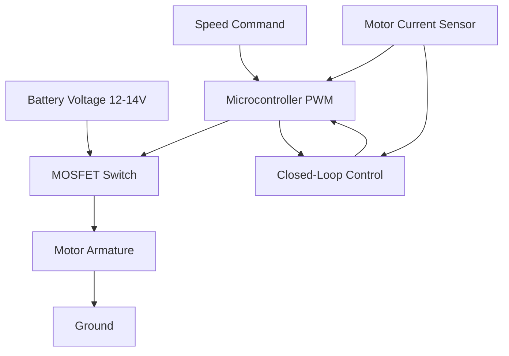
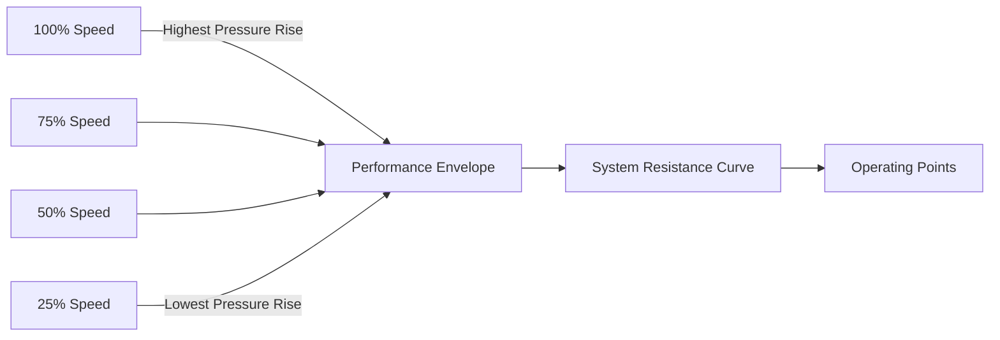
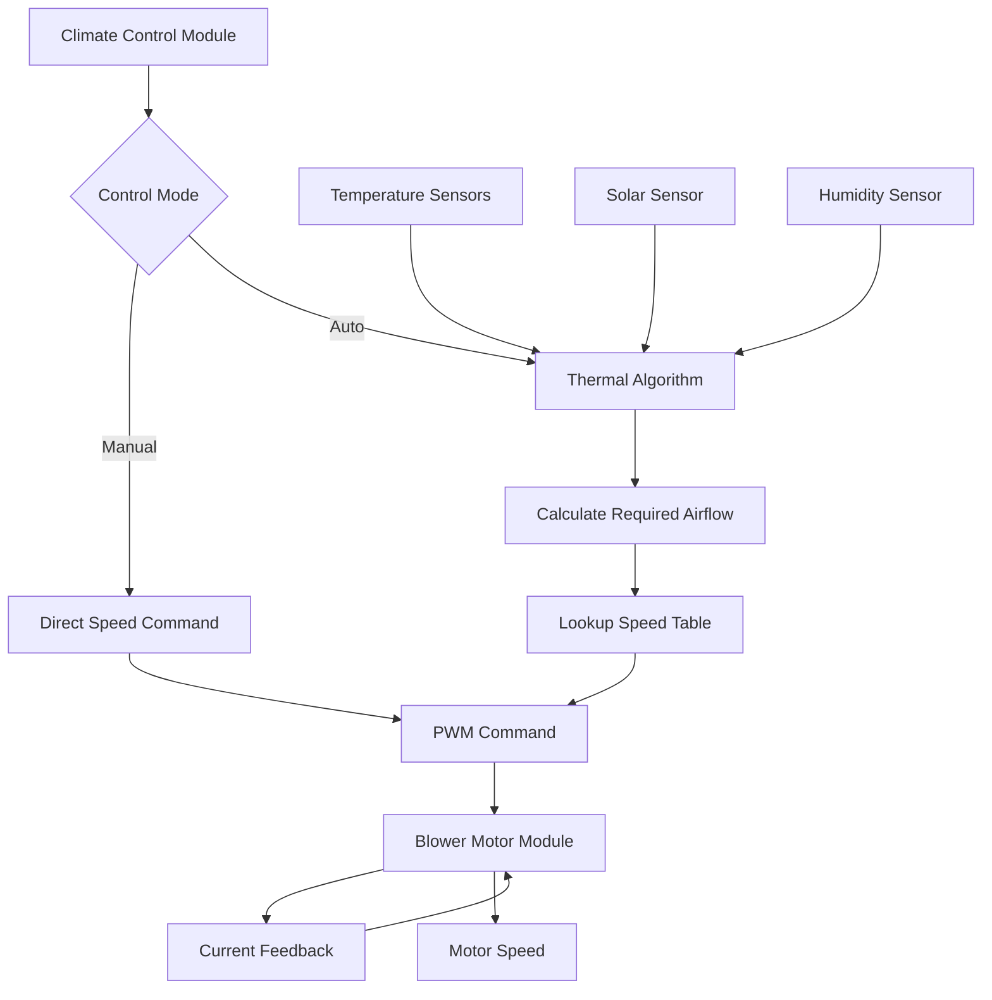

Automotive blower systems serve as the primary air-moving devices in vehicle HVAC systems, delivering conditioned air through the cabin distribution network. These centrifugal machines must operate across wide voltage ranges, extreme temperature conditions, and varying static pressure demands while minimizing noise, power consumption, and electromagnetic interference.

## Centrifugal Blower Fundamentals

Automotive HVAC systems universally employ forward-curved centrifugal blowers (squirrel cage design) rather than axial fans due to their superior ability to generate static pressure against restrictive ductwork and filters. The performance relationship follows fundamental fan laws.

**Fan Power Relationship:**

$$P_{fan} = \frac{\dot{V} \cdot \Delta P}{\eta_{total}}$$

Where:
- $P_{fan}$ = shaft power (W)
- $\dot{V}$ = volumetric flow rate (m³/s)
- $\Delta P$ = static pressure rise (Pa)
- $\eta_{total}$ = total efficiency (typically 0.35-0.50 for automotive blowers)

**Affinity Laws for Speed Variation:**

$$\frac{\dot{V}_2}{\dot{V}_1} = \frac{N_2}{N_1}$$

$$\frac{\Delta P_2}{\Delta P_1} = \left(\frac{N_2}{N_1}\right)^2$$

$$\frac{P_2}{P_1} = \left(\frac{N_2}{N_1}\right)^3$$

These relationships demonstrate that doubling blower speed doubles airflow but increases power consumption eight-fold, making speed control critical for energy management.

## Motor Technologies

### Brushed vs Brushless Motor Comparison

| Parameter | Brushed DC Motor | Brushless DC Motor (BLDC) |
|-----------|------------------|---------------------------|
| Efficiency | 60-75% | 85-92% |
| Service Life | 1,000-3,000 hrs | 10,000-30,000 hrs |
| EMI Generation | High (brush arcing) | Low (electronic commutation) |
| Control Complexity | Simple (voltage variation) | Complex (requires controller) |
| Cost (relative) | 1.0x | 1.8-2.5x |
| Torque Ripple | 5-10% | 1-3% |
| Operating Temp Range | -20°C to 85°C | -40°C to 105°C |
| Acoustic Signature | Broadband brush noise | Tonal electromagnetic noise |

### Motor Selection Physics

The motor must provide sufficient torque to overcome blower aerodynamic resistance:

$$T_{required} = \frac{P_{fan} \cdot 60}{2\pi N}$$

Starting torque must exceed static friction, typically 150-200% of running torque. BLDC motors excel in this application due to:

1. **Thermal management**: Higher efficiency reduces waste heat in confined underdash mounting
2. **Reliability**: No brush wear eliminates failure mode in dusty cabin environments
3. **Control precision**: Electronic commutation enables accurate speed regulation
4. **Voltage tolerance**: Wide operating range (9-16V) handles cranking sags and charging surges

## Speed Control Methods

### PWM Control Implementation

Pulse-width modulation varies effective voltage by switching the motor on/off at frequencies typically 15-25 kHz (above audible range but below significant transistor switching losses).

**Effective Voltage:**

$$V_{eff} = V_{battery} \cdot D$$

Where $D$ = duty cycle (0 to 1)

### Multi-Speed Resistor Networks

Legacy systems use series resistors to reduce voltage and current:

$$I_{motor} = \frac{V_{battery}}{R_{total} + R_{motor}}$$

Power dissipation in resistors:

$$P_{resistor} = I_{motor}^2 \cdot R_{resistor}$$

This method wastes energy as heat (30-50% loss at low speeds) and has been largely replaced by electronic control modules using PWM or linear regulation.

### Automatic Blower Control

Modern systems modulate blower speed continuously based on:
- Cabin temperature error: $\Delta T = T_{setpoint} - T_{cabin}$
- Ambient temperature
- Solar load (via sensor)
- Evaporator temperature (prevents icing)

**PI Control Algorithm:**

$$N_{blower} = K_p \cdot \Delta T + K_i \int \Delta T \, dt$$

Where $K_p$ and $K_i$ are proportional and integral gain constants tuned for thermal response characteristics.

## Performance Characteristics

### Airflow vs Static Pressure Curves

The blower operates where its pressure-flow curve intersects the system resistance curve:

$$\Delta P_{system} = K \cdot \dot{V}^2$$

Where $K$ incorporates duct geometry, filter resistance, and damper positions. As filters load with particulates, $K$ increases, shifting the operating point to lower flow rates at constant speed.

### Typical Performance Specifications

| Speed Setting | RPM | Flow Rate (CFM) | Static Pressure (in H₂O) | Power (W) | Noise (dBA) |
|---------------|-----|-----------------|-------------------------|-----------|-------------|
| Low | 1,500 | 120 | 0.8 | 35 | 42 |
| Medium-Low | 2,200 | 175 | 1.2 | 75 | 48 |
| Medium | 3,000 | 240 | 1.8 | 140 | 54 |
| High | 4,000 | 320 | 2.5 | 270 | 62 |

## Noise Considerations

Blower noise comprises three primary mechanisms:

1. **Aerodynamic Noise**: Turbulent flow around blade edges generates broadband noise
   - Scales as $N^5$ to $N^6$ (blade passing frequency)
   - Dominant above 3,000 RPM

2. **Mechanical Noise**: Bearing vibration and rotor imbalance
   - Tonal components at rotational frequency and harmonics
   - Minimized through precision balancing (ISO 1940 G2.5 grade)

3. **Electromagnetic Noise**: Motor torque ripple excites structural resonances
   - BLDC motors exhibit tonal noise at 6× electrical frequency
   - Mitigated via sensorless FOC (field-oriented control)

**Sound Power Level Estimation:**

$$L_W = 10 \log_{10}\left(\frac{P_{acoustic}}{P_{ref}}\right) + 120$$

Where $P_{ref} = 10^{-12}$ W

Noise reduction strategies per SAE J1477:
- Inlet bellmouth design reduces turbulence
- Vibration isolation mounts (elastomeric bushings)
- Acoustic foam lining in blower housing
- Variable speed operation at lowest acceptable RPM

## Power Consumption Optimization

Energy-efficient blower operation balances airflow delivery with electrical load on the alternator, which directly impacts fuel consumption.

**Fuel Consumption Impact:**

$$\dot{m}_{fuel} = \frac{P_{blower}}{\eta_{alternator} \cdot \eta_{engine} \cdot LHV_{fuel}}$$

For a 200W blower at high speed:
- Alternator efficiency: 0.60
- Engine efficiency: 0.25
- Fuel LHV: 43 MJ/kg

This yields approximately 0.015 kg/hr additional fuel consumption, or 0.4% of idle fuel flow.

**Optimization Strategies:**
- Cabin thermal load calculation determines minimum required airflow
- Thermal mass utilization reduces transient blower demand
- Recirculation mode reduces thermal load by 40-60%
- Variable refrigerant systems enable lower airflow at constant comfort

## Control Architecture

The blower motor module monitors current to detect:
- Overcurrent conditions (>15A indicates mechanical binding)
- Undercurrent at commanded speed (indicates open circuit)
- Locked rotor (high current with zero back-EMF)

Modern implementations per SAE J2842 communicate via LIN bus, enabling diagnostic trouble codes and adaptive control based on measured performance degradation.

## References to Standards

- **SAE J1477**: Measurement of interior sound levels
- **SAE J2842**: HVAC blower motor specifications
- **ISO 1940**: Vibration balancing requirements
- **AEC-Q100**: Automotive electronics reliability qualification

## Component Integration

The complete blower system comprises:
- **Centrifugal blower assembly**: Forward-curved impeller, housing, inlet
- **Motor**: Brushed DC or BLDC with integral or external control
- **Speed control module**: PWM driver, current sensing, diagnostics
- **Resistor pack (legacy)**: Series resistance for multi-speed operation
- **Mounting isolation**: Reduces structure-borne noise transmission
- **Cabin pressure management**: Prevents door closing difficulty and wind noise

Proper selection requires matching blower pressure-flow characteristics to duct system impedance across all operating modes, ensuring adequate defrost airflow (minimum 150 CFM per SAE J902) while maintaining acceptable acoustic levels and minimizing parasitic electrical loads.
