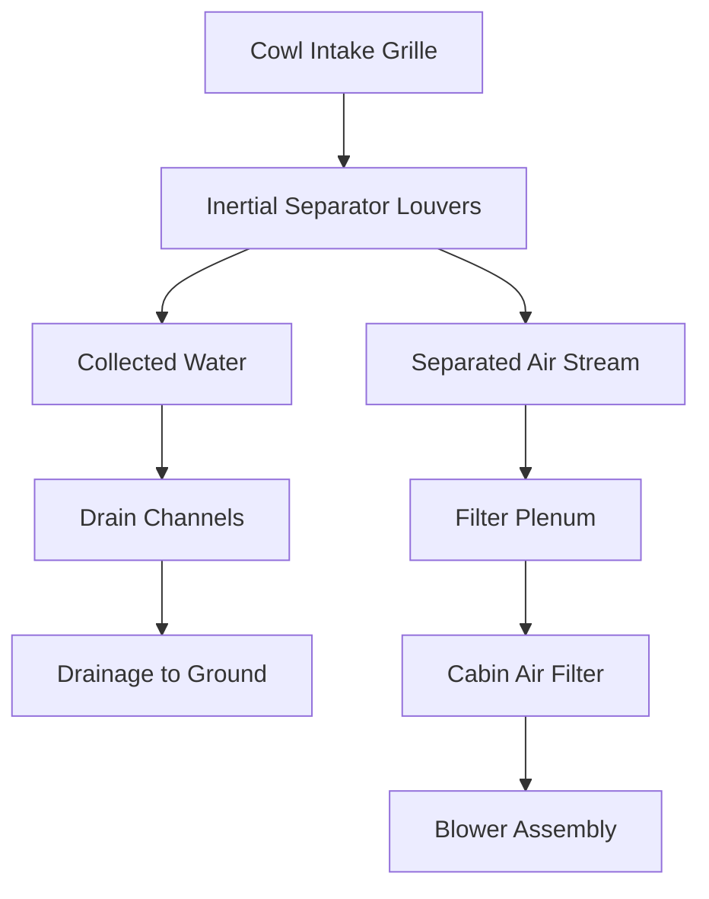
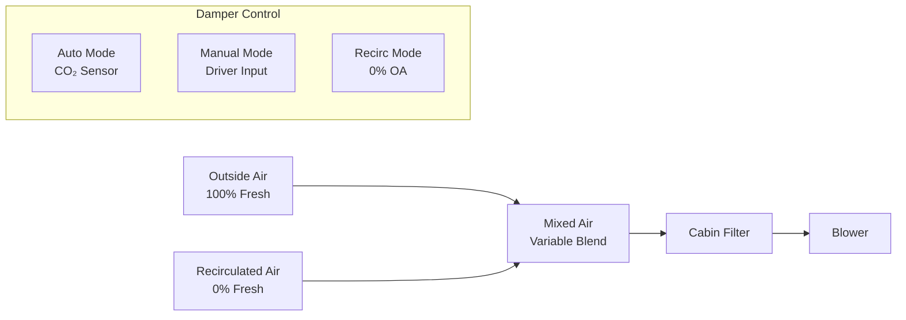

## Fresh Air Systems in Automotive HVAC

Automotive fresh air systems provide ventilation by introducing filtered outside air into the vehicle cabin. These systems must overcome unique challenges: capturing air at vehicle speeds ranging from stationary to highway conditions, separating water from intake air, filtering contaminants, and maintaining adequate ventilation rates in a compact, noise-sensitive environment.

## Cowl Air Intake Design

The cowl area—the junction between the hood and windshield—serves as the primary fresh air inlet for most vehicles due to favorable aerodynamic and packaging characteristics.

### Ram Air Effect

Vehicle motion creates dynamic pressure at the cowl intake. The total pressure available increases with velocity according to:

$$P_{total} = P_{static} + \frac{1}{2}\rho v^2$$

where $\rho$ is air density (typically 1.2 kg/m³) and $v$ is vehicle velocity. At highway speed (30 m/s or 67 mph), dynamic pressure contributes approximately 540 Pa (2.2 in. H₂O), significantly reducing blower power requirements.

The cowl intake typically features a raised lip to create a stagnation zone where air velocity approaches zero and pressure maximizes. SAE J1503 recommends intake locations at least 150 mm from the windshield base to avoid recirculation zones.

### Intake Geometry

Cowl intake area must balance several factors:

| Parameter | Typical Range | Design Driver |
|-----------|---------------|---------------|
| Intake area | 200-400 cm² | Maintains face velocity <3 m/s at idle |
| Grille open area ratio | 40-60% | Water separation vs. pressure drop |
| Louver angle | 20-45° from horizontal | Rain exclusion vs. airflow |
| Plenum volume | 3-8 liters | Pressure recovery and water settling |

Face velocity at the grille opening should remain below 3 m/s at typical blower settings to minimize intake noise and aerodynamic losses.

## Rain and Water Separation

Water separation relies on inertial impaction—exploiting the 800:1 density ratio between water droplets and air.

### Separation Physics

As air changes direction through louvers, droplets continue in their original trajectory due to inertia. The separation efficiency depends on the Stokes number:

$$Stk = \frac{\rho_p d_p^2 v}{18\mu D_c}$$

where:
- $\rho_p$ = particle (droplet) density (1000 kg/m³ for water)
- $d_p$ = droplet diameter
- $v$ = approach velocity
- $\mu$ = air dynamic viscosity (1.8 × 10⁻⁵ Pa·s)
- $D_c$ = characteristic dimension (louver spacing)

Effective separation occurs when Stk > 1. For 100 μm droplets at 5 m/s through 10 mm louver spacing, Stk ≈ 1.5, yielding >85% separation efficiency.

### Drainage System

Drain channels must handle the maximum water ingress rate, typically designed for rainfall intensity of 100 mm/hr (extreme conditions). At vehicle speed with 0.04 m² effective catch area, this represents approximately 67 ml/min flow rate. Drain orifice sizing follows standard hydraulic relationships with minimum 8 mm diameter to prevent debris blockage.

## Cabin Air Filtration

Modern cabin air filters provide two-stage filtration: particulate removal and gaseous contaminant adsorption.

### Particulate Filtration Mechanisms

Three physical mechanisms dominate particle capture:

**Interception**: Particles following streamlines contact fibers when their radius brings them within one radius of the fiber surface. Collection efficiency by interception:

$$\eta_R = \frac{1}{K_u}(1 + R)\left(\frac{d_p}{d_f}\right)^2$$

where $R$ is the interception parameter and $K_u$ is the Kuwabara hydrodynamic factor.

**Diffusion**: Brownian motion causes particles <0.5 μm to deviate from streamlines. Diffusion efficiency increases as particle size decreases:

$$\eta_D = 2.6\left(\frac{1}{K_u}\right)^{1/3}\left(\frac{D}{v \cdot d_f}\right)^{2/3}$$

where $D$ is the particle diffusion coefficient.

**Impaction**: Particles >1 μm with sufficient inertia impact fibers directly. Impaction efficiency depends on the Stokes number for flow around cylindrical fibers.

### Filter Performance Specifications

| Filter Type | Particle Size | Efficiency | Initial ΔP | Dust Capacity |
|-------------|---------------|------------|------------|---------------|
| Standard particulate | 3-10 μm | 80-90% | 25-40 Pa | 30-50 g |
| High-efficiency | 0.3-10 μm | >95% | 40-60 Pa | 40-70 g |
| HEPA (automotive) | 0.3 μm | >99.97% | 80-120 Pa | 20-40 g |

HEPA filters in automotive applications face challenges from limited space and blower capacity. The high initial pressure drop (80-120 Pa) requires more powerful blowers and reduces system airflow by 15-25% compared to standard filters.

### Activated Carbon Layer

Gaseous contaminants (NOₓ, volatile organic compounds, ozone) are not captured by particulate mechanisms. Activated carbon layers use physical adsorption onto high-surface-area carbon granules.

Carbon adsorption capacity follows the Langmuir isotherm for single-component adsorption:

$$q = q_{max}\frac{K_{ads}C}{1 + K_{ads}C}$$

where $q$ is the adsorbed amount per unit mass of carbon, $q_{max}$ is the maximum capacity, $K_{ads}$ is the adsorption equilibrium constant, and $C$ is the gas-phase concentration.

Typical automotive carbon layers contain 50-150 g of activated carbon with specific surface areas of 800-1200 m²/g, providing initial removal efficiencies >90% for odors and >60% for NO₂. Carbon saturates after 12,000-25,000 km depending on exposure levels.

### Filter Replacement Criteria

Replace cabin air filters when:

- Pressure drop exceeds 200 Pa (0.8 in. H₂O) at rated flow
- Airflow decreases by >30% from clean filter baseline
- Visible contamination or biological growth observed
- Carbon layer saturated (typically 1 year or 20,000 km)

Pressure drop increases approximately linearly with accumulated dust mass until filter begins to densify, then rises exponentially as deep bed filtration transitions to surface cake filtration.

## Outside Air Damper Operation

The fresh air damper controls the ratio of outside air to recirculated cabin air.

### Damper Positions and Mixing

Damper actuators use vacuum servos, electric stepper motors, or DC motors with position feedback. Response time typically ranges from 2-5 seconds for full travel to minimize temperature or pressure transients.

### Ventilation Rates for Air Quality

SAE J1503 recommends minimum ventilation rates based on cabin volume and occupancy:

$$Q_{vent} = N \cdot V_{person} + V_{cabin} \cdot ACH_{min}$$

where:
- $N$ = number of occupants
- $V_{person}$ = 7-10 L/s per person (15-21 CFM)
- $V_{cabin}$ = cabin volume (typically 3-5 m³)
- $ACH_{min}$ = minimum air changes per hour (0.5-1.0 ACH)

For a typical sedan (4 m³ cabin, 2 occupants):

$$Q_{vent} = 2 \times 8 + 4 \times \frac{1}{3600} \times 3600 \times 0.75 = 16 + 3 = 19 \text{ L/s (40 CFM)}$$

### CO₂-Based Demand Control

Modern systems measure cabin CO₂ concentration to modulate outside air damper position. Acceptable CO₂ levels range from 800-1200 ppm above ambient (outdoor typically 400-450 ppm). Human respiration produces approximately 0.3 L/min of CO₂ per person at rest, rising to 1-2 L/min during activity.

Mass balance for cabin CO₂:

$$V_{cabin}\frac{dC}{dt} = N \cdot G_{CO_2} - Q_{vent}(C - C_{ambient})$$

At steady state, the required ventilation rate to maintain target CO₂ level becomes:

$$Q_{vent} = \frac{N \cdot G_{CO_2}}{C_{target} - C_{ambient}}$$

For 2 occupants producing 0.3 L/min CO₂ each, maintaining 1000 ppm above ambient requires approximately 20 L/s ventilation rate, confirming the SAE J1503 guideline.

## System Integration Considerations

Fresh air system design must address:

- **Filter housing sealing**: Leakage bypassing the filter defeats filtration. Gasket compression of 20-30% and seal width >8 mm ensures <2% bypass.
- **Blower capacity**: Total system pressure drop (intake + filter + ducts + outlets) typically ranges 150-400 Pa. Centrifugal blowers with backward-curved blades provide efficiency of 40-60%.
- **Noise control**: Intake velocities >6 m/s generate turbulence noise. Plenum volumes >5 liters attenuate pulsations from blower operation.
- **Condensate management**: Temperature drop across evaporator coils can produce 2-4 L/hr condensate in humid conditions. Drain systems must prevent water backup into filter housing.

## References

- SAE J1503: Ventilation Air Change Rates for Light-Duty Vehicles
- SAE J1669: Platform Lift and Wheelchair Lift Design for Stationary Vehicle Applications (cabin volume standards)
- ISO 11155-1: Road vehicles — Air filters for passenger compartments