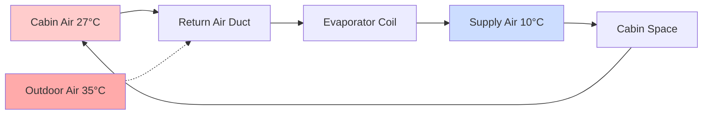
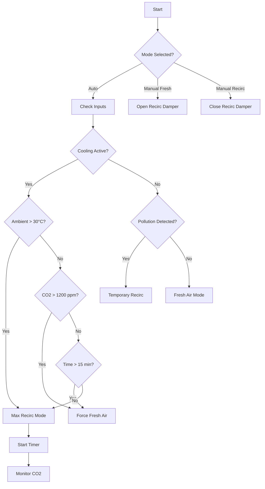

Recirculation mode redirects cabin air back through the HVAC system instead of drawing fresh outdoor air, creating a closed-loop airflow pattern. This operational mode fundamentally alters the thermal and air quality dynamics within the vehicle cabin, offering significant advantages in cooling performance and pollution isolation at the expense of increased carbon dioxide concentration and moisture accumulation.

## Thermodynamic Advantages

The primary benefit of recirculation mode stems from the reduced temperature differential between supply air and the heat exchanger. When the air conditioning system operates in fresh air mode, it must cool outdoor air from ambient temperature $T_{amb}$ to the desired discharge temperature $T_{discharge}$. In recirculation mode, the system processes cabin air already partially cooled to temperature $T_{cabin}$.

The cooling load reduction can be quantified through sensible heat transfer:

$$Q_{sensible} = \dot{m} \cdot c_p \cdot (T_{inlet} - T_{discharge})$$

where $\dot{m}$ represents mass flow rate and $c_p$ is the specific heat of air (1.005 kJ/kg·K). On a hot day with $T_{amb} = 95°F$ (35°C) and $T_{cabin} = 80°F$ (27°C), recirculation mode reduces the temperature differential by approximately 8°C, decreasing sensible cooling load by 30-40%.

This thermal advantage translates to faster cabin cooldown, reduced compressor load, and improved fuel efficiency. SAE J2765 testing demonstrates that recirculation mode can reduce cabin temperature pull-down time by 25-35% compared to fresh air operation.

## Carbon Dioxide Accumulation

The closed-loop nature of recirculation mode creates an unavoidable consequence: metabolic CO2 accumulation. Each occupant produces approximately 0.3-0.4 L/min of CO2 through respiration. In a typical sedan cabin volume of 3.5 m³, this generation rate causes rapid concentration increase.

The CO2 accumulation rate follows:

$$\frac{dC_{CO_2}}{dt} = \frac{n \cdot G_{CO_2}}{V_{cabin}} - \frac{Q_{fresh} \cdot (C_{CO_2} - C_{ambient})}{V_{cabin}}$$

where:
- $n$ = number of occupants
- $G_{CO_2}$ = CO2 generation rate per person (L/min)
- $V_{cabin}$ = cabin volume (m³)
- $Q_{fresh}$ = fresh air infiltration rate (m³/min)
- $C_{ambient}$ = outdoor CO2 concentration (typically 400 ppm)

With pure recirculation ($Q_{fresh} = 0$) and two occupants, cabin CO2 levels increase at approximately 140 ppm/minute. Starting from ambient conditions, the concentration reaches 1000 ppm within 5 minutes and 2000 ppm within 12 minutes.

| Time (min) | CO2 Level (ppm) | Cognitive Impact |
|------------|-----------------|------------------|
| 0 | 400 | Baseline outdoor air |
| 5 | 1000 | ASHRAE acceptable limit |
| 10 | 1700 | Detectable drowsiness threshold |
| 15 | 2400 | Measurable cognitive impairment |
| 20 | 3100 | Significant performance degradation |

Elevated CO2 concentrations above 1000 ppm have been shown to impair decision-making and increase reaction time, creating safety concerns during extended recirculation operation.

## Automatic Control Strategies

Modern vehicles implement sophisticated control algorithms to balance the thermal benefits of recirculation with air quality requirements. These strategies typically employ multi-input decision logic:

### Max AC Mode

Max AC mode provides maximum recirculation during initial cooldown when cabin temperatures significantly exceed setpoint. This mode operates under these conditions:

- Ambient temperature > 30°C (86°F)
- Cabin temperature > setpoint + 5°C
- AC compressor commanded ON
- Time limit not exceeded (typically 10-20 minutes)

The system automatically transitions to partial fresh air once cabin temperature approaches setpoint or the time limit expires.

### Pollution-Based Switching

Air quality sensors detect elevated concentrations of harmful compounds in ambient air and automatically close the recirculation damper to protect occupants. Common sensor types include:

**Metal Oxide Sensors**: Detect VOCs, NOx, and general air quality through resistance changes in heated metal oxide films. Response time typically 5-15 seconds with sensitivity to concentrations as low as 0.1 ppm for certain compounds.

**Electrochemical CO Sensors**: Specifically target carbon monoxide from vehicle exhaust. Provide linear response in the range of 0-100 ppm with accuracy of ±5 ppm.

**NDIR CO2 Sensors**: Measure cabin CO2 levels using infrared absorption at 4.26 μm wavelength. Accuracy typically ±30 ppm with measurement range 0-5000 ppm.

| Pollutant | Source | Threshold (ppm) | Sensor Type |
|-----------|--------|-----------------|-------------|
| CO | Vehicle exhaust | 9 (8-hr avg) | Electrochemical |
| NOx | Diesel exhaust | 0.05 | Metal oxide |
| VOCs | Industrial areas | Varies | Metal oxide |
| CO2 | Occupant respiration | 1000 | NDIR |

### Tunnel Detection

Many systems incorporate GPS data or light sensors to identify tunnel entry, automatically switching to recirculation to prevent ingestion of high-concentration vehicle exhaust. Upon tunnel exit, the system implements a timed fresh air purge cycle to evacuate accumulated CO2.

## Window Fogging Prevention

Recirculation mode increases cabin humidity through occupant respiration and perspiration, raising the dew point temperature. When interior glass surfaces fall below this dew point, condensation occurs.

The moisture generation rate per occupant approximates 40-60 g/hour under normal conditions. In a sealed cabin, relative humidity increases at:

$$\frac{d\phi}{dt} = \frac{n \cdot G_{H_2O}}{V_{cabin} \cdot \rho_{sat}(T)}$$

where $\rho_{sat}(T)$ is the saturation vapor density at cabin temperature.

To prevent fogging, HVAC control systems monitor:

- Windshield temperature (via infrared sensor or model-based estimation)
- Cabin relative humidity (capacitive or resistive sensor)
- Dew point temperature (calculated from temperature and humidity)

When the windshield temperature approaches dew point within 2-3°C margin, the system automatically switches to fresh air mode and directs airflow to defrost vents, regardless of occupant settings.

## Fresh Air Purge Cycles

To manage CO2 accumulation while maintaining the thermal efficiency benefits of recirculation, modern systems implement periodic fresh air purge cycles. Typical strategies include:

- **Time-based**: Force fresh air for 2-3 minutes every 15-20 minutes of continuous recirculation
- **CO2-based**: Maintain cabin CO2 below 1200-1500 ppm through closed-loop damper modulation
- **Partial recirculation**: Blend 70-80% recirculated air with 20-30% fresh air continuously

The air exchange effectiveness during purge cycles depends on supply air placement and cabin mixing. Complete air exchange requires approximately:

$$t_{purge} = \frac{V_{cabin}}{Q_{supply}} \cdot \ln\left(\frac{C_{initial} - C_{ambient}}{C_{target} - C_{ambient}}\right)$$

For typical cabin volumes and supply flow rates of 150-200 CFM, reducing CO2 from 2000 ppm to 800 ppm requires 3-4 minutes of 100% fresh air operation.

## Components

- Recirculation Damper
- Max Ac Mode Recirculation
- Air Quality Recirculation
- Automatic Recirculation Control
- Tunnel Detection Auto Recirc
- Pollution Sensor Control
- Co2 Sensor Cabin
- Voc Sensor Cabin
- Recirculation Time Limit
- Fresh Air Purge Cycle
