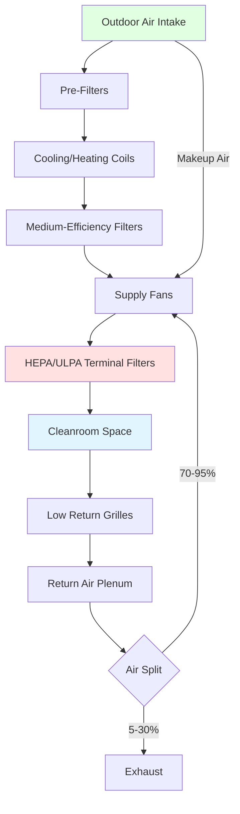

Cleanroom HVAC systems represent highly specialized environmental control applications where particulate contamination, temperature, humidity, and pressure control must be maintained within extremely tight tolerances. These controlled environments are essential for industries where even microscopic contaminants can compromise product quality or research integrity.

## Cleanroom Fundamentals

Cleanrooms are classified by the maximum allowable particle concentration per cubic meter of air. ISO 14644-1 defines cleanroom classifications from ISO Class 1 (fewest particles) to ISO Class 9. The classification directly drives HVAC system requirements, with cleaner classifications demanding exponentially higher air change rates and filtration efficiency.

The primary contamination sources include:
- Personnel (skin cells, hair, clothing fibers)
- Process equipment and materials
- Facility construction materials
- Outdoor air infiltration

Cleanroom design follows strict zoning principles where pressure cascades from cleanest to less clean areas, preventing reverse contamination flow. Typical pressure differentials range from 5 to 20 Pa between adjacent zones.

## Key HVAC Components

Cleanroom HVAC systems consist of several critical components working in concert:

**High-Efficiency Filtration**: HEPA filters (99.97% efficient at 0.3 μm) or ULPA filters (99.9995% efficient at 0.12 μm) are installed at the terminal supply points, typically in the ceiling as a full-coverage filter-fan-unit (FFU) array or as discrete supply diffusers. Pre-filters and bag filters in the air handling units protect the expensive terminal filters and extend their service life.

**Air Handling Units**: Cleanroom AHUs feature oversized filter sections, redundant fans, variable frequency drives for precise airflow control, and robust construction to minimize particle generation. Cooling and dehumidification coils must be designed to prevent moisture carryover that could transport particles.

**Recirculation Systems**: To achieve the required air change rates economically, cleanrooms typically recirculate 70-95% of supply air. Low-sidewall or floor-level returns capture the downward laminar flow, removing particles near their generation source.

**Pressure Control**: Dedicated pressure control systems use modulating dampers or variable speed exhaust fans to maintain positive pressurization. Building automation systems continuously monitor differential pressure across critical barriers and adjust airflows in real-time.

## Air Change Rates and Recirculation

The air change rate directly determines particle removal efficiency. The relationship between air changes per hour (ACH) and particle concentration decay follows first-order kinetics:

$$C(t) = C_0 \cdot e^{-\frac{ACH \cdot t}{60}}$$

where $C(t)$ is particle concentration at time $t$ (minutes), $C_0$ is initial concentration, and ACH is air changes per hour.

Typical air change rates by cleanroom class:

| ISO Class | Particles/m³ (≥0.5 μm) | Air Changes/Hour | Airflow Pattern |
|-----------|------------------------|------------------|-----------------|
| ISO 3 | 35 | 300-600 | Unidirectional |
| ISO 4 | 352 | 300-600 | Unidirectional |
| ISO 5 | 3,520 | 240-480 | Unidirectional |
| ISO 6 | 35,200 | 90-180 | Non-unidirectional |
| ISO 7 | 352,000 | 30-60 | Non-unidirectional |
| ISO 8 | 3,520,000 | 15-30 | Non-unidirectional |

The outdoor air requirement for pressurization and occupant ventilation is calculated as:

$$Q_{OA} = \text{max}(Q_{vent}, Q_{press} + Q_{leak})$$

where $Q_{vent}$ = occupancy-based ventilation (typically 10-20 cfm/person), $Q_{press}$ = intentional exhaust flow, and $Q_{leak}$ = envelope leakage (typically 2-5% of supply flow).

## Contamination Control Principles

Effective contamination control requires integrated strategies:

**Source Control**: Personnel gowning protocols, material transfer airlocks, and process equipment enclosures minimize particle generation. Cleanroom-compatible materials (stainless steel, non-shedding plastics) are specified throughout.

**Airflow Management**: Unidirectional (laminar) airflow at 90 ± 20 fpm sweeps particles away from critical work zones. Non-unidirectional (turbulent) airflow with multiple supply points and low returns provides adequate mixing for less critical spaces.

**Filtration Strategy**: Multi-stage filtration protects downstream components and maintains particle removal efficiency. A typical sequence: outdoor air louvers → 30% MERV 8 → 85% MERV 14 → 99.97% HEPA.

**Pressure Control**: Maintaining positive pressure (typically 0.02-0.05 in. w.g. above adjacent spaces) prevents infiltration of unfiltered air. Airlocks and cascading pressure zones isolate the cleanest areas.

## Industry-Specific Requirements

### Pharmaceutical Manufacturing

Pharmaceutical cleanrooms must comply with FDA 21 CFR Part 211 and EU GMP Annex 1. Critical considerations include:

- **Grade A zones**: ISO 5 in operation, unidirectional flow at critical filling/transfer points
- **Grade B zones**: ISO 5-7 background for Grade A operations
- **Grade C/D zones**: ISO 7-8 for less critical manufacturing steps
- **Temperature**: 20 ± 2°C typical, with tighter control (±0.5°C) for thermally sensitive processes
- **Humidity**: 30-50% RH, with lower humidity (≤35% RH) for hygroscopic materials
- **Microbial control**: Active air sampling, surface monitoring, and sanitization protocols

Pharmaceutical cleanrooms often require steam-in-place (SIP) or vaporized hydrogen peroxide (VHP) compatibility for terminal sterilization.

### Semiconductor Manufacturing

Semiconductor fabs demand the cleanest environments, typically ISO 3-5, with unique requirements:

- **Molecular contamination control**: Chemical filtration for airborne molecular contaminants (AMCs) that affect photolithography
- **Electrostatic discharge (ESD) protection**: Ionization systems, conductive flooring, humidity control (40-60% RH)
- **Process exhaust**: Specialized scrubbing systems for corrosive and toxic process gases
- **Vibration control**: Isolated equipment mounting to prevent photolithography misalignment
- **Temperature stability**: ±0.1°C in photolithography areas to maintain dimensional stability

The extreme air change rates (400-600 ACH) and 100% ceiling coverage with FFUs create an airflow rate of:

$$Q = \frac{A \cdot v \cdot 60}{1000}$$

where $Q$ is airflow (cfm), $A$ is floor area (ft²), $v$ is face velocity (fpm, typically 90), and 60/1000 converts to cfm.

## Energy Efficiency Considerations

Cleanroom HVAC represents one of the most energy-intensive building applications, consuming 10-100 times more energy per square foot than conventional buildings. Energy efficiency strategies include:

**Demand-Based Control**: Reduce airflow during unoccupied periods while maintaining minimum flow for pressurization. ISO 5 cleanrooms can often reduce from 400 ACH to 100 ACH during unoccupied standby mode.

**Heat Recovery**: Energy recovery wheels or plate heat exchangers capture cooling/heating energy from exhaust air. In pharmaceutical applications, these must prevent cross-contamination.

**Economizer Operation**: Free cooling via outdoor air when conditions permit, though limited by humidity and particle control requirements.

**High-Efficiency Equipment**: Premium-efficiency motors, magnetic bearing fans, and optimized duct design reduce fan energy. Each 1 in. w.g. pressure drop reduction saves approximately 25% fan energy.

**Temperature and Humidity Optimization**: Widening acceptable ranges (e.g., 20-24°C instead of 21±1°C) significantly reduces cooling and reheat energy while maintaining process compatibility.

The fan energy for recirculation can be estimated as:

$$P = \frac{Q \cdot \Delta P}{6356 \cdot \eta_{fan} \cdot \eta_{motor}}$$

where $P$ is power (kW), $Q$ is airflow (cfm), $\Delta P$ is total pressure (in. w.g.), and $\eta$ represents efficiencies (typically 0.65-0.75 for fan, 0.93-0.96 for motor).

## Cleanroom Applications by Industry

| Industry | ISO Class | Key Requirements | Critical Parameters |
|----------|-----------|------------------|---------------------|
| Semiconductor Fabrication | ISO 3-5 | AMC control, ESD protection | Temperature ±0.1°C, 40-60% RH |
| Pharmaceutical Sterile | ISO 5-7 | Viable particle control, SIP capability | 20±2°C, 30-50% RH, microbial limits |
| Medical Device Assembly | ISO 6-8 | Particulate control, material compatibility | 20-24°C, <60% RH |
| Biotechnology | ISO 6-8 | Biosafety, temperature stability | 18-26°C, process-dependent humidity |
| Aerospace Assembly | ISO 7-8 | Large volume, dust control | Standard comfort conditions |
| Optics/Lens Manufacturing | ISO 5-7 | Humidity control, static control | 20±1°C, 40-50% RH |
| Food Processing (aseptic) | ISO 5-7 | Sanitizable surfaces, viable control | 4-10°C typical, low humidity |
| Research Laboratories | ISO 6-8 | Flexibility, zoning | Variable by experiment |

Cleanroom HVAC systems require meticulous design, commissioning, and ongoing monitoring to maintain performance. The investment in sophisticated environmental control directly protects product quality and process yield in contamination-sensitive manufacturing and research operations.
