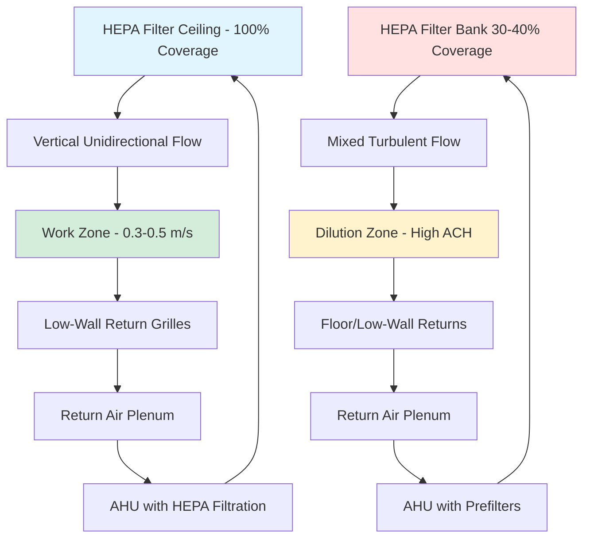

Airflow patterns constitute the fundamental design parameter for cleanroom performance. The airflow configuration directly determines particle removal efficiency, contamination control effectiveness, and cleanroom classification achievement.

## Unidirectional vs Non-Unidirectional Flow

**Unidirectional flow** (commonly called laminar flow) provides parallel air streamlines moving in a single direction at uniform velocity. This pattern sweeps particles away from critical processes in a consistent, predictable manner. True unidirectional flow exhibits minimal turbulence and eddies that could trap or recirculate contaminants.

**Non-unidirectional flow** relies on turbulent mixing to dilute airborne particles. Supply air enters through ceiling diffusers or HEPA filters, mixes with room air, and dilutes contamination to acceptable concentrations. This approach costs less than unidirectional systems but achieves lower cleanliness levels.

The selection between patterns depends on ISO classification requirements:
- ISO Class 1-4: Unidirectional flow required
- ISO Class 5: Unidirectional flow typically required for critical zones
- ISO Class 6-8: Non-unidirectional flow acceptable

## Vertical vs Horizontal Laminar Flow

**Vertical unidirectional flow** supplies air through a full ceiling of HEPA or ULPA filters, directing flow downward to low-wall or raised floor returns. This configuration provides optimal particle removal since gravity assists airflow in moving particles away from work surfaces.

The vertical flow velocity typically ranges from 0.3 to 0.5 m/s (60-100 fpm). The relationship between velocity and particle removal follows:

$$\eta = 1 - e^{-\frac{v_s \cdot t}{H}}$$

where $\eta$ is removal efficiency, $v_s$ is settling velocity, $t$ is time, and $H$ is room height.

**Horizontal unidirectional flow** pushes air from a filter wall across the room to an opposite return wall. This pattern works well for controlled processes requiring personnel access from above or below. Horizontal flow requires careful placement of equipment and personnel to prevent wake effects that disrupt streamlines.

Horizontal systems demand higher velocities (0.4-0.5 m/s) to overcome gravitational settling of particles moving laterally.

## Air Change Rates by Classification

Air change rate determines dilution effectiveness in non-unidirectional cleanrooms. The required rate increases with stricter classifications:

| ISO Class | Air Changes per Hour | Typical Velocity (Unidirectional) | Airflow Pattern |
|-----------|---------------------|----------------------------------|-----------------|
| ISO 3 | N/A | 0.4-0.5 m/s | Unidirectional |
| ISO 4 | N/A | 0.3-0.5 m/s | Unidirectional |
| ISO 5 | 240-480 | 0.3-0.45 m/s | Unidirectional or mixed |
| ISO 6 | 90-180 | N/A | Non-unidirectional |
| ISO 7 | 40-70 | N/A | Non-unidirectional |
| ISO 8 | 15-25 | N/A | Non-unidirectional |

The relationship between air changes and particle concentration follows first-order decay:

$$C(t) = C_0 \cdot e^{-\frac{ACH}{60} \cdot t}$$

where $C(t)$ is particle concentration at time $t$, $C_0$ is initial concentration, and $ACH$ is air changes per hour.

## Return Air Strategies

Return air placement critically affects airflow pattern effectiveness.

**Low-wall returns** position grilles 150-300 mm (6-12 inches) above the floor. This configuration captures particles swept downward by vertical unidirectional flow before they accumulate on the floor. Low-wall returns create optimal streamline patterns in vertical flow rooms.

**Raised floor returns** provide uniform return across the entire floor area through perforated floor panels. This approach delivers the most uniform vertical airflow pattern but requires significant construction investment. The pressure drop through perforated floors typically ranges from 12-25 Pa (0.05-0.1 in w.g.).

The return velocity through low-wall grilles should remain below 2.5 m/s (500 fpm) to prevent particle re-entrainment. For perforated floors, velocity through perforations should not exceed 0.6 m/s (120 fpm).

## Turbulent vs Laminar Velocity Requirements

Velocity requirements differ fundamentally between flow patterns:

**Laminar (unidirectional) flow:**
- Standard velocity: 0.36-0.45 m/s (70-90 fpm)
- Uniformity: ±20% across the filter face
- Maximum deviation: 0.15 m/s from mean velocity

**Turbulent (non-unidirectional) flow:**
- Supply velocity: 2.5-5.0 m/s (500-1000 fpm) at diffuser
- Room velocity: <0.2 m/s (40 fpm) in occupied zone
- Throw distance: Ceiling height × 4 to 6

The Reynolds number determines flow regime transition:

$$Re = \frac{\rho \cdot v \cdot L}{\mu}$$

For cleanroom applications, $Re < 2300$ indicates laminar conditions, while $Re > 4000$ indicates turbulent flow.

## Airflow Visualization and Validation

Airflow pattern validation verifies design performance through multiple methods:

**Smoke studies** release theatrical smoke or aerosol streams to visualize flow patterns. Observations identify recirculation zones, dead spots, and flow disruptions. This qualitative method provides immediate visual feedback but requires expert interpretation.

**Particle count mapping** measures airborne particles at multiple locations during operation. The mapping reveals areas of poor particle removal indicating inadequate airflow. Counts should remain uniform throughout unidirectional flow zones.

**Velocity measurements** using thermal anemometers verify uniformity and magnitude. ISO 14644-3 requires measurements at a grid spacing of approximately 0.6 m (2 ft) across filter faces. Each point must fall within specified tolerances.

**Computational fluid dynamics (CFD)** modeling predicts airflow patterns before construction. CFD identifies design problems early but requires validation through physical testing after installation.

Recovery testing measures the time required to reduce particle concentration by 90% or 99% after a contamination event. This metric directly assesses the practical effectiveness of the airflow pattern under upset conditions.

Proper airflow pattern design and validation ensures cleanroom performance meets process requirements while optimizing energy consumption and construction costs.
