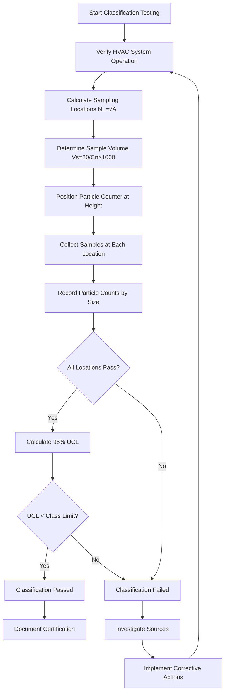

## ISO 14644-1 Classification System

ISO 14644-1 establishes the international standard for cleanroom classification based on airborne particulate cleanliness. The classification designates cleanroom classes from ISO Class 1 (cleanest) to ISO Class 9 (least clean) based on the maximum permitted concentration of particles per cubic meter of air for specified particle sizes.

The fundamental equation defining ISO class limits:

$$C_n = 10^N \times \left(\frac{0.1}{D}\right)^{2.08}$$

Where:
- $C_n$ = maximum permitted concentration (particles/m³) for particle size $D$
- $N$ = ISO classification number (1 through 9)
- $D$ = particle size in micrometers (0.1 μm to 5.0 μm)

For ISO Class 5 cleanrooms at 0.5 μm particle size:

$$C_{0.5} = 10^5 \times \left(\frac{0.1}{0.5}\right)^{2.08} = 10^5 \times 0.255 = 3,520 \text{ particles/m}^3$$

The standard specifies consideration particles at sizes of 0.1 μm, 0.2 μm, 0.3 μm, 0.5 μm, 1.0 μm, and 5.0 μm, though not all sizes apply to all classifications.

## Historical Federal Standard 209E

Federal Standard 209E, used extensively in the United States until superseded by ISO 14644-1 in 2001, classified cleanrooms based on particles per cubic foot rather than cubic meter. The designation number indicated the maximum number of 0.5 μm particles permitted per cubic foot.

### ISO to FS 209E Comparison

| ISO Class | FS 209E Equivalent | Particles/m³ (≥0.5 μm) | Particles/ft³ (≥0.5 μm) |
|-----------|-------------------|------------------------|-------------------------|
| ISO 3 | Class 1 | 35.2 | 1 |
| ISO 4 | Class 10 | 352 | 10 |
| ISO 5 | Class 100 | 3,520 | 100 |
| ISO 6 | Class 1,000 | 35,200 | 1,000 |
| ISO 7 | Class 10,000 | 352,000 | 10,000 |
| ISO 8 | Class 100,000 | 3,520,000 | 100,000 |
| ISO 9 | Room Air | 35,200,000 | 1,000,000 |

The conversion factor between systems: multiply particles/ft³ by 35.2 to obtain particles/m³.

## Particle Count Testing Methods

Cleanroom classification requires discrete particle counting using calibrated optical particle counters (OPCs) that operate on light scattering principles. A laser or white light source illuminates particles passing through a sensing zone, and photodetectors measure scattered light intensity to determine particle size and quantity.

**Sampling locations** follow statistical requirements based on cleanroom area:

$$NL = \sqrt{A}$$

Where $NL$ = minimum number of sampling locations and $A$ = cleanroom area in square meters. For areas less than 4 m², use minimum of 2 locations.

**Sample volume** must be sufficient to detect at least 20 particles at the largest specified particle size if the concentration equals the class limit:

$$V_s = \frac{20}{C_n} \times 1000$$

Where $V_s$ = minimum single sample volume in liters and $C_n$ = class limit in particles per cubic meter.

For ISO Class 5 at 0.5 μm: $V_s = \frac{20}{3,520} \times 1000 = 5.68$ liters minimum per location.

## Classification at Rest vs Operational

ISO 14644-1 defines three occupancy states for classification:

**As-built:** Facility complete with HVAC operational but no production equipment or personnel present. Verifies construction quality and HVAC system performance.

**At-rest:** Installation complete with equipment installed and operational but no personnel present. Demonstrates equipment does not compromise cleanliness when idle.

**Operational:** Normal operating conditions with equipment functioning and personnel performing activities. Represents real-world performance under production conditions.

Most challenging classification occurs during operational state due to particle generation from personnel movement, material handling, and process equipment. Design specifications typically require at-rest performance one ISO class better than operational requirements to provide adequate margin.

## EU GMP Grade Classifications

The European Union Good Manufacturing Practice (EU GMP) guidelines for pharmaceutical manufacturing define cleanroom grades A, B, C, and D, which align approximately with ISO classifications but impose stricter requirements for operational states:

- **Grade A:** ISO 5 equivalent, critical zones for high-risk operations
- **Grade B:** ISO 5-7 equivalent, background for Grade A zones
- **Grade C:** ISO 7-8 equivalent, less critical manufacturing stages
- **Grade D:** ISO 8 equivalent, preparation areas

EU GMP additionally specifies viable particulate (microbial) limits alongside non-viable particle counts, requiring both air and surface sampling for microbiological contamination.

## Certification and Recertification Requirements

Initial certification verifies cleanroom performance upon completion. ISO 14644-2 establishes monitoring requirements and requalification intervals:

**Installation qualification (IQ):** Verifies installed equipment matches design specifications.

**Operational qualification (OQ):** Demonstrates system operates within specified parameters.

**Performance qualification (PQ):** Confirms cleanroom achieves classification under operational conditions.

**Recertification intervals** depend on risk assessment but typically follow maximum periods:
- Particle count testing: every 6-24 months
- Airflow velocity/volume: every 12 months
- HEPA filter integrity: every 24 months
- Room pressure differentials: continuous monitoring with quarterly verification

Pharmaceutical and medical device manufacturing often requires more frequent testing based on regulatory requirements. Any significant facility modification, equipment change, or contamination event necessitates immediate requalification regardless of schedule.

Critical cleanrooms supporting sterile manufacturing undergo continuous particle monitoring with real-time alerts when particle counts approach action levels, providing early warning of contamination events before classification limits are exceeded.
