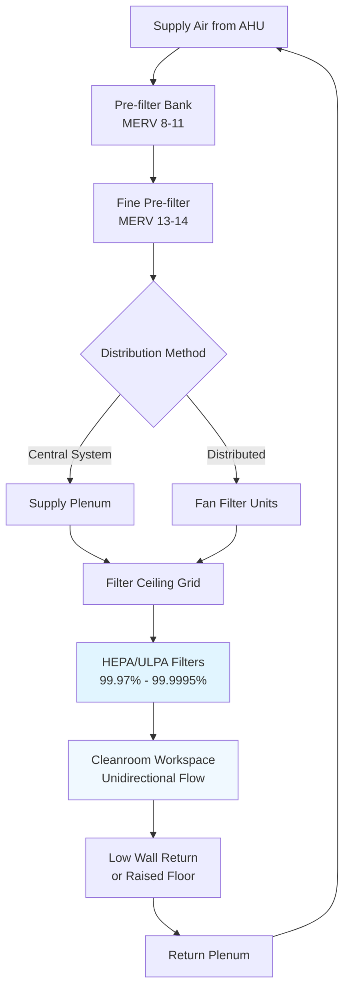

Cleanroom filtration systems provide the primary defense against particulate contamination, removing airborne particles to maintain specified cleanliness levels. The selection and configuration of filtration equipment directly determines cleanroom performance and compliance with ISO 14644-1 classifications.

## HEPA and ULPA Filter Standards

High-Efficiency Particulate Air (HEPA) filters achieve minimum efficiency of 99.97% for 0.3 μm particles, the most penetrating particle size (MPPS). Ultra-Low Penetration Air (ULPA) filters provide 99.9995% efficiency at 0.12 μm, required for ISO Class 3 and cleaner environments.

Filter efficiency is expressed as:

$$\eta = \left(1 - \frac{C_{downstream}}{C_{upstream}}\right) \times 100\%$$

where $C_{downstream}$ represents particle concentration after filtration and $C_{upstream}$ represents concentration before filtration.

Penetration, the inverse of efficiency, is calculated as:

$$P = \frac{C_{downstream}}{C_{upstream}} = 1 - \frac{\eta}{100}$$

For HEPA filters at rated conditions, penetration equals 0.0003 (0.03%). ULPA filters achieve penetration of 0.000005 (0.0005%).

## Filter Types by Cleanroom Classification

| ISO Class | Filter Type | Minimum Efficiency | Typical Application | Coverage |
|-----------|-------------|-------------------|---------------------|----------|
| ISO 3 | ULPA | 99.9995% at 0.12 μm | Semiconductor lithography | 80-100% ceiling |
| ISO 4 | ULPA/HEPA | 99.999% at 0.12 μm | Critical semiconductor processes | 70-90% ceiling |
| ISO 5 | HEPA | 99.99% at 0.3 μm | Pharmaceutical aseptic filling | 35-70% ceiling |
| ISO 6 | HEPA | 99.97% at 0.3 μm | Pharmaceutical production | 15-35% ceiling |
| ISO 7 | HEPA | 99.97% at 0.3 μm | Medical device assembly | 5-15% ceiling |
| ISO 8 | HEPA | 99.97% at 0.3 μm | Pharmaceutical packaging | 5-10% terminal |

## Filter Ceiling Configurations

Filter ceiling design balances air distribution uniformity, particle removal efficiency, and construction costs. Full-coverage filter ceilings provide 80-100% HEPA/ULPA coverage, creating unidirectional downward airflow for ISO Class 3-5 cleanrooms. This configuration delivers air velocity of 0.30-0.50 m/s across the workspace.

Partial coverage installations use 15-70% filter ceiling area for ISO Class 6-7 cleanrooms with non-unidirectional airflow. Filters concentrate over critical work zones, with remaining ceiling area occupied by blank panels, lighting, and utilities.

Terminal filter housings integrate into ducted supply systems or fan filter units for ISO Class 7-8 applications. This approach reduces initial cost but provides less uniform air distribution than filter ceilings.

## Fan Filter Units vs Central Systems

Fan filter units (FFUs) combine HEPA/ULPA filters with integral fans mounted directly in the ceiling grid. Each FFU operates independently, providing 90-100 m³/h airflow at 0.45 m/s face velocity. FFUs offer installation flexibility, reduced ductwork, and simplified expansion but generate heat loads of 30-60 W per unit and require distributed electrical service.

Central air handling systems supply pre-conditioned air through ductwork to terminal HEPA/ULPA filters. This approach centralizes equipment maintenance, provides superior temperature and humidity control, and reduces cleanroom heat gain. Central systems require larger mechanical spaces and more complex distribution networks.

The pressure drop across cleanroom filtration systems affects fan energy:

$$\Delta P_{total} = \Delta P_{pre} + \Delta P_{fine} + \Delta P_{HEPA/ULPA} + \Delta P_{duct}$$

Initial HEPA filter pressure drop ranges from 200-300 Pa, increasing to 400-600 Pa at filter replacement. ULPA filters start at 300-400 Pa due to denser media construction.

## Pre-filtration Strategies

Pre-filters protect final HEPA/ULPA filters from premature loading, extending service life from 2-3 years to 5-7 years. A three-stage filtration cascade provides optimal protection:

**Primary pre-filters (MERV 8-11)** remove large particles >10 μm, including dust, lint, and fiber from outdoor air and building materials. Replace every 3-6 months based on pressure drop monitoring.

**Fine pre-filters (MERV 13-14)** capture 1-10 μm particles before final filtration. These filters achieve 75-85% efficiency at 0.3 μm, significantly reducing HEPA/ULPA loading. Replace every 6-12 months.

**Chemical filters** using activated carbon or potassium permanganate media remove molecular contaminants (AMCs) that pass through particle filters. Critical for semiconductor and aerospace applications where outgassing affects product quality.

Pre-filter pressure drop typically ranges from 50-150 Pa initially, with replacement triggered at 250-400 Pa final pressure.

## Filter Leak Testing Requirements

ISO 14644-3 mandates in-situ leak testing after filter installation and annually thereafter. Testing verifies filter media integrity, gasket sealing, and frame installation.

The photometer scan method introduces polydisperse aerosol (PAO, DOS, or PSL particles) upstream at 10-20 μg/L concentration. A handheld aerosol photometer scans the downstream filter face at 25-50 mm distance, moving at 50 mm/s. Any location showing >0.01% penetration indicates a leak requiring repair or filter replacement.

The particle counter method samples discrete points across the filter face, comparing upstream challenge concentration to downstream readings. This quantitative approach provides documentation for validation protocols.

Acceptable leakage limits vary by application:
- ISO Class 3-4: Zero detectable leaks (0.00% penetration)
- ISO Class 5-6: <0.01% local penetration
- ISO Class 7-8: <0.03% local penetration

## Filter Change-out Procedures

Filter replacement procedures maintain cleanroom integrity during change-out operations. Plan replacements during scheduled shutdowns when production ceases and room classification is not required.

Establish bag-in/bag-out (BIBO) housings for hazardous material applications. These systems seal contaminated filters in plastic bags before removal, protecting personnel from exposure to toxic or infectious particles.

Standard change-out protocol:

1. **Pre-replacement verification** - Document pressure drop, airflow, and particle counts before removal
2. **Workspace preparation** - Clear area below filters, install temporary containment if required
3. **Filter removal** - Release clamps, seal removed filter in plastic bag, clean housing surfaces
4. **Installation** - Position new filter, verify gasket alignment, secure clamps to manufacturer torque specifications
5. **Leak testing** - Perform aerosol scan test across entire filter face and perimeter seal
6. **Performance verification** - Measure airflow, pressure drop, and room particle counts

Maintain continuous pre-filter operation during final filter replacement to minimize cleanroom contamination.

Document all filter changes including date, location, serial numbers, test results, and technician identification for validation and audit requirements.

## Components

- Final Hepa Filtration
- Final Ulpa Filtration
- Prefilter Protection
- Carbon Filter Molecular Contamination
- Fan Filter Units Ffu
- Filter Integrity Testing
- Dioctyl Phthalate Dop Test
- Aerosol Photometer Testing
- Filter Leak Testing Procedures
