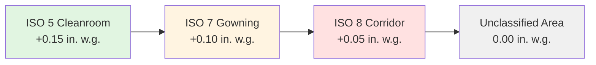

Pressure control constitutes a fundamental aspect of cleanroom design, preventing contamination migration between spaces of different cleanliness classifications. Proper pressure relationships ensure that air flows from cleaner to less clean areas, maintaining the integrity of controlled environments essential for pharmaceutical manufacturing, semiconductor fabrication, and biotechnology operations.

## Pressure Cascade Principles

The pressure cascade establishes a hierarchy of pressure differentials across adjacent spaces, with the cleanest rooms maintained at the highest pressure. This arrangement creates a unidirectional contamination barrier, where any air leakage through doors, penetrations, or building envelope defects flows outward from protected spaces.

The basic pressure relationship follows:

$$\Delta P = P_{\text{clean}} - P_{\text{adjacent}}$$

where $\Delta P$ represents the minimum pressure differential required to prevent contamination ingress. Multiple cascading zones create cumulative pressure differences:

$$\Delta P_{\text{total}} = \sum_{i=1}^{n} \Delta P_i$$

This stepped approach ensures that even temporary pressure fluctuations during door operations do not compromise cleaner spaces.

## Typical Pressure Differentials

Industry standards establish minimum pressure differentials between cleanroom classifications. Federal Standard 209E and ISO 14644 specify 0.02 to 0.05 inches water gauge (in. w.g.) as acceptable ranges, though practical implementations typically target higher values to accommodate operational variations.

| Classification Change | Minimum ΔP (in. w.g.) | Typical Design ΔP (in. w.g.) | Airflow Direction |
|----------------------|----------------------|------------------------------|-------------------|
| ISO 5 to ISO 7 | 0.03 | 0.05 | ISO 5 → ISO 7 |
| ISO 7 to ISO 8 | 0.02 | 0.03 | ISO 7 → ISO 8 |
| ISO 8 to Unclassified | 0.02 | 0.03 | ISO 8 → Outside |
| Cleanroom to Corridor | 0.03 | 0.05 | Room → Corridor |
| Critical Area to Support | 0.05 | 0.08 | Critical → Support |

The volumetric flow required to maintain pressure differential depends on leakage area:

$$Q = C \cdot A \cdot \sqrt{\Delta P}$$

where $Q$ = airflow (CFM), $C$ = discharge coefficient (typically 0.65), $A$ = leakage area (ft²), and $\Delta P$ = pressure differential (in. w.g.).

## Air Locks and Pass-Throughs

Air locks serve as pressure transition zones, buffering cleanrooms from adjacent lower-classification spaces. These vestibules maintain intermediate pressures, minimizing pressure surges when personnel or materials enter controlled areas.

Three airlock configurations exist:

**Bubble Airlock**: Maintained at higher pressure than both adjacent spaces, creating outward airflow in both directions. Preferred for highest contamination control.

**Sink Airlock**: Maintained at lower pressure than adjacent spaces, drawing air inward from both sides. Used when containing hazardous materials.

**Cascade Airlock**: Pressure between adjacent spaces, supporting unidirectional flow from clean to less clean.

Pass-through chambers operate similarly, maintaining pressure control during material transfer. These chambers typically feature interlocked doors preventing simultaneous opening, with HEPA-filtered supply air maintaining positive pressure.

## Door Interlock Systems

Mechanical and electronic interlocks prevent simultaneous door opening in airlocks and pass-throughs, preserving pressure differentials. Mechanical interlocks use physical latching mechanisms, while electronic systems employ magnetic locks controlled by pressure sensors.

Interlock override capabilities must exist for emergency egress, with alarms indicating breach conditions. Advanced systems incorporate time delays, requiring minimum dwell periods before opposite door unlocking, allowing pressure re-establishment.

## Pressure Monitoring and Control

Continuous pressure monitoring employs differential pressure sensors measuring pressure across critical boundaries. Low differential pressure magnehelic gauges provide visual indication, while electronic transmitters supply data to building automation systems for active control.

Control strategies include:

**Supply/Exhaust Balancing**: Modulating dampers adjust supply or exhaust volumes maintaining target differentials. This approach offers rapid response but requires careful tuning preventing hunting.

**Bypass Dampers**: Return air bypass dampers modulate flow based on pressure readings, providing stable control without affecting supply volumes.

**Variable Frequency Drives**: VFD-controlled fans adjust speeds maintaining pressure setpoints. This method provides energy efficiency but responds more slowly to disturbances.

The pressure control response follows proportional-integral-derivative (PID) logic:

$$u(t) = K_p \cdot e(t) + K_i \int e(t)\,dt + K_d \frac{de(t)}{dt}$$

where $u(t)$ = control output, $e(t)$ = error (setpoint minus measured), $K_p$ = proportional gain, $K_i$ = integral gain, and $K_d$ = derivative gain.

## Loss of Pressure Recovery

Pressure loss events require systematic recovery procedures ensuring contamination has not compromised cleanliness. Typical causes include filter loading, fan failures, excessive door openings, or control system malfunctions.

Recovery protocol includes:

1. **Immediate Response**: Alarm notification and restriction of room access
2. **Cause Identification**: Systematic troubleshooting of mechanical systems and controls
3. **Corrective Action**: Filter replacement, equipment repair, or control adjustment
4. **Pressure Re-establishment**: Gradual restoration to design conditions
5. **Room Qualification**: Particle count testing verifying classification restoration
6. **Documentation**: Incident recording and corrective action verification

The recovery time depends on room volume and air change rate:

$$t = \frac{V}{Q} \ln\left(\frac{C_0}{C_f}\right)$$

where $t$ = time to achieve cleanliness, $V$ = room volume, $Q$ = supply airflow, $C_0$ = initial contamination, and $C_f$ = final acceptable contamination level.

Following pressure loss exceeding 30 minutes, re-certification through particle counting and microbial sampling typically becomes necessary before resuming operations, ensuring the space meets its classification requirements.
