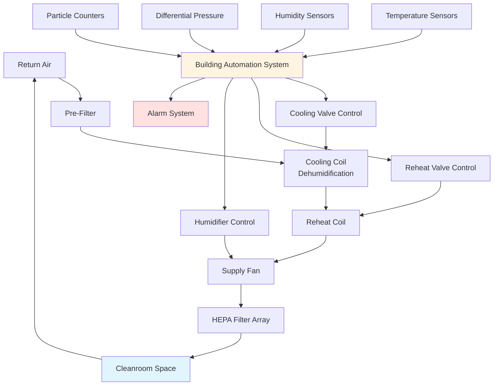

## Precision Temperature Requirements

Cleanroom environments demand exceptional temperature stability to support sensitive manufacturing processes and prevent product defects. Most cleanroom applications require temperature control within **±0.5°C** of setpoint, with semiconductor fabrication facilities often requiring even tighter tolerances of **±0.25°C**.

Temperature precision affects:
- **Photolithography alignment** in semiconductor manufacturing
- **Dimensional stability** of precision components during assembly
- **Chemical reaction rates** in pharmaceutical production
- **Material properties** during composite layup operations
- **Measurement accuracy** in metrology and inspection areas

### Temperature Stratification Control

Vertical temperature gradients must be minimized to maintain uniform conditions throughout the cleanroom space. Ceiling-mounted HEPA filter arrays provide laminar airflow that prevents stratification, typically maintaining vertical temperature variation below **0.3°C per meter** of room height.

The sensible heat removal capacity must account for all heat sources:

$$Q_s = Q_{lights} + Q_{equipment} + Q_{people} + Q_{walls} + Q_{outdoor}$$

Where each component contributes to the total sensible cooling load, requiring precise air volume and temperature control.

## Humidity Control for Static Prevention

Static electricity control represents a critical function of cleanroom humidity management. Electronic device manufacturing requires **40-50% RH** to prevent electrostatic discharge (ESD) damage, while pharmaceutical operations typically maintain **35-50% RH** for product stability.

### Electrostatic Discharge Prevention

The relationship between relative humidity and surface resistance demonstrates why humidity control is essential:

$$R_s = k \cdot e^{-\alpha \cdot RH}$$

Where $R_s$ is surface resistance (ohms), $k$ is a material constant, $\alpha$ is the humidity sensitivity coefficient, and $RH$ is relative humidity in percent. Surface resistance decreases exponentially as humidity increases, reducing static charge accumulation.

Maintaining humidity above **40% RH** typically reduces surface resistance below $10^{11}$ ohms, the threshold for effective static dissipation on most materials.

## Process-Specific Environmental Requirements

Different cleanroom applications impose distinct environmental constraints based on product sensitivity and process chemistry.

| Application | Temperature | Temperature Tolerance | Humidity | Humidity Tolerance | ISO Class |
|-------------|-------------|----------------------|----------|-------------------|-----------|
| Semiconductor Fab | 20-22°C | ±0.25°C | 40-45% RH | ±2% RH | 4-5 |
| Pharmaceutical Mfg | 20-22°C | ±0.5°C | 35-50% RH | ±5% RH | 5-7 |
| Biotech Production | 20-24°C | ±1.0°C | 40-60% RH | ±5% RH | 6-8 |
| Medical Device Assembly | 21-23°C | ±0.5°C | 40-50% RH | ±5% RH | 7-8 |
| Aerospace Composites | 20-25°C | ±1.0°C | 45-55% RH | ±5% RH | 7-8 |
| Optical Lens Production | 20-22°C | ±0.3°C | 40-50% RH | ±3% RH | 6-7 |
| Data Center Cleanrooms | 18-27°C | ±2.0°C | 40-60% RH | ±10% RH | 8 |

### Moisture-Sensitive Processes

Hygroscopic materials in semiconductor processing require dewpoint control rather than relative humidity control. Advanced fabs maintain dewpoint below **-40°C** in lithography areas to prevent moisture absorption by photoresist materials.

The moisture content relationship demonstrates why dewpoint control provides better process repeatability:

$$W = 0.622 \cdot \frac{P_{ws}}{P_{atm} - P_{ws}}$$

Where $W$ is humidity ratio (lb water/lb dry air), $P_{ws}$ is water vapor saturation pressure at dewpoint temperature, and $P_{atm}$ is atmospheric pressure.

## Reheat and Dehumidification Systems

Achieving precise humidity control while maintaining temperature stability requires sophisticated reheat strategies. Cleanroom HVAC systems typically employ multiple stages of conditioning.

### Cooling and Reheat Sequence

1. **Pre-cooling coil** removes bulk sensible and latent load
2. **Deep cooling coil** over-cools supply air to 7-10°C dewpoint
3. **Reheat coil** raises temperature to desired supply condition
4. **Trim cooling** provides fine temperature adjustment

The dehumidification process follows the psychrometric relationship:

$$Q_l = \dot{m}_a \cdot h_{fg} \cdot (W_1 - W_2)$$

Where $Q_l$ is latent cooling (kW), $\dot{m}_a$ is dry air mass flow (kg/s), $h_{fg}$ is latent heat of vaporization (2501 kJ/kg), $W_1$ is entering humidity ratio, and $W_2$ is leaving humidity ratio.

### Desiccant Dehumidification

Low-dewpoint applications below **-20°C** require desiccant systems because refrigeration-based cooling cannot achieve the necessary moisture removal. Regenerative desiccant wheels provide continuous dehumidification with energy recovery.

The desiccant moisture removal capacity depends on the adsorption isotherm:

$$W_{ads} = f(RH, T, t)$$

Where adsorbed water content varies with relative humidity, temperature, and contact time.

## Control System Response Requirements

Cleanroom environmental control systems must respond rapidly to disturbances while avoiding oscillation or overshoot.

### Proportional-Integral-Derivative (PID) Control

Temperature and humidity loops employ PID algorithms tuned for fast response without hunting:

$$u(t) = K_p \cdot e(t) + K_i \int e(t)dt + K_d \frac{de(t)}{dt}$$

Where $u(t)$ is controller output, $e(t)$ is error signal, and $K_p$, $K_i$, $K_d$ are proportional, integral, and derivative gains.

**Typical tuning parameters:**
- **Temperature loops:** $K_p = 2-5$, $T_i = 5-10$ min, $T_d = 1-2$ min
- **Humidity loops:** $K_p = 1-3$, $T_i = 10-20$ min, $T_d = 0-2$ min

### Control Loop Response Times

- **Temperature disturbance recovery:** 10-15 minutes to within ±0.1°C of setpoint
- **Humidity disturbance recovery:** 20-30 minutes to within ±2% RH of setpoint
- **Sensor update rate:** 1-5 second sampling intervals
- **Control valve response:** 30-60 second modulation time

## Monitoring and Alarming

Continuous environmental monitoring ensures process integrity and provides early warning of system degradation.

### Sensor Placement Strategy

- **Temperature sensors:** Located at breathing height (1.2-1.5 m) in work areas, plus supply and return air streams
- **Humidity sensors:** Minimum one per 100 m² of cleanroom area, calibrated quarterly
- **Differential pressure:** Across each HEPA filter array and between cleanroom zones
- **Dewpoint sensors:** Required for processes demanding dewpoint below -20°C

### Alarm Hierarchy

**Critical alarms** (immediate response required):
- Temperature deviation exceeding ±1.0°C for more than 5 minutes
- Humidity deviation exceeding ±10% RH for more than 10 minutes
- Supply air failure or fan shutdown
- Differential pressure loss indicating filter failure

**Warning alarms** (investigation required):
- Temperature deviation exceeding ±0.5°C for more than 10 minutes
- Humidity deviation exceeding ±5% RH for more than 15 minutes
- Trend indicating approaching out-of-tolerance condition

### Data Logging Requirements

Environmental data must be logged continuously for process validation and troubleshooting:

- **Logging interval:** 1-minute averages for trending, 10-second intervals for alarms
- **Storage duration:** Minimum 2 years for pharmaceutical applications (FDA 21 CFR Part 11)
- **Audit trail:** All setpoint changes and alarm acknowledgments recorded with user ID and timestamp
- **Calibration records:** Sensor accuracy verification every 6-12 months depending on criticality

Environmental control represents the foundation of cleanroom operation. Precision temperature and humidity management directly impacts product yield, process repeatability, and regulatory compliance across semiconductor, pharmaceutical, and precision manufacturing industries.
