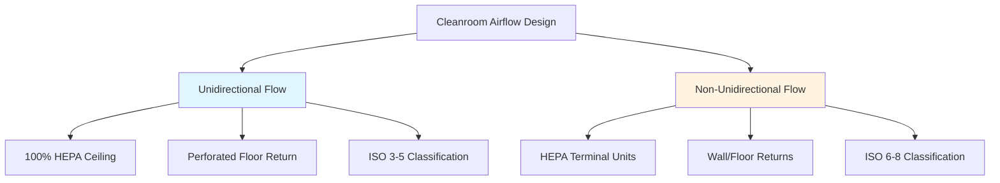

# Cleanrooms & Controlled Environments HVAC

Cleanrooms are specialized spaces where airborne particle concentration is controlled to specified limits. HVAC systems for cleanrooms must maintain precise control of particulate levels, temperature, humidity, and pressure while managing heat loads from equipment and personnel.

## ISO Classification Standards

ISO 14644-1 defines cleanroom classifications based on maximum allowable particle concentrations per cubic meter of air. The classification number represents the log₁₀ of particle count for 0.1 μm particles.

### ISO 14644-1 Particle Concentration Limits

| ISO Class | 0.1 μm | 0.2 μm | 0.3 μm | 0.5 μm | 1 μm | 5 μm |
|-----------|--------|--------|--------|--------|------|------|
| ISO 3 | 1,000 | 237 | 102 | 35 | 8 | - |
| ISO 4 | 10,000 | 2,370 | 1,020 | 352 | 83 | - |
| ISO 5 | 100,000 | 23,700 | 10,200 | 3,520 | 832 | 29 |
| ISO 6 | 1,000,000 | 237,000 | 102,000 | 35,200 | 8,320 | 293 |
| ISO 7 | - | - | - | 352,000 | 83,200 | 2,930 |
| ISO 8 | - | - | - | 3,520,000 | 832,000 | 29,300 |

The particle concentration limit is calculated using:

$$C_n = 10^N \times \left(\frac{0.1}{D}\right)^{2.08}$$

Where:
- $C_n$ = maximum permitted particle concentration (particles/m³)
- $N$ = ISO classification number
- $D$ = particle size (μm)

## Airflow Patterns and Design

Cleanrooms utilize two primary airflow configurations based on contamination control requirements.

### Unidirectional (Laminar) Flow

Unidirectional flow systems provide parallel airflow at 0.36-0.51 m/s (70-100 fpm) velocity through the entire room cross-section. HEPA or ULPA filters cover 80-100% of the ceiling, with perforated raised floors for air return.

**Applications:** ISO 3-5 cleanrooms for semiconductor manufacturing, aseptic pharmaceutical processing, and critical medical device assembly.

**Air change rate:** 300-600 ACH depending on filter coverage and velocity requirements.

### Non-Unidirectional (Turbulent) Flow

Non-unidirectional systems use high-efficiency filters in ceiling-mounted terminals with conventional return air systems. Turbulent mixing dilutes and removes contaminants through high air change rates.

**Applications:** ISO 6-8 cleanrooms for pharmaceutical packaging, electronics assembly, and biotechnology laboratories.

**Air change rate:** 20-60 ACH for ISO 7, 10-25 ACH for ISO 8, per ASHRAE recommendations.

## Pressure Cascade Design

Differential pressure between spaces prevents contaminant migration from less clean to cleaner areas. Pressure cascades are established through airflow balance and door undercut or transfer grilles.

### Pressure Differential Requirements

| Application | Pressure Differential | Direction |
|-------------|----------------------|-----------|
| Cleanroom to corridor | 5-20 Pa (0.02-0.08 in. w.g.) | Positive |
| Aseptic core to support | 10-15 Pa (0.04-0.06 in. w.g.) | Positive |
| Hazardous materials room | 5-15 Pa (0.02-0.06 in. w.g.) | Negative |
| Airlock differential | 2.5-5 Pa (0.01-0.02 in. w.g.) | Stepped |

The airflow required to maintain pressure differential accounts for leakage through construction gaps:

$$Q_{leak} = C \times A \times \sqrt{\Delta P}$$

Where:
- $Q_{leak}$ = leakage airflow (m³/s)
- $C$ = leakage coefficient (0.65-0.85 for typical construction)
- $A$ = leakage area (m²)
- $\Delta P$ = pressure differential (Pa)

## Filtration Systems

### Filter Efficiency Requirements

**HEPA Filters (H13-H14):** Minimum 99.97% efficiency at 0.3 μm MPPS (Most Penetrating Particle Size). Used for ISO 5-8 cleanrooms.

**ULPA Filters (U15-U17):** Minimum 99.9995% efficiency at 0.12 μm MPPS. Required for ISO 3-4 applications.

Filter selection considers particle removal efficiency, pressure drop, and energy consumption. Initial pressure drop typically ranges from 125-375 Pa (0.5-1.5 in. w.g.) for HEPA filters.

The filter life cycle cost includes both initial investment and operating energy:

$$LCC = C_{filter} + \frac{Q \times \Delta P \times t \times C_{energy}}{\eta_{fan}}$$

Where:
- $LCC$ = life cycle cost ($)
- $C_{filter}$ = filter replacement cost ($)
- $Q$ = airflow rate (m³/s)
- $\Delta P$ = average pressure drop (Pa)
- $t$ = operating hours (h)
- $C_{energy}$ = energy cost ($/kWh)
- $\eta_{fan}$ = fan/motor efficiency

## Temperature and Humidity Control

Cleanroom processes often require tight environmental tolerances:

**Temperature:** ±0.5°C to ±2.0°C depending on process requirements
**Relative Humidity:** ±2% to ±5% RH for precision applications

Sensible heat ratio in cleanrooms typically exceeds 0.90 due to equipment heat loads and minimal occupant density. Dehumidification requires careful integration with filtration systems to prevent condensation on HEPA filters.

The cooling load calculation accounts for:
- Equipment heat gain (often 50-80% of total load)
- Lighting heat gain
- Personnel heat gain
- Fan heat gain from high air change rates
- Envelope loads (minimal in controlled environments)

## Air Handling System Design

### Makeup Air Requirements

Cleanroom makeup air compensates for exhaust, pressurization, and process consumption:

$$Q_{MA} = Q_{exhaust} + Q_{press} + Q_{process}$$

Makeup air systems provide 100% outdoor air with multiple filtration stages:
1. Pre-filters (MERV 8-11)
2. Secondary filters (MERV 13-14)
3. Final HEPA/ULPA filters at point of use

### Energy Recovery Considerations

Energy recovery between exhaust and makeup air streams reduces conditioning loads but requires careful design to prevent cross-contamination. Rotating wheel heat exchangers are generally avoided in pharmaceutical and biotech applications due to potential carryover. Plate heat exchangers or runaround loops provide safer alternatives.

Recovery effectiveness of 60-75% is achievable while maintaining complete air stream separation. The energy savings potential is:

$$E_{saved} = Q \times \rho \times c_p \times (T_{oa} - T_{ra}) \times \varepsilon \times t$$

Where $\varepsilon$ is heat recovery effectiveness.

## System Commissioning and Validation

Cleanroom qualification follows a structured protocol per FDA guidelines and ISO 14644-3:

**IQ (Installation Qualification):** Verify installed equipment matches specifications
**OQ (Operational Qualification):** Confirm systems meet design parameters under operational conditions
**PQ (Performance Qualification):** Validate process performance under simulated production conditions

Key commissioning tests include:
- Particle counting at multiple locations and operational states
- HEPA filter leak testing using DOP or PAO aerosols
- Airflow velocity and uniformity measurements
- Room pressure differential verification
- Temperature and humidity mapping
- Recovery time testing after contamination events

ASHRAE Guidelines provide detailed protocols for cleanroom testing, adjusting, and balancing procedures specific to critical environments.

---

**Related Topics:**
- Pharmaceutical Manufacturing HVAC
- Semiconductor Fab Environmental Control
- Laboratory Exhaust Systems
- Biosafety Cabinet Ventilation
- Sterile Processing Department Design
