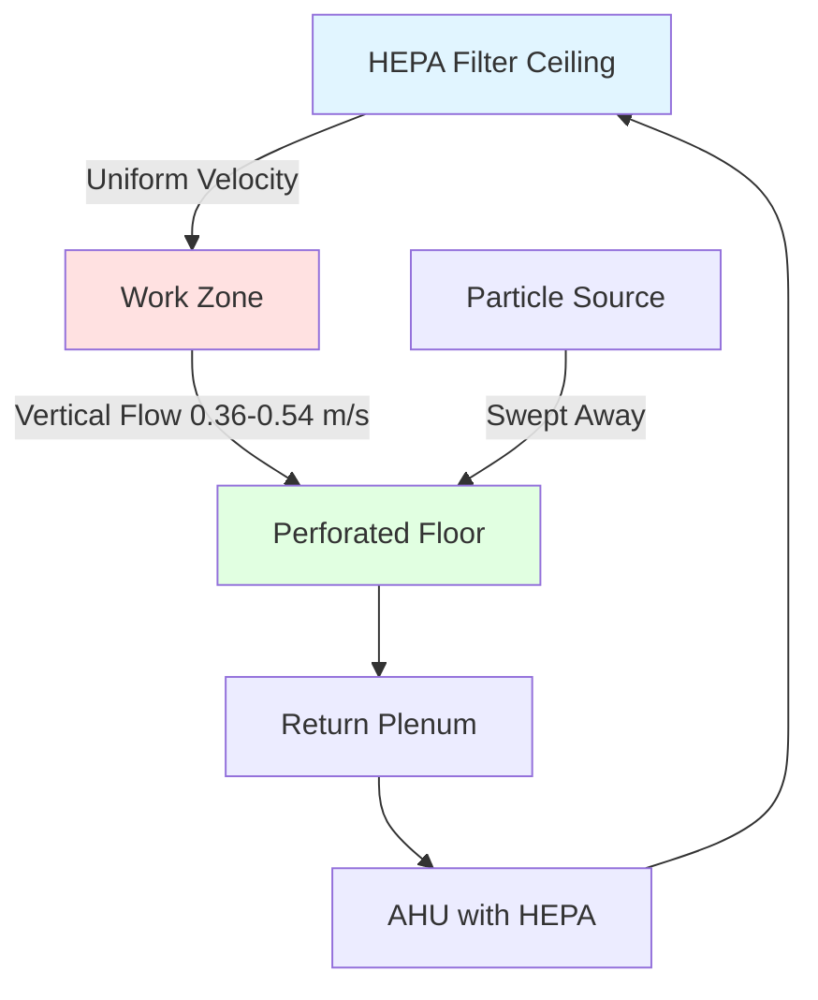
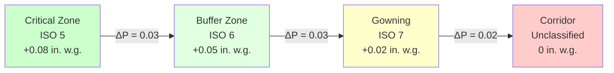

## Fundamental Cleanroom Physics

Cleanrooms maintain controlled particulate contamination levels through engineered airflow patterns that continuously remove and dilute airborne particles. The fundamental principle relies on the particle mass balance equation:

$$\frac{dC}{dt} = G - Q \cdot C - \lambda \cdot C$$

where $C$ is particle concentration (particles/m³), $G$ is particle generation rate (particles/m³·s), $Q$ is air exchange rate (1/s), and $\lambda$ is particle deposition rate constant (1/s).

At steady state ($dC/dt = 0$), the equilibrium concentration becomes:

$$C_{eq} = \frac{G}{Q + \lambda}$$

This relationship reveals that particle concentration decreases with increased air exchange rate $Q$, forming the basis for cleanroom air change requirements.

## ISO 14644 Cleanroom Classifications

ISO 14644-1 defines cleanroom classes based on maximum allowable particle concentrations at specified particle sizes. The classification number $N$ represents the maximum particle count (particles per cubic meter) at 0.1 μm diameter.

### Classification Table

| ISO Class | 0.1 μm | 0.2 μm | 0.3 μm | 0.5 μm | 1.0 μm | 5.0 μm | Typical Applications |
|-----------|---------|---------|---------|---------|---------|---------|---------------------|
| ISO 1 | 10 | 2 | — | — | — | — | Theoretical limit |
| ISO 2 | 100 | 24 | 10 | 4 | — | — | Semiconductor nodes <7nm |
| ISO 3 | 1,000 | 237 | 102 | 35 | 8 | — | Semiconductor wafer fab |
| ISO 4 | 10,000 | 2,370 | 1,020 | 352 | 83 | — | Semiconductor assembly |
| ISO 5 | 100,000 | 23,700 | 10,200 | 3,520 | 832 | 29 | Sterile drug filling |
| ISO 6 | 1,000,000 | 237,000 | 102,000 | 35,200 | 8,320 | 293 | Aseptic processing background |
| ISO 7 | — | — | — | 352,000 | 83,200 | 2,930 | Pharmaceutical packaging |
| ISO 8 | — | — | — | 3,520,000 | 832,000 | 29,300 | General manufacturing |

The particle count limit for any size follows the exponential relationship:

$$C_n = 10^N \times \left(\frac{0.1}{d_p}\right)^{2.08}$$

where $C_n$ is particle concentration limit (particles/m³), $N$ is ISO class number, and $d_p$ is particle diameter (μm). The exponent 2.08 derives from log-normal particle size distribution assumptions.

## Airflow Patterns and Particle Removal

Cleanroom airflow patterns determine particle transport and removal efficiency. Two fundamental configurations exist: unidirectional (laminar) and non-unidirectional (turbulent mixing).

### Unidirectional Flow (ISO 3-5)

Unidirectional flow maintains near-parallel streamlines with velocity $V_{flow} = 0.36-0.54$ m/s (70-106 fpm). This velocity exceeds particle settling velocities while avoiding turbulent vortices that trap particles.

The required face velocity to prevent particle recirculation follows from Reynolds number considerations:

$$V_{min} = \frac{\nu \cdot Re_{crit}}{L_c}$$

where $\nu$ is kinematic viscosity (1.5 × 10⁻⁵ m²/s for air), $Re_{crit} = 2,300$ for turbulent transition, and $L_c$ is characteristic length (typically 1-3 m). This yields $V_{min} \approx 0.01-0.03$ m/s, well below the standard 0.36 m/s specification, providing safety margin.

### Non-Unidirectional Flow (ISO 6-8)

Non-unidirectional cleanrooms use turbulent mixing to dilute particle concentrations. Supply air from HEPA-filtered ceiling diffusers creates mixing patterns that reduce particle concentration through the exponential decay relationship:

$$C(t) = C_0 e^{-Qt/V}$$

where $C_0$ is initial concentration, $Q$ is supply airflow rate, $V$ is room volume, and $t$ is time. The time constant $\tau = V/Q$ represents the time to reduce concentration by 63.2% (1/e).

The required air changes per hour (ACH) to achieve classification follows from steady-state analysis:

$$ACH = \frac{G \cdot V}{C_{target} \cdot V} = \frac{G}{C_{target}}$$

Typical cleanroom ACH requirements:

| ISO Class | ACH Range | Air Change Time Constant |
|-----------|-----------|-------------------------|
| ISO 5 | 400-600 | 6-9 seconds |
| ISO 6 | 150-240 | 15-24 seconds |
| ISO 7 | 60-90 | 40-60 seconds |
| ISO 8 | 20-30 | 120-180 seconds |

## HEPA and ULPA Filtration Requirements

High-Efficiency Particulate Air (HEPA) filters provide minimum 99.97% efficiency at 0.3 μm, corresponding to the most penetrating particle size (MPPS). Ultra-Low Penetration Air (ULPA) filters achieve 99.9995% efficiency at 0.12 μm.

### Filtration Efficiency Physics

Filter collection efficiency $\eta$ depends on five mechanisms:

$$\eta_{total} = 1 - (1-\eta_{interception})(1-\eta_{impaction})(1-\eta_{diffusion})(1-\eta_{gravity})(1-\eta_{electrostatic})$$

At the MPPS (0.1-0.3 μm), inertial impaction and Brownian diffusion are weakest, creating the minimum efficiency point. The MPPS diameter $d_{MPPS}$ follows:

$$d_{MPPS} = \sqrt{\frac{18 \mu D}{\rho_p V_0 d_f}}$$

where $\mu$ is air viscosity, $D$ is particle diffusion coefficient, $\rho_p$ is particle density, $V_0$ is face velocity, and $d_f$ is fiber diameter.

### Filter Sizing and Pressure Drop

HEPA filter face velocity affects service life and pressure drop. The pressure drop across clean HEPA filters ranges from 0.5-1.0 in. w.g. at rated flow. Pressure drop follows the Darcy-Weisbach relationship:

$$\Delta P = K \cdot \rho \cdot V^2$$

where $K$ is filter resistance coefficient (0.5-1.5 for HEPA media) and $V$ is face velocity. As filters load with particles, pressure drop increases:

$$\Delta P(t) = \Delta P_0 \left(1 + \frac{m_p(t)}{A \cdot \alpha}\right)$$

where $m_p(t)$ is accumulated particle mass, $A$ is filter area, and $\alpha$ is dust holding capacity (100-300 g/m² for HEPA filters). Filters require replacement when pressure drop reaches 2.0-2.5 in. w.g. or efficiency degrades below specification.

## Pressure Cascade Design

Cleanrooms maintain positive pressure relative to adjacent less-clean spaces, creating a pressure gradient that prevents contaminant infiltration. The pressure cascade follows the hierarchy:

The minimum pressure differential $\Delta P_{min}$ must overcome door leakage and maintain directional airflow. ISO 14644-4 recommends:

$$\Delta P_{min} = 0.02-0.05 \text{ in. w.g. (5-12 Pa)}$$

The airflow required to maintain pressure differential against leakage follows the orifice equation:

$$Q = C_d A_{leak} \sqrt{\frac{2 \Delta P}{\rho}}$$

where $C_d = 0.6-0.65$ for door gaps and $A_{leak}$ is total leakage area. For a standard cleanroom with 200 ft² wall area and 0.1 cfm/ft² leakage rate, maintaining 0.05 in. w.g. requires approximately 20 cfm of makeup air.

## Particle Generation and Removal Rates

Human personnel generate 100,000-10,000,000 particles/minute ≥0.5 μm depending on activity level and gowning protocol. Process equipment contributes additional particle loads.

### Personnel Particle Generation

| Activity | Particles/Minute (≥0.5 μm) | ISO Class Limit |
|----------|---------------------------|-----------------|
| Seated, minimal motion | 100,000 | ISO 5 compatible |
| Standing, light work | 500,000 | ISO 6 compatible |
| Walking slowly | 1,000,000 | ISO 7 compatible |
| Walking rapidly | 5,000,000 | ISO 8 compatible |
| Calisthenics | 10,000,000+ | Requires gowning room |

The particle removal rate in a cleanroom follows first-order kinetics:

$$\frac{dN}{dt} = G - \lambda N$$

where $N$ is total particle count, $G$ is generation rate, and $\lambda$ is removal rate constant. At equilibrium:

$$N_{eq} = \frac{G}{\lambda} = \frac{G \cdot V}{Q}$$

For a 1,000 ft³ ISO 5 cleanroom with one operator generating 500,000 particles/min at ≥0.5 μm, the required airflow to maintain classification (3,520 particles/m³ at 0.5 μm) is:

$$Q = \frac{G \cdot V}{C_{target}} = \frac{500,000 \text{ part/min} \times 1}{3,520 \text{ part/m}^3 \times 35.3 \text{ ft}^3/\text{m}^3} \approx 4,020 \text{ cfm}$$

This corresponds to approximately 240 ACH, consistent with ISO 5 requirements.

## Temperature and Humidity Control

Cleanrooms maintain tight temperature and humidity tolerances for process control and personnel comfort. Typical specifications:

- Temperature: 20 ± 2°C (68 ± 3.6°F)
- Relative humidity: 45 ± 5% RH
- Temperature gradient: <0.5°C per meter height

Humidity control prevents electrostatic discharge (ESD) and controls hygroscopic particle behavior. The relationship between particle size and relative humidity follows the Kelvin equation:

$$\ln\left(\frac{RH}{100}\right) = \frac{4 \gamma M}{\rho RT d_p}$$

where $\gamma$ is surface tension, $M$ is molecular weight, $R$ is gas constant, $T$ is temperature, and $d_p$ is particle diameter. Hygroscopic particles grow significantly above 60% RH, complicating particle control.

Sensible cooling load in cleanrooms includes:

$$Q_{sensible} = Q_{lights} + Q_{equipment} + Q_{people} + Q_{infiltration} + Q_{supply\ fan}$$

Latent load from personnel and infiltration requires dehumidification capacity:

$$Q_{latent} = m_{moisture} \times h_{fg}$$

where $h_{fg} = 1,060$ BTU/lb is water vaporization enthalpy. A typical person generates 200 BTU/hr latent heat at light activity.

## Supply Air Distribution

Supply air distribution affects both particle removal efficiency and thermal uniformity. Ceiling-mounted HEPA filter modules (2×4 ft or 2×2 ft) provide 100% coverage for ISO 4-5 unidirectional flow cleanrooms.

### Filter Coverage Ratio

The filter coverage ratio determines airflow uniformity:

$$Coverage = \frac{A_{filter}}{A_{ceiling}} \times 100\%$$

| ISO Class | Coverage Ratio | Filter Velocity | Room ACH |
|-----------|----------------|-----------------|----------|
| ISO 3-4 | 80-100% | 90 fpm | 540-720 |
| ISO 5 | 60-80% | 90 fpm | 360-540 |
| ISO 6-7 | 15-25% | 90 fpm | 60-150 |
| ISO 8 | 5-10% | 90 fpm | 20-40 |

Non-unidirectional cleanrooms use perforated diffusers or low-velocity displacement diffusers to minimize turbulent jet mixing that resuspends settled particles.

## Energy Consumption and Optimization

Cleanrooms consume 10-100 times more energy per square foot than conventional buildings due to high airflow rates and 100% outside air requirements (in some applications). Annual energy consumption ranges from 50-200 kWh/ft²·year.

### Energy Recovery Opportunities

Heat recovery from exhaust air reduces makeup air conditioning loads. The heat recovery effectiveness $\varepsilon$ follows:

$$\varepsilon = \frac{T_{supply} - T_{OA}}{T_{exhaust} - T_{OA}}$$

Rotary heat exchangers achieve $\varepsilon = 0.75-0.85$ but risk cross-contamination. Plate heat exchangers provide $\varepsilon = 0.50-0.70$ with complete separation of airstreams.

Fan power consumption scales with airflow and pressure drop:

$$P_{fan} = \frac{Q \times \Delta P_{total}}{6,356 \times \eta_{fan}}$$

where $P_{fan}$ is fan power (hp), $Q$ is airflow (cfm), $\Delta P_{total}$ is total system pressure (in. w.g.), and $\eta_{fan}$ is fan efficiency (0.60-0.75). High-efficiency ECM motors and variable frequency drives reduce energy consumption by 30-50% compared to constant-volume systems.

## Contamination Control Strategy

Effective cleanroom operation requires integrated contamination control addressing sources, pathways, and receptors:

### Source Control
- Personnel gowning protocols minimize particle shedding
- Equipment selection emphasizes low-particle-generating designs
- Material transfer procedures prevent contaminant introduction

### Pathway Control
- Pressure cascades prevent airborne migration
- Airlocks isolate transition zones
- Sticky mats capture floor-level particles

### Receptor Protection
- Unidirectional flow shields critical work zones
- Localized HEPA-filtered workstations create microenvironments
- Process isolation in barrier systems or isolators

The defense-in-depth approach combines multiple control layers, ensuring single-point failures do not compromise cleanliness.

## Validation and Monitoring

ISO 14644-3 specifies cleanroom performance tests conducted during installation qualification (IQ), operational qualification (OQ), and performance qualification (PQ) phases.

### Critical Performance Parameters

1. **Airflow velocity and uniformity**: Measure at 80% of filter face locations
2. **HEPA filter leak testing**: DOP or PAO aerosol challenge at 99.97% efficiency
3. **Particle count testing**: Sample at representative locations, multiple size channels
4. **Pressure differential verification**: Record cascade across all barriers
5. **Recovery time**: Measure time to return to classification after particle challenge
6. **Air change rate**: Calculate from volume and measured airflow

The recovery time $t_{recovery}$ to reduce concentration from ISO 8 to ISO 5 levels follows:

$$t_{recovery} = \frac{V}{Q} \ln\left(\frac{C_{initial}}{C_{target}}\right) = \frac{1}{ACH/60} \times \ln\left(\frac{C_8}{C_5}\right)$$

For ISO 8 to ISO 5 recovery (concentration reduction factor ≈1,000) at 360 ACH:

$$t_{recovery} = \frac{60}{360} \times \ln(1,000) \approx 1.15 \text{ minutes}$$

Continuous monitoring of differential pressure, particle counts, temperature, and humidity ensures sustained compliance between periodic recertification cycles (typically 6-12 months).
