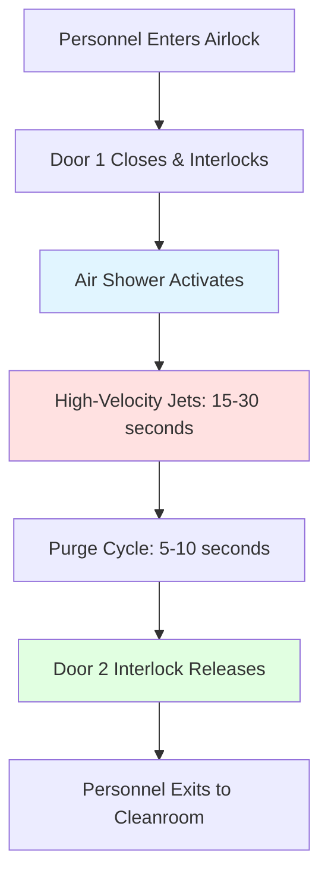
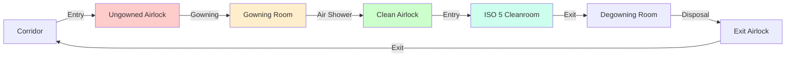

## Fundamental Airlock Physics

Airlocks in cleanroom gowning areas function as pressure transition zones that prevent bidirectional contamination transfer. The fundamental principle relies on maintaining a pressure gradient that drives airflow from cleaner to less clean environments, preventing particle migration against the pressure differential.

The pressure differential across an airlock door follows the orifice flow equation:

$$Q = C_d A \sqrt{\frac{2\Delta P}{\rho}}$$

where $Q$ is volumetric airflow (cfm), $C_d$ is discharge coefficient (0.6-0.65 for door gaps), $A$ is effective leakage area (ft²), $\Delta P$ is pressure differential (in. w.g.), and $\rho$ is air density (lb/ft³).

For a typical cleanroom door with 0.125 in. perimeter gap, the leakage area approximates $A = L \times h$ where $L$ is door perimeter and $h$ is gap height. A standard 3 ft × 7 ft door yields $A \approx 0.174$ ft² at 0.125 in. gap.

## Cascading Pressure Differential Design

Effective airlock systems establish a monotonic pressure gradient from the controlled cleanroom through the gowning area to the uncontrolled environment. ISO 14644-4 recommends minimum pressure differentials of 0.02-0.05 in. w.g. (5-12 Pa) between adjacent zones.

### Three-Stage Pressure Cascade

| Zone | Typical Pressure | Relative to Atmosphere | Air Changes/Hour |
|------|------------------|------------------------|------------------|
| ISO 5 Cleanroom | +0.08 in. w.g. | +20 Pa | 400-600 |
| Gowning Airlock | +0.05 in. w.g. | +12 Pa | 60-90 |
| Ungowned Corridor | +0.02 in. w.g. | +5 Pa | 20-30 |
| External Environment | 0 in. w.g. | 0 Pa | — |

The pressure differential must overcome door leakage and maintain directional airflow. The required airflow to sustain pressure differential is:

$$Q_{required} = Q_{leakage} + Q_{safety} = C_d A \sqrt{\frac{2\Delta P}{\rho}} + 0.2Q_{leakage}$$

The 20% safety factor compensates for door operation transients and system variations.

### Pressure Decay Test

Airlock integrity verification follows ISO 14644-3 pressure decay methodology. With all doors closed, the time constant $\tau$ for pressure decay characterizes leakage:

$$P(t) = P_0 e^{-t/\tau}$$

where $\tau = V/(Q_{leak})$ and $V$ is airlock volume. A well-sealed airlock exhibits $\tau > 20$ seconds for pressure to decay from 0.05 to 0.025 in. w.g.

## Air Shower Integration

Air showers provide localized high-velocity air jets (4,000-6,000 fpm) to dislodge surface particles from personnel and garments. The particle removal efficiency depends on jet impingement dynamics.

### Particle Dislodgement Mechanics

The critical velocity $V_{crit}$ required to overcome particle adhesion forces follows:

$$V_{crit} = \sqrt{\frac{F_{adhesion}}{0.5 \rho C_d A_p}}$$

where $F_{adhesion}$ is particle-surface adhesion force (10⁻⁶ to 10⁻⁸ N for 1-10 μm particles), $A_p$ is particle cross-sectional area, and $C_d$ is particle drag coefficient (≈ 0.4 for spheres).

For 5 μm particles with van der Waals adhesion forces, $V_{crit}$ ranges from 2,500-4,500 fpm depending on surface characteristics and humidity conditions. Higher velocities (5,000-6,000 fpm) provide margin for effective removal.

### Air Shower Cycle Design

Typical air shower specifications:

- Jet velocity: 5,000-6,000 fpm (25-30 m/s)
- Cycle duration: 15-30 seconds
- HEPA filtration efficiency: 99.99% at 0.3 μm
- Air volume: 800-1,200 cfm per shower
- Noise level: 75-85 dBA during operation

The purge cycle following the shower ensures particle-laden air is evacuated before door release.

## Personnel Flow Pattern Optimization

Unidirectional flow prevents cross-contamination between incoming and outgoing personnel. The critical design parameter is the segregation of clean and potentially contaminated pathways.

### Linear Flow Configuration

This configuration eliminates personnel cross-traffic, reducing particle resuspension and maintaining pressure integrity.

### Airlock Sizing

Minimum airlock dimensions accommodate personnel movement without garment contact with walls:

- Single occupancy: 4 ft × 4 ft × 8 ft (16 ft² floor area)
- Dual occupancy: 6 ft × 6 ft × 8 ft (36 ft² floor area)
- Wheelchair accessible: 5 ft × 5 ft × 8 ft minimum

Airlock volume influences pressure stabilization time. The time constant for pressure equalization is:

$$\tau_{eq} = \frac{V}{Q_{supply}} \times \ln\left(\frac{\Delta P_{initial}}{\Delta P_{final}}\right)$$

For a 128 ft³ airlock (4×4×8 ft) with 400 cfm supply, pressure stabilization from 0 to 0.05 in. w.g. requires approximately 2-3 seconds.

## Contamination Control Strategies

Multiple engineering controls work synergistically to minimize particle introduction:

### 1. Interlock Systems

Electronic or mechanical interlocks prevent simultaneous opening of both airlock doors. The pressure differential collapses when doors are simultaneously open, allowing bidirectional contamination transfer. Interlock logic ensures:

$$\text{Door}_2 = \text{LOCKED if Door}_1 = \text{OPEN}$$

Override capabilities must include audible/visual alarms and logging for quality system compliance.

### 2. Pressure Monitoring

Continuous differential pressure monitoring with alarming ensures pressure cascade integrity. Pressure sensor placement at mid-height (4 ft above floor) avoids stratification effects. Alarm setpoints typically trigger at:

- Low alarm: $\Delta P < 0.015$ in. w.g. (75% of setpoint)
- High alarm: $\Delta P > 0.08$ in. w.g. (excessive pressurization)

### 3. Air Velocity Control

Airlock supply velocity must be sufficient to overcome door opening turbulence. The supply diffuser velocity $V_{supply}$ should satisfy:

$$V_{supply} \geq 100 \text{ fpm (outward from cleanroom)}$$

This outward velocity prevents inward particle migration during door opening transients.

### 4. Surface Material Selection

Airlock interior surfaces must be non-shedding and cleanable. Recommended materials include:

| Surface | Material | Cleanliness Rationale |
|---------|----------|----------------------|
| Walls | Vinyl-coated gypsum, FRP panels | Non-porous, chemical resistant |
| Ceiling | Sealed USG cleanroom tile | Smooth, particle-shedding resistant |
| Floor | Epoxy or polyurethane coating | Seamless, easy to clean |
| Doors | Powder-coated steel with seals | Smooth surface, gasketed |

## Airlock Ventilation Design

The airlock supply airflow must balance three requirements:

1. Maintain pressure differential against leakage
2. Provide air changes for particle dilution
3. Supply makeup air for air shower (if integrated)

Total airflow requirement:

$$Q_{total} = Q_{pressurization} + Q_{air\ changes} + Q_{air\ shower}$$

For a 128 ft³ airlock with 0.05 in. w.g. differential, 60 ACH, and integrated 1,000 cfm air shower:

- $Q_{pressurization} = 50$ cfm (from leakage calculation)
- $Q_{air\ changes} = (128 \text{ ft}^3 \times 60)/60 = 128$ cfm
- $Q_{air\ shower} = 1,000$ cfm (during cycle only)

Peak demand during air shower operation: $Q_{total} = 1,178$ cfm

The supply system must modulate between normal (178 cfm) and shower cycle (1,178 cfm) modes while maintaining pressure setpoint.

## Operational Considerations

Airlock performance depends on proper operation and maintenance:

- Door seals must be inspected quarterly for compression set and damage
- Pressure differentials require weekly verification with calibrated manometers
- Air shower HEPA filters need replacement when pressure drop exceeds 1.5 times initial resistance
- Personnel must be trained to minimize door open time (<5 seconds typical)

The relationship between door open time and particle intrusion follows:

$$N_{intrusion} = C_{ambient} \times Q_{inflow} \times t_{open}$$

where $N_{intrusion}$ is particle count introduced, $C_{ambient}$ is ambient concentration, and $t_{open}$ is door open duration. Minimizing $t_{open}$ through training and automatic door closers directly reduces contamination.

## Compliance Verification

ISO 14644-3 specifies airlock performance qualification tests:

1. Pressure differential verification (installed and at-rest states)
2. Airflow direction visualization (smoke tests)
3. Leak integrity testing (pressure decay method)
4. Interlock functionality testing
5. Recovery time testing (return to classification after door opening)

Documentation must demonstrate that the airlock maintains the required pressure cascade and prevents measurable particle migration between zones during normal operation and door transit events.
