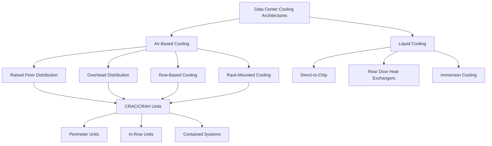
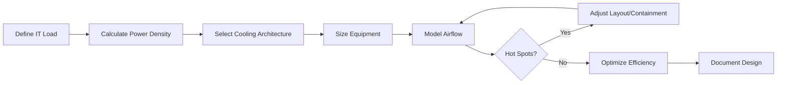

# Data Center Cooling

Data center cooling represents one of the most demanding HVAC applications, requiring precise temperature and humidity control while managing exceptionally high power densities. Modern facilities can exceed 300 W/ft² in high-performance computing environments, creating thermal management challenges that far surpass conventional commercial buildings.

## Power Density Fundamentals

The cooling load in data centers is directly proportional to IT equipment power consumption. Heat rejection occurs through sensible cooling, with minimal latent load from personnel or processes.

The fundamental relationship between power consumption and cooling load is:

$$Q_{\text{cooling}} = P_{\text{IT}} + P_{\text{lighting}} + P_{\text{UPS loss}} + Q_{\text{envelope}}$$

Where total power density per unit area is calculated as:

$$\rho_P = \frac{P_{\text{total}}}{A_{\text{floor}}} \quad \text{[W/ft² or W/m²]}$$

The sensible heat ratio (SHR) in data centers typically exceeds 0.95, contrasting sharply with commercial spaces where SHR ranges from 0.65 to 0.80.

### Typical Power Density Ranges

| Facility Type | Power Density | Cooling Requirement |
|---------------|---------------|---------------------|
| Enterprise IT | 100-150 W/ft² | 28-43 tons/1000 ft² |
| High-Performance Computing | 200-400 W/ft² | 57-114 tons/1000 ft² |
| Edge Computing | 50-100 W/ft² | 14-28 tons/1000 ft² |
| Traditional Server Room | 30-75 W/ft² | 9-21 tons/1000 ft² |

Note: 12,000 BTU/hr = 1 ton refrigeration = 3.517 kW thermal.

## Design Challenges

Data center cooling systems must address multiple competing requirements:

**Reliability Requirements**
- N+1 or 2N redundancy for mission-critical operations
- Sub-second response to thermal transients
- Elimination of single points of failure
- Continuous operation during maintenance

**Thermal Management**
- Localized hot spots exceeding 500 W/ft²
- Mixing of supply and return air (bypass airflow)
- Equipment inlet temperature uniformity (±2°F variation)
- Humidity control within ASHRAE recommended range (40-60% RH)

**Energy Efficiency**
- Power Usage Effectiveness (PUE) targets below 1.3
- Free cooling integration where climate permits
- Variable capacity operation matching IT load
- Minimization of parasitic losses (fans, pumps, controls)

## Cooling Architectures

### Air-Based Cooling Systems

**Raised Floor Distribution**
- Supply air delivered through perforated floor tiles
- CRAC (Computer Room Air Conditioner) or CRAH (Computer Room Air Handler) units
- Plenum depth typically 18-36 inches
- Effective for power densities up to 150 W/ft²

**Hot Aisle/Cold Aisle Configuration**
- Alternating rack orientations to separate supply and return streams
- Cold aisles face equipment intakes (front of servers)
- Hot aisles face equipment exhaust (rear of servers)
- Reduces mixing and improves efficiency

**Containment Systems**
- Physical barriers isolating cold or hot aisles
- Cold aisle containment (CAC) encloses supply air path
- Hot aisle containment (HAC) encloses return air path
- Increases temperature differential (ΔT) enabling higher efficiency

The effectiveness of containment is quantified by the Return Temperature Index (RTI):

$$\text{RTI} = \frac{T_{\text{return}} - T_{\text{supply}}}{T_{\text{IT exhaust}} - T_{\text{supply}}}$$

Optimal containment achieves RTI values above 0.85.

### Liquid Cooling Approaches

For power densities exceeding 300 W/ft², liquid cooling becomes necessary due to the superior thermal capacity of water compared to air:

$$\frac{c_p \text{ water}}{c_p \text{ air}} \approx 4000 \quad \text{[mass basis]}$$

**Direct-to-Chip Cooling**
- Cold plates mounted directly on processors
- Chilled water or dielectric fluid circulation
- Capable of removing 500+ watts per processor
- Requires redundant pumping systems

**Rear Door Heat Exchangers**
- Heat exchanger mounted on rack exhaust
- Intercepts 60-100% of rack heat before entering room
- Allows existing air infrastructure to support higher densities
- Simplified retrofit approach

## Efficiency Metrics

ASHRAE TC 9.9 (Mission Critical Facilities, Technology Spaces, and Electronic Equipment) establishes design guidelines and performance metrics for data center cooling.

**Power Usage Effectiveness (PUE)**

$$\text{PUE} = \frac{P_{\text{total facility}}}{P_{\text{IT equipment}}}$$

Industry benchmarks:
- Traditional design: PUE = 2.0-2.5
- Efficient design: PUE = 1.3-1.5
- Leading edge: PUE = 1.1-1.2

**Mechanical Energy Efficiency**

$$\text{Mechanical Load Component (MLC)} = \frac{P_{\text{cooling}}}{P_{\text{IT}}}$$

Target MLC values range from 0.10 to 0.30 depending on climate and cooling technology.

## Environmental Operating Conditions

ASHRAE TC 9.9 defines equipment classes with corresponding allowable ranges:

| Class | Dry-Bulb Range | Dew Point Range | Application |
|-------|----------------|-----------------|-------------|
| A1 | 59-90°F (15-32°C) | -12 to 63°F (-12 to 17°C) | Enterprise servers, storage |
| A2 | 50-95°F (10-35°C) | -12 to 69°F (-12 to 21°C) | Volume servers, storage |
| A3 | 41-104°F (5-40°C) | -12 to 75°F (-12 to 24°C) | Volume servers, robust IT |
| A4 | 41-113°F (5-45°C) | -12 to 75°F (-12 to 24°C) | Ruggedized equipment |

Expanding the allowable temperature range enables increased use of airside economization, reducing mechanical cooling requirements and lowering PUE.

## Design Process

Critical design considerations include:

1. **Load Assessment**: Determine nameplate power, actual operating power, and diversity factors
2. **Redundancy Level**: N, N+1, N+2, or 2N configuration based on uptime requirements
3. **Distribution Strategy**: Centralized vs. distributed cooling equipment
4. **Economizer Potential**: Climate analysis for free cooling hours
5. **Future Expansion**: Modular approach allowing phased deployment

## Conclusion

Data center cooling demands integration of mechanical engineering principles with IT infrastructure requirements. Success requires rigorous application of thermodynamic fundamentals, adherence to ASHRAE TC 9.9 guidelines, and careful attention to airflow management. As computing power densities continue to increase, hybrid cooling approaches combining air and liquid technologies will become standard practice, with efficiency optimization remaining paramount for operational cost control.
