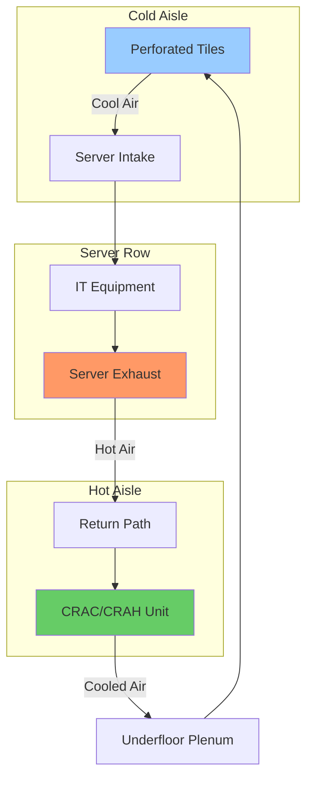
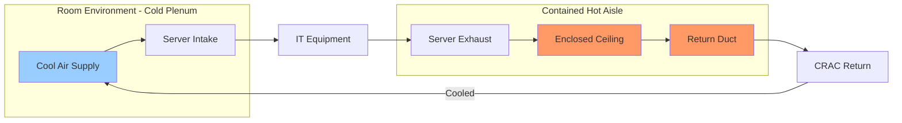

## Overview

Data center cooling architectures define the physical arrangement of air distribution, containment strategies, and cooling equipment placement to manage heat loads ranging from 5-30 kW/rack in modern facilities. ASHRAE TC 9.9 (Mission Critical Facilities, Technology Spaces, and Electronic Equipment) establishes design guidelines for these systems, with recommended supply air temperatures of 64.4-80.6°F (18-27°C) and maximum allowable dew points of 59°F (15°C) to prevent condensation while maintaining equipment reliability.

The fundamental challenge in data center cooling is matching cooling capacity to heat rejection while minimizing bypass airflow (cold air that returns to cooling units without absorbing heat) and recirculation (hot exhaust air re-entering equipment intakes). Proper architecture selection directly impacts Power Usage Effectiveness (PUE), the ratio of total facility power to IT equipment power.

## Hot Aisle/Cold Aisle Configuration

The hot aisle/cold aisle layout is the foundation of modern data center cooling. Server racks are arranged in rows with cold aisles facing equipment air intakes and hot aisles facing exhaust outlets. This separation prevents mixing of supply and return air streams, improving cooling efficiency.

### Basic Layout

### Airflow Calculations

The volumetric airflow required for a server rack is determined by heat load and temperature differential:

$$Q = \dot{m} \cdot c_p \cdot \Delta T$$

$$\text{CFM} = \frac{P_{IT} \times 3.413}{1.08 \times \Delta T}$$

Where:
- $P_{IT}$ = IT equipment power (kW)
- $\Delta T$ = Temperature rise across equipment (°F)
- 3.413 = Conversion factor (BTU/hr per watt)
- 1.08 = Constant for standard air (0.075 lb/ft³ × 0.24 BTU/lb·°F × 60 min/hr)

For a 10 kW rack with 20°F temperature rise:

$$\text{CFM} = \frac{10 \times 3.413}{1.08 \times 20} = \frac{34.13}{21.6} = 1,580 \text{ CFM}$$

## Containment Systems

Containment isolates hot and cold air streams, eliminating mixing losses. Two primary strategies exist:

### Cold Aisle Containment (CAC)

Cold aisles are enclosed with doors and ceilings, creating a pressurized cold air plenum. Supply air is delivered exclusively to contained spaces, with server exhaust entering the open room environment (return plenum). This approach protects supply air temperature consistency and allows higher room temperatures (reducing mechanical cooling load).

**Advantages:**
- Tighter control of inlet temperatures
- Personnel can access hot aisles without thermal stress
- Simpler door/access configurations
- Lower implementation cost

**Disadvantages:**
- Entire room serves as return plenum
- Hot spots can develop in room spaces
- Less effective for high-density applications (>15 kW/rack)

### Hot Aisle Containment (HAC)

Hot aisles are enclosed, capturing exhaust air directly from servers and ducting it to cooling units. The room environment becomes the cold supply plenum. This configuration is preferred for high-density deployments where heat concentration is severe.

**Advantages:**
- Maximum separation efficiency (minimal bypass/recirculation)
- Supports high-density racks (20-30+ kW)
- Enables elevated return air temperatures (energy savings)
- Better alignment with economizer operation

**Disadvantages:**
- Higher installation cost (ducting, access doors)
- Maintenance requires entering hot environment
- Requires robust containment integrity

## Cooling Delivery Methods

### Raised Floor with Underfloor Distribution

Traditional approach using a raised floor (typically 24-36 inches) as a supply air plenum. Perforated tiles or floor-mounted diffusers deliver air to cold aisles. Computer Room Air Conditioners (CRAC) or Air Handlers (CRAH) discharge into the underfloor space.

**Pressure calculations** for underfloor plenum:

$$\Delta P = \frac{\rho \cdot v^2}{2} + f \cdot \frac{L}{D_h} \cdot \frac{\rho \cdot v^2}{2}$$

Where:
- $\Delta P$ = Pressure drop (Pa)
- $\rho$ = Air density (kg/m³)
- $v$ = Velocity (m/s)
- $f$ = Friction factor
- $L$ = Flow path length (m)
- $D_h$ = Hydraulic diameter (m)

**Design considerations:**
- Perforated tile open area: 25-60%
- Underfloor velocity: <500 FPM to minimize turbulence
- Plenum depth affects pressure uniformity
- Cable/pipe obstructions reduce effective flow area

### In-Row Cooling

Cooling units positioned directly within server rows, minimizing air travel distance. These units provide 5-50 tons capacity and feature vertical or horizontal airflow. The proximity to heat sources reduces bypass airflow and improves thermal management precision.

**Effectiveness equation:**

$$\eta_{cooling} = \frac{Q_{removed}}{Q_{IT}} = \frac{\dot{m}_{actual} \cdot c_p \cdot \Delta T_{actual}}{P_{IT} \times 3.413}$$

In-row units typically achieve 85-95% effectiveness versus 60-75% for perimeter CRAC units.

### Overhead Cooling Distribution

Supply air delivered from overhead ducts or ceiling-mounted units directly to cold aisles. Eliminates raised floor requirement, reducing construction costs and simplifying infrastructure modifications. Often combined with hard ceiling return plenums capturing hot aisle exhaust.

**Applications:**
- Retrofit installations without raised floors
- High-density zones requiring supplemental cooling
- Modular data center deployments

## Architecture Comparison

| Architecture | Typical Density | PUE Range | Installation Cost | Flexibility | Bypass/Recirc |
|--------------|----------------|-----------|-------------------|-------------|---------------|
| Raised Floor + CRAC (No Containment) | 3-8 kW/rack | 1.6-2.0 | Baseline | High | 30-50% |
| Cold Aisle Containment (CAC) | 8-15 kW/rack | 1.3-1.5 | +15-25% | Moderate | 10-20% |
| Hot Aisle Containment (HAC) | 15-30 kW/rack | 1.2-1.4 | +25-40% | Moderate | 5-15% |
| In-Row Cooling | 10-25 kW/rack | 1.2-1.4 | +20-35% | Low | 5-10% |
| Overhead + Containment | 12-20 kW/rack | 1.3-1.5 | +10-20% | High | 8-18% |

**Selection criteria:**
- Heat density drives primary decision (higher density requires tighter coupling)
- Existing infrastructure (raised floor presence)
- Capital budget constraints
- Future expansion requirements
- Economizer compatibility (HAC enables higher return temps)

## ASHRAE TC 9.9 Compliance

ASHRAE TC 9.9 defines four environmental classes (A1-A4) for IT equipment:

- **Class A1:** 59-89.6°F, 20-80% RH (enterprise servers)
- **Class A2:** 50-95°F, 20-80% RH (volume servers)
- **Class A3:** 41-104°F, 8-85% RH (workstations)
- **Class A4:** 41-113°F, 8-90% RH (specialty applications)

Proper architecture selection ensures supply conditions remain within equipment tolerance while maximizing economizer hours and minimizing mechanical cooling runtime. Monitoring inlet temperatures at rack level validates design performance.

## Conclusion

Data center cooling architecture selection balances thermal management effectiveness, energy efficiency, and capital investment. High-density deployments demand hot aisle containment or in-row cooling to minimize airflow inefficiencies. Lower-density facilities can utilize cold aisle containment or traditional raised floor systems with acceptable performance. Adherence to ASHRAE TC 9.9 guidelines ensures equipment reliability while optimizing operational costs through informed temperature management strategies.
