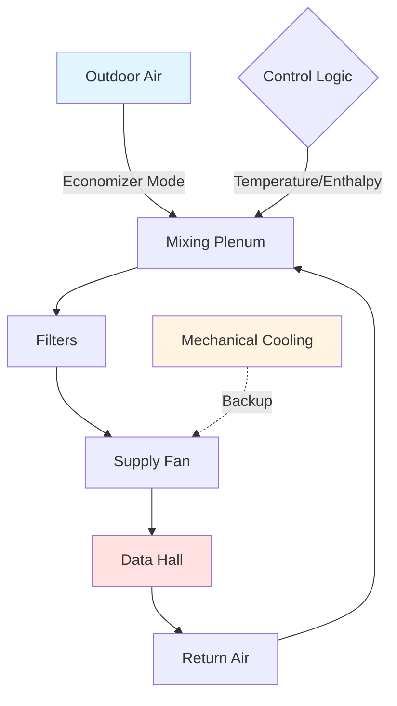
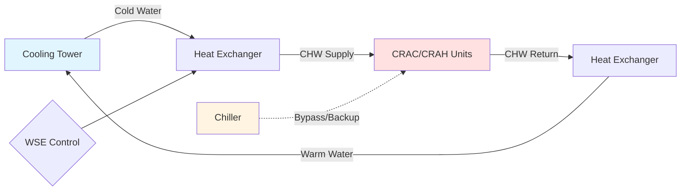

Free cooling leverages ambient conditions to reduce or eliminate mechanical refrigeration in data center cooling systems. When outdoor air temperature or enthalpy falls below return air conditions, properly designed economizers deliver substantial energy savings while maintaining equipment reliability within ASHRAE TC 9.9 thermal guidelines.

## Air-Side Economizer Systems

Air-side economizers introduce filtered outdoor air directly into the data center when ambient conditions permit cooling without mechanical refrigeration. The system modulates outdoor air and return air dampers based on temperature or enthalpy control strategies.

### Operating Modes

**Control Strategies:**

1. **Temperature-based control**: Economizer activates when outdoor air dry-bulb temperature < return air temperature minus differential (typically 2-5°F)
2. **Enthalpy-based control**: Economizer activates when outdoor air enthalpy < return air enthalpy, preventing introduction of high-moisture air
3. **Dewpoint-based control**: Limits economizer operation based on outdoor dewpoint to prevent condensation risk

### Economizer Hour Calculation

Annual economizer hours depend on climate zone and control strategy. The fraction of annual hours suitable for economization:

$$
\eta_{econ} = \frac{\sum_{i=1}^{8760} \mathbb{1}(T_{oa,i} < T_{setpoint} - \Delta T)}{8760}
$$

Where:
- $\eta_{econ}$ = economizer availability fraction
- $T_{oa,i}$ = outdoor air temperature at hour $i$ (°F)
- $T_{setpoint}$ = economizer lockout temperature (°F)
- $\Delta T$ = differential temperature (°F)
- $\mathbb{1}$ = indicator function (1 if condition true, 0 otherwise)

Energy savings from air-side economizer operation:

$$
Q_{saved} = \dot{m} \cdot c_p \cdot (T_{return} - T_{oa}) \cdot \eta_{econ} \cdot 8760
$$

$$
\text{COP}_{equiv} = \frac{Q_{saved}}{P_{fan,additional}}
$$

Where:
- $Q_{saved}$ = annual cooling energy avoided (Btu)
- $\dot{m}$ = air mass flow rate (lb/hr)
- $c_p$ = specific heat of air = 0.24 Btu/(lb·°F)
- $\text{COP}_{equiv}$ = equivalent coefficient of performance
- $P_{fan,additional}$ = additional fan power for outdoor air (kWh)

## Water-Side Economizer Systems

Water-side economizers utilize cooling towers or dry coolers to produce chilled water without operating mechanical chillers when ambient wet-bulb or dry-bulb temperatures are sufficiently low.

### Design Configurations

| Configuration | Description | Efficiency | Capital Cost |
|--------------|-------------|-----------|--------------|
| Integrated waterside economizer | Single loop with plate-frame heat exchanger | High (15-40% energy reduction) | Medium |
| Parallel waterside economizer | Separate economizer loop with dedicated tower | Very High (20-50% energy reduction) | High |
| Thermosyphon economizer | Natural convection circulation | Highest (no pumping penalty) | High |

Waterside economizer effectiveness:

$$
\epsilon_{wse} = \frac{T_{CHW,return} - T_{CHW,supply}}{T_{CHW,return} - T_{wb,oa}}
$$

Where:
- $\epsilon_{wse}$ = heat exchanger effectiveness (typically 0.7-0.85)
- $T_{CHW,return}$ = chilled water return temperature (°F)
- $T_{CHW,supply}$ = chilled water supply temperature (°F)
- $T_{wb,oa}$ = outdoor air wet-bulb temperature (°F)

## Evaporative Cooling Technologies

### Direct Evaporative Cooling

Direct evaporative cooling (DEC) adds moisture to the air stream while reducing dry-bulb temperature along a constant wet-bulb line. Cooling capacity:

$$
Q_{DEC} = \dot{m}_{air} \cdot (h_{in} - h_{out}) = \dot{m}_{air} \cdot c_p \cdot \eta_{sat} \cdot (T_{db,in} - T_{wb,in})
$$

Where:
- $\eta_{sat}$ = saturation efficiency (0.70-0.95 depending on media)
- $h$ = enthalpy (Btu/lb)
- $T_{db,in}$ = dry-bulb temperature entering media (°F)
- $T_{wb,in}$ = wet-bulb temperature entering media (°F)

### Indirect Evaporative Cooling

Indirect evaporative cooling (IEC) provides sensible cooling without adding moisture to the supply air stream. Heat exchanger separates wet and dry channels, enabling exhaust air evaporative pre-cooling.

**Performance advantage**: IEC can achieve supply air temperatures 3-8°F below outdoor wet-bulb temperature without humidification penalty, critical for data center humidity control per ASHRAE TC 9.9 guidelines (40-60% RH recommended, 20-80% RH allowable).

## Climate Zone Performance Analysis

Free cooling effectiveness varies significantly by climate zone based on temperature and humidity profiles.

| ASHRAE Climate Zone | Annual Economizer Hours (Temperature) | Annual Economizer Hours (Enthalpy) | Typical PUE Improvement |
|---------------------|--------------------------------------|-----------------------------------|------------------------|
| 1A (Miami) | 850-1,200 | 400-800 | 0.08-0.12 |
| 2A (Houston) | 1,800-2,400 | 1,200-1,800 | 0.12-0.18 |
| 2B (Phoenix) | 3,200-3,800 | 2,800-3,400 | 0.18-0.25 |
| 3A (Atlanta) | 2,800-3,400 | 2,200-2,800 | 0.15-0.22 |
| 3C (San Francisco) | 6,500-7,200 | 6,200-6,900 | 0.28-0.38 |
| 4A (New York) | 3,600-4,200 | 2,800-3,600 | 0.18-0.26 |
| 5A (Chicago) | 4,400-5,000 | 3,400-4,200 | 0.22-0.32 |
| 6A (Minneapolis) | 5,200-5,800 | 4,000-4,800 | 0.25-0.36 |
| 7 (Duluth) | 6,000-6,600 | 4,600-5,400 | 0.28-0.40 |

*Assumptions: 75°F economizer lockout temperature, ASHRAE A1 class envelope (59-89.6°F allowable)*

## PUE Impact Assessment

Power Usage Effectiveness (PUE) quantifies data center infrastructure efficiency:

$$
\text{PUE} = \frac{P_{total,facility}}{P_{IT,equipment}}
$$

Free cooling reduces cooling infrastructure power consumption:

$$
\Delta\text{PUE} = \frac{P_{cooling,baseline} - P_{cooling,economizer}}{P_{IT,equipment}}
$$

**Typical energy distribution in baseline facility (PUE = 1.8)**:
- IT equipment: 56% (by definition, 1.0/1.8)
- Cooling systems: 30% (mechanical refrigeration, pumps, fans)
- Power distribution losses: 10% (UPS, PDU, transformer losses)
- Lighting and other: 4%

**With optimized free cooling (PUE = 1.3-1.4)**:
- IT equipment: 71-77%
- Cooling systems: 12-18% (primarily fans and pumps during economizer operation)
- Power distribution losses: 8-9%
- Lighting and other: 3-4%

## ASHRAE TC 9.9 Thermal Guidelines Compliance

ASHRAE Technical Committee 9.9 defines equipment classes based on allowable temperature and humidity ranges:

| Equipment Class | Allowable Temperature Range | Recommended Temperature Range | Allowable Humidity Range |
|----------------|----------------------------|------------------------------|------------------------|
| A1 | 59-89.6°F (15-32°C) | 64.4-80.6°F (18-27°C) | 20-80% RH, 63°F DP max |
| A2 | 50-95°F (10-35°C) | 64.4-80.6°F (18-27°C) | 20-80% RH, 70°F DP max |
| A3 | 41-104°F (5-40°C) | 64.4-80.6°F (18-27°C) | 8-85% RH, 73°F DP max |
| A4 | 41-113°F (5-45°C) | 64.4-80.6°F (18-27°C) | 8-90% RH, 78°F DP max |

**Free cooling implications**: Expanding allowable ranges (A2-A4 classifications) increases annual economizer hours by 15-40% depending on climate zone. Equipment warranty considerations must be evaluated against energy savings.

### Humidity Control Strategies

Economizer operation must maintain dewpoint control to prevent condensation and corrosion:

$$
\text{DP}_{max} = T_{supply} - \frac{\ln(\text{RH}_{max}/100)}{\lambda} \quad \text{(simplified approximation)}
$$

Where $\lambda \approx 0.06$ for typical operating ranges, or use psychrometric relationships for precise calculation.

## Implementation Considerations

**Filtration requirements**: MERV 13-15 filtration recommended for air-side economizers to prevent particulate contamination. Pressure drop penalty: 0.4-0.8 in. w.g., requiring 15-25% additional fan power.

**Reliability factors**: Economizer damper failure modes must default to minimum outdoor air to prevent uncontrolled humidity or temperature excursions. Redundant sensors and control loops ensure continuous operation.

**Particulate and gaseous contamination**: ASHRAE TC 9.9 provides gaseous and particulate contamination limits. Sites with high ambient pollution may require gas-phase filtration (activated carbon), adding 0.3-0.5 in. w.g. pressure drop.

## Free Cooling Optimization Strategies

1. **Raise chilled water supply temperature**: 50°F to 55-60°F increases economizer hours by 800-1,500 hours annually in temperate climates
2. **Implement hot aisle/cold aisle containment**: Permits higher return air temperatures (85-95°F), expanding economizer operating window
3. **Deploy variable speed drives**: Optimize fan and pump energy during partial load economizer operation
4. **Use predictive controls**: Weather forecasting enables pre-cooling strategies to maximize free cooling utilization

These strategies collectively achieve PUE values of 1.15-1.25 in favorable climates (ASHRAE zones 3C, 5A-7) with properly designed free cooling systems.

## Sub-Topics

- Air Side Economizer Data Center
- Water Side Economizer Data Center
- Direct Evaporative Cooling
- Indirect Evaporative Cooling
- Adiabatic Cooling Data Center
- Free Cooling Hours Maximization
- ASHRAE Thermal Guidelines Data Centers
- Allowable Temperature Range Expansion
- Class A1 A2 A3 A4 Environments
