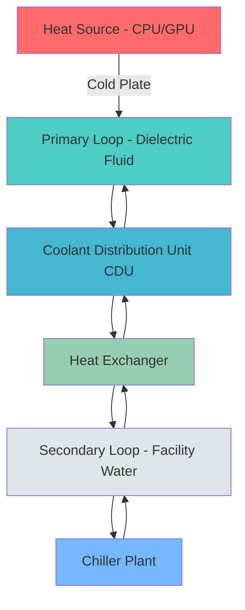
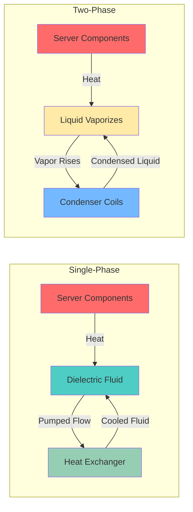

## Liquid Cooling Fundamentals

Liquid cooling technologies have become essential for modern data centers managing heat densities exceeding 20-30 kW per rack. The superior thermal properties of liquids compared to air—specific heat capacity approximately 4,000 times greater and thermal conductivity 25 times higher—enable efficient heat removal at elevated server inlet temperatures while reducing energy consumption.

ASHRAE Technical Committee 9.9 (Mission Critical Facilities, Technology Spaces, and Electronic Equipment) provides design guidance for liquid cooling implementations, emphasizing reliability, efficiency, and compatibility with existing infrastructure.

### Heat Transfer Comparison

The fundamental heat transfer equation for liquid cooling systems:

$$Q = \dot{m} \cdot c_p \cdot \Delta T$$

Where:
- $Q$ = heat removal rate (W)
- $\dot{m}$ = mass flow rate (kg/s)
- $c_p$ = specific heat capacity (J/kg·K)
- $\Delta T$ = temperature differential (K)

For single-phase liquid cooling, the convective heat transfer coefficient:

$$h = \frac{Nu \cdot k}{D_h}$$

Where:
- $h$ = convective heat transfer coefficient (W/m²·K)
- $Nu$ = Nusselt number (dimensionless)
- $k$ = thermal conductivity of fluid (W/m·K)
- $D_h$ = hydraulic diameter (m)

## Direct-to-Chip Cooling

Direct-to-chip (DTC) cooling employs cold plates mounted directly to high-power processors (CPUs, GPUs, ASICs) to extract heat at the source. This approach bypasses thermal interface resistance associated with heat sinks and air cooling.

### Cold Plate Design

Cold plates typically utilize microchannel or pin-fin geometries to maximize surface area and turbulence. The thermal resistance from junction to fluid:

$$R_{j-f} = R_{die} + R_{TIM} + R_{coldplate} + R_{conv}$$

Where typical values for high-performance cold plates achieve $R_{coldplate}$ of 0.01-0.03 K/W.

### System Architecture

## Rear Door Heat Exchangers

Rear door heat exchangers (RDHx) provide passive cooling by replacing standard rack doors with water-to-air heat exchangers. Hot exhaust air passes through the heat exchanger coils, rejecting heat to facility water before returning to the room.

### Performance Characteristics

| Parameter | Passive RDHx | Active RDHx |
|-----------|--------------|-------------|
| Heat Removal Capacity | 20-35 kW | 35-60 kW |
| Pressure Drop | 0-10 Pa | 50-150 Pa |
| Water Flow Rate | 15-30 L/min | 30-50 L/min |
| Supply Water Temperature | 15-20°C | 15-25°C |
| Approach Temperature | 3-5 K | 2-4 K |
| Power Consumption | 0 W (passive) | 200-400 W (fans) |

The heat exchange effectiveness:

$$\epsilon = \frac{Q_{actual}}{Q_{max}} = \frac{T_{air,in} - T_{air,out}}{T_{air,in} - T_{water,in}}$$

For typical installations, effectiveness ranges from 0.60-0.85 depending on air and water flow rates.

## Immersion Cooling

Immersion cooling submerges IT equipment directly in dielectric fluid, eliminating air cooling entirely. Two primary approaches exist: single-phase and two-phase immersion.

### Single-Phase Immersion

Servers operate fully submerged in dielectric fluid (mineral oil, synthetic fluids, or engineered fluids) maintained below boiling point. Fluid circulation transfers heat to external heat exchangers.

Heat transfer follows natural or forced convection:

$$Nu = C \cdot Re^m \cdot Pr^n$$

Where constants C, m, n depend on geometry and flow regime. For forced convection in server chassis: $Nu = 0.023 \cdot Re^{0.8} \cdot Pr^{0.4}$ (Dittus-Boelter correlation).

### Two-Phase Immersion

Servers submerge in low-boiling-point dielectric fluid (boiling point 40-65°C). Heat causes fluid vaporization at component surfaces; vapor condenses on overhead coils, releasing latent heat.

The boiling heat transfer coefficient:

$$q'' = h_{boiling} \cdot (T_{surface} - T_{sat})$$

Nucleate boiling achieves heat transfer coefficients of 5,000-20,000 W/m²·K, dramatically exceeding single-phase convection (500-2,000 W/m²·K).

### Immersion Cooling Comparison

| Characteristic | Single-Phase | Two-Phase |
|----------------|--------------|-----------|
| Fluid Temperature | 30-50°C | 40-65°C (boiling point) |
| Heat Transfer Mode | Convection | Boiling/condensation |
| Heat Transfer Coefficient | 500-2,000 W/m²·K | 5,000-20,000 W/m²·K |
| Pumping Power | Moderate | Minimal (natural circulation) |
| Fluid Cost | Lower | Higher |
| Material Compatibility | Broader | Requires compatibility testing |
| Component Temperature | Higher variance | Isothermal (at saturation) |

## Hybrid Cooling Architectures

Hybrid approaches combine air and liquid cooling to optimize cost and performance. Common configurations include:

1. **Liquid-assisted air cooling:** Direct-to-chip cooling for high-power processors (CPUs, GPUs) with air cooling for remaining components (memory, storage, networking)

2. **Zoned cooling:** Liquid cooling for high-density racks (>20 kW) with air cooling for standard racks

3. **Progressive migration:** Rear door heat exchangers as bridge technology before full direct-to-chip deployment

### Hybrid System Energy Balance

For a hybrid rack with liquid-cooled processors and air-cooled components:

$$Q_{total} = Q_{liquid} + Q_{air}$$

Where typical distributions achieve 60-80% heat removal via liquid with corresponding PUE improvements of 15-30% compared to air-only cooling.

| Cooling Strategy | PUE Range | Typical Rack Density | Capital Cost Index |
|------------------|-----------|----------------------|-------------------|
| Air Only (Hot/Cold Aisle) | 1.4-1.8 | 8-15 kW | 1.0× |
| Rear Door Heat Exchanger | 1.3-1.5 | 15-30 kW | 1.2-1.4× |
| Direct-to-Chip Hybrid | 1.15-1.3 | 25-50 kW | 1.5-2.0× |
| Full Immersion (Single-Phase) | 1.05-1.15 | 50-100 kW | 1.8-2.5× |
| Full Immersion (Two-Phase) | 1.03-1.1 | 100-250 kW | 2.5-3.5× |

## Coolant Distribution Units

Coolant Distribution Units (CDUs) serve as the interface between primary liquid cooling loops and facility water infrastructure. CDUs provide:

- Heat exchange between primary (dielectric fluid) and secondary (facility water) loops
- Pumping for primary coolant circulation
- Filtration and fluid conditioning
- Leak detection and monitoring
- Temperature and flow control

CDU sizing follows the relationship:

$$\dot{m}_{coolant} = \frac{Q_{IT}}{\rho \cdot c_p \cdot \Delta T}$$

For a 100 kW IT load with 10 K temperature differential and water as coolant:

$$\dot{m} = \frac{100,000}{1000 \cdot 4186 \cdot 10} = 2.39 \text{ L/s} \approx 143 \text{ L/min}$$

## Design Considerations

**Fluid Selection Criteria:**
- Dielectric strength for electrical isolation
- Thermal conductivity and specific heat capacity
- Viscosity across operating temperature range
- Material compatibility with server components
- Environmental impact and disposal requirements
- Cost and availability

**Reliability Requirements:**
- Redundant pumps and leak detection
- Quick-disconnect couplings for serviceability
- Pressure monitoring and relief valves
- Filtration to prevent particle contamination
- Fluid quality monitoring (conductivity, pH)

**Integration Challenges:**
- Server warranty implications
- Staff training requirements
- Maintenance procedures
- Decommissioning and fluid disposal
- Emergency shutdown protocols

ASHRAE TC 9.9 recommends liquid cooling for applications exceeding 20 kW/rack density where air cooling becomes economically or physically impractical. The selection between direct-to-chip, immersion, or hybrid approaches depends on density requirements, infrastructure constraints, and total cost of ownership analysis.
