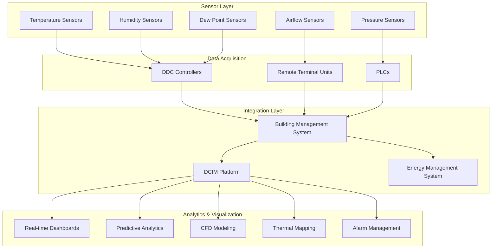

## Overview

Data center monitoring and controls represent the nervous system of mission-critical facilities, providing real-time visibility into thermal, power, and environmental conditions. Effective monitoring enables proactive management, optimizes energy efficiency, and prevents thermal excursions that could compromise IT equipment reliability.

ASHRAE TC 9.9 (Mission Critical Facilities) establishes guidelines for environmental monitoring density, sensor placement, and control strategies that maintain equipment within recommended operating envelopes while maximizing energy efficiency.

## Power Usage Effectiveness (PUE) Monitoring

PUE quantifies data center energy efficiency by comparing total facility power to IT equipment power:

$$\text{PUE} = \frac{P_{\text{total}}}{P_{\text{IT}}}$$

Where:
- $P_{\text{total}}$ = total facility power (kW)
- $P_{\text{IT}}$ = IT equipment power (kW)

For real-time PUE calculation with granular component breakdown:

$$\text{PUE} = \frac{P_{\text{IT}} + P_{\text{cooling}} + P_{\text{lighting}} + P_{\text{aux}}}{P_{\text{IT}}}$$

Simplified to infrastructure overhead:

$$\text{PUE} = 1 + \frac{P_{\text{cooling}} + P_{\text{lighting}} + P_{\text{aux}}}{P_{\text{IT}}}$$

Continuous monitoring of cooling system power consumption enables correlation analysis between cooling efficiency and environmental setpoints, outdoor air conditions, and IT load variations.

## Environmental Monitoring Architecture

## Sensor Placement Strategy

| **Zone** | **Sensor Type** | **Density** | **Height** | **Measurement Points** |
|----------|----------------|-------------|-----------|----------------------|
| Hot Aisle | Temperature | 1 per 5 racks | Top, middle, bottom | Return air temperature |
| Cold Aisle | Temperature | 1 per 5 racks | Inlet height (2m) | Supply air temperature |
| CRAC/CRAH Discharge | Temperature, RH | 1 per unit | Discharge plenum | Supply conditions |
| Under-floor Plenum | Temperature, Pressure | 1 per 200 m² | Floor level | Stratification, static pressure |
| Overhead Return | Temperature | 1 per 200 m² | Ceiling level | Return air temperature |
| Critical Equipment Inlet | Temperature | 1 per critical rack | Equipment inlet | Compliance verification |
| Perimeter Walls | Temperature, RH | 1 per 10m | Mid-height | Envelope conditions |
| Dew Point | Humidity | 1 per 400 m² | Return air path | Moisture control |

ASHRAE TC 9.9 recommends minimum monitoring density of one temperature sensor per 150-200 m² of raised floor area, with increased density in high-heat-density zones exceeding 10 kW per rack.

## Data Center Infrastructure Management (DCIM)

DCIM platforms integrate environmental monitoring, power metering, asset management, and capacity planning into unified dashboards. Core DCIM functions include:

**Real-Time Monitoring**: Continuous polling of temperature, humidity, power, and airflow sensors at 15-60 second intervals provides immediate visibility into environmental deviations.

**Capacity Management**: 3D visualization of rack space, power capacity, and cooling capacity enables proactive planning and prevents oversubscription of critical resources.

**Asset Tracking**: Automated discovery and documentation of IT equipment location, power draw, and thermal output supports accurate capacity modeling.

**Energy Analytics**: Granular power metering at PDU, rack, and device levels enables PUE decomposition, trending analysis, and identification of efficiency opportunities.

## Building Management System Integration

BMS integration enables coordinated control between HVAC systems and IT load conditions:

**Load-Based Cooling Control**: Supply air temperature and chilled water temperature reset based on monitored return air temperature and IT load variations.

**Airside Economizer Optimization**: Automatic switching to free cooling when outdoor conditions permit, based on enthalpy comparison:

$$h_{\text{outdoor}} < h_{\text{return}} - \Delta h_{\text{min}}$$

Where $\Delta h_{\text{min}}$ represents minimum enthalpy differential for economizer operation (typically 2-4 kJ/kg).

**Redundancy Management**: Automated sequencing of redundant cooling units based on N+1 or 2N architecture, with load balancing and lead-lag rotation.

**Demand Response**: Coordinated response to utility demand events through temporary increases in supply air temperature within ASHRAE allowable ranges.

## Alarm Management and Escalation

Critical alarm thresholds based on ASHRAE Thermal Guidelines:

| **Parameter** | **Warning** | **Critical** | **Response Time** |
|--------------|------------|--------------|------------------|
| Rack Inlet Temperature | >27°C | >32°C | <2 min |
| Relative Humidity | <20% or >60% | <8% or >80% | <5 min |
| Dew Point | >17°C | >21°C | <5 min |
| Under-floor Pressure | <12 Pa | <8 Pa | <5 min |
| CRAC/CRAH Failure | Single unit | N-1 loss | <1 min |
| Chilled Water Supply | >10°C | >13°C | <2 min |

Alarm escalation protocols integrate with SMS, email, and building automation system notifications, ensuring 24/7 operator awareness of critical conditions.

## Predictive Analytics and Machine Learning

Advanced DCIM platforms employ predictive analytics to forecast thermal excursions before they occur:

**Trending Analysis**: Historical temperature data reveals seasonal variations, equipment degradation, and cooling system performance decline.

**Anomaly Detection**: Machine learning algorithms identify deviations from baseline thermal patterns, flagging potential failures or airflow obstructions.

**Failure Prediction**: Monitoring cooling unit runtime hours, compressor current draw, and differential pressure enables predictive maintenance scheduling before catastrophic failures.

**Computational Fluid Dynamics (CFD) Integration**: Real-time sensor data validates and calibrates CFD models, improving accuracy of what-if scenarios for capacity planning and hot spot identification.

## Thermal Mapping and Visualization

Continuous thermal mapping generates heat maps overlaid on facility floor plans, identifying:

- Hot spots exceeding ASHRAE recommended inlet temperatures
- Cold air bypass and supply air short-circuiting
- Under-utilized cooling capacity
- Opportunities for containment optimization

Three-dimensional thermal visualization enables rapid identification of vertical temperature stratification and mixing inefficiencies in both under-floor and overhead supply configurations.

## Implementation Best Practices

**Calibration**: Annual sensor calibration maintains measurement accuracy within ±0.5°C for temperature and ±3% RH for humidity sensors.

**Network Architecture**: Separate monitoring networks from production IT networks prevents security vulnerabilities and ensures monitoring system availability during network failures.

**Data Retention**: Minimum 2-year historical data storage enables long-term trending analysis and regulatory compliance documentation.

**Redundancy**: Dual communication paths and redundant monitoring controllers prevent single points of failure in critical alarm systems.

Effective monitoring and controls transform data centers from reactive firefighting environments into proactive, optimized facilities operating at peak efficiency while maintaining stringent reliability requirements.
