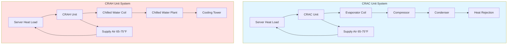
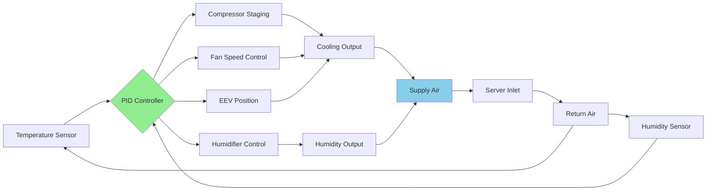

## Precision Cooling Fundamentals

Precision cooling systems deliver continuous environmental control for data centers, telecommunications facilities, and server rooms. Unlike comfort cooling systems, precision units maintain tight temperature and humidity tolerances while managing predominantly sensible heat loads from electronic equipment. ASHRAE TC 9.9 (Mission Critical Facilities, Technology Spaces, and Electronic Equipment) establishes design criteria for these specialized applications.

Data center cooling requires 24/7 operation with minimal downtime, high sensible heat ratios, and precise environmental control. The two primary precision cooling technologies are Computer Room Air Conditioning (CRAC) units and Computer Room Air Handler (CRAH) units, each offering distinct operational characteristics.

## CRAC vs CRAH Systems

### CRAC Units (Computer Room Air Conditioning)

CRAC units contain integral direct expansion (DX) refrigeration systems with compressors, evaporator coils, and controls. These self-contained systems connect to remote condensers or condensing units.

**Operational characteristics:**
- Direct expansion cooling with refrigerant-to-air heat exchange
- Multiple compressor stages for capacity modulation (typically 25%, 50%, 75%, 100%)
- Integrated humidification and dehumidification
- Sensible heat ratios: 0.90 to 1.0
- Cooling capacities: 5 to 100+ tons per unit
- Independent operation without central plant infrastructure

### CRAH Units (Computer Room Air Handler)

CRAH units use chilled water coils supplied by central chilled water plants. These units contain fans, filters, chilled water coils, and controls but no refrigeration components.

**Operational characteristics:**
- Chilled water heat exchange (typically 42-48°F supply water)
- Variable flow control valves for capacity modulation
- Requires central chiller plant infrastructure
- Higher energy efficiency potential with free cooling
- Cooling capacities: 10 to 150+ tons per unit
- Centralized refrigeration management

## Sensible Heat Ratio Calculations

The sensible heat ratio (SHR) quantifies the proportion of total cooling load that is sensible (temperature change) versus latent (moisture removal). Data centers typically exhibit SHR values of 0.90 to 1.0.

$$\text{SHR} = \frac{Q_s}{Q_t} = \frac{Q_s}{Q_s + Q_l}$$

Where:
- $Q_s$ = Sensible cooling load (Btu/hr)
- $Q_l$ = Latent cooling load (Btu/hr)
- $Q_t$ = Total cooling load (Btu/hr)

**Sensible cooling capacity:**

$$Q_s = 1.08 \times \text{CFM} \times \Delta T$$

Where:
- CFM = Airflow rate (cubic feet per minute)
- $\Delta T$ = Temperature difference between return and supply air (°F)
- 1.08 = Conversion factor (0.24 Btu/lb·°F × 0.075 lb/ft³ × 60 min/hr)

**Total cooling capacity:**

$$Q_t = 4.5 \times \text{CFM} \times \Delta h$$

Where:
- $\Delta h$ = Enthalpy difference between return and supply air (Btu/lb)
- 4.5 = Conversion factor (0.075 lb/ft³ × 60 min/hr)

**Example calculation:**
For a precision unit with 10,000 CFM airflow, return air at 80°F, and supply air at 65°F with negligible latent load:

$$Q_s = 1.08 \times 10{,}000 \times (80 - 65) = 162{,}000 \text{ Btu/hr} = 13.5 \text{ tons}$$

## Precision AC Specifications

| Parameter | Comfort AC | Precision AC | Design Criteria |
|-----------|-----------|--------------|-----------------|
| Temperature Control | ±4°F | ±2°F | ASHRAE TC 9.9 |
| Humidity Control | ±15% RH | ±5% RH | 40-55% RH target |
| Sensible Heat Ratio | 0.60-0.75 | 0.90-1.0 | High sensible load |
| Operating Hours | 2,000-3,000 hr/yr | 8,760 hr/yr | 24/7 operation |
| Fan Operation | Intermittent | Continuous | Constant airflow |
| Airflow Rate | 350-400 CFM/ton | 450-550 CFM/ton | High air changes |
| Filter Efficiency | MERV 8 | MERV 11-13 | Particulate control |
| Redundancy | N | N+1 or 2N | Mission critical |

## Close Control Features

Precision cooling systems incorporate advanced control capabilities to maintain environmental stability:

**Temperature control:**
- Electronic expansion valves (EEV) for precise refrigerant metering
- Multiple compressor stages with digital scroll technology
- Variable speed EC (electronically commutated) fans
- Proportional-integral-derivative (PID) control algorithms
- Hot gas bypass for low-load capacity modulation

**Humidity control:**
- Ultrasonic or infrared humidification systems
- Active dehumidification with hot gas reheat
- Dewpoint monitoring and control
- Humidity ratio calculations from dry-bulb and wet-bulb measurements

**Airflow management:**
- Variable speed fan control (25-100% capacity)
- Airflow rates: 450-550 CFM per ton of cooling
- Supply air temperature: 65-75°F (adjustable)
- Return air temperature: 75-85°F (typical server exhaust)

## Capacity Modulation Methods

Precision cooling systems employ multiple strategies for matching cooling capacity to varying server loads:

**CRAC capacity control:**
- Multiple compressors (2-4 circuits) with staged operation
- Digital scroll compressor technology (10-100% capacity in 10% steps)
- Variable frequency drives (VFD) on compressors
- Electronic expansion valve modulation
- Hot gas bypass for minimum load conditions

**CRAH capacity control:**
- Chilled water control valves (2-way or 3-way)
- Variable water flow rates
- Variable fan speed with VFD or EC motors
- Entering water temperature reset
- Leaving air temperature control

The combination of multiple modulation methods enables precision units to maintain setpoint conditions across load ranges from 20% to 100% of design capacity while optimizing energy efficiency and equipment lifecycle.

## Design Considerations

**System selection factors:**
- Facility size and redundancy requirements (N+1, N+2, 2N configurations)
- Available infrastructure (chilled water plant vs. DX systems)
- Energy efficiency targets (PUE goals)
- Future expansion capability
- Maintenance access and serviceability
- Water availability for humidification

**ASHRAE TC 9.9 recommended conditions:**
- Allowable temperature range: 64.4-80.6°F (Class A1)
- Recommended temperature range: 64.4-80.6°F
- Allowable humidity range: -12°F DP to 59°F DP
- Recommended humidity range: 41.9°F DP to 59°F DP
- Maximum rate of change: 9°F/hr temperature, 5°F/hr dewpoint

Precision cooling systems represent the critical environmental infrastructure for data centers, requiring specialized design, operation, and maintenance to ensure continuous uptime for mission-critical computing equipment.
