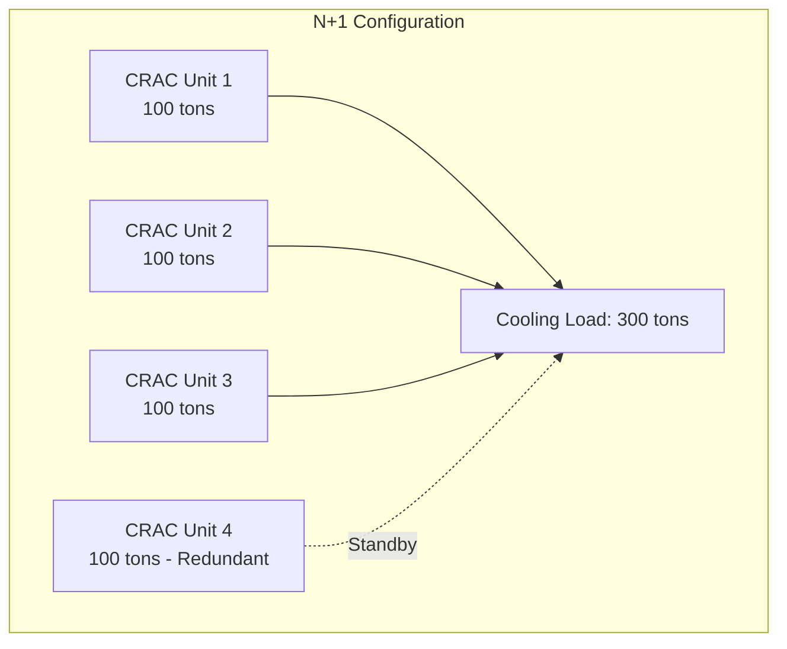
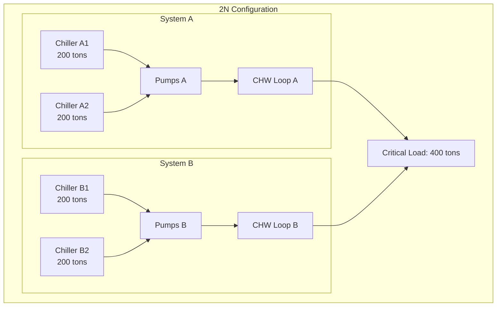

## Overview

Data center cooling redundancy ensures continuous operation during equipment failures and maintenance events. The design strategy directly impacts system availability, with configurations ranging from basic N+1 to fully fault-tolerant 2N+1 architectures. Redundancy planning must account for both component-level failures and distribution path vulnerabilities.

## Redundancy Configurations

### N+1 Redundancy

N+1 provides one additional unit beyond the minimum required capacity. The system operates with N units meeting the full cooling load while maintaining one spare unit in standby or active mode.

**Capacity Requirement:**
$$Q_{\text{total}} = (N + 1) \times Q_{\text{unit}}$$

where $N = \lceil Q_{\text{load}} / Q_{\text{unit}} \rceil$

**Characteristics:**
- Single point of failure tolerance
- Most cost-effective redundant configuration
- Requires all remaining units at full capacity if one fails
- Common distribution path creates vulnerability

### 2N Redundancy

2N architecture duplicates the entire cooling system including distribution paths. Each independent system can support 100% of the critical load.

**Capacity Requirement:**
$$Q_{\text{total}} = 2 \times Q_{\text{load}}$$

**Characteristics:**
- Complete system redundancy
- Independent distribution paths eliminate common failure modes
- Allows full system maintenance without load impact
- Highest availability, highest cost

### 2N+1 Redundancy

2N+1 combines dual distribution paths with additional component redundancy. This provides fault tolerance for both distribution failures and individual component failures.

**Capacity Requirement:**
$$Q_{\text{total}} = 2 \times (N + 1) \times Q_{\text{unit}}$$

### Distributed Redundancy

Distributed redundancy deploys multiple smaller units across zones rather than centralized large units. This approach improves resilience against localized failures while maintaining N+1 or 2N principles at the facility level.

## Uptime Institute Tier Classification

| Tier | Configuration | Availability | Downtime/Year | Key Requirements |
|------|--------------|--------------|---------------|------------------|
| I | Basic Capacity | 99.671% | 28.8 hours | Single path, no redundancy |
| II | Redundant Components | 99.741% | 22.0 hours | N+1 components, single path |
| III | Concurrently Maintainable | 99.982% | 1.6 hours | N+1 components, dual paths |
| IV | Fault Tolerant | 99.995% | 0.4 hours | 2N or 2N+1, dual active paths |

### Tier I: Basic Capacity

Non-redundant system with single distribution path. Planned maintenance requires complete shutdown. Vulnerable to unplanned outages from any component failure.

### Tier II: Redundant Components (N+1)

N+1 redundancy for cooling equipment but maintains single distribution path. Maintenance on redundant components possible without shutdown, but distribution work requires outage.

### Tier III: Concurrently Maintainable

Dual distribution paths with N+1 component redundancy. Any single component can be removed for maintenance without impacting load. However, single failures during maintenance can cause outages.

### Tier IV: Fault Tolerant

Full 2N or 2N+1 architecture with compartmentalization. System withstands any single fault at any time, including during maintenance activities. Requires physical and logical separation of redundant systems.

## Availability Calculations

System availability depends on component reliability and configuration architecture.

**Series Components (Single Path):**
$$A_{\text{system}} = \prod_{i=1}^{n} A_i$$

**Parallel Components (Redundant):**
$$A_{\text{system}} = 1 - \prod_{i=1}^{n} (1 - A_i)$$

**Example: N+1 with Four 99.5% Reliable Units**

Three units required (N=3), one redundant:
$$A_{\text{system}} = 1 - (1 - 0.995)^4 = 1 - (0.005)^4 = 0.999999$$

This yields 99.9999% availability (0.5 minutes downtime/year) for the component layer. Distribution path availability must be calculated separately and combined in series.

## Design Considerations

**Concurrent Maintainability Requirements:**
- Isolation valves on all cooling distribution branches
- Redundant pumping with independent isolation
- Cross-tie capabilities between systems
- Automated failover within thermal time constant
- Monitoring of all redundant path states

**Fault Tolerance Implementation:**
- Physical separation of redundant systems (separate rooms/floors)
- Independent electrical feeds from separate utility services
- Separate control systems with no common dependencies
- Compartmentalized fire suppression
- Regular testing of failover sequences under load

**Capacity Planning:**
- Size for N+1 at future peak load, not current
- Account for cooling unit degradation over time (typically 5-10%)
- Verify capacity at elevated ambient conditions per ASHRAE TC 9.9
- Consider diversity factor for distributed loads
- Plan for increased rack densities in refresh cycles

## Operational Modes

**Active-Active:** All redundant units operate at partial load. Provides load sharing, efficiency optimization, and faster response to failures. Requires load balancing controls.

**Active-Standby:** Redundant units remain off until failure detection. Reduces energy consumption but introduces startup delay and thermal transients during failover.

**Rotational Standby:** Units rotate between active and standby positions on scheduled intervals. Equalizes runtime, ensures standby units remain operational, and identifies failures during low-risk periods.

## Failure Mode Analysis

Critical failure scenarios requiring redundancy protection:

- Compressor mechanical failure
- Refrigerant leaks reducing capacity
- Condenser water supply interruption
- Chilled water pump failures
- Control system faults preventing operation
- Electrical supply disruptions
- Planned maintenance activities

Properly designed redundancy architectures maintain full cooling capacity through any single failure event and allow maintenance without load impact.

## References

- ASHRAE TC 9.9: Mission Critical Facilities, Data Centers, Technology Spaces, and Electronic Equipment
- Uptime Institute Tier Standard: Topology
- TIA-942: Telecommunications Infrastructure Standard for Data Centers
