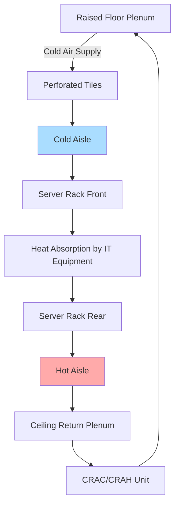

# Data Center HVAC Systems

Data center HVAC systems represent one of the most demanding and critical specialty applications in climate control engineering. These facilities require continuous operation with exceptional reliability, precise environmental control, and energy efficiency to support IT equipment generating heat densities ranging from 100 to 500+ W/ft² (1076 to 5382+ W/m²).

## ASHRAE Thermal Guidelines for Data Centers

ASHRAE Technical Committee 9.9 publishes the definitive thermal guidelines for data processing environments. The recommended and allowable operating envelopes define acceptable conditions for IT equipment:

| Class | Application | Recommended Temp | Allowable Temp Range | Recommended RH | Allowable RH Range | Max Dew Point |
|-------|-------------|------------------|----------------------|----------------|-----------------------|---------------|
| A1 | Enterprise servers, storage | 64.4-80.6°F (18-27°C) | 59-89.6°F (15-32°C) | 40-60% | 20-80% | 62.6°F (17°C) |
| A2 | Volume servers, storage | 50-95°F (10-35°C) | 41-95°F (5-35°C) | 8-80% | 63.0°F (21°C) |
| A3 | Volume servers, storage | 41-104°F (5-40°C) | 41-113°F (5-45°C) | 8-85% | 62.6°F (24°C) |
| A4 | Volume servers, storage | 41-113°F (5-45°C) | 41-113°F (5-45°C) | 8-90% | 69.8°F (24°C) |

The recommended envelope (18-27°C, 40-60% RH) provides optimal equipment reliability and longevity. Operating at higher temperatures within the allowable range reduces cooling energy but may decrease component lifespan.

## Data Center Cooling Load Calculation

Total cooling load consists of IT equipment heat rejection plus infrastructure losses:

$$Q_{total} = Q_{IT} + Q_{lighting} + Q_{UPS} + Q_{PDU} + Q_{envelope} + Q_{people}$$

The IT load dominates, typically representing 60-80% of total heat generation. Power utilization effectiveness (PUE) quantifies overall efficiency:

$$PUE = \frac{P_{total\,facility}}{P_{IT\,equipment}}$$

World-class data centers achieve PUE values of 1.1-1.3, meaning 10-30% additional power for cooling and infrastructure. Typical facilities operate at PUE 1.5-2.0.

Sensible heat ratio (SHR) in data centers approaches 0.95-1.0 due to minimal latent loads:

$$SHR = \frac{Q_{sensible}}{Q_{sensible} + Q_{latent}}$$

This high SHR allows sensible-only cooling strategies without humidity addition in many cases.

## Airflow Management Strategies

Effective airflow management prevents hot air recirculation and cold air bypass, which degrade cooling efficiency and create temperature non-uniformities.

### Hot Aisle/Cold Aisle Configuration

The fundamental approach organizes server racks in alternating rows:

- **Cold aisles**: Face rack fronts (air intake) toward each other
- **Hot aisles**: Position rack backs (exhaust) facing each other
- **Perforated tiles**: Locate in cold aisles to deliver conditioned air
- **Return air**: Capture hot exhaust from ceiling plenums or rear of racks

### Containment Systems

Physical barriers prevent mixing of supply and return airstreams:

**Cold Aisle Containment (CAC)**
- Encloses cold aisles with doors, roof panels, and end walls
- Creates pressurized cold air supply directly to equipment intakes
- Allows rest of data center to operate at elevated temperatures
- Typical pressure differential: 0.02-0.05 in. w.c. (5-12 Pa)

**Hot Aisle Containment (HAC)**
- Encloses hot aisles to capture all equipment exhaust
- Returns hot air directly to cooling units without mixing
- More common than CAC due to superior performance and safety
- Return air temperatures: 95-115°F (35-46°C)

Containment systems improve cooling capacity by 20-40% and reduce fan energy consumption by eliminating overcooling to compensate for mixing losses.

## Precision Cooling Equipment

### Computer Room Air Conditioning (CRAC) Units

CRAC units provide DX (direct expansion) cooling with integrated compressors:

- Cooling capacity: 3-30 tons (10.5-105 kW) per unit
- Upflow or downflow configurations for raised floor or overhead supply
- Integrated humidification and dehumidification
- Microprocessor controls with network connectivity
- Typical energy efficiency: 0.8-1.2 kW/ton (EER 10-14)

Refrigerant charge and compressor staging respond to sensible load changes. Multiple units operate in parallel with lead-lag sequencing.

### Computer Room Air Handling (CRAH) Units

CRAH units use chilled water coils instead of DX systems:

- Supplied by central chiller plant
- Higher cooling capacity per unit: 30-100+ tons (105-350+ kW)
- Variable speed fans with VFD control
- Chilled water supply temperature: 42-55°F (5.6-12.8°C)
- Lower in-row energy consumption than CRAC
- Enables waterside economizer operation

The sensible cooling capacity of a chilled water coil follows:

$$Q = \dot{m}_{water} \cdot c_p \cdot \Delta T_{water} = GPM \cdot 500 \cdot \Delta T_{water}$$

where the constant 500 incorporates water density, specific heat, and unit conversions for US customary units.

## In-Row Cooling Systems

In-row coolers mount between server racks, positioning cooling as close as possible to heat sources:

- Horizontal airflow directly into rack fronts
- Eliminates raised floor requirements
- Minimal fan power due to short air paths
- Cooling capacity: 10-50 kW per unit
- Supply air temperature matches rack inlet requirements

Air flow rate requirements depend on cooling capacity and temperature differential:

$$CFM = \frac{Q_{sensible} \cdot 3413}{1.08 \cdot \Delta T}$$

For 30 kW cooling with 20°F (11°C) ΔT:

$$CFM = \frac{30,000 \cdot 3413/1000}{1.08 \cdot 20} = 4,750\,CFM$$

## Rear-Door Heat Exchangers

Passive rear-door heat exchangers (RDHx) mount on rack exhaust doors:

- Chilled water coils with no fans or controls
- Remove 50-90% of rack heat before exhaust enters room
- Cooling capacity: 20-50 kW per door
- Minimal impact on IT equipment airflow
- Allows ultra-high density racks (20-40 kW)

The heat exchanger effectiveness depends on coil area, water flow rate, and approach temperature:

$$\epsilon = \frac{T_{air,in} - T_{air,out}}{T_{air,in} - T_{water,in}}$$

Typical effectiveness ranges from 0.6 to 0.8 for well-designed units.

## Liquid Cooling Technologies

Direct liquid cooling systems overcome the limitations of air cooling for extreme densities (>30 kW/rack):

**Cold Plate Cooling**
- Liquid-cooled cold plates mount directly on CPUs, GPUs, and memory
- Heat transfer directly from components to fluid loop
- Typical coolant: 40-60°F (4-16°C) water or dielectric fluid
- Removes 60-90% of total heat at source
- Remaining heat handled by air cooling

**Immersion Cooling**
- Submerges entire servers in dielectric liquid
- Single-phase immersion: 113-122°F (45-50°C) fluid temperature
- Two-phase immersion: Boiling coolant at ~122°F (50°C)
- Eliminates all server fans
- Cooling capacity: 100+ kW/rack

Heat transfer coefficient for cold plate interfaces:

$$q'' = h \cdot (T_{surface} - T_{fluid})$$

where h ranges from 1000-5000 W/m²·K for liquid cooling versus 10-100 W/m²·K for air cooling.

## Free Cooling and Economizers

Data centers minimize mechanical cooling through economizer operation when outdoor conditions permit.

### Air-Side Economizers

Direct or indirect introduction of outdoor air for cooling:

- **Direct (open)**: Mix outdoor air with return air through dampers
- **Indirect (closed)**: Air-to-air heat exchanger separates airstreams
- Operating hours: Depends on climate and temperature setpoint
- Energy savings: 30-70% of annual cooling energy in suitable climates

Economizer operation begins when outdoor air enthalpy falls below return air enthalpy:

$$h_{outdoor} < h_{return}$$

### Water-Side Economizers

Produce chilled water using cooling towers and heat exchangers when outdoor wet-bulb temperature permits:

- Plate-and-frame heat exchangers between tower water and chilled water
- Operating wet-bulb range: <45-55°F (7-13°C) depending on system design
- Parallel or series configuration with mechanical chillers
- Energy savings: 40-80% of annual cooling energy

The cooling tower approach temperature determines economizer effectiveness:

$$T_{approach} = T_{CW,out} - T_{WB,outdoor}$$

Typical approach: 5-10°F (3-6°C) for efficient towers.

## Redundancy and Reliability Requirements

Data center infrastructure must maintain continuous operation through equipment failures:

| Tier Level | Description | Redundancy | Concurrent Maintainability | Annual Downtime |
|------------|-------------|------------|---------------------------|-----------------|
| Tier I | Basic capacity | N | No | 28.8 hours |
| Tier II | Redundant capacity components | N+1 | No | 22.0 hours |
| Tier III | Concurrently maintainable | N+1 | Yes | 1.6 hours |
| Tier IV | Fault tolerant | 2(N+1) | Yes | 0.4 hours |

**N** = Capacity required to serve IT load
**N+1** = One additional unit beyond required capacity
**2(N+1)** = Two independent distribution systems, each N+1

HVAC redundancy configurations:

- **N+1**: One standby cooling unit for every N required units
- **2N**: Complete dual cooling systems
- **Distributed redundancy**: Multiple smaller units versus few large units

Mean time between failure (MTBF) for cooling equipment ranges from 30,000 to 100,000 hours. Automatic failover systems detect equipment problems and activate standby capacity within seconds.

## Raised Floor vs. Overhead Supply

### Raised Floor Plenum Systems

Traditional approach with 18-48 inch (0.5-1.2 m) elevated floor:

- Pressurized plenum supplies air through perforated tiles
- Cable routing beneath floor
- Flexible equipment placement
- Typical plenum pressure: 0.05-0.15 in. w.c. (12-37 Pa)
- Tile perforation ratios: 25-56% open area

Pressure drop through perforated tiles:

$$\Delta P = \rho \cdot \frac{V^2}{2} \cdot K$$

where K = loss coefficient (typically 1.5-3.0 for perforated tiles).

### Overhead Supply Systems

Modern approach with overhead ducting or in-row cooling:

- Eliminates raised floor construction costs
- Improves underfloor cable management
- Reduces fan energy by eliminating plenum losses
- Better suited for high-density cooling

## Energy Optimization Strategies

Data center cooling energy consumption can be minimized through integrated strategies:

1. **Elevated temperature operation**: Increase supply air to 70-75°F (21-24°C)
2. **Wide temperature deadband**: Allow 5-10°F (3-6°C) supply variation
3. **Variable speed fan control**: Match airflow to actual cooling demand
4. **Economizer maximization**: Free cooling whenever outdoor conditions permit
5. **High-efficiency equipment**: Premium efficiency chillers, cooling towers, fans
6. **Containment implementation**: Eliminate hot/cold air mixing losses

Combined optimization approaches reduce cooling energy by 40-60% compared to traditional constant-volume, low-temperature designs.

Supply fan power follows the cubic relationship with flow rate:

$$P_{fan} = \frac{Q \cdot \Delta P}{6356 \cdot \eta_{fan} \cdot \eta_{motor}}$$

Reducing airflow by 20% through temperature optimization decreases fan power by approximately 50%.

## Humidity Control Considerations

Maintaining humidity within ASHRAE-recommended ranges prevents electrostatic discharge and equipment corrosion:

- **Low humidity (<20% RH)**: Electrostatic discharge risk to sensitive electronics
- **High humidity (>80% RH)**: Condensation risk and corrosion
- **Dew point control**: Maximum 62.6°F (17°C) for Class A1 equipment

Humidification systems add moisture when outdoor air dilution creates dry conditions:

- Ultrasonic humidifiers: 3-5 W/lb water evaporated
- Steam injection: 1000-1100 Btu/lb (2326-2558 kJ/kg)
- Evaporative media: Minimal energy but cooling effect

Dehumidification occurs automatically during sensible cooling when chilled water temperature or refrigerant evaporator temperature falls below air dew point.

---

**Key Takeaways**

Data center HVAC systems demand precision, reliability, and efficiency to support critical IT operations. Hot aisle/cold aisle configurations with containment prevent airflow mixing. CRAC and CRAH units provide traditional cooling, while in-row systems and liquid cooling address high-density applications. Economizer operation exploits favorable outdoor conditions to minimize mechanical cooling. Proper implementation of ASHRAE TC 9.9 thermal guidelines, redundancy configurations, and energy optimization strategies ensures equipment reliability while controlling operational costs.
