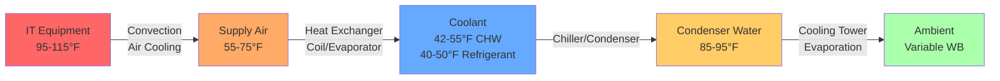
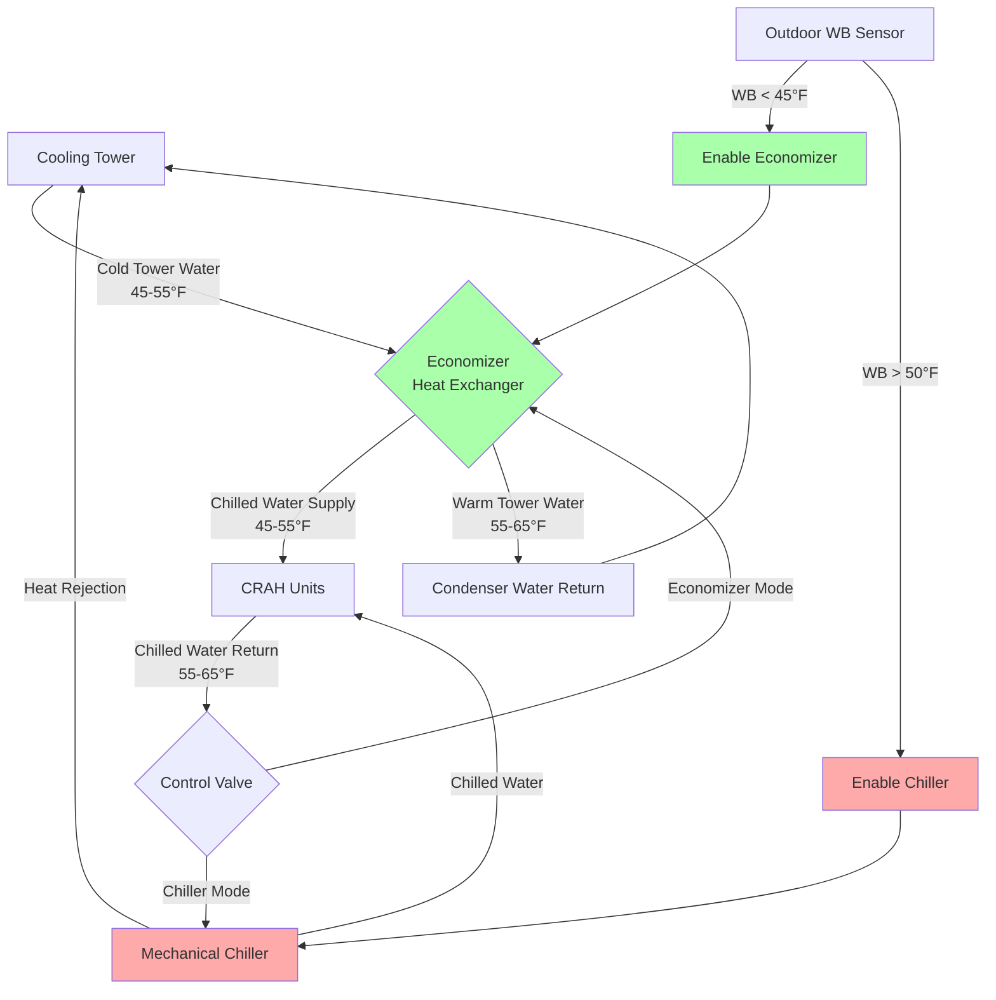

# Data Center Cooling Efficiency Strategies

Cooling efficiency represents the dominant opportunity for energy optimization in data center operations, typically accounting for 30-50% of total infrastructure power consumption beyond IT equipment loads. Achieving efficient cooling requires understanding the thermodynamic principles governing heat rejection, implementing intelligent control strategies, and exploiting favorable environmental conditions through economizer operation.

## Thermodynamic Basis of Cooling Efficiency

The fundamental challenge in data center cooling involves transferring heat from IT equipment at elevated temperatures (95-115°F / 35-46°C exhaust) to ambient conditions through multiple thermal resistance steps. Each temperature differential represents thermodynamic irreversibility and energy consumption.

### Heat Transfer Pathway

The complete cooling cycle involves serial heat transfer processes:

Each thermal resistance step requires temperature differential and consumes energy. Minimizing these differentials while maintaining adequate heat transfer rates represents the core efficiency optimization challenge.

### Carnot Efficiency Limits

The theoretical maximum coefficient of performance for mechanical refrigeration follows Carnot cycle limits:

$$COP_{Carnot} = \frac{T_{evap}}{T_{cond} - T_{evap}}$$

where temperatures must be expressed in absolute units (Kelvin or Rankine).

For typical data center conditions:
- Evaporator temperature: 40°F (4.4°C) = 277.6 K
- Condenser temperature: 95°F (35°C) = 308.2 K

$$COP_{Carnot} = \frac{277.6}{308.2 - 277.6} = \frac{277.6}{30.6} = 9.07$$

Real chillers achieve 50-65% of Carnot efficiency, resulting in actual COP values of 4.5-6.0 under these conditions. Improving efficiency requires either raising evaporator temperature or lowering condenser temperature.

## Economizer Systems for Free Cooling

Economizer operation exploits favorable outdoor conditions to eliminate or reduce mechanical refrigeration, representing the highest-impact efficiency strategy.

### Water-Side Economizer Operation

Water-side economizers produce chilled water using cooling tower water passed through heat exchangers when outdoor wet-bulb temperature permits adequate cooling without mechanical compression.

#### Heat Exchanger Effectiveness

Plate-and-frame heat exchangers transfer heat between tower water and chilled water loops:

$$\epsilon_{HX} = \frac{Q_{actual}}{Q_{maximum}} = \frac{T_{CHW,return} - T_{CHW,supply}}{T_{CHW,return} - T_{tower,supply}}$$

Typical effectiveness ranges from 0.70 to 0.85 for counterflow plate heat exchangers with adequate surface area.

The required outdoor wet-bulb temperature for full economizer operation:

$$T_{WB,required} = T_{CHW,supply} - \epsilon_{HX} \cdot \epsilon_{tower} \cdot (T_{CHW,return} - T_{CHW,supply})$$

For 45°F (7.2°C) chilled water supply with 55°F (12.8°C) return, 0.80 heat exchanger effectiveness, and 0.85 cooling tower effectiveness:

$$T_{WB,required} = 45 - 0.80 \cdot 0.85 \cdot (55-45) = 45 - 6.8 = 38.2°F\,(3.4°C)$$

#### Integrated Water-Side Economizer Configuration

### Air-Side Economizer Operation

Air-side economizers introduce outdoor air directly into the data center when temperature and humidity conditions fall within acceptable ranges.

#### Direct Air-Side Economizer

Direct systems mix outdoor air with return air through modulating dampers:

$$CFM_{outdoor} = \frac{Q_{cooling}}{1.08 \cdot (T_{return} - T_{outdoor})}$$

For 1000 kW (284 tons) cooling load with 85°F (29.4°C) return air and 55°F (12.8°C) outdoor air:

$$CFM_{outdoor} = \frac{1000 \times 3413}{1.08 \times (85-55)} = \frac{3,413,000}{32.4} = 105,340\,CFM$$

Challenges include:
- Humidity control when outdoor dew point varies significantly
- Particulate filtration requirements (MERV 13-15 minimum)
- Gaseous contamination in urban or industrial locations
- Control complexity to prevent temperature hunting

#### Indirect Air-Side Economizer

Indirect systems use air-to-air heat exchangers to transfer cooling capacity while maintaining separation between outdoor and data center air:

Heat exchanger capacity:

$$Q = \epsilon_{HX} \cdot C_{min} \cdot (T_{outdoor} - T_{supply})$$

where $C_{min} = \min(\dot{m}_{outdoor} \cdot c_p,\, \dot{m}_{datacenter} \cdot c_p)$ represents the minimum heat capacity rate.

Typical effectiveness for rotary heat exchangers: 0.75-0.85
Typical effectiveness for plate heat exchangers: 0.60-0.75

### Partial Economizer Operation

Most locations cannot achieve full free cooling year-round, but partial economizer operation provides significant savings by reducing mechanical cooling load.

The chiller operates at reduced capacity when outdoor conditions provide partial cooling:

$$Q_{chiller} = Q_{total} - Q_{economizer}$$

$$Q_{economizer} = \epsilon_{system} \cdot \dot{m}_{air} \cdot c_p \cdot (T_{return} - T_{outdoor})$$

Control strategies sequence between full mechanical cooling, partial economizer with mechanical trim, and full economizer operation based on outdoor conditions and load requirements.

## Temperature Management for Efficiency

Operating at elevated temperatures throughout the cooling system improves efficiency at every thermodynamic step while maintaining equipment reliability within ASHRAE TC 9.9 guidelines.

### Elevated Chilled Water Temperature

Traditional data center chilled water systems operate at 42-45°F (5.6-7.2°C) supply temperature. Increasing to 50-55°F (10-12.8°C) provides multiple benefits:

**Chiller Efficiency Improvement**

Evaporator temperature rise improves COP approximately 1.5-2.5% per °F increase:

$$\frac{dCOP}{dT_{evap}} \approx 0.015\,\text{to}\,0.025\,\text{per °F}$$

For 10°F increase from 42°F to 52°F:
- COP improvement: 15-25%
- Energy reduction: 13-20% at constant load

**Economizer Hours Extension**

Higher chilled water temperature allows economizer operation at elevated outdoor wet-bulb conditions, extending annual free cooling hours by 800-1500 hours in moderate climates.

**Equipment Considerations**

Elevated CHW temperature requires:
- Larger cooling coils to maintain heat transfer with reduced temperature differential
- Higher airflow rates or acceptance of elevated supply air temperature
- Compatibility verification with existing CRAH/CRAC units

The required coil surface area scales inversely with log-mean temperature difference (LMTD):

$$Q = UA \cdot LMTD$$

$$A_{new} = A_{existing} \cdot \frac{LMTD_{existing}}{LMTD_{new}}$$

For constant U (overall heat transfer coefficient), increasing CHW supply from 42°F to 52°F while maintaining 55°F supply air typically requires 25-35% additional coil area.

### Supply Air Temperature Optimization

Supply air temperature directly affects both cooling capacity and fan energy consumption.

**Temperature-Airflow Relationship**

Sensible cooling capacity:

$$Q_{sensible} = 1.08 \cdot CFM \cdot \Delta T$$

For constant cooling load, airflow requirement varies inversely with temperature differential:

$$\frac{CFM_2}{CFM_1} = \frac{\Delta T_1}{\Delta T_2}$$

Increasing supply temperature from 55°F to 65°F with 85°F return air:
- Original ΔT: 30°F
- New ΔT: 20°F
- Airflow reduction: 33%

**Fan Energy Impact**

Fan power follows affinity laws with cubic relationship to flow:

$$\frac{P_2}{P_1} = \left(\frac{CFM_2}{CFM_1}\right)^3$$

33% airflow reduction results in 70% fan power reduction:

$$\frac{P_2}{P_1} = (0.67)^3 = 0.30$$

### ASHRAE Thermal Envelope Compliance

| Strategy | Supply Air Temp | Rack Inlet Temp | ASHRAE Class | Annual Savings per MW IT |
|----------|----------------|-----------------|--------------|--------------------------|
| Traditional | 55-60°F (13-16°C) | 65-70°F (18-21°C) | A1 (conservative) | Baseline |
| Moderate optimization | 60-65°F (16-18°C) | 70-75°F (21-24°C) | A1 (upper range) | 150-250 MWh |
| Aggressive optimization | 65-70°F (18-21°C) | 75-80°F (24-27°C) | A2 (allowable) | 250-400 MWh |
| Maximum optimization | 70-75°F (21-24°C) | 80-85°F (27-29°C) | A2/A3 (allowable) | 350-550 MWh |

Temperature optimization must balance energy savings against equipment reliability considerations. ASHRAE allowable ranges permit aggressive optimization, but manufacturer warranties may specify more conservative limits.

## Cooling Equipment Efficiency

Mechanical cooling equipment selection and operation significantly impact overall energy consumption.

### Chiller Technology Comparison

| Technology | Typical COP Range | kW/ton | Best Applications | Efficiency at Part Load |
|------------|------------------|--------|-------------------|------------------------|
| Air-cooled screw | 2.5-3.2 | 1.1-1.4 | Small facilities, no water access | Fair (VFD compressor) |
| Water-cooled screw | 4.0-5.5 | 0.64-0.88 | Medium facilities | Good (staging + VFD) |
| Water-cooled centrifugal | 5.0-7.5 | 0.47-0.70 | Large facilities | Excellent (magnetic bearing) |
| Absorption (waste heat) | 0.6-1.2 | 2.9-5.9 | Cogeneration applications | Moderate |

### Variable Speed Drive Implementation

Variable frequency drives (VFDs) allow cooling equipment to operate at reduced capacity with significantly improved part-load efficiency.

**Chiller Compressor VFD**

Centrifugal compressors with VFDs maintain high efficiency across 30-100% load range:

$$\text{Part Load Efficiency} = \frac{COP_{part\,load}}{COP_{full\,load}}$$

Typical values:
- 100% load: 1.00 (reference)
- 75% load: 1.05-1.10
- 50% load: 1.10-1.20
- 25% load: 1.00-1.10

**Cooling Tower Fan VFD**

Tower fans modulate to maintain target approach temperature:

$$P_{fan} = P_{rated} \cdot \left(\frac{RPM_{actual}}{RPM_{rated}}\right)^3$$

At 70% speed to maintain approach during moderate outdoor conditions:

$$P_{fan} = P_{rated} \cdot (0.70)^3 = 0.343 \cdot P_{rated}$$

66% fan power reduction yields 5-15% total cooling system efficiency improvement depending on tower sizing.

### Cooling Unit Staging Strategy

Multiple smaller cooling units operating in parallel provide better part-load efficiency than fewer large units.

**N+1 Configuration Example**

Five 200-ton chillers instead of three 333-ton chillers:

At 50% facility load (500 tons required):
- Five-unit approach: Three chillers at 83% load each → High efficiency operation
- Three-unit approach: Two chillers at 83% load → Similar efficiency but no redundancy at part load

Lead-lag rotation distributes runtime evenly across units, maximizing equipment life while maintaining efficiency.

## Airflow Management for Energy Efficiency

Effective airflow management eliminates unnecessary cooling capacity and fan energy consumption by preventing hot and cold air mixing.

### Containment Energy Impact

Physical containment systems deliver measurable energy reductions through multiple mechanisms:

**Reduced Cooling Capacity Requirement**

Eliminating recirculation allows higher return air temperature:

$$\Delta T_{improvement} = (1 - RI) \cdot (T_{return,potential} - T_{return,actual})$$

where RI = recirculation index (0 = perfect, 0.5 = severe mixing)

Improving from RI = 0.3 to RI = 0.05 with 95°F equipment exhaust:
- Without containment: 75°F return (30% recirculation)
- With containment: 90°F return (5% recirculation)
- ΔT improvement: 15°F (8.3°C)

**Fan Energy Reduction**

Higher ΔT reduces airflow requirement:

$$CFM_{new} = CFM_{original} \cdot \frac{\Delta T_{original}}{\Delta T_{new}}$$

$$P_{fan,new} = P_{fan,original} \cdot \left(\frac{\Delta T_{original}}{\Delta T_{new}}\right)^3$$

For 50% ΔT increase (20°F to 30°F):
- Airflow reduction: 33%
- Fan power reduction: 70%

### Computational Fluid Dynamics Optimization

CFD analysis optimizes tile placement and perforated area to minimize required airflow while maintaining thermal uniformity.

**Optimization Objectives**

1. Rack inlet temperature uniformity: ±2°F (1°C) maximum deviation
2. Minimize bypass airflow: <10% of supply airflow
3. Minimize recirculation: Recirculation index <0.10
4. Minimum required plenum pressure: Reduce fan energy

Typical CFD-optimized designs achieve 15-25% fan energy reduction compared to uniform tile distribution approaches.

### Pressure Drop Minimization

Reducing pressure drop in air distribution systems directly reduces fan energy:

$$P_{fan} = \frac{CFM \cdot \Delta P_{total}}{6356 \cdot \eta_{fan}}$$

Each 0.1 in. w.c. (25 Pa) pressure reduction saves approximately 3-5% fan energy at constant flow.

**Pressure Drop Sources**

| Component | Typical Pressure Drop | Optimization Strategy |
|-----------|----------------------|----------------------|
| Perforated floor tiles | 0.03-0.10 in. w.c. | Higher perforation ratio, CFD optimization |
| Raised floor plenum | 0.02-0.08 in. w.c. | Remove obstructions, adequate plenum height |
| Cooling coil | 0.20-0.50 in. w.c. | Low-velocity coil design, regular cleaning |
| Filters | 0.10-0.40 in. w.c. | Larger filter area, timely replacement |
| Ductwork and fittings | 0.10-0.30 in. w.c. | Streamlined transitions, minimize bends |

## Efficiency Metrics and Monitoring

Quantitative metrics enable objective assessment of cooling system performance and identification of degradation or optimization opportunities.

### Power Usage Effectiveness (PUE)

PUE remains the primary data center efficiency metric:

$$PUE = \frac{P_{total\,facility}}{P_{IT}} = 1 + \frac{P_{cooling} + P_{lighting} + P_{UPS\,loss} + P_{other}}{P_{IT}}$$

**Cooling Component Isolation**

The cooling-specific contribution to PUE:

$$PUE_{cooling} = \frac{P_{cooling}}{P_{IT}}$$

Typical values:
- Legacy facilities: 0.50-1.00 (PUE cooling component)
- Modern facilities: 0.25-0.40
- Optimized facilities: 0.10-0.20

### Coefficient of Performance (COP)

System-level COP quantifies mechanical cooling efficiency:

$$COP_{system} = \frac{Q_{cooling}}{P_{chiller} + P_{pumps} + P_{tower\,fans} + P_{CRAH\,fans}}$$

Comprehensive COP includes all auxiliary equipment, providing accurate efficiency assessment.

### Cooling Capacity Utilization

Capacity utilization indicates whether cooling infrastructure operates at efficient load points:

$$\text{Utilization} = \frac{Q_{actual\,load}}{Q_{installed\,capacity}} \times 100\%$$

Optimal range: 60-80% of installed capacity
- Below 50%: Excessive cycling, poor part-load efficiency
- Above 90%: Insufficient redundancy, risk of thermal excursions

### Temperature Efficiency Metrics

**Supply Heat Index (SHI)**

Quantifies bypass airflow that returns without passing through equipment:

$$SHI = \frac{T_{return} - T_{equipment\,outlet}}{T_{equipment\,outlet} - T_{supply}}$$

Target: SHI < 0.10 (less than 10% bypass)

**Return Temperature Index (RTI)**

Measures effectiveness of capturing hot exhaust:

$$RTI = \frac{T_{return} - T_{supply}}{T_{equipment\,outlet} - T_{supply}}$$

Target: RTI > 0.85 (capturing >85% of temperature rise)

**Recirculation Index (RI)**

Quantifies hot exhaust mixing with cold supply:

$$RI = \frac{T_{rack\,inlet} - T_{supply}}{T_{return} - T_{supply}}$$

Target: RI < 0.05 (less than 5% recirculation)

## Climate-Specific Optimization Strategies

Geographic location determines economizer potential and optimal cooling approaches.

### Cold Climate Strategies (Minneapolis, Denver, Toronto)

Annual outdoor temperature <55°F: 6000-7000 hours

**Optimization Priorities**

1. **Maximize air-side economizer operation**
   - Direct outdoor air introduction when T<50°F and humidity appropriate
   - Dry-bulb economizer control acceptable in cold climates
   - Annual energy savings: 40-60% of cooling energy

2. **Elevated operating temperatures**
   - Supply air 70-75°F enables economizer even during mild conditions
   - Chilled water 55-60°F extends water-side economizer hours

3. **Minimize winter humidification**
   - Cold outdoor air has low absolute humidity
   - Target lower end of ASHRAE humidity range (30-40% RH)
   - Adiabatic humidification preferred over steam

### Moderate Climate Strategies (San Francisco, Seattle, Portland)

Annual outdoor temperature <55°F: 5000-6000 hours

**Optimization Priorities**

1. **Water-side economizer with trim cooling**
   - Partial economizer operation year-round
   - Mechanical chiller provides trim capacity
   - Annual energy savings: 50-70% of cooling energy

2. **Indirect air-side economizer**
   - Avoids humidity control challenges
   - Effective with moderate coastal conditions
   - Heat exchanger effectiveness critical

3. **Adiabatic pre-cooling**
   - Evaporative cooling of outdoor or condenser air
   - Extends economizer hours by 500-1000 hours annually
   - Requires water availability and treatment

### Hot-Dry Climate Strategies (Phoenix, Las Vegas, Albuquerque)

Annual outdoor temperature <55°F: 2000-3500 hours

**Optimization Priorities**

1. **Evaporative cooling enhancement**
   - Direct evaporative cooling of supply air
   - Indirect evaporative cooling of condenser water
   - Wet-bulb temperature 20-30°F below dry-bulb enables significant capacity

2. **Thermal storage**
   - Chilled water or ice storage charged during nighttime
   - Reduces peak electrical demand and cost
   - Enables undersized mechanical cooling for average load

3. **Aggressive temperature optimization**
   - Supply air 72-78°F maximizes mechanical efficiency
   - Reduced ΔT partially offset by minimal economizer benefit

### Hot-Humid Climate Strategies (Miami, Houston, Singapore)

Annual outdoor temperature <55°F: <1000 hours

**Optimization Priorities**

1. **High-efficiency mechanical cooling**
   - Economizer provides minimal benefit
   - Premium efficiency chillers mandatory
   - Chiller COP >6.0 achievable with optimization

2. **Dehumidification optimization**
   - High outdoor humidity requires continuous moisture removal
   - Elevated CHW temperature reduces dehumidification
   - Consider desiccant systems for humidity control

3. **Waste heat rejection optimization**
   - Cooling tower performance critical
   - Oversized towers reduce approach temperature
   - Adiabatic pre-cooling extends tower capacity

## Advanced Control Strategies

Intelligent control algorithms optimize cooling systems dynamically based on real-time conditions and predictive analytics.

### Model Predictive Control (MPC)

MPC algorithms predict future thermal conditions and optimize control decisions:

$$\min_{u(t)} \sum_{k=0}^{N} [J(x(k), u(k))]$$

subject to thermal constraints: $T_{rack,inlet,i} \leq T_{max}$ for all racks

where:
- x(k) = system state (temperatures, loads) at time k
- u(k) = control inputs (cooling unit outputs, fan speeds)
- J = objective function (typically energy consumption)
- N = prediction horizon (typically 1-4 hours)

MPC implementations achieve 5-15% energy savings beyond conventional control through:
- Anticipating load changes and adjusting proactively
- Exploiting thermal mass for demand shifting
- Optimizing economizer transitions to prevent hunting

### Artificial Intelligence Optimization

Machine learning algorithms identify non-obvious efficiency opportunities:

**Neural Network Load Prediction**

Predict IT load based on time of day, day of week, and external factors:

$$P_{IT}(t+\Delta t) = f_{NN}(t, day, weather, workload\,pattern)$$

Accurate load prediction enables:
- Preemptive cooling adjustments
- Optimized equipment staging
- Anticipatory economizer mode changes

**Reinforcement Learning Control**

RL algorithms learn optimal control policies through trial and error:

1. State observation: Current temperatures, loads, outdoor conditions
2. Action selection: Cooling unit outputs, setpoints, equipment staging
3. Reward calculation: Negative energy consumption, penalties for thermal violations
4. Policy update: Adjust control strategy to maximize cumulative reward

Deployed RL systems demonstrate 10-20% cooling energy reduction beyond conventional optimization while maintaining tighter thermal control.

## Energy Performance Validation

Continuous monitoring validates efficiency improvements and identifies degradation.

### Baseline Energy Consumption

Establish pre-optimization baseline using regression analysis:

$$E_{cooling} = a_0 + a_1 \cdot P_{IT} + a_2 \cdot T_{outdoor} + a_3 \cdot T_{outdoor}^2$$

where coefficients are determined through historical data analysis.

### Measurement and Verification (M&V)

IPMVP (International Performance Measurement and Verification Protocol) Option B approach:

$$\text{Savings} = (E_{baseline,adjusted} - E_{post-optimization}) \pm \text{precision}$$

where baseline is adjusted for current year conditions (IT load, outdoor temperature).

**Required Metering**

- Total facility electrical consumption (±1% accuracy)
- IT load consumption (±2% accuracy)
- Cooling system electrical consumption by subsystem (±2% accuracy)
- Cooling water flow rates (±3% accuracy)
- Supply/return air and water temperatures (±0.5°F accuracy)
- Outdoor air temperature and humidity (±1°F, ±3% RH)

### Long-Term Performance Tracking

Efficiency degrades over time due to:
- Fouled heat exchangers: 5-15% efficiency loss over 2-3 years
- Degraded sealing: Increased recirculation, 8-12% efficiency loss
- Calibration drift: Suboptimal control, 3-8% efficiency loss

Quarterly efficiency benchmarking against baseline detects degradation:

$$\text{Efficiency Retention} = \frac{COP_{current}}{COP_{baseline}} \times 100\%$$

Values below 95% trigger investigation and corrective maintenance.

---

**Key Takeaways**

Cooling efficiency optimization requires integrated attention to thermodynamic fundamentals, equipment selection, control strategies, and continuous monitoring. Economizer systems provide the highest-impact savings by eliminating mechanical cooling when outdoor conditions permit. Temperature optimization throughout the system—from elevated chilled water to higher supply air temperatures—improves efficiency at every stage while maintaining ASHRAE TC 9.9 compliance. Effective airflow management through containment and CFD optimization eliminates mixing losses that compromise both capacity and efficiency. Climate-specific strategies tailor optimization approaches to local conditions, with cold climates favoring air-side economizers and hot climates requiring mechanical cooling optimization. Advanced control algorithms including MPC and machine learning extract additional savings through predictive and adaptive operation. Comprehensive metering and M&V protocols validate improvements and detect performance degradation requiring corrective action.
