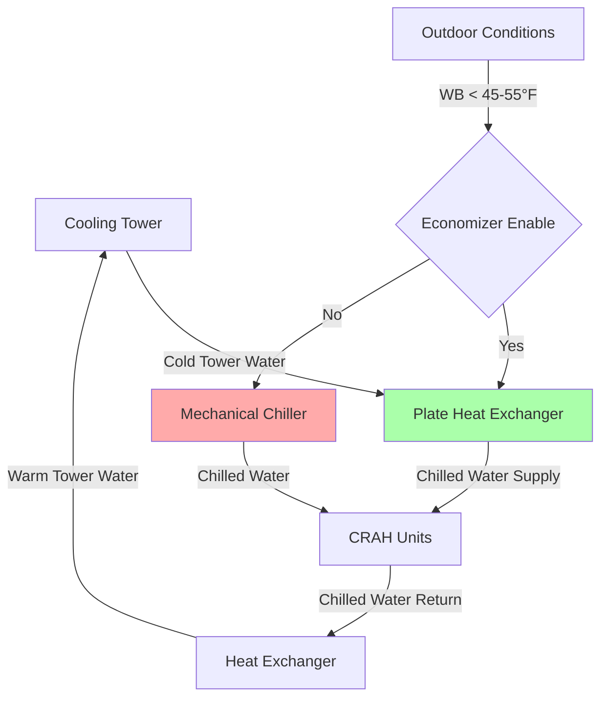
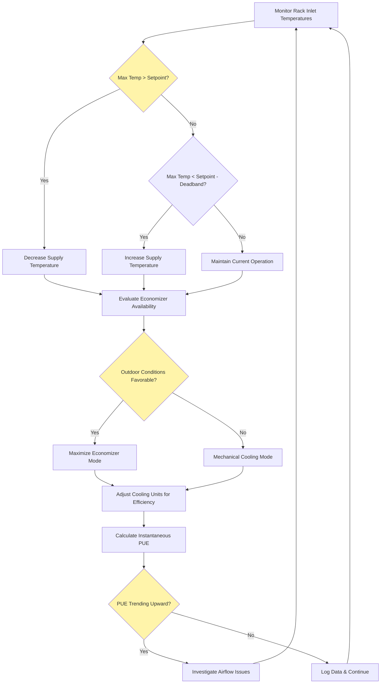

# PUE Optimization Strategies for Data Centers

Power Usage Effectiveness (PUE) optimization represents the fundamental metric-driven approach to minimizing data center energy consumption while maintaining thermal reliability for IT equipment. Achieving world-class PUE values below 1.2 requires systematic optimization of cooling systems, intelligent use of free cooling, rigorous airflow management, and continuous monitoring through Data Center Infrastructure Management (DCIM) platforms.

## PUE Fundamentals and Calculation

PUE quantifies total facility energy consumption relative to IT equipment energy:

$$PUE = \frac{P_{total\,facility}}{P_{IT\,equipment}} = \frac{P_{IT} + P_{cooling} + P_{lighting} + P_{UPS\,loss} + P_{other}}{P_{IT}}$$

This can be decomposed into component efficiency factors:

$$PUE = 1 + \frac{P_{cooling}}{P_{IT}} + \frac{P_{lighting}}{P_{IT}} + \frac{P_{UPS\,loss}}{P_{IT}} + \frac{P_{other}}{P_{IT}}$$

The cooling component typically dominates infrastructure overhead, representing 30-60% of non-IT power consumption. ASHRAE TC 9.9 guidelines emphasize that cooling system optimization yields the most significant PUE improvements.

### PUE Performance Benchmarks

| Facility Class | Typical PUE | Best Practice PUE | Annual kWh/kW IT Load |
|----------------|-------------|-------------------|----------------------|
| Legacy data center | 2.0-2.5 | 1.8-2.0 | 17,520-21,900 |
| Modern enterprise | 1.5-1.8 | 1.3-1.5 | 11,388-15,768 |
| Hyperscale optimized | 1.2-1.4 | 1.08-1.2 | 9,467-12,264 |
| World-class efficient | 1.05-1.15 | 1.02-1.08 | 8,759-10,074 |

The physics of PUE reduction centers on minimizing thermodynamic irreversibilities in the heat rejection pathway from IT equipment to ambient environment.

## Cooling System Efficiency Optimization

Cooling system efficiency directly impacts PUE through both electrical power consumption and heat generation within the facility.

### Chiller Plant Efficiency

Modern data center chiller plants achieve coefficient of performance (COP) values ranging from 4.0 to 7.0, depending on technology and operating conditions:

$$COP_{chiller} = \frac{Q_{cooling}}{W_{compressor}} = \frac{\text{Cooling capacity (kW)}}{\text{Compressor power (kW)}}$$

The relationship to kW/ton (inverse of COP) expressed in conventional units:

$$\text{kW/ton} = \frac{3.517}{COP}$$

High-efficiency strategies include:

**Variable Primary Flow Systems**
- Eliminate constant-speed primary pumps
- Variable speed drives modulate flow based on cooling load
- Pump power follows affinity laws: $P \propto Q^3$
- Energy savings: 40-60% compared to constant primary systems

**Elevated Chilled Water Temperature**
- Increase supply temperature from 42°F (5.6°C) to 50-55°F (10-13°C)
- Chiller efficiency improves approximately 1.5-2% per °F increase
- Requires larger coils but dramatically improves economizer hours
- ASHRAE TC 9.9 Class A1-A4 equipment tolerates elevated temperatures

The thermodynamic relationship between evaporator temperature and compressor work:

$$COP_{Carnot} = \frac{T_{evap}}{T_{cond} - T_{evap}}$$

Raising evaporator temperature from 40°F (4.4°C) to 50°F (10°C) while maintaining 95°F (35°C) condenser temperature increases theoretical COP from 9.1 to 11.3, representing a 24% efficiency gain.

### Cooling Tower Optimization

Cooling towers reject heat to ambient through evaporative cooling, achieving approach temperatures of 5-10°F (3-6°C) to wet-bulb:

$$T_{approach} = T_{CW,supply} - T_{WB,ambient}$$

Tower effectiveness:

$$\epsilon_{tower} = \frac{T_{CW,return} - T_{CW,supply}}{T_{CW,return} - T_{WB,ambient}}$$

Optimization strategies:

- **Variable speed fan control**: Modulate to maintain target approach
- **Increased tower capacity**: Lower approach enables higher chiller efficiency
- **Water treatment**: Prevent scaling that reduces heat transfer coefficient
- **Multiple cells**: Stage fans incrementally to match load

Energy analysis shows oversizing cooling towers by 20-30% reduces annual cooling energy by 8-12% through improved chiller efficiency despite marginally higher tower fan energy.

### CRAH/CRAC Unit Optimization

Computer Room Air Handler (CRAH) and Computer Room Air Conditioner (CRAC) unit optimization focuses on fan energy and temperature management:

**Variable Speed Fan Control**

Fan power relationship:

$$P_{fan} = \frac{Q \cdot \Delta P}{6356 \cdot \eta_{fan} \cdot \eta_{motor} \cdot \eta_{VFD}}$$

With affinity laws, reducing flow by 30% decreases power by approximately 66%:

$$\frac{P_2}{P_1} = \left(\frac{Q_2}{Q_1}\right)^3$$

**Supply Air Temperature Reset**

Traditional data centers supply 55-60°F (13-16°C) air. Increasing to 65-70°F (18-21°C):
- Reduces airflow requirements by 25-40%
- Enables economizer operation for more annual hours
- Decreases chiller energy through elevated evaporator temperature
- Maintains ASHRAE recommended envelope when rack inlet reaches 70-75°F (21-24°C)

## Free Cooling Economizer Strategies

Free cooling exploits favorable outdoor conditions to minimize or eliminate mechanical refrigeration, representing the single most impactful PUE optimization technique.

### Air-Side Economizer Systems

Air-side economizers introduce outdoor air when enthalpy or temperature permits:

**Direct Air-Side (Open Circuit)**
- Mix outdoor air with return air through modulating dampers
- Eliminate mechanical cooling when $T_{outdoor} < T_{return} - \Delta T_{buffer}$
- Buffer typically 5-10°F (3-6°C) to prevent hunting
- Filtration critical: MERV 13-15 required for outdoor air quality

**Indirect Air-Side (Closed Circuit)**
- Air-to-air heat exchangers separate outdoor and data center airstreams
- Prevents humidity, particulate, and gaseous contamination
- Heat exchanger effectiveness 60-80%
- Operational when: $T_{outdoor} < T_{supply} - \frac{T_{supply} - T_{outdoor}}{\epsilon}$

### Water-Side Economizer Systems

Water-side economizers produce chilled water using cooling tower and heat exchanger when wet-bulb temperature permits:

Operating threshold depends on approach temperatures:

$$T_{CHW,supply} = T_{WB,outdoor} + T_{approach,tower} + T_{approach,HX}$$

For 45°F (7°C) chilled water supply with 7°F (4°C) tower approach and 5°F (3°C) heat exchanger approach:

$$T_{WB,required} = 45 - 7 - 5 = 33°F\,(0.6°C)$$

### Economizer Hours Analysis by Climate

Annual economizer availability varies dramatically by geography:

| Climate Zone | Representative City | Annual Economizer Hours (T<55°F) | Annual Economizer Hours (WB<45°F) | Annual kWh Savings per kW IT |
|--------------|-------------------|--------------------------------|----------------------------------|------------------------------|
| Cold | Minneapolis, MN | 6,200 hours (71%) | 5,800 hours (66%) | 2,800-3,400 |
| Moderate | San Francisco, CA | 7,500 hours (86%) | 6,900 hours (79%) | 3,200-3,900 |
| Hot-Dry | Phoenix, AZ | 2,800 hours (32%) | 2,200 hours (25%) | 1,200-1,600 |
| Hot-Humid | Miami, FL | 800 hours (9%) | 400 hours (5%) | 300-500 |

Partial economizer operation extends these hours significantly when outdoor conditions enable reduced compressor lift even without full free cooling.

## Airflow Management for PUE Reduction

Effective airflow management eliminates thermodynamic inefficiencies caused by hot and cold air mixing, reducing required cooling capacity and fan energy.

### Containment System Effectiveness

Physical containment prevents recirculation and bypass airflows:

**Recirculation**: Hot exhaust air mixing with cold supply
**Bypass**: Cold supply air returning without passing through IT equipment

The recirculation index quantifies mixing effectiveness:

$$RI = \frac{T_{rack\,inlet} - T_{supply}}{T_{return} - T_{supply}}$$

Ideal performance: RI = 0 (no recirculation)
Uncontained facility: RI = 0.2-0.5 (20-50% recirculation)

Similarly, supply heat index measures bypass:

$$SHI = \frac{T_{return} - T_{rack\,outlet}}{T_{rack\,outlet} - T_{supply}}$$

**Hot Aisle Containment (HAC) Performance**

Enclosing hot aisles captures equipment exhaust before mixing:
- Return air temperature increases 10-25°F (6-14°C)
- Recirculation index reduces to <0.05
- Cooling capacity increases 25-40% for same equipment
- Fan energy reduces 20-35% through higher ΔT operation

Energy balance with containment:

$$Q_{cooling} = \dot{m}_{air} \cdot c_p \cdot (T_{return} - T_{supply}) = \frac{CFM \cdot 1.08 \cdot \Delta T}{3413}$$

Increasing ΔT from 15°F to 25°F (8°C to 14°C) reduces airflow by 40% for equivalent cooling, decreasing fan power by approximately 78% due to cubic relationship.

### Blanking Panel Implementation

Unsealed rack spaces create low-resistance bypass paths:

- Open rack U-spaces allow 30-50% cold air bypass
- Blanking panels force airflow through populated equipment
- Reduces required supply airflow by 25-40%
- Implementation cost: $10-30 per rack
- Energy savings: 150-250 kWh/year per rack

The pressure differential across equipment determines airflow distribution according to flow resistance networks. Sealing bypasses increases equipment pressure drop, forcing proportional flow through heat-generating components.

### Optimized Tile Placement

Perforated tile location directly affects delivery efficiency:

**Traditional approach**: Uniform tile distribution (25-30% floor area perforated)
**Optimized approach**: Tiles positioned only in cold aisles near high-density racks

Computational fluid dynamics (CFD) analysis optimizes placement to achieve:
- Rack inlet temperature uniformity within ±2°F (±1°C)
- Minimum required plenum pressure
- Reduced fan energy through targeted delivery

## DCIM Monitoring and Optimization

Data Center Infrastructure Management (DCIM) platforms enable real-time monitoring and algorithmic optimization of cooling systems based on actual thermal conditions.

### Sensor Network Architecture

Comprehensive thermal monitoring requires distributed measurement:

**Rack-Level Sensors**
- Inlet temperature: Top, middle, bottom of rack fronts
- Outlet temperature: Rear of rack hot aisle
- Differential pressure: Across rack enclosure
- Measurement frequency: 15-60 second intervals

**Room-Level Sensors**
- Supply air temperature and humidity
- Return air temperature
- Plenum pressure (raised floor installations)
- Containment pressure differential

Sensor density recommendations:
- Minimum: One inlet/outlet pair per rack
- Standard: Three inlet points (top/mid/bottom) per rack
- High-density: 6-12 points per rack for racks >15 kW

### Real-Time Optimization Algorithms

DCIM platforms implement control algorithms that continuously adjust cooling based on thermal feedback:

**Supply Air Temperature Reset**

Algorithm maintains maximum observed rack inlet temperature at setpoint (typically 70-75°F):

$$T_{supply,new} = T_{supply,current} - k \cdot (T_{rack\,inlet,max} - T_{setpoint})$$

where k = control gain (typically 0.3-0.7 for stability)

**Cooling Unit Staging**

Activate minimum number of units to maintain thermal envelope:

1. Monitor all rack inlet temperatures
2. If max temperature exceeds setpoint + deadband → activate additional unit
3. If all temperatures below setpoint - deadband → deactivate one unit
4. Hysteresis prevents hunting: typically 2-3°F (1-2°C) deadband

**Predictive Thermal Modeling**

Advanced DCIM systems build thermal response models:

$$T_{rack\,inlet}(t+\Delta t) = f(T_{supply}, CFM_{supply}, P_{IT\,load}, t)$$

Machine learning algorithms predict temperature response to cooling changes, enabling proactive adjustments before temperature excursions occur.

### Energy Monitoring and PUE Tracking

Continuous PUE calculation requires power metering at:

- Main utility service (total facility power)
- UPS output or PDU inputs (IT equipment power)
- Chiller plant electrical consumption
- Cooling tower and condenser water pumps
- CRAH/CRAC units and air handling equipment

Time-averaged PUE calculation:

$$PUE_{avg} = \frac{\int_0^T P_{facility}(t) \, dt}{\int_0^T P_{IT}(t) \, dt}$$

DCIM dashboards display:
- Real-time instantaneous PUE
- Daily/weekly/monthly averages
- Component-level energy breakdown
- Trending analysis identifying degradation

### Cooling Optimization Workflow

## Integrated PUE Optimization Strategy

Achieving world-class PUE requires simultaneous implementation of multiple optimization strategies:

### Temperature Optimization
- Increase supply air temperature to 65-70°F (18-21°C)
- Raise chilled water temperature to 50-55°F (10-13°C)
- Implement 5-10°F (3-6°C) supply temperature deadband
- Expected impact: PUE reduction of 0.1-0.2

### Airflow Management
- Deploy hot aisle or cold aisle containment
- Install blanking panels on all unsealed rack spaces
- Optimize perforated tile placement via CFD analysis
- Expected impact: PUE reduction of 0.15-0.25

### Economizer Maximization
- Install water-side economizer for chilled water systems
- Implement controls for partial economizer operation
- Extend economizer hours through elevated CHW temperature
- Expected impact: PUE reduction of 0.1-0.3 (climate dependent)

### Equipment Efficiency
- Variable speed drives on all cooling fans and pumps
- High-efficiency chillers (>0.5 kW/ton at design conditions)
- Oversized cooling towers for reduced approach
- Expected impact: PUE reduction of 0.08-0.15

### Control Optimization
- DCIM platform with real-time thermal monitoring
- Automated cooling unit staging algorithms
- Predictive controls based on weather forecasting
- Expected impact: PUE reduction of 0.05-0.12

**Combined Impact**: Comprehensive optimization can reduce PUE from typical 1.6-1.8 baseline to 1.15-1.25, representing 30-40% reduction in infrastructure energy consumption.

For a 1 MW IT load facility:

$$\text{Annual Savings} = 1000\,\text{kW} \times 8760\,\text{hr} \times (PUE_{before} - PUE_{after}) \times \text{Electric Rate}$$

$$= 1000 \times 8760 \times (1.7 - 1.2) \times \$0.10/\text{kWh} = \$438,000/\text{year}$$

---

**Key Takeaways**

PUE optimization requires systematic attention to cooling system efficiency, maximum exploitation of free cooling through economizers, elimination of airflow inefficiencies via containment and blanking, and continuous monitoring through DCIM platforms. The physics of optimization centers on minimizing thermodynamic irreversibilities—reducing temperature differentials in heat transfer, eliminating mixing losses, and operating equipment at maximum efficiency points. ASHRAE TC 9.9 thermal guidelines enable elevated temperature operation that simultaneously improves chiller efficiency and extends economizer hours. Comprehensive implementation of optimization strategies achieves PUE values below 1.2, reducing infrastructure energy consumption by 35-45% while maintaining full compliance with equipment manufacturer specifications and reliability requirements.
