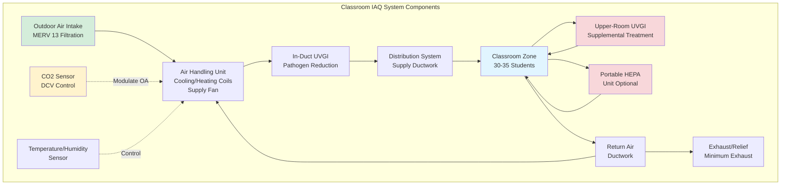

Indoor air quality in classrooms directly impacts student health, cognitive performance, and learning outcomes. Research demonstrates that adequate ventilation correlates with improved test scores, reduced absenteeism, and enhanced concentration. ASHRAE Standard 62.1 provides the foundation for classroom ventilation design, while emerging technologies offer enhanced IAQ solutions.

## ASHRAE 62.1 Ventilation Requirements

ASHRAE Standard 62.1 establishes minimum outdoor air requirements based on both occupancy and floor area. For classrooms, the ventilation rate procedure requires:

$$V_{oz} = R_p \times P_z + R_a \times A_z$$

Where:
- $V_{oz}$ = outdoor air requirement for breathing zone (cfm)
- $R_p$ = people outdoor air rate = 10 cfm/person
- $P_z$ = zone population (occupants)
- $R_a$ = area outdoor air rate = 0.12 cfm/ft²
- $A_z$ = zone floor area (ft²)

For a typical classroom with 30 students plus one teacher (31 occupants) and 900 ft² floor area:

$$V_{oz} = (10 \times 31) + (0.12 \times 900) = 310 + 108 = 418 \text{ cfm}$$

This translates to approximately 13.5 cfm/ft², significantly higher than general office spaces. The dual component approach accounts for both body bioeffluents (people-related) and building materials/furnishings (area-related).

### ASHRAE 62.1 Ventilation Rates for Educational Spaces

| Space Type | People Rate (cfm/person) | Area Rate (cfm/ft²) | Typical Occupancy (people/1000 ft²) | Combined Rate (cfm/ft²) |
|------------|-------------------------|---------------------|-------------------------------------|------------------------|
| Classrooms (ages 5-8) | 10 | 0.12 | 25 | 0.37 |
| Classrooms (ages 9+) | 10 | 0.12 | 35 | 0.47 |
| Lecture Halls | 7.5 | 0.06 | 65 | 0.55 |
| Computer Labs | 10 | 0.12 | 25 | 0.37 |
| Music Rooms | 10 | 0.12 | 35 | 0.47 |
| Art Classrooms | 10 | 0.18 | 20 | 0.38 |
| Science Labs | 10 | 0.18 | 25 | 0.43 |
| Libraries | 5 | 0.12 | 10 | 0.17 |
| Gymnasiums | 20 | 0.06 | 30 | 0.66 |

## CO2-Based Demand Controlled Ventilation

Demand controlled ventilation (DCV) uses real-time CO2 monitoring to modulate outdoor air delivery based on actual occupancy. In classrooms with variable attendance, DCV can maintain IAQ while reducing energy consumption during partial occupancy periods.

**Implementation Principles:**

- **Setpoint Selection**: Maintain CO2 levels at or below 1000 ppm (600-700 ppm above outdoor ambient)
- **Sensor Placement**: Install sensors in the breathing zone, 3-6 feet above floor, away from supply diffusers and windows
- **Minimum Ventilation**: Always maintain area-based ventilation (0.12 cfm/ft²) even at zero occupancy
- **Response Time**: System must respond within 10-15 minutes to occupancy changes

The CO2-based ventilation rate can be calculated:

$$V_{ot} = V_{oz} \times \frac{C_s - C_o}{C_z - C_o}$$

Where:
- $V_{ot}$ = target outdoor air rate (cfm)
- $V_{oz}$ = design outdoor air rate (cfm)
- $C_s$ = CO2 setpoint (typically 1000 ppm)
- $C_o$ = outdoor CO2 concentration (typically 400 ppm)
- $C_z$ = measured zone CO2 concentration (ppm)

## Filtration Requirements

The COVID-19 pandemic elevated awareness of airborne pathogen transmission, prompting enhanced filtration standards for educational facilities.

**Current Recommendations:**

- **Minimum MERV 13**: ASHRAE now recommends MERV 13 filters as baseline for schools, providing 85% efficiency for 1-3 μm particles
- **MERV 14-16**: Consider for schools serving vulnerable populations or in high pollution areas
- **System Compatibility**: Verify existing air handling units can accommodate increased pressure drop (MERV 13 typically 0.4-0.6 in. w.g. at 500 fpm)
- **Filter Replacement**: Establish schedules based on pressure differential monitoring rather than fixed intervals

MERV 13 filters capture:
- 50%+ of 0.3-1.0 μm particles (includes many viruses on droplet nuclei)
- 85%+ of 1.0-3.0 μm particles (includes bacteria, mold spores)
- 90%+ of 3.0-10 μm particles (includes pollen, dust)

## Temperature and Humidity for Learning

Thermal comfort directly influences student attention span and cognitive function. Research indicates optimal learning occurs within specific environmental parameters.

**Temperature Ranges:**
- Heating Season: 68-72°F (20-22°C)
- Cooling Season: 73-76°F (23-24°C)
- Maximum Variation: ±2°F within occupied zone

**Relative Humidity:**
- Target Range: 40-60% RH
- Minimum: 30% RH (prevents static electricity, respiratory irritation)
- Maximum: 60% RH (limits mold growth, reduces allergens)

Humidity control presents challenges in classrooms with high occupancy density. Each occupant generates approximately 0.25 lb/hr of moisture through respiration and perspiration. In a 31-person classroom:

$$M_{total} = 31 \times 0.25 = 7.75 \text{ lb/hr moisture generation}$$

Adequate outdoor air ventilation and proper cooling coil moisture removal capacity are essential for humidity control.

## VOC and Formaldehyde Control

Building materials, furnishings, cleaning products, and art supplies introduce volatile organic compounds into classroom air. Young children are particularly vulnerable to VOC exposure due to higher breathing rates relative to body mass.

**Control Strategies:**

1. **Source Control**:
   - Specify low-VOC paints, adhesives, flooring (Green Guard or equivalent certification)
   - Use solid wood furniture rather than particleboard (formaldehyde source)
   - Establish green cleaning product policies
   - Schedule renovation activities during summer breaks with pre-occupancy flushing

2. **Ventilation Flushing**:
   - Conduct building flush-out: 14,000 ft³ total outdoor air per ft² before occupancy
   - Pre-occupancy purge: Operate HVAC at 100% outdoor air for 48-72 hours after construction

3. **Air Cleaning**:
   - Gas-phase filtration (activated carbon) for formaldehyde and VOC removal
   - Photocatalytic oxidation (PCO) units for organic compound breakdown

## Air Cleaning Technologies for Enhanced IAQ

Beyond filtration and ventilation, supplemental air cleaning technologies provide additional pathogen reduction and contaminant removal.

**Technology Options:**

**Upper-Room Ultraviolet Germicidal Irradiation (UVGI)**:
- Fixtures mounted 7+ feet above floor irradiate upper air zone
- Room air circulation naturally moves air through UV zone
- Effective against airborne bacteria, viruses, mold spores
- Provides equivalent air changes of 10-20 ACH pathogen removal

**In-Duct UVGI**:
- UV lamps installed in air handling units or ductwork
- Irradiates cooling coils (prevents biofilm) and airstream
- Lower single-pass effectiveness than upper-room, but treats all supply air

**Bipolar Ionization**:
- Generates positive and negative ions that attach to particles
- Claims of pathogen inactivation remain under study
- May produce ozone as byproduct; verify UL 2998 certification (zero ozone)

**Portable Air Cleaners**:
- HEPA-filtered units provide supplemental air cleaning
- Size appropriately: Clean Air Delivery Rate (CADR) should be 4-6× room volume per hour
- Position to avoid short-circuiting supply air distribution

## Practical Implementation Considerations

**System Design:**
- Dedicate outdoor air to classrooms rather than relying on transfer air from corridors
- Size distribution systems for low velocities (<500 fpm in ducts, <100 fpm at diffusers) to minimize noise
- Provide individual room temperature control with wireless or low-voltage thermostats
- Install manual outdoor air dampers with position indicators for verification

**Operations:**
- Implement pre-occupancy and post-occupancy ventilation schedules (start 2 hours before, run 2 hours after)
- Conduct annual testing and balancing verification
- Monitor filter differential pressure and CO2 levels continuously
- Establish preventive maintenance schedules for coil cleaning and drain pan sanitization

**Monitoring:**
- Install building automation system (BAS) monitoring for outdoor air damper position, filter status, and space CO2
- Consider real-time IAQ dashboards visible to building occupants (transparency builds trust)
- Establish alert protocols for excursions beyond acceptable ranges

Proper classroom IAQ requires integration of adequate outdoor air ventilation, effective filtration, thermal and humidity control, source management, and potentially supplemental air cleaning technologies. These systems working in concert create healthy learning environments that support student achievement and well-being.
