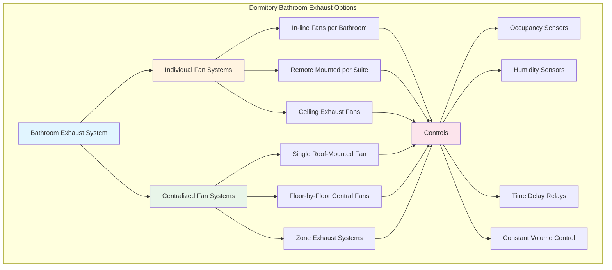

## Overview

Bathroom exhaust systems in dormitory and residence hall facilities present unique challenges compared to typical residential applications. High occupancy density, 24-hour operation, shared facilities, and institutional maintenance requirements demand carefully engineered ventilation solutions that balance code compliance, energy efficiency, and reliable moisture and odor removal.

The selection between continuous and intermittent exhaust strategies, centralized versus individual fan systems, and the integration of energy recovery significantly impact both initial construction costs and long-term operating expenses in multi-story residence halls.

## Code Requirements and Exhaust Rates

The International Mechanical Code (IMC) and ASHRAE Standard 62.1 establish minimum ventilation requirements for dormitory bathrooms that differ from single-family residential standards.

### Minimum Exhaust Rates

For dormitory bathrooms with bathtubs or showers:

- **IMC Section 403.3**: Minimum 50 cfm intermittent or 20 cfm continuous
- **ASHRAE 62.1**: 25 cfm per water closet (toilet), 25 cfm per shower/tub
- **For toilet rooms without showers**: Minimum 25 cfm intermittent or 10 cfm continuous

The total exhaust requirement for a typical dormitory bathroom suite with toilet, shower, and lavatory:

$$Q_{total} = Q_{wc} + Q_{shower} = 25 + 25 = 50 \text{ cfm}$$

For larger gang bathrooms serving multiple occupants simultaneously:

$$Q_{gang} = n_{wc} \times 25 + n_{shower} \times 25 + n_{lav} \times 10 \text{ cfm}$$

where $n$ represents the quantity of each fixture type.

### Diversity Factors

In large residence halls, applying diversity factors reduces peak exhaust requirements:

$$Q_{design} = Q_{total} \times DF$$

where $DF$ typically ranges from 0.6 to 0.8 for buildings with more than 100 bathrooms, based on probability of simultaneous use.

## Continuous vs Intermittent Exhaust Strategies

The choice between continuous and intermittent operation fundamentally affects system design and energy consumption.

### Continuous Exhaust Operation

Continuous systems provide constant ventilation at the code-minimum rate (typically 20 cfm per bathroom):

**Advantages:**
- Consistent odor and moisture removal
- Simpler controls with no occupancy sensors required
- Better humidity control in hot, humid climates
- Maintains slight negative pressure preventing migration of odors
- No delay in ventilation response

**Disadvantages:**
- Higher annual energy consumption (24/7 fan operation)
- Increased heating/cooling load from continuous outdoor air replacement
- Greater wear on fan motors and bearings

The annual energy consumption for continuous operation:

$$E_{annual} = \frac{Q \times \Delta P \times 8760}{6356 \times \eta_{fan} \times \eta_{motor}} \text{ kWh}$$

where $Q$ is airflow (cfm), $\Delta P$ is static pressure (in. w.g.), and efficiencies are in decimal form.

### Intermittent Exhaust Operation

Intermittent systems operate at higher rates (50 cfm) only when bathrooms are occupied:

**Advantages:**
- Reduced annual energy consumption (fans run only during occupancy)
- Lower heating/cooling loads over the year
- Can size exhaust fans larger for rapid moisture removal

**Disadvantages:**
- Requires occupancy sensors or manual switches (maintenance issues)
- Potential for inadequate ventilation if controls fail
- Moisture accumulation during unoccupied periods in humid climates
- Time delay before ventilation begins

**Control Strategies:**
- Wall-mounted occupancy sensors with adjustable time delays (typically 20 minutes)
- Light switch integration (runs for preset duration after light turns off)
- Humidity sensors triggering fans at >60% RH regardless of occupancy
- Combination occupancy + humidity control for optimal performance

## System Configuration Options

## Centralized vs Individual Exhaust Systems

The decision between centralized and individual exhaust systems involves tradeoffs in cost, maintenance, and performance.

| **Criteria** | **Centralized System** | **Individual System** |
|-------------|----------------------|---------------------|
| **Initial Cost** | Lower equipment cost, higher duct cost | Higher equipment cost, lower duct cost |
| **Fan Efficiency** | 60-70% (larger fans more efficient) | 40-50% (small fans less efficient) |
| **Maintenance** | Single point service access | Multiple units to maintain |
| **Reliability** | Single point of failure affects multiple bathrooms | Failure isolated to one bathroom |
| **Sound Control** | Better (fans remote from occupied space) | More challenging (fans near occupants) |
| **Energy Recovery** | Easier to integrate central ERV | Individual room ERVs costly |
| **Balancing** | Complex duct balancing required | Simple, self-contained systems |
| **Fire Dampers** | Required at floor/corridor penetrations | Fewer required |
| **Duct Size** | 6-12 inch mains, 4-6 inch branches | 4-6 inch individual ducts |
| **Controls** | Centralized DDC, VFD for modulation | Individual thermostats/switches |
| **Typical Application** | New construction, >100 bathrooms | Renovation, smaller buildings |

### Centralized System Design

A centralized exhaust system serving one floor (40 bathrooms) requires:

$$Q_{central} = n_{bathrooms} \times Q_{bathroom} \times DF = 40 \times 50 \times 0.7 = 1400 \text{ cfm}$$

Duct sizing for main trunk (velocity limited to 1200-1500 fpm for noise control):

$$A = \frac{Q}{V} = \frac{1400}{1300} = 1.08 \text{ ft}^2 \rightarrow 12 \text{ inch round or 10×12 rectangular}$$

### Individual System Design

Individual bathroom exhaust fans are typically:
- 50-110 cfm capacity for intermittent operation
- 20-50 cfm for continuous operation
- 0.5-1.5 sones sound rating for quiet operation
- 4-6 inch duct connections

## Moisture and Odor Control

Effective moisture removal prevents mold growth, material deterioration, and occupant complaints.

### Target Humidity Levels

Maintain bathroom relative humidity below:
- **60% RH during occupancy** (shower events)
- **50% RH average** over 24-hour period
- **Exhaust runtime** of 20-30 minutes post-shower to remove moisture

The moisture generation rate during showering:

$$W = 0.2-0.5 \text{ lbs/hour}$$

Required exhaust to maintain 60% RH:

$$Q = \frac{W \times 60}{(\omega_{room} - \omega_{outdoor})} \text{ cfm}$$

where $\omega$ represents humidity ratio (lbs moisture/lbs dry air).

### Odor Control

Effective odor removal requires:
- Minimum 5-8 air changes per hour in toilet rooms
- Negative pressure relative to adjacent spaces (-2 to -5 Pa)
- Exhaust grilles located away from makeup air sources
- Continuous low-level exhaust (even in intermittent systems) of 10 cfm minimum

## Makeup Air Pathways

Exhaust air must be replaced to prevent building depressurization and ensure proper system operation.

### Door Undercut Requirements

The IMC requires makeup air pathways, typically provided by door undercuts:

$$A_{undercut} = \frac{Q}{V_{max}}$$

For $Q = 50$ cfm and maximum velocity $V_{max} = 200$ fpm (to limit noise):

$$A_{undercut} = \frac{50}{200} = 0.25 \text{ ft}^2 = 36 \text{ in}^2$$

Standard practice: **3/4 to 1 inch undercut** on 3×7 ft door provides 32-42 square inches.

### Transfer Grilles

For bathrooms without doors to corridors, wall-mounted transfer grilles sized at:
- 150-200 fpm face velocity
- Located to prevent short-circuiting of exhaust
- Louvers directing air downward to floor level

### Corridor Pressurization

In centralized exhaust systems, corridors must be pressurized to provide makeup air:

$$Q_{corridor} = \sum Q_{exhaust} + Q_{infiltration}$$

Corridor supply systems typically provide 10-20% more air than total exhaust to maintain slight positive pressure.

## Energy Recovery from Exhaust Air

Energy recovery from bathroom exhaust is challenging due to moisture and contamination but can provide significant savings in large installations.

### Energy Recovery Ventilators (ERV)

Central ERV systems recover both sensible and latent energy:

**Sensible effectiveness:** 60-80%
**Latent effectiveness:** 50-70%

Annual energy savings:

$$\Delta E = Q \times \rho \times c_p \times \Delta T \times \eta_{sensible} \times hours \times \frac{1}{3413} \text{ kWh}$$

For 1400 cfm system with 40°F temperature difference and 70% effectiveness operating 8760 hours:

$$\Delta E = 1400 \times 0.075 \times 0.24 \times 40 \times 0.70 \times 8760 \times \frac{1}{3413} = 60,600 \text{ kWh/year}$$

### Heat Recovery Challenges

Bathroom exhaust recovery presents obstacles:
- **High moisture content** may cause frosting in cold climates
- **Code restrictions** on recirculating contaminated air
- **Maintenance** of heat exchangers exposed to lint and soap residue
- **Economics** may not justify recovery from small individual systems

**Solutions:**
- Enthalpy wheels with purge sectors
- Run-around loop systems isolating exhaust and supply
- Exhaust air heat pumps recovering energy for domestic hot water
- Defrost cycles preventing ice formation

### Code Compliance for Energy Recovery

ASHRAE 90.1 requires energy recovery when:
- Design supply airflow exceeds 5000 cfm, AND
- Minimum outdoor air exceeds 70% of design supply

Most individual dormitory bathroom systems fall below these thresholds, but centralized systems serving entire floors may trigger requirements.

## Design Recommendations

For optimal dormitory bathroom exhaust performance:

1. **Use continuous exhaust** (20 cfm minimum) with boost to 50 cfm on occupancy in humid climates
2. **Centralized systems** preferred for new construction with >50 bathrooms per building
3. **Provide 3/4 to 1 inch door undercuts** for makeup air transfer
4. **Install humidity sensors** triggering exhaust when RH exceeds 60%
5. **Locate exhaust grilles** at ceiling level above shower/tub
6. **Maintain negative pressure** of -2 to -5 Pa relative to corridors
7. **Consider energy recovery** for centralized systems >3000 cfm
8. **Specify premium efficiency fans** (>2.0 cfm/watt for individual, >3.0 cfm/watt for central)
9. **Provide vibration isolation** for all fans to minimize noise transmission
10. **Design for maintainability** with accessible filters and fan access panels

Properly engineered bathroom exhaust systems contribute significantly to occupant comfort, building durability, and energy efficiency in dormitory facilities while ensuring compliance with ventilation codes and standards.
