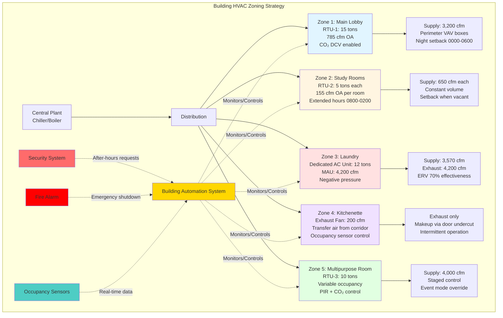

# HVAC for Dormitory Common Areas

Dormitory common areas present distinct HVAC challenges compared to individual sleeping rooms due to highly variable occupancy patterns, diverse functional requirements, and extended operating hours. Unlike residential sleeping areas with predictable overnight occupancy, common spaces experience peak loads during evening hours (1800-2400), require separate zoning to avoid conditioning vacant dorm rooms during study hours, and demand robust ventilation systems to handle concentrated occupancy during social events. Proper design separates common area systems from individual room conditioning, implements demand-controlled ventilation for energy efficiency, and integrates with building security systems to prevent unauthorized access through mechanical penetrations.

## Lobby and Lounge Area Conditioning

### Design Load Characteristics

**Occupancy patterns:**
- Peak density: 1 person per 15-20 ft² during evening hours (1900-2300)
- Minimum density: 1 person per 100 ft² during class hours (0900-1500)
- 24-hour continuous occupancy requires year-round conditioning
- Weekend peaks 50% higher than weekday averages

**Envelope loads:**
- Large glazing areas (40-60% window-to-wall ratio) create significant solar gains
- Main entrance door infiltration: 400-800 cfm per door during peak traffic
- Two-story atriums create thermal stratification challenges
- Exterior exposure typically 50% or greater (building corners, main entrances)

**Internal loads:**
- Occupants: 250 BTU/hr sensible + 200 BTU/hr latent (light activity, sitting/standing)
- Lighting: 0.8-1.2 W/ft² (LED downlights + decorative fixtures)
- Televisions/displays: 300-500 BTU/hr per 55-inch screen
- Vending machines: 1,200-1,800 BTU/hr per unit
- Furniture/finishes: Moderate thermal mass

**Example cooling load calculation (2,000 ft² lobby, 100 occupants peak):**

$$Q_{sensible} = Q_{occupants} + Q_{lights} + Q_{solar} + Q_{transmission} + Q_{infiltration}$$

$$Q_{sensible} = (100 \times 250) + (2000 \times 1.0 \times 3.413) + 45,000 + 12,000 + 8,500$$

$$Q_{sensible} = 25,000 + 6,826 + 45,000 + 12,000 + 8,500 = 97,326 \text{ BTU/hr}$$

$$Q_{latent} = (100 \times 200) + (Q_{infiltration,latent}) = 20,000 + 4,200 = 24,200 \text{ BTU/hr}$$

$$Q_{total} = 97,326 + 24,200 = 121,526 \text{ BTU/hr (10.1 tons)}$$

**Sensible heat ratio:**

$$SHR = \frac{97,326}{121,526} = 0.80$$

This moderate SHR (0.75-0.85 typical) requires proper equipment selection to handle both sensible and latent loads without excessive dehumidification during part-load conditions.

### System Recommendations

**Rooftop units (RTUs) with VAV reheat:**
- Best for large lobbies (> 3,000 ft²)
- Capacity: 7.5-25 tons per unit
- Supply air: 350-450 cfm/ton
- Multiple zones from single unit (perimeter vs core)
- Economizer capability reduces cooling energy 20-35%

**Split heat pump systems:**
- Suitable for medium lobbies (1,000-3,000 ft²)
- Capacity: 3-10 tons
- Lower first cost than RTU
- Quieter operation (indoor air handler)
- Heat recovery during shoulder seasons

**Radiant ceiling panels with DOAS:**
- Premium option for high-ceiling spaces (> 12 ft)
- Eliminates thermal stratification
- Excellent comfort (mean radiant temperature control)
- Reduced air distribution noise
- 15-25% energy savings vs all-air systems

### Ventilation Requirements

**ASHRAE 62.1-2022 minimum outdoor air:**

$$V_{oz} = R_p \times P_z + R_a \times A_z$$

Where:
- $R_p$ = 5 cfm/person (Table 6-1, assembly spaces - unconcentrated)
- $R_a$ = 0.06 cfm/ft²
- $P_z$ = Peak occupancy (1 person per 15 ft²)
- $A_z$ = Floor area (ft²)

**Example (2,000 ft² lobby, 133 peak occupants):**

$$V_{oz} = 5 \times 133 + 0.06 \times 2000 = 665 + 120 = 785 \text{ cfm}$$

**Demand-controlled ventilation (DCV) implementation:**
- CO₂ sensors measure actual occupancy (1 per 1,000 ft² maximum spacing)
- Outdoor air modulates between minimum (120 cfm area component) and design maximum (785 cfm)
- Setpoint: 1,000-1,100 ppm above outdoor ambient
- Annual energy savings: 25-40% of ventilation energy

$$\text{Avg OA} = V_{min,area} + \frac{\text{Actual occupancy}}{\text{Design occupancy}} \times V_{people}$$

During low occupancy (20 people, 0900-1500):

$$V_{oz,actual} = 120 + \frac{20}{133} \times 665 = 120 + 100 = 220 \text{ cfm (72% reduction)}$$

## Study Room Ventilation and Comfort

### Load Calculations

**Typical study room configuration:**
- Area: 300-600 ft² per room
- Occupancy: 15-30 students (high density)
- Equipment: Computers, laptops, charging stations
- Hours: Extended operation (0800-0200, 18 hours/day)

**Cooling loads per occupant:**
- Sensible: 250 BTU/hr (sedentary activity)
- Latent: 200 BTU/hr (moderate activity, stress)
- Total: 450 BTU/hr per person

**Equipment heat gain:**
- Laptop: 50-80 W (170-275 BTU/hr) when charging
- Desktop computer: 120-180 W (400-615 BTU/hr) including monitor
- LED desk lamps: 10-15 W (35-50 BTU/hr)
- Phone chargers: 5-10 W (17-35 BTU/hr) per student

**Example load calculation (500 ft² study room, 25 students, 15 laptops):**

$$Q_{occupants} = 25 \times 450 = 11,250 \text{ BTU/hr}$$

$$Q_{equipment} = 15 \times 225 + 10 \times 75 = 3,375 + 750 = 4,125 \text{ BTU/hr}$$

$$Q_{lighting} = 500 \times 1.2 \times 3.413 = 2,048 \text{ BTU/hr}$$

$$Q_{transmission} = U \times A \times \Delta T = 0.06 \times 200 \times 15 = 180 \text{ BTU/hr (interior room)}$$

$$Q_{total} = 11,250 + 4,125 + 2,048 + 180 = 17,603 \text{ BTU/hr (1.5 tons)}$$

**Peak cooling load intensity:**

$$q = \frac{17,603}{500} = 35.2 \text{ BTU/hr/ft²}$$

This high cooling intensity (30-40 BTU/hr/ft²) exceeds typical office space (25-30 BTU/hr/ft²) and requires dedicated HVAC capacity.

### Ventilation and Air Quality

**ASHRAE 62.1 outdoor air requirement:**

$$V_{oz} = 5 \times 25 + 0.06 \times 500 = 125 + 30 = 155 \text{ cfm}$$

**Actual supply air requirement (based on cooling load):**

$$\text{CFM}_{supply} = \frac{Q_{sensible}}{1.08 \times \Delta T} = \frac{14,000}{1.08 \times 20} = 648 \text{ cfm}$$

**Minimum outdoor air fraction:**

$$\text{OA%} = \frac{155}{648} = 23.9\%$$

This high outdoor air percentage (typical offices use 15-20%) increases cooling and heating energy but is necessary for occupant comfort and code compliance.

**Air changes per hour:**

$$ACH = \frac{648 \times 60}{500 \times 8} = 9.7 \text{ ACH}$$

This elevated air change rate (typical offices 4-6 ACH) provides excellent ventilation effectiveness and rapid contaminant removal.

### Thermal Comfort Optimization

**Temperature and humidity control:**
- Cooling setpoint: 72-74°F (students prefer cooler during concentration)
- Heating setpoint: 69-71°F
- Deadband: 3°F minimum (energy code requirement)
- Relative humidity: 40-55% (prevents dry air complaints during heating)

**Zoning strategies:**
- Individual RTU or heat pump per study room (> 500 ft²)
- Separate VAV box for smaller study rooms from common area system
- Allows extended hours without conditioning vacant spaces
- Night setback when unoccupied (0200-0800): 65°F heating, 80°F cooling

**Acoustical performance:**
- Study rooms require quiet HVAC operation (NC 30-35 maximum)
- Diffuser selection: Low-velocity perforated or fabric duct (< 300 fpm discharge)
- Return air: Ducted returns preferred over door grilles (reduces hallway noise transmission)
- Equipment location: Remote from study spaces

## Laundry Room Exhaust and Makeup Air

### Heat and Moisture Loads

**Commercial dryer characteristics (per machine):**
- Gas-fired: 30,000-50,000 BTU/hr input, 200 cfm exhaust
- Electric: 5,000 W (17,065 BTU/hr), 200 cfm exhaust
- Moisture removal: 0.5-0.8 gallons/hour per load
- Cycle time: 30-45 minutes typical

**Washer characteristics (per machine):**
- Electric: 1,500-2,000 W heating element (primarily to drain, minimal space load)
- No direct exhaust requirement
- Occasional door opening releases moisture pulse

**Typical dormitory laundry facility (1,200 ft², 12 washers, 12 dryers):**

**Sensible heat gain from dryers:**

$$Q_{dryers,sensible} = 12 \times 5000 \times 3.413 \times 0.35 = 71,673 \text{ BTU/hr}$$

(Factor 0.35 accounts for heat exhausted directly outside vs released to space)

**Latent heat gain (moisture):**

$$Q_{dryers,latent} = 12 \times 0.65 \frac{\text{gal}}{\text{hr}} \times 8.33 \frac{\text{lb}}{\text{gal}} \times 1,060 \frac{\text{BTU}}{\text{lb}} = 68,834 \text{ BTU/hr}$$

**Occupant load (transient, 10 persons average):**

$$Q_{occupants} = 10 \times (250 + 200) = 4,500 \text{ BTU/hr}$$

**Lighting and miscellaneous:**

$$Q_{lights+misc} = 1200 \times 1.0 \times 3.413 = 4,096 \text{ BTU/hr}$$

**Total cooling load:**

$$Q_{total} = 71,673 + 68,834 + 4,500 + 4,096 = 149,103 \text{ BTU/hr (12.4 tons)}$$

**Cooling load per square foot:**

$$q = \frac{149,103}{1,200} = 124 \text{ BTU/hr/ft²}$$

This extremely high cooling intensity requires dedicated HVAC equipment and proper exhaust/makeup air design.

### Exhaust and Makeup Air Design

**Dryer exhaust requirements:**
- Per manufacturer specification: 200 cfm per dryer
- Total exhaust: 12 × 200 = 2,400 cfm
- Duct to exterior (not connected to HVAC return)
- Backdraft dampers prevent cold air infiltration when off
- Lint screens required (fire safety)

**Space exhaust (general ventilation):**
- ASHRAE 62.1 requirement: 0.06 cfm/ft² area component
- Recommended for laundry: 1.5 cfm/ft² (captures residual moisture and heat)
- Total space exhaust: 1,200 × 1.5 = 1,800 cfm

**Total exhaust requirement:**

$$\text{Exhaust}_{total} = 2,400 + 1,800 = 4,200 \text{ cfm}$$

**Makeup air requirement:**
- Must equal total exhaust to prevent building depressurization
- Makeup air unit (MAU) capacity: 4,200 cfm
- Heating capacity (winter, 0°F outdoor to 65°F supply):

$$Q_{heating} = 1.08 \times 4,200 \times (65 - 0) = 294,840 \text{ BTU/hr (245 MBH)}$$

**Energy recovery option:**
- Exhaust air energy recovery ventilator (ERV)
- Sensible effectiveness: 60-75%
- Latent effectiveness: 50-60%
- Annual heating energy savings: 40-55%
- Payback period: 4-7 years in cold climates

**Without ERV heating cost (annual, Chicago climate):**

$$\text{Cost}_{heating} = \frac{294,840 \times 4,380 \text{ HDD}}{65 \times 75,000 \times 0.80} \times \$1.00/\text{therm} = \$3,294/\text{year}$$

**With ERV (70% effectiveness):**

$$\text{Cost}_{heating,ERV} = \$3,294 \times (1 - 0.70) = \$988/\text{year}$$

$$\text{Savings} = \$3,294 - \$988 = \$2,306/\text{year}$$

### Pressure Relationships

**Maintain laundry room at negative pressure:**
- Target: -0.05 to -0.10 in. w.c. relative to corridor
- Prevents odor and moisture migration to adjacent spaces
- Exhaust cfm exceeds supply cfm by 10-15%

**Calculation:**

$$\text{Supply air} = 0.85 \times \text{Exhaust} = 0.85 \times 4,200 = 3,570 \text{ cfm}$$

$$\text{Negative pressure flow} = 4,200 - 3,570 = 630 \text{ cfm (infiltration from corridor)}$$

## Kitchen and Kitchenette Ventilation

### Residential Kitchenette Requirements

**Typical dormitory floor kitchenette (shared by 30-40 students):**
- Appliances: Refrigerator, microwave, toaster oven, coffee maker, sink
- No commercial cooking equipment (range hoods, ovens, fryers)
- Minimal grease generation
- Primary concern: Odor control and occupant comfort

**ASHRAE 62.1 ventilation (residential dwelling kitchen):**
- Intermittent exhaust: 100 cfm
- Continuous exhaust: 25 cfm
- Most dormitory kitchenettes use intermittent exhaust activated by occupancy sensor or wall switch

**Recommended design:**
- Exhaust fan: 150-200 cfm (oversized for better capture)
- Makeup air: Transfer from corridor (no dedicated MAU needed for small kitchenette)
- Maintain negative pressure: -0.02 to -0.05 in. w.c.
- Exhaust discharge: Minimum 10 ft from outdoor air intakes

### Commercial Kitchen Requirements

**Large dormitory complexes with central dining/commercial kitchen:**
- Subject to IMC Chapter 5 (Commercial Kitchen Ventilation)
- Type I hoods required over grease-producing appliances
- Type II hoods required over non-grease appliances (dishwashers, steamers)
- Separate exhaust system from building HVAC

**Type I hood exhaust rates (per IMC Table 507.2.2):**
- Wall-mounted canopy: 200-400 cfm per linear foot
- Single island canopy: 400-600 cfm per linear foot
- Double island canopy: 500-700 cfm per linear foot
- Backshelf/passover: 300-500 cfm per linear foot

**Example (10-foot Type I wall canopy, heavy-duty cooking):**

$$\text{Exhaust}_{hood} = 400 \times 10 = 4,000 \text{ cfm}$$

**Makeup air requirement (per IMC 508.1):**
- Makeup air required when exhaust exceeds 2,000 cfm
- Minimum 50% of exhaust must be conditioned makeup air
- Temperature: Minimum 50°F (can be up to 10°F below room temperature)

$$\text{MAU conditioned} = 4,000 \times 0.50 = 2,000 \text{ cfm at 60°F minimum}$$

$$\text{MAU unconditioned} = 4,000 \times 0.50 = 2,000 \text{ cfm (transfer air acceptable)}$$

## Variable Occupancy Design Strategies

### Occupancy Monitoring Technology

**CO₂ sensor-based demand control:**
- Wireless CO₂ sensors: $300-500 per sensor
- Coverage: 1 sensor per 1,000-1,500 ft²
- Control algorithm modulates outdoor air damper based on occupancy
- Response time: 2-5 minutes (CO₂ sensor lag)

**PIR motion sensors:**
- Occupancy detection: Present/vacant status
- Cost: $50-150 per sensor
- Coverage: 1 sensor per 300-500 ft² (depending on mounting height)
- Response time: Immediate occupancy detection, 15-30 minute vacancy delay

**People counting systems:**
- Overhead sensors count entries/exits
- Accuracy: ±2-5% typical
- Cost: $800-1,500 per counting location
- Provides actual occupancy number for precise ventilation control

### Control Strategies

**Stepped ventilation control:**
- Low occupancy (< 25%): Minimum outdoor air (area component only)
- Medium occupancy (25-75%): 50% of design outdoor air
- High occupancy (> 75%): 100% of design outdoor air
- Prevents over-ventilation during low occupancy periods

**Staged equipment operation:**
- Single compressor systems: Thermostat setback during low occupancy
- Multiple unit systems: Stage units off when rooms vacant
- Variable speed systems: Reduce fan speed during unoccupied periods

**Example energy savings (2,000 ft² lounge, RTU system):**

| Period | Hours/day | Occupancy | OA cfm | Fan speed | kW | kWh/day |
|--------|-----------|-----------|--------|-----------|-----|---------|
| Peak (evening) | 6 | 100% | 785 | 100% | 3.5 | 21.0 |
| Moderate (daytime) | 10 | 40% | 385 | 70% | 1.7 | 17.0 |
| Low (overnight) | 8 | 10% | 120 | 40% | 0.6 | 4.8 |
| **Total** | **24** | — | — | — | — | **42.8** |

**Without demand control (constant 785 cfm, 100% fan speed):**

$$\text{kWh/day}_{baseline} = 3.5 \times 24 = 84 \text{ kWh/day}$$

**Energy savings:**

$$\text{Savings} = \frac{84 - 42.8}{84} = 49\% \text{ reduction}$$

$$\text{Annual savings} = (84 - 42.8) \times 365 \times \$0.12 = \$1,804/\text{year per zone}$$

## Security Integration with HVAC Systems

### Access Control Coordination

**Mechanical room security:**
- Card reader access to mechanical rooms, electrical rooms, HVAC closets
- BAS monitors door status (open/closed)
- Alarm triggers when unauthorized access detected
- Integration: BACnet/IP or Modbus connection between access control and BAS

**After-hours HVAC requests:**
- Students request extended conditioning via building app or card reader
- System grants 2-4 hour HVAC override for specific zone
- Occupancy sensors verify actual use (cancels if vacant after 30 minutes)
- Reduces unnecessary night conditioning of common areas

### Intrusion Prevention

**Outdoor air intake protection:**
- Louvers: Minimum 3/8-inch blade spacing prevents hand entry
- Screening: 1/2-inch mesh over intake (prevents debris and animals)
- Height: Mount intakes > 7 feet above grade when possible
- Locked access panels on ground-level equipment

**Ductwork penetrations:**
- Fire/smoke dampers with tamper switches
- BAS monitors damper position (detects if manually forced open)
- Duct smoke detectors in return air streams
- Acoustic lining secured (prevents removal from inside duct)

**Roof access via mechanical penthouses:**
- Penthouse doors: Alarmed emergency exit hardware
- Roof hatches: Locked and monitored
- Ladder cages: Locked gate at base
- Motion detection: Cameras monitor rooftop equipment areas

### Emergency Response Integration

**Fire alarm interface:**
- Smoke detectors shut down air handlers (prevent smoke distribution)
- Stairwell pressurization fans activate (smoke control mode)
- Exhaust fans in fire zone activate (smoke exhaust)
- All zones: Fresh air dampers close (prevent outdoor air feeding fire)

**Mass notification coordination:**
- BAS can send emergency messages to occupant interfaces
- HVAC system status displayed on emergency panels
- Remote shutdown capability from fire command center
- Generator-backed critical systems (stairwell pressurization, smoke exhaust)

**Shelter-in-place mode:**
- External contamination event: Close all outdoor air dampers
- Recirculation mode maintains temperature control
- High-efficiency filtration (MERV 14-16) removes particulates
- Activated via manual switch or automatic chemical sensor

## Dormitory Common Area HVAC Zoning

## Ventilation Rates for Dormitory Common Spaces

| Space Type | People Component (cfm/person) | Area Component (cfm/ft²) | Typical Density (ft²/person) | Example Space (2,000 ft²) | Total OA (cfm) | ACH at OA (8 ft ceiling) |
|------------|----------------------------------|------------------------------|----------------------------------|-------------------------------|-------------------|------------------------------|
| **Lobby/Lounge** | 5 | 0.06 | 15 | 133 occupants | 785 | 2.9 |
| **Study Room** | 5 | 0.06 | 20 | 100 occupants | 620 | 2.3 |
| **Computer Lab** | 5 | 0.06 | 25 | 80 occupants | 520 | 2.0 |
| **Multipurpose Room** | 5 | 0.06 | 15 | 133 occupants | 785 | 2.9 |
| **Game Room** | 7.5 | 0.06 | 20 | 100 occupants | 870 | 3.3 |
| **Fitness Center** | 20 | 0.06 | 25 | 80 occupants | 1,720 | 6.5 |
| **Laundry Facility** | 5 | 1.50 | 100 | 20 occupants | 3,100 | 11.6 |
| **Kitchenette (residential)** | — | — | — | Intermittent | 150-200 | 0.6-0.8 |
| **Commercial Kitchen** | 7.5 | 0.18 | 200 | 10 occupants | 435† | 1.6† |
| **Corridor (supply air)** | — | 0.06 | — | Transfer air | 120 | 0.5 |

**Notes:**
- All values based on ASHRAE 62.1-2022 Table 6-1
- † Commercial kitchen ventilation primarily via hood exhaust (not included in table values)
- Game rooms use higher people component (7.5 cfm/person) due to higher activity level
- Fitness centers require 20 cfm/person minimum due to exercise activity
- Laundry facilities use elevated area component (1.5 cfm/ft²) for moisture/heat removal
- ACH calculated assuming 8-foot ceiling height
- Demand-controlled ventilation can reduce average outdoor air by 30-50% in variable-occupancy spaces

## Conclusion

Dormitory common area HVAC design requires separation from individual sleeping room systems to enable extended operating hours, variable occupancy control strategies, and specialized ventilation for high-moisture and high-occupancy spaces. Lobby and lounge areas benefit from CO₂-based demand-controlled ventilation to reduce energy consumption during low-occupancy periods while maintaining code-compliant ventilation during peak use. Study rooms require dedicated cooling capacity (35-40 BTU/hr/ft²) due to high occupant density and equipment loads, with quiet operation (NC 30-35) critical for concentration. Laundry facilities demand substantial makeup air (4,000+ cfm typical) to replace dryer exhaust and space ventilation, with energy recovery providing 4-7 year payback in heating-dominated climates. Integration with building security systems enables after-hours HVAC request management, mechanical room access monitoring, and emergency response coordination. Proper zoning, equipment selection, and control strategies reduce common area HVAC operating costs by 35-50% compared to constant-volume systems while improving comfort and indoor air quality.
