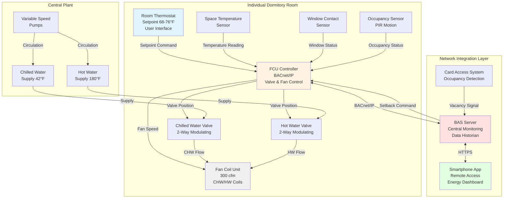

# Individual Room Control in Dormitory HVAC Systems

Individual room temperature control represents the most critical design parameter for student satisfaction in residence halls. Students expect control authority similar to residential apartments, yet institutional constraints require energy management strategies to prevent excessive consumption. The challenge lies in balancing occupant autonomy with operational efficiency across systems serving hundreds of rooms with diverse thermal preferences and unpredictable schedules.

ASHRAE 62.1 Section 6.2.7.1 mandates that occupants have control over thermal comfort in individual spaces, requiring adjustable setpoints with a minimum range of 68-76°F. However, practical dormitory applications typically implement wider lockout ranges (65-80°F) to accommodate extreme preferences while preventing energy waste from windows left open during heating or excessive cooling setpoints.

## Fan Coil Unit Configurations

Fan coil units (FCUs) provide the highest quality room-level control for dormitory applications, delivering filtered conditioned air with minimal noise and excellent energy efficiency when connected to central chilled water and hot water plants.

### Four-Pipe Fan Coil Systems

Four-pipe FCU systems maintain separate chilled water and hot water piping to each unit, enabling simultaneous heating and cooling availability throughout the building regardless of season.

**System components per room:**
- FCU cabinet with supply fan (200-400 cfm typical for 250-300 ft² rooms)
- Chilled water coil (2-3 rows, 8-10 FPI)
- Hot water coil (1-2 rows, 8-10 FPI)
- Supply and return chilled water piping (typically ¾-inch)
- Supply and return hot water piping (typically ¾-inch)
- Control valve on each coil (2-way modulating preferred)
- Thermostat with fan speed control (low/medium/high or continuous variable)

**Heating capacity calculation:**

$$Q_h = \dot{m}_{hw} \times c_p \times (T_{hw,in} - T_{hw,out})$$

For typical conditions (180°F supply, 160°F return, 2.5 gpm):

$$Q_h = 2.5 \times 60 \times 1 \times (180 - 160) = 3,000 \text{ BTU/hr}$$

This provides adequate heating for a 250 ft² room with design heat loss of 8,000-12,000 BTU/hr when combined with electric reheat or higher flow rates.

**Cooling capacity calculation:**

$$Q_c = \dot{m}_{chw} \times c_p \times (T_{chw,ret} - T_{chw,sup})$$

For typical conditions (42°F supply, 55°F return, 2.0 gpm):

$$Q_c = 2.0 \times 60 \times 1 \times (55 - 42) \times 1.0 = 1,560 \text{ BTU/hr sensible}$$

Total cooling including latent load typically reaches 9,000-12,000 BTU/hr for dormitory rooms with 2 occupants and moderate solar exposure.

**Advantages of four-pipe systems:**
- Immediate changeover between heating and cooling modes
- No seasonal switchover lag during shoulder seasons
- Individual room control independent of system-wide operating mode
- Excellent part-load efficiency through modulating control valves
- Lower operating noise than PTAC systems (NC 30-35 vs NC 45-50)

**Disadvantages:**
- High first cost ($3,500-5,000 per room including distribution piping)
- Complex piping distribution requiring coordination with structure
- Water leakage risk in occupied spaces
- Fire-rated penetration requirements at each floor
- Requires central plant infrastructure (chillers, boilers, pumps)

### Two-Pipe Fan Coil Systems

Two-pipe FCU systems utilize a single supply and return pipe pair that carries either chilled water or hot water depending on seasonal changeover schedule.

**Operating modes:**
- **Cooling mode** (typically May-October): 42-45°F chilled water throughout system
- **Heating mode** (typically November-April): 160-180°F hot water throughout system
- **Shoulder season transition**: Building-wide changeover based on outdoor temperature

**Changeover criteria:**

$$T_{changeover} = \frac{Q_{heat,rooms} - Q_{cool,rooms}}{U \times A_{total}}$$

Practically, changeover occurs when 7-day average outdoor temperature crosses 60-65°F threshold, or when substantial portions of building simultaneously require heating and cooling.

**Limitations:**
- Simultaneous heating and cooling demands cannot be satisfied during changeover periods
- South-facing rooms may require cooling while north-facing rooms require heating
- Student complaints increase during shoulder seasons (March-April, October-November)
- Occupants frequently open windows to compensate for incorrect seasonal mode

**Cost comparison to four-pipe:**
- First cost reduction: $800-1,200 per room (40% piping reduction)
- Annual complaint increase: 3-5× higher during shoulder seasons
- Energy penalty: 10-15% higher due to window opening behavior

**Recommendation:** Two-pipe systems are only appropriate for small residence halls (<50 rooms) in climates with distinct seasons and minimal shoulder season duration. Four-pipe systems provide superior comfort and lower life-cycle costs for buildings >100 rooms.

### Fan Coil Control Strategies

**Thermostat control configurations:**

1. **Fan speed + valve modulation**: Most common approach
   - Thermostat switches fan between low/medium/high speeds
   - Control valve modulates water flow proportionally to error
   - Provides good comfort with minimal complexity

2. **Continuous fan + valve modulation**: Premium comfort
   - Fan runs continuously at selected speed
   - Control valve modulates to maintain setpoint
   - Lowest temperature swing (±0.5°F achievable)
   - Higher energy consumption (fan runtime 8,760 hr/yr vs 4,000 hr/yr)

3. **On/off control**: Budget approach
   - Fan cycles on/off based on thermostat demand
   - Water flow valve opens fully when fan operates
   - Temperature swing ±2-3°F typical
   - Not recommended for dormitory applications (poor comfort)

**Fan power consumption:**

$$P_{fan} = \frac{\dot{V} \times \Delta P}{6356 \times \eta_{fan} \times \eta_{motor}}$$

For typical FCU (300 cfm, 0.5 in. w.c., 50% efficiency):

$$P_{fan} = \frac{300 \times 0.5}{6356 \times 0.50 \times 0.85} = 0.056 \text{ hp} = 42 \text{ W}$$

Annual energy consumption (50% duty cycle):

$$E_{annual} = 42 \text{ W} \times 8760 \text{ hr} \times 0.50 = 184 \text{ kWh/yr} = \$22/\text{yr at } \$0.12/\text{kWh}$$

## PTAC and PTHP Applications

Packaged Terminal Air Conditioners (PTAC) and Packaged Terminal Heat Pumps (PTHP) provide self-contained room conditioning with individual outdoor air connections through exterior walls.

### PTAC Configuration

**System components:**
- Wall sleeve through exterior wall (42-inch or 54-inch width typical)
- Self-contained unit with direct expansion cooling
- Electric resistance heating (3-5 kW typical)
- Outdoor air damper (manual or motorized)
- Individual room thermostat (integrated into unit or wall-mounted)
- 208-230V electrical connection

**Cooling performance:**

$$\text{EER} = \frac{Q_{cooling}}{P_{input}}$$

Typical PTAC performance at AHRI conditions (95°F outdoor, 80°F/67°F indoor):
- Cooling capacity: 9,000-15,000 BTU/hr
- EER: 9.8-11.5 (AHRI 310/380 minimum 9.8)
- Power input: 1,000-1,400 W

**Heating performance:**

Electric resistance heating provides 3.413 BTU/hr per watt input:

$$Q_{heat} = P_{heater} \times 3.413$$

For 5 kW heater:

$$Q_{heat} = 5,000 \times 3.413 = 17,065 \text{ BTU/hr}$$

This provides adequate heating for most dormitory rooms except extreme cold climates or highly glazed rooms.

**Operating cost comparison (per 250 ft² room, annual):**

Cooling season (1,000 hr/yr, 12,000 BTU/hr average):

$$E_{cool} = \frac{12,000 \times 1,000}{10 \times 1,000} = 1,200 \text{ kWh} = \$144/\text{yr}$$

Heating season (1,500 hr/yr, 8,000 BTU/hr average):

$$E_{heat} = \frac{8,000 \times 1,500}{3.413 \times 1,000} = 3,515 \text{ kWh} = \$422/\text{yr}$$

Total annual operating cost: $566/room (significantly higher than FCU or PTHP alternatives)

### PTHP Configuration

Packaged Terminal Heat Pumps provide both cooling and heating using refrigeration cycle with reversing valve, offering substantially lower heating costs than PTAC electric resistance.

**Heating COP:**

$$\text{COP}_{heating} = \frac{Q_{heating}}{P_{input}}$$

At AHRI conditions (47°F outdoor, 70°F indoor):
- Heating capacity: 10,000-14,000 BTU/hr
- COP: 3.0-3.8
- Power input: 900-1,200 W

**Low-temperature performance:**

Heat pump capacity degrades at low outdoor temperatures. At 17°F outdoor:
- Heating capacity: 6,000-9,000 BTU/hr (60% of 47°F rating)
- COP: 2.0-2.5
- Electric resistance backup engages when capacity insufficient

**Annual heating energy comparison:**

PTHP (COP 3.2 average, 70% of load, plus electric resistance 30%):

$$E_{heat,PTHP} = \frac{8,000 \times 1,500 \times 0.70}{3.2 \times 1,000} + \frac{8,000 \times 1,500 \times 0.30}{3.413 \times 1,000} = 2,625 + 1,055 = 3,680 \text{ kWh}$$

Annual cost: $442/yr (vs $422 for pure electric resistance in moderate climate)

In cold climates, PTHP savings increase significantly due to higher heat pump utilization percentage.

### PTAC/PTHP Control Limitations

**Outdoor air control challenges:**
- Manual dampers result in excessive outdoor air (occupant adjustment rarely optimized)
- Motorized dampers add cost and mechanical complexity
- Outdoor air enters unconditioned, creating comfort complaints during extreme weather
- No filtration on outdoor air intake (pollen, dust directly enter space)

**Noise concerns:**
- Compressor operation creates 45-55 dBA in occupied space
- Outdoor unit noise affects adjacent rooms and campus spaces
- Night operation disturbs sleeping occupants

**Maintenance requirements:**
- Filters require monthly replacement by occupants (rarely performed adequately)
- Unit replacement every 10-12 years (vs 20-25 years for FCU)
- Individual unit failures require emergency response (critical in extreme weather)

## Temperature Setpoint Limiting Strategies

Dormitory HVAC systems require setpoint limits to prevent energy waste while maintaining sufficient control authority for occupant comfort.

### Lockout Range Implementation

**Standard lockout ranges:**
- Minimum heating setpoint: 65°F (prevents excessive heating energy)
- Maximum cooling setpoint: 80°F (prevents excessive cooling energy)
- Adjustable range: 65-80°F (15°F span vs 8°F minimum per ASHRAE 62.1)

**Deadband enforcement:**

Energy codes require minimum 3-5°F deadband between heating and cooling setpoints to prevent simultaneous heating and cooling:

$$\Delta T_{deadband} = T_{sp,cooling} - T_{sp,heating} \geq 5°F$$

Example: If occupant sets heating to 72°F, cooling setpoint automatically limited to minimum 77°F.

**Energy savings from lockout ranges:**

Without lockouts (occupant sets 65°F cooling, 78°F heating):

$$E_{excess} = \frac{Q \times \Delta T_{excessive}}{COP} \times h_{operating}$$

For typical room requiring 15% additional runtime due to aggressive setpoints:

$$E_{excess} = 450 \text{ kWh/yr/room} = \$54/\text{yr/room}$$

Building-wide savings (200 rooms): $10,800/yr

### Adaptive Lockout Strategies

**Outdoor temperature reset:**

Adjust lockout limits based on outdoor conditions to reflect reduced heating/cooling loads:

$$T_{heat,min} = 65 + 0.5 \times (T_{oa} - 0) \text{ for } T_{oa} > 32°F$$

$$T_{cool,max} = 80 - 0.3 \times (95 - T_{oa}) \text{ for } T_{oa} < 95°F$$

This approach restricts extreme setpoints during mild weather when building loads are minimal.

**Time-of-day restrictions:**

Some institutions implement stricter limits during peak demand periods:
- Standard range (0000-0600, 0800-1700): 68-76°F
- Relaxed range (1700-2400, weekends): 65-80°F
- Rationale: Peak electrical demand occurs 1400-1800, coinciding with minimal dormitory occupancy

**Controversy:** Time-of-day restrictions generate significant student complaints when residents are present during restricted periods. Not recommended unless institution clearly communicates energy conservation goals and peak demand charges justify implementation.

## Occupancy-Based Setback Capabilities

Dormitory rooms experience vacancy during academic breaks (Thanksgiving, winter break, spring break, summer) and intermittent daytime vacancy during class periods.

### Break Period Setback

**Vacancy detection methods:**

1. **Manual shutdown**: Students adjust thermostat to "vacation mode" before departure
   - Reliability: 20-30% compliance typical
   - Method: Physical switch or app-based control

2. **Card access integration**: BAS monitors door access events
   - Reliability: 80-90% accuracy
   - Method: No card swipe for 48 hours triggers vacancy mode

3. **Occupancy sensors**: PIR or ultrasonic sensors detect motion
   - Reliability: 60-70% accuracy (false positives from curtain movement, etc.)
   - Method: No motion for 24 hours triggers vacancy mode

**Setback strategies:**

Winter break setback (68°F normal heating → 55°F setback):

$$Q_{heat,setback} = U \times A \times (T_{sp,setback} - T_{oa})$$

Energy savings per room over 3-week break:

$$E_{saved} = \frac{(Q_{68°F} - Q_{55°F}) \times h_{break}}{COP_{heating}}$$

For typical room with 800 BTU/hr/°F UA and average 30°F outdoor temperature:

$$Q_{reduction} = 800 \times (68-30) - 800 \times (55-30) = 30,400 - 20,000 = 10,400 \text{ BTU/hr}$$

$$E_{saved} = \frac{10,400 \times 504 \text{ hr}}{3.2 \times 1,000} = 1,638 \text{ kWh per 3-week break}$$

At $0.12/kWh: $197 per room per break

Building-wide (200 rooms): $39,400 per break

**Critical consideration:** Prevent pipe freezing in perimeter rooms during setback:
- Minimum setpoint: 55°F for freeze protection
- Monitor space temperature with low-temperature alarms
- Maintain air circulation (fan auto mode) to prevent stratification

### Daily Occupancy Setback

**Class schedule integration:**

Some advanced systems integrate with class schedules to implement temporary setback during likely vacant periods:
- Weekdays 0900-1700: Assume room vacant if no override
- Setback to 65°F heating / 78°F cooling
- Occupancy sensor override returns to normal setpoint within 5 minutes

**Energy savings potential:**

Assume 40% of rooms vacant during typical weekday class hours (8 hr/day × 5 days/week = 40 hr/week):

$$E_{saved,weekly} = \frac{Q_{reduction} \times 40 \text{ hr} \times 0.40 \times N_{rooms}}{COP}$$

For 200-room building with 2,000 BTU/hr average load reduction:

$$E_{saved,weekly} = \frac{2,000 \times 40 \times 0.40 \times 200}{3.5 \times 1,000} = 1,829 \text{ kWh/week}$$

Annual savings: 1,829 × 30 weeks = 54,870 kWh = $6,584/yr

**Student acceptance concerns:**

Daily occupancy setback generates significant complaints:
- Students with irregular schedules arrive to uncomfortable rooms
- Override process perceived as inconvenient
- "Big brother" concerns regarding occupancy monitoring

**Recommendation:** Implement only for extended breaks (>3 days). Daily setback creates more dissatisfaction than energy savings justify.

## Network Integration for Energy Management

### Building Automation System Integration

**Communication protocols:**

1. **BACnet**: Industry standard for HVAC device communication
   - BACnet/IP for network backbone
   - BACnet MS/TP for device-level communication
   - Supports FCU controllers, thermostats, sensors

2. **LonWorks**: Alternative protocol for distributed control
   - Free topology networking
   - Common in older installations

3. **Modbus TCP**: Simple protocol for basic monitoring
   - Limited control capabilities
   - Suitable for data acquisition only

**FCU controller integration:**

Each FCU controller exposes standard BACnet objects:
- Analog Inputs: Space temperature, valve position, supply air temperature
- Analog Outputs: Heating valve command, cooling valve command, fan speed
- Binary Inputs: Occupancy status, window contact status
- Analog Values: Heating setpoint, cooling setpoint, deadband

**Central monitoring capabilities:**

BAS workstation provides:
- Real-time temperature and setpoint display for all rooms
- Alarm notification for temperature excursions (>85°F or <60°F)
- Trend data logging (15-minute intervals typical)
- Batch setpoint adjustment during breaks
- Energy consumption reporting by zone or building

### Thermostat Selection for Network Integration

**Wired communicating thermostats:**
- Physical connection to FCU controller or BAS network
- Most reliable communication
- Higher installation cost (wiring labor)
- Typical cost: $150-300 per thermostat

**Wireless communicating thermostats:**
- Wi-Fi or ZigBee communication to gateway
- Lower installation cost (no control wiring)
- Battery replacement requirement (annual)
- Network reliability concerns in dense deployments
- Typical cost: $120-200 per thermostat

**Smartphone app integration:**

Modern thermostat systems offer mobile apps enabling:
- Remote setpoint adjustment
- Schedule programming
- Energy consumption feedback
- Maintenance request submission
- Push notifications for temperature alarms

**Student engagement benefits:**
- Real-time energy consumption visibility encourages conservation
- Convenience features increase system acceptance
- Remote adjustment reduces temperature complaints

### Demand Response Integration

**Utility demand response programs:**

Many utilities offer financial incentives for load curtailment during peak demand periods (typically summer afternoons 1400-1800).

**Dormitory DR strategies:**

1. **Setpoint adjustment**: Raise cooling setpoints by 2-4°F during DR events
   - Load reduction: 15-25% per room
   - Student impact: Minimal (gradual temperature rise)

2. **Pre-cooling**: Lower setpoints 2 hours before DR event
   - Utilizes thermal mass to maintain comfort during event
   - Load reduction: 30-40% during event
   - Energy neutral over 24-hour period

**Load reduction calculation:**

200-room building with 1 ton average cooling load per room:

$$Q_{reduction} = 200 \text{ rooms} \times 12,000 \frac{\text{BTU}}{\text{hr}} \times 0.20 = 480,000 \frac{\text{BTU}}{\text{hr}} = 40 \text{ tons}$$

$$kW_{reduction} = \frac{40 \text{ tons} \times 12,000}{COP \times 3.413 \times 1,000} = \frac{480,000}{4.5 \times 3,413} = 31 \text{ kW}$$

Annual incentive (assuming 20 DR events at $1.50/kW): 31 kW × 20 events × $1.50 = $930/yr

## Room-Level HVAC Control System Comparison

| Control Parameter | 4-Pipe FCU | 2-Pipe FCU | PTHP | PTAC |
|------------------|-----------|-----------|------|------|
| **First cost** ($/room) | $4,500 | $3,200 | $2,800 | $2,200 |
| **Operating cost** ($/room/yr) | $210 | $225 | $380 | $566 |
| **Temperature control accuracy** | ±0.5°F | ±1.0°F | ±1.5°F | ±2.0°F |
| **Noise level** | NC 30-35 | NC 30-35 | NC 40-45 | NC 45-50 |
| **Setpoint range** (lockout capable) | 60-85°F | 60-85°F | 65-80°F | 65-80°F |
| **Deadband enforcement** | Yes (BAS) | Yes (BAS) | Limited | Limited |
| **Occupancy setback** | Yes (BAS) | Yes (BAS) | No | No |
| **Network integration** | Full BACnet | Full BACnet | Limited | None |
| **Outdoor air quality** | Filtered, conditioned | Filtered, conditioned | Unfiltered | Unfiltered |
| **Shoulder season performance** | Excellent | Poor | Good | Good |
| **Maintenance frequency** | 2×/year | 2×/year | 2×/year | 4×/year |
| **Equipment life** | 20-25 years | 20-25 years | 12-15 years | 10-12 years |
| **Life-cycle cost (20 yr)** | $7,120 | $7,680 | $9,420 | $13,520 |

**System selection recommendations:**

- **4-Pipe FCU**: Large buildings (>100 rooms) with central plant, institutions prioritizing comfort and life-cycle cost
- **2-Pipe FCU**: Small buildings (<50 rooms) in climates with distinct seasons, lower first cost priority
- **PTHP**: Retrofit applications, buildings without central plant infrastructure, moderate climate zones
- **PTAC**: Budget-constrained projects, mild climates, small buildings where operating cost is not prioritized

## Dormitory Room HVAC Control System Architecture

## Conclusion

Individual room control represents the most critical factor for student satisfaction in dormitory HVAC systems, yet energy management strategies are essential to prevent excessive consumption across hundreds of independently controlled spaces. Four-pipe fan coil systems provide optimal performance through simultaneous heating and cooling availability, quiet operation, and full BAS integration enabling occupancy-based setback during breaks. Setpoint lockout ranges of 65-80°F balance individual comfort preferences with institutional energy goals, while deadband enforcement prevents wasteful simultaneous heating and cooling. Network integration through BACnet communication enables central monitoring, automated vacation setback generating $197 per room per break in savings, and demand response participation. PTAC systems remain viable for budget-constrained projects despite 2.5× higher operating costs, but lack of network integration limits energy management capabilities. Smartphone app integration enhances student engagement and system acceptance while providing real-time energy feedback supporting conservation behaviors.

