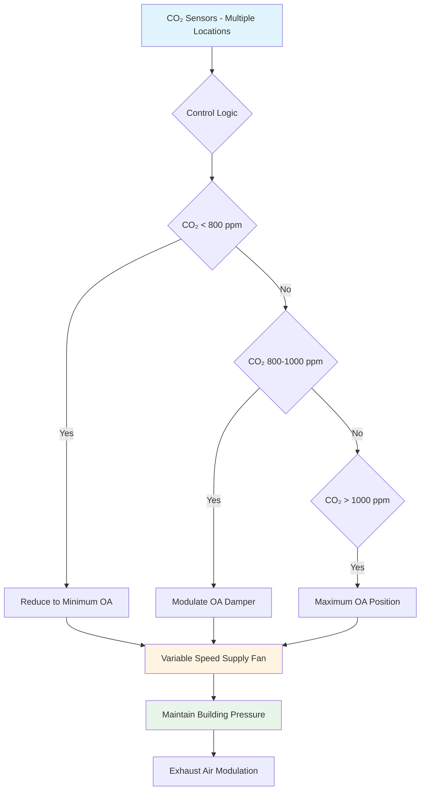
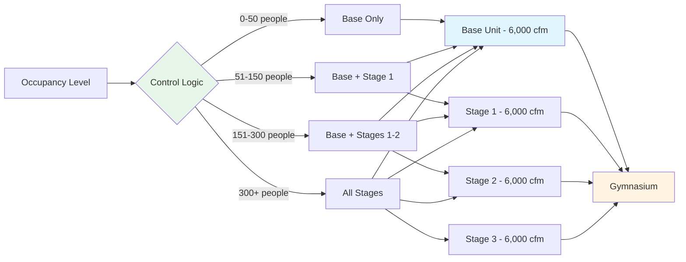

Gymnasiums present unique HVAC challenges due to extreme occupancy variations. A typical school gymnasium might serve 30 students during a morning PE class, then host 800 spectators for an evening basketball game. This 25:1 occupancy range creates significant design complexity that demands intelligent control strategies and proper equipment selection.

## Occupancy Load Characteristics

### Typical Occupancy Scenarios

Gymnasium occupancy patterns vary dramatically throughout the day and week:

| Scenario | Occupant Count | Sensible Load | Latent Load | Ventilation Requirement |
|----------|----------------|---------------|-------------|------------------------|
| Empty/Storage | 0-5 | 5-10 Btu/hr·ft² | Minimal | 0.06 cfm/ft² |
| PE Class (30 students) | 30-40 | 15-25 Btu/hr·ft² | High | 900-1,200 cfm |
| Practice (50 athletes) | 50-70 | 25-40 Btu/hr·ft² | Very High | 1,500-2,100 cfm |
| Game (spectators) | 400-1,000 | 60-90 Btu/hr·ft² | Moderate | 12,000-30,000 cfm |
| Assembly/Event | 500-1,500 | 50-80 Btu/hr·ft² | Low-Moderate | 15,000-45,000 cfm |

### Metabolic Heat Generation

Athletic activities generate substantially higher metabolic heat than sedentary spectators:

- **Sedentary spectators**: 400 Btu/hr total (250 sensible, 150 latent)
- **Light activity (walking)**: 550 Btu/hr total (250 sensible, 300 latent)
- **Moderate exercise (PE class)**: 850 Btu/hr total (315 sensible, 535 latent)
- **Heavy exercise (basketball, volleyball)**: 1,450 Btu/hr total (580 sensible, 870 latent)

The latent heat fraction increases significantly with activity intensity, ranging from 38% for spectators to 60% for heavy exercise. This affects both ventilation requirements and dehumidification capacity.

## ASHRAE 62.1 Ventilation Requirements

Per ASHRAE 62.1, gymnasiums require ventilation rates based on both area and occupancy:

**Breathing Zone Outdoor Airflow (Vbz) = Ra × Az + Rp × Pz**

Where:
- Ra = 0.06 cfm/ft² (area component)
- Rp = 30 cfm/person (people component for gyms with spectator seating)
- Rp = 20 cfm/person (for exercise rooms without spectator seating)
- Az = floor area (ft²)
- Pz = zone population

For a 10,000 ft² gymnasium:
- **Minimum (unoccupied)**: 600 cfm (area component only)
- **30 students (PE class)**: 600 + (20 × 30) = 1,200 cfm
- **800 spectators (game)**: 24,600 cfm (600 + 30 × 800)

This 20:1 ventilation range makes constant-volume systems energy-inefficient.

## Demand-Controlled Ventilation Strategies

### CO₂-Based Control

Demand-controlled ventilation (DCV) using CO₂ sensors provides the most effective approach for managing variable occupancy:

**Implementation Requirements:**

1. **Sensor Placement**: Minimum three sensors in breathing zone (4-6 ft above floor), distributed to avoid dead spots
2. **Setpoint Strategy**: 800-1,000 ppm range with proportional control
3. **Minimum Position**: Always maintain area component (0.06 cfm/ft²)
4. **Response Time**: 2-5 minute averaging to prevent hunting
5. **Override Capability**: Manual high-speed override for rapid occupancy changes

### Scheduling-Based Pre-Occupancy

Integration with facility scheduling systems enables anticipatory ventilation:

```mermaid
gantt
    title Daily Gymnasium Ventilation Schedule
    dateFormat HH:mm
    axisFormat %H:%M

    section Ventilation Mode
    Unoccupied (Min OA)     :done, unoc1, 00:00, 07:00
    Pre-Purge (50% OA)      :active, prepurge1, 07:00, 08:00
    PE Class 1 (DCV Active) :crit, pe1, 08:00, 09:00
    Unoccupied (Min OA)     :done, unoc2, 09:00, 10:00
    PE Class 2 (DCV Active) :crit, pe2, 10:00, 11:00
    Unoccupied (Min OA)     :done, unoc3, 11:00, 15:00
    Pre-Event (75% OA)      :active, preevent, 15:00, 16:00
    Game Event (DCV Active) :crit, game, 16:00, 18:00
    Post-Purge (100% OA)    :active, postpurge, 18:00, 19:00
    Unoccupied (Min OA)     :done, unoc4, 19:00, 24:00
```

**Pre-occupancy strategies:**

- **30-60 minute pre-purge** before scheduled high-occupancy events
- **100% outdoor air flush** for 15-30 minutes post-event to remove accumulated contaminants
- **Setback to minimum OA** during verified unoccupied periods
- **Temperature pre-conditioning** coordinated with ventilation pre-purge

## Equipment Selection for Variable Loads

### Variable Air Volume Systems

VAV systems with variable-speed drives provide optimal energy performance:

**Fan Selection Criteria:**
- Design for peak occupancy (games/events)
- Select motors for 40-50% minimum speed capability
- Use backward-curved or airfoil fans for wide operating range
- Implement static pressure reset based on damper positions

**Energy Savings Calculation:**

At 50% airflow, fan power drops to approximately 12.5% of full load (cube law relationship):

Power₂ / Power₁ = (CFM₂ / CFM₁)³

For a 30,000 cfm design serving a gymnasium:
- **Full load** (800 occupants): 30,000 cfm = 30 hp
- **PE class** (30 students): 1,200 cfm (4%) = 0.008 hp
- **Unoccupied**: 600 cfm (2%) = 0.0003 hp

Annual operating hours weighted average shows 75-85% fan energy reduction versus constant volume operation.

### Modular Approach for Large Gymnasiums

For facilities exceeding 15,000 ft², consider modular equipment staging:

## Control Sequences for Occupancy Transitions

### Rapid Occupancy Increase Response

When CO₂ levels rise above setpoint:

1. **Immediate**: Outdoor air damper modulates to 100% open
2. **0-30 seconds**: Supply fan ramps to design speed
3. **30-60 seconds**: Return/exhaust dampers modulate to maintain building pressure
4. **60+ seconds**: Cooling/heating adjusts to maintain setpoint

### Post-Event Purge Cycle

After high-occupancy events:

1. **Event end trigger**: Occupancy sensor or manual input
2. **Maximum ventilation**: 100% outdoor air for 20-30 minutes
3. **Temperature override**: Allow 5°F drift during purge
4. **Verification**: CO₂ must drop below 600 ppm before returning to minimum OA
5. **System shutdown**: After purge completion and temperature recovery

## Energy Efficiency Considerations

### Economizer Integration

Free cooling through economizer operation significantly reduces energy consumption during shoulder seasons:

- **Dry-bulb economizer**: Appropriate for most climates, lockout above 70°F outdoor
- **Enthalpy economizer**: Preferred in humid climates, prevents latent load introduction
- **Integrated control**: Coordinate with DCV to maximize free cooling during high-occupancy periods

### Heat Recovery

Energy recovery ventilators (ERVs) become economically viable for gymnasiums with consistent high-occupancy schedules:

**Payback Analysis:**
- Gymnasiums operating >2,000 hours/year at >50% design occupancy
- Minimum 50% effectiveness sensible recovery
- Total effectiveness >60% for latent recovery in humid climates
- Typical payback: 4-7 years in northern climates, 6-10 years in mild climates

### Destratification

High ceilings (20-40 ft typical) create significant stratification during heating:

- **Ceiling fans**: 10-15°F reduction in ceiling-to-floor temperature differential
- **Energy savings**: 20-30% heating energy reduction
- **Summer operation**: Reverse to pull cool air up, reducing cooling load on spectators
- **Controls integration**: Activate based on space temperature differential sensors

## Design Recommendations

1. **Always implement DCV** with CO₂ sensors for gymnasiums serving multiple functions
2. **Design for peak load** but select equipment optimized for part-load operation
3. **Install minimum three CO₂ sensors** distributed throughout breathing zone
4. **Integrate scheduling system** with HVAC controls for anticipatory ventilation
5. **Provide manual override** capability for unscheduled events
6. **Include post-event purge** sequences in control programming
7. **Consider dedicated dehumidification** separate from sensible cooling to handle variable latent loads
8. **Design for 0.02-0.05 in. w.c. positive pressure** to prevent infiltration during low occupancy

Proper management of occupancy variation transforms gymnasium HVAC from energy-intensive to highly efficient while maintaining superior indoor air quality across all operating conditions.
