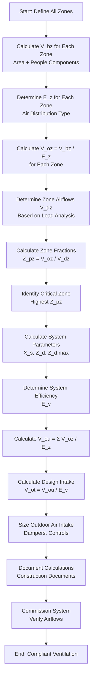

ASHRAE Standard 62.1, *Ventilation for Acceptable Indoor Air Quality*, establishes minimum ventilation rates and other requirements for educational facilities. Proper implementation ensures adequate outdoor air delivery while maintaining energy efficiency and documenting compliance with building codes.

## Ventilation Rate Procedure

The Ventilation Rate Procedure represents the prescriptive method for determining outdoor air requirements based on occupancy and space function. This approach provides a straightforward calculation methodology applicable to most school applications.

**Breathing Zone Outdoor Airflow**

The breathing zone outdoor airflow $V_{bz}$ combines area-based and people-based components:

$$V_{bz} = R_p \times P_z + R_a \times A_z$$

Where:
- $V_{bz}$ = breathing zone outdoor airflow (cfm)
- $R_p$ = outdoor air rate per person (cfm/person)
- $P_z$ = zone population (people)
- $R_a$ = outdoor air rate per unit area (cfm/ft²)
- $A_z$ = zone floor area (ft²)

**System Outdoor Air Intake**

The uncorrected outdoor air intake flow $V_{ou}$ accounts for multiple zones:

$$V_{ou} = \sum_{all zones} \frac{V_{oz}}{E_z}$$

Where:
- $V_{ou}$ = uncorrected outdoor air intake (cfm)
- $V_{oz}$ = zone outdoor airflow (cfm)
- $E_z$ = zone air distribution effectiveness

The design outdoor air intake $V_{ot}$ incorporates system ventilation efficiency:

$$V_{ot} = \frac{V_{ou}}{E_v}$$

Where:
- $V_{ot}$ = design outdoor air intake flow (cfm)
- $E_v$ = system ventilation efficiency

## Area-Based and People-Based Requirements

ASHRAE 62.1 Table 6.2.2.1 specifies minimum ventilation rates for educational occupancies combining both components to address baseline contaminant generation from materials and building components (area-based) plus occupant-related bioeffluents (people-based).

| Space Type | $R_p$ (cfm/person) | $R_a$ (cfm/ft²) | Default Occupancy (people/1000 ft²) |
|------------|-------------------|-----------------|-------------------------------------|
| Classrooms (ages 5-8) | 10 | 0.12 | 25 |
| Classrooms (ages 9+) | 10 | 0.12 | 35 |
| Lecture Classroom | 7.5 | 0.06 | 65 |
| Lecture Hall (fixed seats) | 7.5 | 0.06 | 150 |
| Art Classroom | 10 | 0.18 | 20 |
| Science Laboratories | 10 | 0.18 | 25 |
| Music/Theater/Dance | 10 | 0.06 | 35 |
| Multi-use Assembly | 7.5 | 0.06 | 100 |
| Cafeteria/Fast-food Dining | 7.5 | 0.18 | 100 |
| Corridor | - | 0.06 | - |
| Media Center | 10 | 0.12 | 25 |
| Computer Lab | 10 | 0.12 | 25 |

**Design Occupancy Determination**

Designers may use actual anticipated occupancy rather than default values when documented through architectural programming. Higher occupancy density requires proportionally greater outdoor air delivery.

## Zone Air Distribution Effectiveness

The zone air distribution effectiveness $E_z$ accounts for how effectively outdoor air reaches the breathing zone. Standard mixing systems achieve $E_z = 1.0$, while displacement ventilation or overhead supply can achieve higher values.

**Standard Values:**
- Ceiling supply of cool air: $E_z = 1.0$
- Ceiling supply of warm air, floor return: $E_z = 1.0$
- Floor supply of cool air, ceiling return: $E_z = 1.0$
- Floor supply of warm air, ceiling return: $E_z = 1.2$ (displacement ventilation)
- Underfloor air distribution (UFAD): $E_z = 1.2$

The zone outdoor airflow requirement becomes:

$$V_{oz} = \frac{V_{bz}}{E_z}$$

Higher effectiveness factors reduce required outdoor air delivery, yielding energy savings.

## System Ventilation Efficiency

For multiple-zone recirculating systems, the system ventilation efficiency $E_v$ prevents under-ventilation of critical zones. The calculation requires determining the critical zone—the zone with the highest outdoor air fraction.

**Zone Outdoor Air Fraction:**

$$Z_{pz} = \frac{V_{oz}}{V_{dz}}$$

Where:
- $Z_{pz}$ = zone outdoor air fraction
- $V_{dz}$ = zone primary airflow (cfm)

**System Ventilation Efficiency:**

For single-zone systems: $E_v = 1.0$

For multiple-zone recirculating systems:

$$E_v = \frac{1 + X_s - Z_d}{1 + X_s - Z_{d,max}}$$

Where:
- $X_s$ = uncorrected system outdoor air fraction
- $Z_d$ = outdoor air fraction for ventilation-critical zone
- $Z_{d,max}$ = maximum $Z_d$ among all zones

The calculation ensures sufficient outdoor air delivery to all zones regardless of discharge airflow variations.

## Multiple-Zone Recirculating System Requirements

Variable air volume (VAV) systems serving multiple zones with different outdoor air requirements demand careful analysis. The system must maintain adequate outdoor air delivery under all operating conditions.

**Key Considerations:**

1. **Dynamic reset capability**: Outdoor air damper position adjusts as zone airflows vary
2. **Critical zone tracking**: System identifies which zone requires highest outdoor air fraction
3. **Minimum primary air**: VAV boxes maintain minimum flows supporting ventilation requirements
4. **Demand-controlled ventilation**: CO₂ sensors modulate outdoor air based on actual occupancy

**Calculation Sequence:**

## Documentation and Verification Requirements

ASHRAE 62.1 Section 4.6 mandates documentation demonstrating compliance. Design documents must include:

**Design Phase Documentation:**

- Calculation methodology (Ventilation Rate Procedure or Indoor Air Quality Procedure)
- Occupancy assumptions for each space type
- Breathing zone outdoor airflow calculations
- Zone air distribution effectiveness values with justification
- System ventilation efficiency calculations for multiple-zone systems
- Outdoor air intake flow requirements
- Equipment capacities and specifications
- Control sequences ensuring continuous compliance

**Construction Phase Verification:**

- Submittal reviews confirming specified equipment
- Installation verification for outdoor air measurement devices
- Functional performance testing of control sequences
- Airflow measurements at representative zones
- Outdoor air intake flow measurement and adjustment

**Commissioning Requirements:**

Functional testing confirms:

1. Outdoor air dampers achieve minimum and design positions
2. Airflow measurement stations provide accurate readings
3. Control systems maintain minimum outdoor air under all loads
4. VAV boxes maintain minimum flows supporting ventilation
5. Demand-controlled ventilation systems respond appropriately
6. System achieves calculated outdoor air intake flow $V_{ot}$

**Operations and Maintenance:**

Provide building operators with:
- Design outdoor air flow rates and setpoints
- Measurement and adjustment procedures
- Filter replacement schedules maintaining design pressure drops
- Annual verification testing protocols
- Ventilation system operating manual

Proper documentation creates a verifiable chain demonstrating code compliance, supports building permit approval, and enables long-term system performance maintenance ensuring healthy indoor environments for students and staff.

## Practical Application Example

**Classroom Calculation:**

Given:
- Elementary classroom: 900 ft²
- Design occupancy: 25 students + 1 teacher = 26 people
- Ceiling supply mixing system: $E_z = 1.0$
- VAV system primary airflow: 800 cfm at design

Breathing zone outdoor airflow:

$$V_{bz} = (10 \text{ cfm/person} \times 26) + (0.12 \text{ cfm/ft}^2 \times 900) = 260 + 108 = 368 \text{ cfm}$$

Zone outdoor airflow:

$$V_{oz} = \frac{368}{1.0} = 368 \text{ cfm}$$

Zone outdoor air fraction:

$$Z_{pz} = \frac{368}{800} = 0.46$$

This 46% outdoor air fraction represents substantial ventilation, emphasizing the importance of energy recovery in school applications. Multiple classroom zones with similar fractions would establish system efficiency values and total outdoor air intake requirements through the complete calculation sequence.
