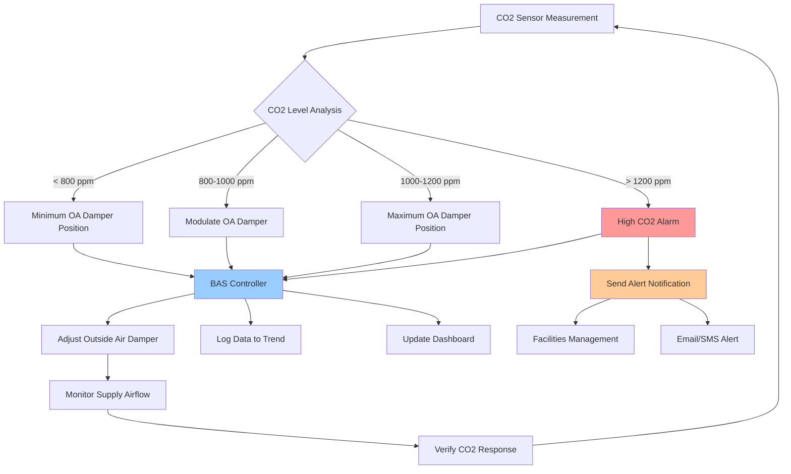

Carbon dioxide monitoring has become a critical component of indoor air quality management in educational facilities. CO2 levels serve as a reliable proxy for occupancy and ventilation effectiveness, making CO2-based demand controlled ventilation (DCV) an essential strategy for maintaining healthy learning environments while optimizing energy consumption.

## CO2 Sensor Technology

### NDIR Sensor Fundamentals

Non-dispersive infrared (NDIR) sensors represent the industry standard for CO2 measurement in educational facilities. These sensors operate on the principle that CO2 molecules absorb infrared radiation at a specific wavelength (4.26 μm). The sensor measures the attenuation of infrared light passing through an air sample to determine CO2 concentration.

NDIR sensors offer several advantages:

- High accuracy and stability over time
- Minimal cross-sensitivity to other gases
- Long operational lifespan (10-15 years)
- No consumable components requiring replacement

### Accuracy Requirements

For school applications, CO2 sensors must meet stringent accuracy standards:

- **Accuracy**: ±50 ppm or ±3% of reading at 1000 ppm
- **Range**: 0-2000 ppm minimum (0-5000 ppm preferred)
- **Resolution**: 1 ppm minimum
- **Response time**: T90 < 60 seconds
- **Operating temperature**: 32-122°F (0-50°C)

Dual-wavelength NDIR sensors provide superior accuracy by compensating for aging of the infrared source and detector. These sensors use a reference wavelength where CO2 does not absorb, enabling automatic drift correction.

## Sensor Placement Guidelines

Proper sensor placement directly impacts measurement accuracy and system performance.

### Classroom Placement Strategy

**Wall-mounted sensors:**
- Install 3-5 feet above floor level (breathing zone height)
- Position away from doors, windows, and supply diffusers (minimum 6 feet)
- Avoid locations near exhaust grilles or return air paths
- Maintain minimum 3-foot clearance from building exterior walls
- Ensure unrestricted airflow around sensor

**Return air sensors:**
- Mount in main return duct serving the space
- Position minimum 3 duct diameters downstream of any elbows
- Install upstream of filtration or mixing points
- Provide adequate probe insertion depth (1/3 duct diameter minimum)

**Zone coverage:**
- One sensor per thermal zone for DCV applications
- Additional sensors for spaces exceeding 1000 ft²
- Separate sensors for areas with distinct occupancy patterns

## CO2 Setpoints for Demand Controlled Ventilation

Establishing appropriate CO2 setpoints balances indoor air quality, energy efficiency, and code compliance.

### Setpoint Selection

**Primary setpoint range**: 1000-1200 ppm above outdoor baseline

The relationship between CO2 concentration and ventilation rate follows:

$$V = \frac{N \times G}{C_i - C_o}$$

Where:
- $V$ = required ventilation rate (CFM)
- $N$ = number of occupants
- $G$ = CO2 generation rate per person (~0.31 CFM at sedentary activity)
- $C_i$ = indoor CO2 concentration (ppm)
- $C_o$ = outdoor CO2 concentration (typically 400-450 ppm)

For a classroom with 25 students at 1000 ppm indoor concentration:

$$V = \frac{25 \times 0.31}{(1000 - 450) \times 10^{-6}} = 14,091 \text{ CFM}$$

This simplifies to approximately 15 CFM per person, aligning with ASHRAE Standard 62.1 requirements.

### Control Strategy

**Staged ventilation response:**

1. **Below 800 ppm**: Minimum ventilation rate
2. **800-1000 ppm**: Linear increase in outdoor air
3. **1000-1200 ppm**: Maximum ventilation rate maintained
4. **Above 1200 ppm**: High-CO2 alarm condition

Implement deadband control (±25 ppm) to prevent hunting and excessive damper cycling.

## Building Automation System Integration

### Communication Protocols

Modern CO2 sensors integrate with building automation systems through:

- **BACnet**: IP or MS/TP for standardized interoperability
- **Modbus**: RTU or TCP for legacy system compatibility
- **0-10 VDC analog**: Simple signal transmission for basic applications
- **4-20 mA current loop**: Industrial-grade noise immunity

### Control Sequence

## Dashboard and Alerting Capabilities

### Real-Time Monitoring

Effective CO2 monitoring systems provide comprehensive visualization:

**Dashboard features:**
- Live CO2 readings for all monitored spaces
- Color-coded status indicators (green/yellow/red)
- Historical trending (hourly, daily, weekly)
- Peak occupancy identification
- Ventilation system operational status
- Energy consumption correlation

### Alert Configuration

**Alarm thresholds:**

| Alert Level | CO2 Concentration | Response Action |
|-------------|-------------------|-----------------|
| Normal | < 1000 ppm | Standard operation |
| Advisory | 1000-1200 ppm | Log event, monitor trend |
| Warning | 1200-1500 ppm | Notify facilities staff |
| Critical | > 1500 ppm | Immediate response required |

**Notification methods:**
- Email alerts to facilities management
- SMS messaging for critical alarms
- Integration with work order systems
- Historical alarm logs for analysis

## CO2 Levels and School IAQ Implications

| CO2 Level (ppm) | Ventilation Status | IAQ Implications | Recommended Action |
|-----------------|-------------------|------------------|-------------------|
| 400-600 | Excellent | Outdoor baseline, well-ventilated | Maintain current operation |
| 600-800 | Good | Adequate ventilation | Continue monitoring |
| 800-1000 | Acceptable | Meets minimum standards | Acceptable for occupied periods |
| 1000-1200 | Marginal | Approaching inadequate ventilation | Increase outdoor air intake |
| 1200-1500 | Poor | Insufficient ventilation | Immediate ventilation increase |
| 1500-2000 | Very Poor | Significant air quality degradation | Emergency ventilation response |
| > 2000 | Unacceptable | Health concerns likely | Evacuate and investigate system |

## Calibration and Maintenance Requirements

### Calibration Protocols

**Factory calibration**: All NDIR sensors receive initial calibration against known gas concentrations traceable to NIST standards.

**Field calibration frequency:**
- Annual calibration for critical applications
- Biennial calibration for standard installations
- Verification after any system maintenance affecting airflow

**Calibration methods:**

1. **Single-point calibration**: Expose sensor to known outdoor air (assumed 400 ppm)
2. **Two-point calibration**: Use zero gas (nitrogen) and span gas (1000 ppm CO2)
3. **Automatic baseline correction (ABC)**: Algorithm assumes periodic exposure to outdoor air levels

### Maintenance Schedule

**Monthly:**
- Visual inspection of sensor housing
- Verify proper mounting and airflow access
- Review trending data for anomalies

**Quarterly:**
- Clean sensor optics and housing exterior
- Test alarm functionality
- Verify BAS communication

**Annually:**
- Perform calibration verification
- Replace sensors exceeding drift specifications (>100 ppm)
- Update firmware and software as needed
- Document all maintenance activities

**Filter maintenance correlation**: Clean or replace air filters on the same schedule as CO2 sensor maintenance to ensure accurate readings and optimal system performance.

### Preventive Measures

- Protect sensors from direct sunlight and thermal radiation
- Shield from cleaning chemicals and aerosols
- Maintain stable electrical power supply
- Document baseline outdoor CO2 concentrations for reference
- Establish sensor replacement budget on 12-15 year lifecycle

Proper CO2 monitoring enables schools to maintain healthy indoor environments while capturing significant energy savings through optimized ventilation control. When integrated with comprehensive building automation systems, CO2 sensors provide the data foundation for evidence-based facility management and continuous improvement of educational facility indoor air quality.
