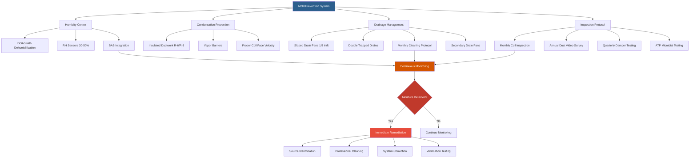

Mold growth in educational facilities presents serious health risks and learning disruptions. Effective mold prevention requires integrated HVAC design, operational protocols, and maintenance procedures targeting moisture control at all system components and building interfaces.

## Humidity Control Targets

Maintain relative humidity below 60% RH to prevent mold proliferation, with optimal range 30-50% RH for educational occupancy. The relationship between temperature and absolute humidity determines condensation risk:

$$\text{Dew Point} = T - \frac{100 - RH}{5}$$

Where $T$ is dry bulb temperature (°C) and $RH$ is relative humidity (%). Surfaces below dew point temperature accumulate condensation, creating ideal conditions for mold colonization.

For precise humidity control during varying occupancy:

$$\dot{m}_w = \frac{\dot{Q}_l}{h_{fg}}$$

Where $\dot{m}_w$ is moisture removal rate (lb/hr), $\dot{Q}_l$ is latent cooling load (Btu/hr), and $h_{fg}$ is latent heat of vaporization (1050 Btu/lb at standard conditions).

### Humidity Control Equipment

- **Dedicated outdoor air systems (DOAS)** with enthalpy wheels or desiccant dehumidification
- **Chilled water systems** with deep coil leaving temperatures (48-52°F supply air)
- **Direct expansion systems** with enhanced dehumidification modes
- **Continuous monitoring** with building automation system integration

## Condensation Prevention

Cooling coils and ductwork require thermal insulation and proper system operation to prevent surface condensation.

### Cooling Coil Design

- **Face velocity**: Maximum 500 fpm to ensure adequate moisture removal
- **Coil leaving temperature**: 52-55°F to balance dehumidification and energy efficiency
- **Fin spacing**: 8-10 fins per inch for optimal moisture drainage
- **Slope**: Minimum 1/8 inch per foot toward drain connections

Surface temperature differential determines condensation risk:

$$q = U \cdot A \cdot (T_s - T_{dp})$$

Where $q$ is heat transfer rate, $U$ is overall heat transfer coefficient, $A$ is surface area, $T_s$ is surface temperature, and $T_{dp}$ is dew point temperature. When $T_s < T_{dp}$, condensation occurs.

### Ductwork Insulation

All supply ductwork in unconditioned spaces requires insulation R-value minimum:

| Space Condition | Minimum R-Value | Vapor Barrier |
|----------------|-----------------|---------------|
| Unconditioned mechanical rooms | R-6 | Required |
| Attics and crawl spaces | R-8 | Required |
| Outdoor installation | R-8 | Required |
| Below-grade locations | R-6 | Required |

External insulation with vapor barrier facing away from duct surface prevents moisture migration into insulation material.

## Drainage and Drain Pan Maintenance

Proper drainage prevents standing water accumulation in drain pans and coil sections.

### Drain Pan Design Requirements

- **Material**: Stainless steel (Type 316) or corrosion-resistant polymer
- **Slope**: Minimum 1/8 inch per foot toward drain outlet
- **Double trapped drains**: P-traps with 3-4 inch water seal depth
- **Access panels**: Minimum 12" × 12" for inspection and cleaning
- **Secondary drain pans**: Required beneath all indoor air handlers

Drain line sizing follows:

$$D = 0.593 \sqrt[3]{\dot{V}}$$

Where $D$ is drain diameter (inches) and $\dot{V}$ is condensate flow rate (gpm). Minimum 3/4 inch diameter for all primary drains.

### Maintenance Protocol

- **Monthly inspection** during cooling season
- **Quarterly cleaning** with EPA-registered biocide
- **Drain line flushing** with compressed air or water jet
- **Trap seal verification** - refill during heating season
- **Microbial growth testing** if visible contamination present

## Air Handler and Ductwork Inspection

Regular inspection identifies moisture accumulation and microbial contamination before extensive colonization.

### Inspection Frequency

| Component | Inspection Interval | Documentation |
|-----------|-------------------|---------------|
| Cooling coils | Monthly (cooling season) | Visual + photos |
| Drain pans | Monthly (cooling season) | Condition report |
| Filter sections | Monthly | Pressure drop log |
| Ductwork interiors | Annually | Video inspection |
| Outdoor air dampers | Quarterly | Function test |

### Inspection Criteria

- **Visual contamination**: Visible mold, slime, or biological growth
- **Odor**: Musty or biological odors at supply registers
- **Moisture**: Standing water, wet insulation, or surface condensation
- **Biological indicators**: ATP testing for microbial load assessment

## Building Envelope Moisture Management

HVAC systems interact with building envelope performance to prevent bulk water intrusion and vapor diffusion.

### Critical Control Points

- **Roof drainage**: Ensure positive drainage away from air handlers and ductwork
- **Foundation waterproofing**: Prevent groundwater migration into mechanical spaces
- **Window flashing**: Proper installation prevents water intrusion near terminal units
- **Vapor retarders**: Position according to climate zone requirements

Vapor diffusion through assemblies follows:

$$\dot{m} = \frac{\mu \cdot A \cdot (p_1 - p_2)}{L}$$

Where $\dot{m}$ is vapor flow rate, $\mu$ is permeability, $A$ is area, $p_1 - p_2$ is vapor pressure difference, and $L$ is material thickness.

### Mechanical Room Requirements

- **Dehumidification**: Independent systems for below-grade mechanical rooms
- **Sump pumps**: Automatic operation with high-water alarm
- **Ventilation**: Minimum 0.5 ACH to prevent stagnant conditions
- **Floor drains**: Properly trapped and connected to sanitary system

## Humidity Levels and Mold Growth Risk

| Relative Humidity | Mold Growth Risk | Control Strategy | Inspection Frequency |
|------------------|------------------|------------------|---------------------|
| < 30% | None | Monitor only | Quarterly |
| 30-50% | Very low | Standard operation | Quarterly |
| 50-60% | Low | Enhanced monitoring | Monthly |
| 60-70% | Moderate | Immediate action | Weekly |
| 70-80% | High | System evaluation | Daily |
| > 80% | Very high | Emergency response | Continuous |

## Remediation and System Cleaning

When contamination occurs, systematic remediation prevents recurrence.

### Assessment Protocol

1. **Extent determination**: Visual inspection, moisture meter readings, air sampling
2. **Source identification**: HVAC malfunction, building envelope failure, occupant activities
3. **Health evaluation**: Consult industrial hygienist for extensive contamination
4. **Remediation scope**: Define cleaning extent and containment requirements

### Cleaning Procedures

**Minor contamination** (< 10 sq ft):

- HEPA vacuum all surfaces
- Clean with EPA-registered biocide
- Dry completely before system restart
- Replace porous materials (insulation, filters)

**Major contamination** (> 10 sq ft):

- Professional remediation contractor
- Complete system shutdown and containment
- HEPA-filtered negative air machines
- Post-remediation verification testing
- Source correction before system restart

### Prevention Measures Post-Remediation

- **Enhanced filtration**: Upgrade to MERV 13 minimum
- **UV-C germicidal irradiation**: Install in supply air streams downstream of cooling coils
- **Increased inspection frequency**: Monthly for first year
- **Relative humidity monitoring**: Continuous data logging with alarms
- **Drain pan treatments**: Quarterly application of antimicrobial coatings

## Mold Prevention System Integration

## System Performance Verification

Continuous monitoring validates mold prevention effectiveness:

- **Relative humidity**: Log all occupied spaces hourly, alarm at 60% RH threshold
- **Surface temperature**: Monitor coil and duct surfaces in critical areas
- **Condensate flow**: Verify proper drainage during peak cooling loads
- **Pressure differentials**: Ensure positive pressurization prevents moisture migration

Effective mold prevention integrates equipment design, operational control, proactive maintenance, and rapid response to moisture events. Schools must prioritize these strategies to protect occupant health and maintain optimal learning environments.
