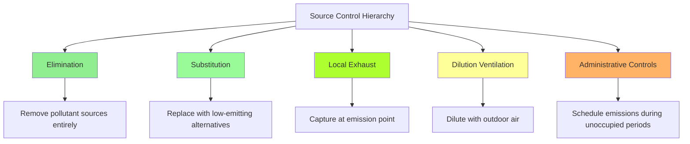

Source control represents the most effective and energy-efficient strategy for maintaining indoor air quality in educational facilities. By eliminating or reducing pollutant sources at their origin, schools minimize the ventilation burden while protecting occupant health and cognitive performance.

## Source Control Hierarchy

The principle of pollution prevention follows a structured hierarchy that prioritizes elimination over dilution:

## Low-Emitting Materials Selection

Material selection during construction and renovation significantly impacts long-term IAQ. Volatile organic compounds (VOCs) and formaldehyde emissions from building products create persistent exposure concerns.

**VOC Emission Standards:**

Specify materials meeting or exceeding these limits:

| Material Category | VOC Limit | Standard |
|------------------|-----------|----------|
| Paints and coatings | < 50 g/L | SCAQMD Rule 1113 |
| Adhesives | < 70 g/L | SCAQMD Rule 1168 |
| Carpet systems | < 0.5 mg/m²·hr total VOC | CRI Green Label Plus |
| Composite wood | < 0.09 ppm formaldehyde | CARB Phase 2 |
| Ceiling tiles | < 0.5 mg/m²·hr total VOC | CDPH Standard Method v1.2 |
| Furniture | < 0.5 mg/m²·hr total VOC | ANSI/BIFMA e3 |

**Formaldehyde Control:**

Formaldehyde emissions from composite wood products (particleboard, MDF, plywood) pose particular concern in schools. CARB Phase 2 limits:

- Hardwood plywood: 0.05 ppm
- Particleboard: 0.09 ppm
- Medium-density fiberboard: 0.11 ppm

Specify ultra-low-emitting (ULEF) or no-added-formaldehyde (NAF) products for cabinets, furniture, and architectural millwork.

## Art and Science Lab Chemical Storage Ventilation

Chemical storage areas require dedicated local exhaust to prevent migration of vapors into occupied spaces.

**Storage Room Requirements:**

Minimum exhaust rate: $Q = 1.0 \text{ cfm/ft}^2$ of floor area

For volatile chemical storage exceeding 10 gallons:

$$Q = Q_{\text{base}} + \frac{V_{\text{chem}} \times EF \times SF}{C_{\text{max}}}$$

Where:
- $Q_{\text{base}}$ = baseline exhaust (1.0 cfm/ft²)
- $V_{\text{chem}}$ = volume of volatile chemicals (gallons)
- $EF$ = emission factor (cfm/gallon, typically 2-5)
- $SF$ = safety factor (1.5-2.0)
- $C_{\text{max}}$ = maximum allowable concentration

**Design Parameters:**

- Negative pressure: 5-10 Pa relative to adjacent spaces
- Air changes: minimum 6 ACH, 12 ACH preferred
- Exhaust inlet: low-level (within 12 inches of floor)
- Interlocked door switch: exhaust proven before entry permitted
- Dedicated exhaust: no recirculation, direct to exterior
- Backup power: connected to emergency generator

Install vapor sensors with alarm for flammable or toxic substances exceeding threshold limit values.

## Custodial Closet Exhaust Requirements

Cleaning products release VOCs, fragrances, and irritants that degrade IAQ. Custodial closets require continuous exhaust during occupied hours plus extended post-occupancy operation.

**Exhaust Sizing:**

Minimum exhaust: $Q = 1.0 \text{ cfm/ft}^2$ floor area or 50 cfm, whichever is greater

For closets storing significant quantities (>5 gallons concentrated product):

$$Q = 0.5 \times V_{\text{room}} \times ACH_{\text{required}}$$

Where $ACH_{\text{required}}$ = 10-15 air changes per hour

**Implementation Requirements:**

- Continuous operation during occupied periods
- Extend operation 2 hours post-occupancy
- Negative pressure: 5 Pa minimum relative to corridor
- Exhaust inlet: ceiling-mounted or high-wall
- Door undercut: 1 inch minimum for makeup air
- No recirculation to building
- Explosion-proof equipment if flammable materials present

## Copy and Print Room Ventilation

Photocopiers and laser printers emit ultrafine particles, ozone, VOCs (styrene, benzene, toluene), and other byproducts of toner heating and paper processing.

**Ventilation Strategy:**

Dedicated exhaust: $Q = 25-50 \text{ cfm/device}$ plus general room ventilation

Total room ventilation:

$$Q_{\text{total}} = Q_{\text{devices}} + (A_{\text{floor}} \times 0.3 \text{ cfm/ft}^2)$$

**Control Measures:**

- Local exhaust hoods above high-volume copiers (>10,000 copies/month)
- Capture velocity: 50-75 fpm at device surface
- Separate exhaust system (no mixing with general ventilation)
- Continuous operation during occupied hours plus 1-hour purge
- Locate rooms at building perimeter for direct exhaust
- Consider central production rooms rather than distributed copiers
- Specify low-emission devices (Blue Angel certified)

Provide 100% outdoor air supply to maintain negative pressure and prevent migration to classrooms.

## Emission Sources and Control Strategies

| Pollutant Source | Primary Contaminants | Control Strategy | Effectiveness |
|------------------|---------------------|------------------|---------------|
| Paints, coatings | VOCs, formaldehyde | Low-VOC specification, off-hours application | High |
| Carpet, flooring | VOCs, 4-PC | Green Label Plus certification, 72-hour ventilation | High |
| Cleaning products | Fragrances, VOCs, ammonia | Green Seal certified, custodial exhaust | Medium-High |
| Copiers, printers | Ozone, UFP, VOCs | Local exhaust, low-emission equipment | High |
| Art supplies | VOCs, particulates | AP/CP certified, local exhaust | Medium-High |
| Science chemicals | Multiple | Closed storage with exhaust, fume hoods | High |
| Pest control | Pesticides, pyrethroids | IPM program, outdoor application priority | High |
| HVAC system | Biological growth, dust | Proper filtration, moisture control, maintenance | High |
| Outdoor infiltration | Combustion products, allergens | Air barriers, filtration, strategic intake location | Medium |
| Occupants | CO₂, bioeffluents | Adequate ventilation rates, occupancy-based control | High |

## Pest Management Integration with HVAC

Integrated pest management (IPM) programs reduce pesticide use while maintaining HVAC system integrity.

**HVAC-IPM Coordination:**

- Seal duct penetrations and utility chases (common pest pathways)
- Maintain positive building pressure to prevent infiltration
- Eliminate moisture sources (condensate leaks, high humidity)
- Install door sweeps and weather-stripping
- Schedule exterior pesticide application during unoccupied periods
- Maintain 50-foot buffer from outdoor air intakes for applications
- Operate ventilation systems in unoccupied mode (100% exhaust) for 24 hours post-treatment if interior application required
- Prioritize baits and physical barriers over broadcast spraying

**Post-Application Ventilation:**

If interior pesticide application necessary:

$$t = \frac{\ln(C_0/C_f)}{ACH} \times 60$$

Where:
- $t$ = purge time (minutes)
- $C_0$ = initial concentration
- $C_f$ = final acceptable concentration
- $ACH$ = air changes per hour

For example, reducing concentration to 10% of initial with 6 ACH:

$$t = \frac{\ln(1/0.1)}{6} \times 60 = 23 \text{ minutes}$$

In practice, maintain 24-hour purge with maximum outdoor air before reoccupancy.

## Maintenance Chemical Use and Ventilation Protocols

Maintenance activities introduce episodic pollutant sources requiring procedural controls coordinated with HVAC operation.

**Activity-Based Protocols:**

| Activity | Pollutants | Ventilation Protocol | Duration |
|----------|-----------|---------------------|----------|
| Floor stripping/refinishing | VOCs, particulates | 100% OA, isolate area, extend purge | 72 hours |
| Painting | VOCs, solvents | 100% OA, isolate zone, low-VOC products | 48 hours |
| Carpet installation | VOCs, adhesives | 100% OA, install unoccupied periods | 72 hours |
| Roof work | Asphalt fumes, solvents | Close outdoor air intakes if within 25 feet | During work |
| Duct cleaning | Dust, biological material | Isolate zones, HEPA vacuum, verify filtration | During + 24h |
| Pest control (interior) | Pesticides | 100% exhaust, no recirculation | 24 hours |

**Chemical Selection Guidelines:**

- Prioritize Green Seal GS-37, GS-40, or Safer Choice certified products
- Eliminate aerosol air fresheners and masking fragrances
- Use microfiber cleaning systems to reduce chemical requirements
- Store all maintenance chemicals in exhausted closets
- Maintain chemical inventory accessible to facility and health staff
- Provide material safety data sheets (SDS) for all products

**Scheduling Practices:**

Conduct high-emission activities during:
- Extended breaks (summer, winter, spring)
- Weekends with extended pre-occupancy purge
- Late afternoon with overnight ventilation purge
- Staged implementation allowing adjacent spaces to remain occupied

Calculate required purge time:

$$t_{\text{purge}} = \frac{4}{ACH_{\text{effective}}} \text{ (hours)}$$

This achieves approximately 98% contaminant removal (4 time constants).

## Implementation and Verification

Source control effectiveness requires verification through commissioning and ongoing monitoring:

1. **Material verification:** Confirm specified low-emitting products delivered and installed
2. **Exhaust verification:** Test airflow rates and pressure differentials at custodial closets, chemical storage
3. **IAQ testing:** Conduct post-occupancy evaluation after major renovations
4. **Protocol compliance:** Audit maintenance and pest control procedures quarterly
5. **Continuous improvement:** Track occupant complaints and adjust protocols

The hierarchy of elimination, substitution, and local exhaust provides superior IAQ outcomes compared to dilution ventilation alone while reducing energy consumption and operating costs.
