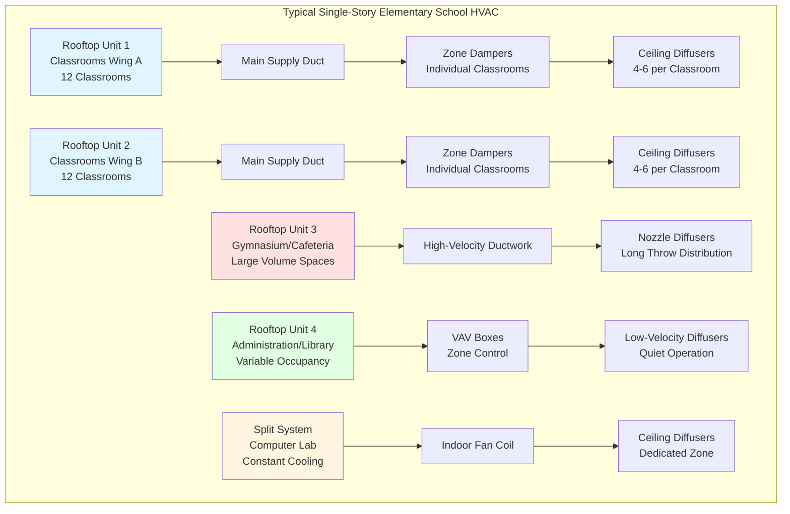
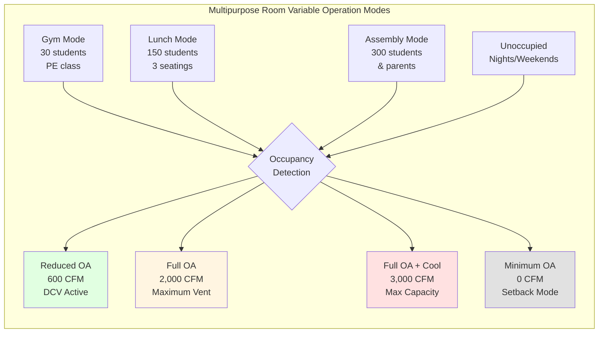

# Elementary School HVAC: Design for Young Learners

Elementary schools serving grades K-5 (ages 5-10) require HVAC systems designed specifically for younger children who have higher metabolic rates per unit body mass, greater susceptibility to airborne contaminants, and safety needs distinct from older students. Design priorities emphasize safety, simplicity, robust indoor air quality, and thermal comfort optimized for smaller body sizes and different activity patterns.

## Age-Specific Ventilation Requirements

ASHRAE Standard 62.1 differentiates ventilation rates based on student age due to physiological differences in breathing rates and metabolic activity.

### Elementary Classroom Ventilation (Ages 5-8)

For students aged 5-8, the standard prescribes:

**Vₒₐ = Rₚ × Pz + Rₐ × Az**

Where:
- Rₚ = 10 CFM/person (same as older students)
- Rₐ = 0.12 CFM/ft²
- Pz = design occupancy (typically 22-26 students + 1 teacher)
- Az = classroom floor area

**Example Calculation for Typical Elementary Classroom:**

A 750 ft² kindergarten classroom with 24 students and 1 teacher:

Vₒₐ = (10 × 25) + (0.12 × 750) = 250 + 90 = 340 CFM

This yields 13.6 CFM/person, higher than the person-only component because younger students occupy classrooms with lower density (28-35 ft²/student vs. 25-28 ft²/student in upper grades).

### Metabolic Rate Considerations

Elementary-age children have higher metabolic rates relative to body surface area compared to adults:

| Age Group | Metabolic Rate (met) | Sensible Heat (BTU/hr) | Latent Heat (BTU/hr) | Total Heat (BTU/hr) |
|-----------|---------------------|----------------------|---------------------|-------------------|
| Kindergarten (age 5-6) | 1.2-1.4 | 180 | 95 | 275 |
| Grades 1-2 (age 6-8) | 1.2-1.3 | 195 | 105 | 300 |
| Grades 3-5 (age 8-10) | 1.1-1.2 | 210 | 115 | 325 |
| Adult (seated, light work) | 1.0-1.1 | 245 | 155 | 400 |

Children generate 30-40% less total heat per person than adults but have higher surface-area-to-volume ratios, making them more sensitive to ambient temperature variations. Target setpoints of 70-72°F heating and 74-76°F cooling maintain comfort without overheating.

## Safety-Focused Design Requirements

Elementary schools demand heightened attention to student safety in all HVAC design elements.

### Equipment Protection and Accessibility

**Safeguarding Requirements:**
- Locate all mechanical equipment in locked rooms inaccessible to students
- Eliminate exposed hot surfaces (pipes, radiators, heat exchangers) in occupied areas
- Install tamper-resistant thermostats minimum 60 inches above finished floor
- Protect all accessible grilles, diffusers, and registers with robust construction
- Provide lockout capability on all local controls accessible from occupied spaces

**Temperature Limits:**
- Maximum accessible surface temperature: 120°F (prevent contact burns)
- Domestic hot water limited to 110°F maximum at fixtures
- Heated floor surfaces limited to 84°F maximum surface temperature
- Radiators and convectors require protective enclosures if below 72 inches AFF

### Air Distribution Safety

**Discharge Air Considerations:**
- Limit supply air discharge velocity to prevent paper disturbance and discomfort
- Position diffusers to avoid direct airflow on seated children (lower head height)
- Supply air temperature differential limited to 15°F maximum to prevent drafts
- Avoid floor-mounted diffusers in primary corridors (trip hazard, debris accumulation)

**Return Air Restrictions:**
- Prohibit return air from toilet rooms, custodial areas, and food preparation spaces
- Install grille guards on low-mounted returns to prevent foreign object insertion
- Minimum grille opening dimension 0.5 inches maximum to prevent finger access to moving parts

## Simplified Control Strategies

Elementary school maintenance staff and teachers require intuitive, simple HVAC controls. Complex building automation systems should provide user-friendly interfaces for basic adjustments.

### Teacher-Accessible Controls

Provide room-level control limited to:
- Temperature setpoint adjustment (±3°F from baseline)
- Occupied/unoccupied override button (2-4 hour duration)
- Visual feedback of current temperature and system status

**Control Restrictions:**
- No access to fan speed, ventilation rates, or equipment start/stop
- Automatic return to scheduled operation after override period
- Minimum ventilation maintained during all occupied periods regardless of local adjustments

### Centralized System Management

Building-level controls should enable facilities staff to:

1. **Schedule Management**: Coordinate HVAC operation with bell schedules, recess periods, and special events
2. **Zone Grouping**: Control classroom wings, grade-level pods, or entire buildings as logical groups
3. **Setpoint Limits**: Establish acceptable temperature ranges preventing excessive energy use
4. **Alarm Notifications**: Receive alerts for equipment failures, extreme temperatures, or ventilation issues
5. **Simple Override**: Provide after-hours access for events without reprogramming

Graphical interfaces with floor plans and color-coded status displays allow non-technical staff to identify and respond to issues effectively.

## Typical Elementary School HVAC System Architecture

Elementary schools commonly employ rooftop units with zone-level control or VAV systems depending on building size and budget.

### System Selection Criteria for Elementary Schools

| Building Configuration | Recommended System | Rationale |
|----------------------|-------------------|-----------|
| Single-story, 12-24 classrooms | Multiple Packaged RTUs | Simple, accessible, low first cost, independent zones |
| Two-story, 24+ classrooms | Central VAV with perimeter heat | Better humidity control, centralized maintenance |
| Renovation/addition | Split systems or ductless | Minimizes existing building disruption |
| High-performance/LEED | DOAS + radiant or active beams | Superior IAQ, energy efficiency, acoustic performance |

## Classroom-Specific Design Considerations

Elementary classrooms differ from upper grades in layout, occupancy patterns, and internal load characteristics.

### Space Planning Integration

**Typical Elementary Classroom Layout:**
- 700-900 ft² floor area
- 22-26 students at individual desks or grouped tables
- Teaching wall with whiteboard/smartboard
- Reading corner or activity centers
- Coat/backpack storage area

**HVAC Coordination Requirements:**
- Avoid supply diffusers directly above teaching wall (glare from ceiling lights)
- Position thermostats away from exterior walls and direct sunlight
- Locate returns opposite supply to promote air circulation
- Maintain 9-10 foot clear ceiling height minimum for proper air mixing

### Internal Load Characteristics

Elementary classrooms generate lower equipment loads than middle/high schools:

**Typical Classroom Heat Gains:**
- Students: 25 students × 300 BTU/hr = 7,500 BTU/hr
- Teacher: 1 × 400 BTU/hr = 400 BTU/hr
- Lighting (LED): 750 ft² × 1.0 W/ft² × 3.41 = 2,560 BTU/hr
- Equipment: 1-2 computers, projector = 1,500 BTU/hr
- Envelope: Varies by orientation, construction = 3,000-8,000 BTU/hr

**Total Cooling Load: 15,000-20,000 BTU/hr** (approximately 1.5-2.0 tons)

Lower equipment density reduces cooling loads but increases the relative importance of envelope performance and solar heat gain control.

## Special Space Requirements

Elementary schools include specialized spaces with unique HVAC needs.

### Kindergarten Classrooms

Kindergarten rooms require enhanced design attention:

**Ventilation Considerations:**
- Higher air change rates (5-6 ACH vs. 3-4 ACH for upper grades)
- Increased outdoor air percentage due to potential for higher VOC emissions from arts/crafts materials
- Consideration for nap time periods with reduced activity levels

**Thermal Comfort:**
- Floor-level temperature monitoring (children sit and lie on floors frequently)
- Radiant floor heating ideal for carpet/mat areas where children gather
- Avoid cold drafts at floor level during winter heating season

**Safety Enhancements:**
- Toilet room exhaust continuous operation during occupied hours
- Enhanced filtration (MERV 11-13 minimum) due to younger immune systems
- Locate thermostats and controls out of reach (60+ inches AFF)

### Art Rooms and Maker Spaces

Art instruction generates airborne contaminants requiring dedicated exhaust:

**Exhaust Requirements:**
- Local exhaust for kilns, pottery wheels, and painting areas
- Minimum 0.50 CFM/ft² general exhaust for art rooms
- Capture hoods for spray painting booths (100-150 FPM face velocity)
- Separate exhaust systems for kiln firing (high-temperature rated ductwork)

**Makeup Air:**
Provide tempered makeup air to replace exhaust and maintain space pressure balance. Direct-fired gas makeup air units or transfer air from adjacent corridors acceptable for general exhaust. Dedicated makeup air required for local exhaust exceeding 300 CFM.

### Music Rooms and Instrumental Practice

Acoustic performance conflicts with HVAC noise requirements:

**Target Noise Levels:**
- Music classrooms: NC 25-30 maximum background noise
- Practice rooms: NC 20-25 maximum background noise

**Acoustic Design Strategies:**
- Duct silencers in supply and return ducts near rooms
- Low-velocity air distribution (500-800 FPM maximum)
- Vibration isolation for all mechanical equipment
- Dedicated air handlers for music wing to isolate from noisier RTUs
- Consider radiant cooling with minimal air distribution for practice rooms

### Multipurpose Rooms and Cafeterias

Combined gymnasium/cafeteria spaces common in elementary schools present variable occupancy challenges:

**Design Approach:**
- Size equipment for maximum simultaneous occupancy (assembly mode)
- Implement CO₂-based demand-controlled ventilation to reduce outdoor air during PE classes
- Two-stage or variable-capacity cooling to handle 3:1 load variation
- Separate thermostat and occupancy override for cafeteria vs. gymnasium use
- Exhaust fans for odor control during lunch periods

## Indoor Air Quality Enhancement

Elementary-age children are more susceptible to airborne contaminants due to developing respiratory systems and higher breathing rates per body mass.

### Enhanced Filtration Strategies

**Minimum Filtration Levels:**
- MERV 11: Standard elementary school application
- MERV 13: Recommended for high-pollen areas or areas with air quality concerns
- MERV 14-16: Schools with asthmatic student populations or urban air quality issues

**Filter Maintenance:**
Install magnehelic differential pressure gauges on all air handlers. Replace filters when pressure drop exceeds manufacturer recommendations (typically 0.5-1.0 in. w.c. depending on filter type). Establish filter replacement on calendar basis (quarterly minimum) rather than reactive approach.

### Humidity Control

Maintaining 40-60% relative humidity year-round provides multiple benefits:

**Health Benefits:**
- Reduced survival time for influenza and other airborne viruses
- Decreased respiratory irritation and static electricity
- Minimized mold and dust mite proliferation

**Operational Strategies:**
- Cooling-season dehumidification through subcooling and reheat or dedicated dehumidification
- Heating-season humidification through central steam or evaporative humidifiers
- Monitor humidity in representative spaces and adjust based on outdoor dewpoint

Dedicated outdoor air systems with integrated dehumidification provide superior humidity control compared to conventional systems that often sacrifice dehumidification for energy efficiency.

## Energy Efficiency and Operational Savings

Elementary schools operate approximately 1,800-2,000 hours annually during instructional time, with extended unoccupied periods enabling aggressive energy conservation.

### Schedule-Based Energy Strategies

**Occupied Schedule:**
- Preheat/precool: 6:00-7:30 AM (optimum start)
- Full operation: 7:30 AM-3:00 PM (instructional day)
- After-school: 3:00-5:00 PM (reduced zones, activities)
- Unoccupied: 5:00 PM-6:00 AM (setback to 55°F heat / 85°F cool)

**Seasonal Shutdown:**
Summer vacancy (typically June-August) allows complete shutdown except:
- Minimum ventilation for moisture control in humid climates
- Space conditioning for summer programs and administrative staff
- Periodic equipment operation to prevent bearing damage and maintain lubrication

### Lighting and Plug Load Coordination

Elementary schools have lower plug loads than secondary schools:

**Typical Power Density:**
- Classrooms: 0.5-0.8 W/ft² (computers, projectors)
- Administration: 1.0-1.5 W/ft² (computers, copiers, printers)
- Library: 0.6-1.0 W/ft² (computers, multimedia)

LED lighting with occupancy sensors and daylight harvesting reduces internal gains by 40-60% compared to fluorescent lighting, decreasing cooling loads proportionally while improving visual quality.

## Maintenance Accessibility and Safety

Design for safe, efficient maintenance by school facilities staff with varying skill levels.

### Equipment Location and Access

**Rooftop Equipment:**
- Provide OSHA-compliant roof access (permanent ladder or interior stairs)
- Install fall protection systems (railings, harness tie-off points)
- Minimum 48-inch clearance around all equipment for filter changes and service
- Weatherproof electrical disconnects and control panels

**Indoor Mechanical Rooms:**
- Locate away from classrooms requiring quiet environments
- Provide adequate lighting (50 footcandles minimum) for maintenance tasks
- Install floor drains for equipment condensate and flushing
- Maintain clear access paths 36-48 inches wide to all equipment

### Filter and Coil Maintenance

**Accessibility Requirements:**
- Filter access doors at standing height (no ladders or lifts required)
- Permanent magnehelic gauges visible from filter access point
- Adequate floor space for staging dirty and clean filters
- Washable or permanent filters for small split systems to reduce replacement burden

**Coil Cleaning:**
Outdoor air intake coils require annual cleaning to maintain heat transfer efficiency and prevent biological growth. Provide:
- Removable access panels on both sides of coil
- Floor drains or catch pans for cleaning solution runoff
- Water supply hose bibs near outdoor air intakes

## Conclusion

Elementary school HVAC design demands specialized attention to child safety, simplified operation, enhanced indoor air quality, and age-appropriate thermal comfort. Proper implementation of ASHRAE 62.1 ventilation requirements, robust filtration systems, temperature limits on accessible surfaces, and tamper-resistant controls creates healthy learning environments for young students. System selection should prioritize simplicity, maintainability, and reliable performance over technological sophistication, recognizing the operational constraints and maintenance capabilities typical of elementary school facilities.

---

**Related Topics:**
- [K-12 School HVAC Systems](../)
- [Classroom HVAC Design](../../classrooms-hvac/)
- [Indoor Air Quality in Schools](../../indoor-air-quality-schools/)
- [Gymnasiums and Natatoriums](../../gymnasiums-natatoriums/)
- [School Cafeterias](../../school-cafeterias/)
