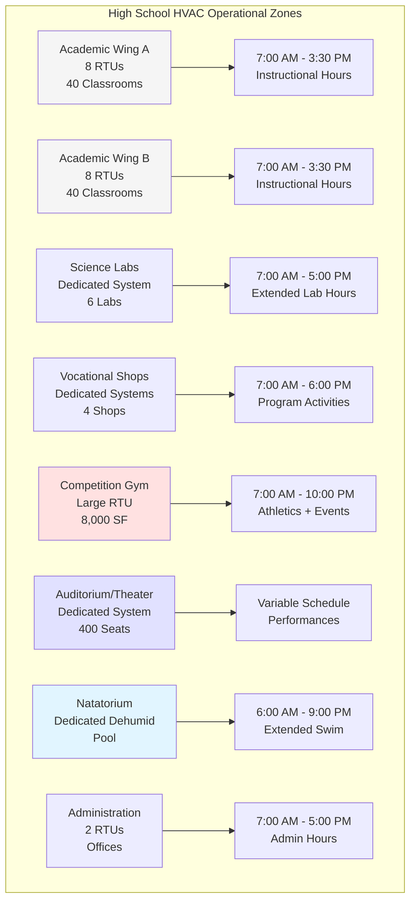
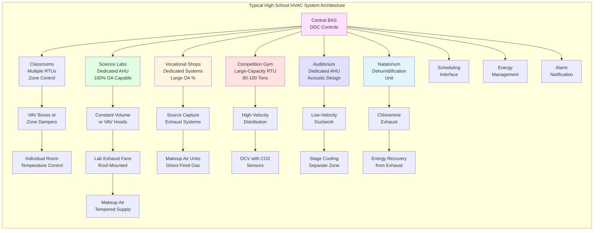

# High School HVAC: Complex Multi-Use Facility Design

High schools represent the most complex HVAC design challenge within K-12 education due to diverse specialized spaces including chemistry and biology laboratories with fume hoods, vocational shops requiring industrial exhaust, competition gymnasiums with variable spectator loads, performing arts theaters demanding strict acoustic control, and extended operating hours supporting athletic events and evening activities. Design must integrate these varied requirements while maintaining energy efficiency and operational simplicity.

## Building Complexity and Space Diversity

High schools typically contain 50-150 classrooms plus specialized facilities not found in elementary or middle schools. This diversity requires zone-specific HVAC strategies rather than uniform building-wide approaches.

### High School Space Type HVAC Requirements

| Space Type | Ventilation Rate | Special Requirements | Typical Load (tons/1000 ft²) |
|------------|------------------|---------------------|------------------------------|
| Standard Classroom | 10 CFM/person + 0.12 CFM/ft² | Quiet operation, individual control | 1.5-2.0 |
| Chemistry Laboratory | 1.0 CFM/ft² + hood exhaust | Fume hood makeup air, emergency exhaust | 2.5-3.5 |
| Biology Laboratory | 1.0 CFM/ft² + hood exhaust | Specimen storage, incubator heat loads | 2.0-3.0 |
| Physics Laboratory | 10 CFM/person + 0.12 CFM/ft² | Equipment heat loads, laser safety exhaust | 2.0-2.5 |
| Automotive Shop | 1.5 CFM/ft² | Vehicle exhaust capture, oil mist removal | 1.0-1.5 |
| Welding Shop | 200 CFM/station | Fume extraction, fire protection coordination | 1.5-2.0 |
| Woodworking Shop | 1.5 CFM/ft² | Dust collection integration, fire protection | 1.0-1.5 |
| Culinary Arts Kitchen | Type I/II hoods | Commercial kitchen exhaust, makeup air | 3.0-4.0 |
| Competition Gymnasium | 20 CFM/person + 0.06 CFM/ft² | Spectator seating, extended hours, DCV | 0.8-1.2 |
| Auditorium/Theater | 15 CFM/person | NC 25 acoustics, stage lighting loads | 1.5-2.0 |
| Weight Room | 20 CFM/person | High latent loads, equipment off-gassing | 2.5-3.5 |
| Natatorium | 0.5 CFM/ft² minimum | Dehumidification, chloramine control | 4.0-6.0 |

## Chemistry and Biology Laboratory Systems

Laboratory spaces require sophisticated exhaust systems to protect student and teacher safety during experiments involving chemicals, biological materials, and heat sources.

### Fume Hood Design and Performance

Chemistry laboratories typically contain 2-4 fume hoods serving benchtop experiments. Hood design follows ANSI Z9.5 and ASHRAE 110 standards.

**Fume Hood Exhaust Calculation:**

For a 6-foot horizontal-sash hood, exhaust airflow is determined by face velocity and opening area:

$$Q_{hood} = V_{face} \times A_{opening}$$

Where:
- $Q_{hood}$ = hood exhaust rate (CFM)
- $V_{face}$ = face velocity, typically 80-100 FPM for educational applications
- $A_{opening}$ = sash opening area (ft²)

For a 6-foot wide × 2-foot high opening:

$$Q_{hood} = 100 \text{ FPM} \times (6 \times 2) = 1,200 \text{ CFM}$$

With sash height adjustable from 0-2 feet, hood exhaust must maintain face velocity across the operating range. Constant-volume systems exhaust 1,200 CFM continuously. Variable-air-volume (VAV) hood systems modulate exhaust from 300 CFM (sash closed) to 1,200 CFM (sash fully open), saving 40-60% of exhaust energy while maintaining safety.

### Laboratory Makeup Air Requirements

Laboratory hood exhaust creates substantial negative pressure requiring makeup air provision. A chemistry lab with four 6-foot hoods exhausting simultaneously requires 4,800 CFM makeup air.

**Makeup Air Strategy Options:**

1. **General Supply Air**: Provide conditioned makeup air through ceiling diffusers
2. **Perforated Supply Walls**: Low-velocity air introduction behind hoods
3. **Makeup Air Plenums**: Direct low-velocity air supply into room volume
4. **Combination**: General ventilation plus hood-specific makeup air

**Laboratory Space Pressure:**

Maintain laboratories at negative pressure (-0.02 to -0.05 in. w.c.) relative to corridors to contain contaminants. Calculate general exhaust to maintain pressure differential:

$$Q_{exhaust} = Q_{supply} + \Delta Q_{pressure}$$

Where $\Delta Q_{pressure}$ = 50-100 CFM per laboratory to maintain negative pressure during door opening/closing events.

### Laboratory Ventilation Rate Calculation

Beyond hood exhaust, laboratories require general room ventilation per ASHRAE 62.1:

$$V_{oa,lab} = 1.0 \text{ CFM/ft}^2 \times A_{lab}$$

For a 1,200 ft² chemistry laboratory:

$$V_{oa,lab} = 1.0 \times 1,200 = 1,200 \text{ CFM general ventilation}$$

This general ventilation operates continuously during occupied hours, independent of hood operation. Total outdoor air requirement equals general ventilation plus hood exhaust makeup.

## Industrial Arts and Vocational Shop Ventilation

Vocational programs generate industrial contaminants requiring specialized exhaust systems coordinated with academic building HVAC.

### Automotive Technology Shop Exhaust

Automotive shops present multiple exhaust requirements for different activities and contaminant types.

**Vehicle Exhaust Capture Systems:**

Source-capture exhaust removes vehicle emissions during engine operation. Design options include:

- **Tailpipe Hoses**: Flexible hoses connect to vehicle exhaust, 3-inch diameter minimum, 150-200 CFM per hose
- **Overhead Extraction**: Articulated arms position capture hoods above vehicle, 300-400 CFM per position
- **Underfloor Exhaust**: Floor-mounted connections via rails, 200-300 CFM per position

**General Ventilation:**

Beyond source capture, provide general exhaust to dilute fugitive emissions and oil mists:

$$Q_{general} = 1.5 \text{ CFM/ft}^2 \times A_{shop}$$

For a 3,000 ft² automotive shop:

$$Q_{general} = 1.5 \times 3,000 = 4,500 \text{ CFM}$$

Tempered makeup air prevents excessive negative pressure during heating season. Direct-fired gas makeup air units provide 80-93% efficiency.

**Paint Booth Requirements:**

Spray painting requires dedicated exhaust booth meeting NFPA 33 requirements:
- Exhaust rate: 100 FPM face velocity minimum
- Exhaust plenum velocity: 100-200 FPM for filter efficiency
- Makeup air: 90-100% of exhaust rate
- Explosion-proof electrical equipment
- Automatic sprinkler protection

### Welding Shop Fume Extraction

Welding operations generate metal fumes and UV radiation requiring source-capture extraction per ANSI Z49.1 and AWS F1.5.

**Welding Fume Capture Methods:**

1. **Low-Volume High-Velocity (LVHV) Systems**: Flexible arms with 4-6 inch capture hoods, 150-300 CFM per station, effective capture radius 12-18 inches from arc
2. **Downdraft Tables**: 200-400 CFM/ft² table area, captures fumes at source before rising into breathing zone
3. **Crossdraft Benches**: Horizontal airflow across work surface, 50-100 FPM capture velocity
4. **General Dilution Ventilation**: Secondary system providing 2,000 CFM minimum per welder for fugitive fumes

**Welding Shop Air Quality Calculation:**

For a shop with 6 welding stations using LVHV extraction:

$$Q_{welding} = (250 \text{ CFM/station}) \times 6 + 1,000 \text{ CFM general} = 2,500 \text{ CFM}$$

Fire protection coordination critical: ensure exhaust systems maintain operation during sprinkler activation events.

### Woodworking Shop Dust Collection Integration

Woodworking equipment generates wood dust requiring dedicated collection systems. Coordinate dust collection with building HVAC to prevent interference.

**Design Integration Requirements:**

- Dust collection system operates independently from building HVAC
- Provide building general ventilation (1.0-1.5 CFM/ft²) separate from dust collection
- Maintain shop at neutral pressure (±0.00 in. w.c.) relative to corridors
- Makeup air provision for dust collector exhaust if vented outdoors
- Interlock dust collector operation with equipment power supply

## Competition Gymnasium HVAC Design

High school gymnasiums serve multiple functions: physical education classes, competitive athletics with spectator seating, assemblies, and community events. Design must accommodate load variations from 30 students to 1,500+ spectators.

### Gymnasium Ventilation Strategies

**Design Outdoor Air Requirements:**

Base ventilation on maximum occupancy (competitive events with spectators):

$$V_{oa,gym} = (20 \text{ CFM/person} \times P_{max}) + (0.06 \text{ CFM/ft}^2 \times A_{gym})$$

For an 8,000 ft² gymnasium with 1,200-person capacity:

$$V_{oa,gym} = (20 \times 1,200) + (0.06 \times 8,000) = 24,000 + 480 = 24,480 \text{ CFM}$$

**Demand-Controlled Ventilation Implementation:**

Install CO₂ sensors at breathing height in both playing area and spectator sections. Modulate outdoor air based on measured concentrations:

- Unoccupied: 0 CFM (system off during setback)
- PE Class (30 students): 2,000 CFM (based on CO₂ feedback)
- Practice (50 students + coaches): 3,500 CFM
- Junior Varsity Game (400 spectators): 12,000 CFM
- Varsity Game (1,200 spectators): 24,480 CFM

DCV reduces annual ventilation energy by 35-50% compared to constant maximum airflow.

### High-Volume Air Distribution

Gymnasium ceiling heights of 24-30 feet require long-throw air distribution. Design approach:

**Supply Air Strategy:**

- High-velocity nozzle diffusers providing 50-70 foot throw
- Supply air temperature differential 15-20°F acceptable due to high mixing
- Mount diffusers at perimeter walls aimed toward center
- Avoid direct discharge on basketball courts (affects ball trajectory)

**Return Air Strategy:**

- High sidewall returns opposite supply diffusers
- Return air temperature stratification minimal if supply designed properly
- Ceiling returns acceptable but require destratification fans in heating mode

### Variable-Capacity Cooling

Gymnasium cooling loads vary 5:1 from unoccupied to full spectator capacity. Single-stage equipment short-cycles during low loads. Solutions include:

- **Two-Stage RTUs**: First stage serves base loads, second stage for events
- **Variable-Capacity Compressors**: Modulate from 25-100% capacity continuously
- **Multiple Smaller Units**: Sequence operation based on load, provide redundancy

## Performing Arts and Theater HVAC

Auditoriums and performing arts spaces require strict acoustic control, precise temperature maintenance during performances, and coordination with theatrical lighting heat loads.

### Acoustic Requirements for Theaters

ANSI S12.60 and acoustical engineering principles establish maximum background noise levels:

- **Auditorium/Theater**: NC 25 maximum during performances
- **Music Rehearsal Rooms**: NC 20-25 maximum
- **Practice Rooms**: NC 20 maximum

Achieving these targets requires comprehensive acoustic design:

**HVAC Noise Control Strategies:**

1. **Low-Velocity Ductwork**: Limit velocities to 500-800 FPM in occupied spaces
2. **Duct Silencers**: Install in supply and return ducts, select for insertion loss at problem frequencies (125-500 Hz)
3. **Acoustically-Lined Ductwork**: Use minimum 1-inch internal liner for 50 feet minimum upstream of diffusers
4. **Vibration Isolation**: All rotating equipment on spring isolators with 95%+ isolation efficiency
5. **Equipment Location**: Separate mechanical rooms from performance spaces by buffer zones

**Diffuser Selection:**

Low-noise diffusers with NC 20-25 ratings at design flow rates. Specify maximum sones rating (2.0-3.0 maximum) in performance spaces.

### Theater Ventilation During Performances

Theaters experience high, variable occupancy creating dynamic ventilation requirements:

**Auditorium Ventilation Calculation:**

For a 400-seat auditorium (6,000 ft² including stage):

$$V_{oa,theater} = (15 \text{ CFM/person} \times 400) + (0.06 \text{ CFM/ft}^2 \times 6,000) = 6,360 \text{ CFM}$$

Implement occupancy-based ventilation control reducing outdoor air during rehearsals with partial cast (50-100 people) while maintaining full airflow during performances (400 people).

**Stage Area Cooling:**

Theatrical lighting generates substantial heat loads. Typical lighting power density:

- Drama theater: 5-8 W/ft² stage area
- Multi-purpose auditorium: 3-5 W/ft² stage area

For a 1,200 ft² stage with 7 W/ft² lighting:

$$Q_{lighting} = 1,200 \times 7 \times 3.41 = 28,644 \text{ BTU/hr} = 2.4 \text{ tons}$$

Provide dedicated cooling to stage area separate from house air distribution. Locate diffusers to avoid disturbing curtains and acoustic performance.

## Extended Operating Hours and Scheduling

High school HVAC systems operate beyond instructional hours supporting athletics, performing arts, community use, and maintenance activities.

### Operational Schedule Zoning

Divide building HVAC into operational zones enabling partial building operation:

### Evening and Weekend Operation Optimization

**Energy Conservation Strategies:**

1. **Zone Isolation**: Operate only systems serving scheduled activities
2. **Temperature Setback**: Reduce setpoints in adjacent unoccupied zones (60°F heating, 82°F cooling)
3. **Ventilation Reduction**: Reduce outdoor air to occupied zones only
4. **Lighting Coordination**: Integrate lighting and HVAC schedules preventing conditioning of unoccupied spaces
5. **Optimum Stop**: Calculate minimum equipment runtime before event conclusion

**Event-Based Scheduling:**

Athletic events require preparation time before and recovery time after. For a 7:00 PM basketball game:

- **Pre-cooling Start**: 4:30 PM (2.5 hours advance for spectator comfort)
- **Game Time**: 7:00-9:00 PM (full capacity operation)
- **Post-Event**: 9:00-10:00 PM (reduced operation during egress)
- **Setback**: 10:00 PM (return to unoccupied mode)

Coordinate with athletic director schedule well in advance. Provide web-based scheduling interface allowing coaches and event coordinators to request HVAC operation.

## High School HVAC System Architecture

Complex building organization requires zone-specific systems rather than central plant approach.

## System Selection Matrix

| Building Type | Recommended Primary System | Special Considerations |
|--------------|---------------------------|----------------------|
| Standard Classrooms | Multiple RTUs with VAV/zone control | Economizers, occupancy-based control |
| Science Labs | Dedicated AHU with 100% OA capability | VAV fume hoods, emergency exhaust |
| Vocational Shops | Makeup air units + source capture | Direct-fired MAUs, interlock coordination |
| Competition Gym | Large-capacity RTU (80-100+ tons) | Two-stage cooling, DCV, extended hours |
| Auditorium | Dedicated AHU with acoustic treatment | NC 25 design, stage cooling zone |
| Natatorium | Dedicated dehumidification unit | Chloramine exhaust, 60-62°F dewpoint |
| Administration | RTU or split systems | Standard comfort cooling, economizers |

## Control System Integration

High schools require sophisticated building automation systems (BAS) managing diverse equipment, schedules, and user interfaces.

**BAS Functional Requirements:**

- **Multi-Schedule Management**: Academic, athletic, performing arts, community use schedules
- **Zone-Level Control**: Enable partial building operation for events
- **Remote Monitoring**: Facilities staff access from off-site locations
- **Alarm Prioritization**: Critical alarms (lab exhaust failure, high CO₂) escalate immediately
- **Energy Dashboards**: Track consumption by system type and time period
- **Maintenance Tracking**: Log filter changes, equipment runtime, service requirements

**User Access Levels:**

1. **Teachers**: Room temperature adjustment (±3°F), occupancy override
2. **Coaches/Directors**: Schedule HVAC for events (gymnasium, auditorium)
3. **Facilities Staff**: Full system control, troubleshooting, maintenance logging
4. **Administration**: Energy reports, cost tracking, high-level scheduling

## Maintenance Considerations

High schools operate 180-200 school days plus extended hours requiring robust maintenance programs.

**Preventive Maintenance Schedule:**

| System Component | Frequency | Critical Items |
|-----------------|-----------|----------------|
| RTU Filters | Monthly during operation | Check pressure drop, replace MERV 11-13 |
| Lab Exhaust Fans | Quarterly | Verify airflow, inspect belts, check static pressure |
| Fume Hoods | Annual | ASHRAE 110 testing, face velocity verification |
| DCV CO₂ Sensors | Annual | Calibration verification, replace every 5-7 years |
| VAV Box Calibration | Annual | Airflow verification, damper operation |
| Cooling Coils | Annual | Clean outdoor coils, inspect indoor coils |
| Economizer Operation | Seasonal | Damper operation, sensor calibration |

**Specialized Testing Requirements:**

- **Laboratory Fume Hoods**: Annual ASHRAE 110 quantitative testing per ANSI Z9.5
- **Kitchen Exhaust**: Semi-annual hood cleaning, annual fire suppression inspection
- **Natatorium Dehumidification**: Monthly dewpoint verification, quarterly refrigerant check

High school HVAC systems represent the culmination of educational facility design complexity. Success requires integrating academic, athletic, and performing arts requirements into cohesive, energy-efficient systems supporting diverse educational programs while maintaining operational simplicity and life-cycle cost effectiveness.

---

**Related Topics:**
- [K-12 School HVAC Systems](../)
- [Elementary School HVAC](../elementary-schools/)
- [Chemistry Lab Fume Hoods](../../laboratory-hvac/)
- [Gymnasiums and Natatoriums](../../gymnasiums-natatoriums/)
- [School Cafeterias](../../school-cafeterias/)
- [Acoustic Considerations in Assembly Spaces](../../acoustic-considerations-assembly/)
