# Middle School HVAC: Complex Multi-Zone Design

Middle schools serving grades 6-8 (ages 11-14) present the most complex HVAC design challenges among K-12 facilities. These buildings combine the diverse space requirements of high schools—including science laboratories, specialized classrooms, and athletic facilities—with the intensive occupancy patterns and supervision needs of elementary schools. Design must accommodate rapid occupancy fluctuations during class changes, highly variable exhaust requirements across different spaces, and energy management opportunities from predictable but diverse scheduling patterns.

## Diverse Space Type Requirements

Middle schools typically include 15-20 distinct space types, each with unique ventilation, thermal, and operational requirements.

### Ventilation Requirements by Middle School Space Type

| Space Type | People Rate (CFM/person) | Area Rate (CFM/ft²) | Typical Size (ft²) | Design OA (CFM) | ACH Range |
|------------|------------------------------|-------------------------|----------------------|-------------------|-----------|
| General Classroom | 10 | 0.12 | 900 | 370 | 3-4 |
| Science Laboratory | 10 | 0.18 | 1,200 | 490 | 4-6 |
| Computer Lab | 10 | 0.12 | 1,000 | 400 | 3-4 |
| Art Room | 10 | 0.18 | 1,200 | 490 | 4-6 |
| Music Room | 10 | 0.06 | 1,500 | 390 | 3-4 |
| Gymnasium | 20 | 0.06 | 5,000 | 900 | 4-6 |
| Cafeteria Dining | 7.5 | 0.18 | 3,000 | 1,200 | 6-8 |
| Locker Room | - | 0.50 | 800 | 400 | 6-10 |
| Library/Media Center | 5 | 0.12 | 2,500 | 550 | 2-3 |
| Auditorium | 5 | 0.06 | 4,000 | 800 | 3-5 |
| Weight Room | 20 | 0.06 | 1,000 | 260 | 6-8 |
| Administrative Offices | 5 | 0.06 | 150 | 85 | 3-4 |
| Corridors | - | 0.06 | - | Variable | 2-3 |

**Calculation Example - Science Laboratory:**

For a 1,200 ft² science lab with 28 students and 1 teacher:

$$V_{oa} = R_p \times P_z + R_a \times A_z$$

$$V_{oa} = (10 \times 29) + (0.18 \times 1,200) = 290 + 216 = 506 \text{ CFM}$$

This outdoor air requirement represents only the ventilation component. Total supply air must also satisfy thermal loads, typically resulting in 1,200-1,800 CFM total supply for proper air distribution and temperature control.

## Occupancy Density During Class Changes

Middle schools experience dramatic occupancy fluctuations during 4-7 minute class change periods occurring every 45-90 minutes throughout the day.

### Peak Occupancy Analysis

**Typical Daily Occupancy Pattern:**
- Classroom period: 28 students + 1 teacher (29 occupants)
- Class change: 0 occupants in classroom, 800-1,200 students in corridors simultaneously
- Between periods: 5-10 minute setup time with partial occupancy

**Corridor Loading During Class Changes:**

A 200-foot corridor section, 12 feet wide (2,400 ft²):

Peak occupancy density: 4-6 ft²/student during class change

$$\text{Corridor Occupants} = \frac{2,400 \text{ ft}^2}{5 \text{ ft}^2/\text{student}} = 480 \text{ students}$$

**Ventilation Implications:**

Standard corridor outdoor air requirement:
$$V_{oa} = 0.06 \text{ CFM/ft}^2 \times 2,400 \text{ ft}^2 = 144 \text{ CFM}$$

If designed for peak corridor occupancy (not required by code):
$$V_{oa} = 10 \text{ CFM/person} \times 480 = 4,800 \text{ CFM}$$

**Design Approach:**

ASHRAE 62.1 bases ventilation on steady-state occupancy, not transient peaks. Corridors designed to area-based rates (0.06 CFM/ft²) prove adequate because:

1. High air change rates from transfer air from classrooms
2. Brief duration of peak loading (4-7 minutes)
3. Reduced metabolic activity during transit
4. CO₂ dilution from opening classroom doors

### Thermal Load Implications

Class changes create thermal load spikes from:
- Latent heat release (students moving between spaces)
- Door openings increasing infiltration
- Simultaneous locker use creating localized heat sources

**Load Calculation Adjustment:**

Standard cooling load diversity factor for middle school: 0.85-0.90 (accounts for fact that 10-15% of building unoccupied during any given period due to class changes, assemblies, and varying schedules)

## Science Laboratory Ventilation Requirements

Middle school science programs include chemistry, biology, and physics instruction requiring enhanced ventilation and local exhaust capabilities.

### General Science Lab Ventilation

**Base Ventilation Rate:**
- People component: 10 CFM/person
- Area component: 0.18 CFM/ft² (50% higher than standard classroom)

The increased area rate accounts for:
- Chemical storage cabinets off-gassing
- Demonstration experiments between classes
- Preserved specimen odors in biology labs
- Cleanup operations with disinfectants

**Supply Air Distribution:**

Science labs require 4-6 air changes per hour minimum, with supply air delivery patterns preventing short-circuiting to fume hood exhausts:

$$\text{ACH} = \frac{Q \times 60}{V}$$

For 1,200 ft² lab with 10-foot ceilings:

$$Q = \frac{5 \text{ ACH} \times 12,000 \text{ ft}^3}{60} = 1,000 \text{ CFM total supply}$$

### Fume Hood Requirements

Middle school labs typically include 1-2 demonstration fume hoods for teacher use rather than individual student hoods.

**Fume Hood Exhaust Rates:**

Standard demonstration hood: 4-6 feet wide × 2-3 feet deep

Face velocity requirement: 80-100 FPM (ASHRAE 110 Method of Testing)

$$Q_{hood} = \text{Face Area} \times \text{Face Velocity}$$

For 5-foot wide × 2-foot high sash opening:

$$Q_{hood} = (5 \times 2) \times 100 = 1,000 \text{ CFM}$$

**Variable Volume Hood Control:**

Install sash position sensors that modulate exhaust based on actual opening height:
- Fully open (24 inches): 1,000 CFM
- Half open (12 inches): 500 CFM
- Closed (6-inch minimum): 200 CFM

This reduces exhaust volume by 50-80% during unoccupied periods while maintaining minimum purge rates.

**Makeup Air Coordination:**

Hood exhaust must be replaced with makeup air to prevent:
- Excessive space negative pressure (>0.05 in. w.c.)
- Difficulty opening corridor doors
- Reduced effectiveness of general ventilation system

Provide dedicated makeup air or transfer air from adjacent non-laboratory spaces. Makeup air should be tempered to within 15°F of space temperature to maintain comfort.

### Chemical Storage Ventilation

Separate exhaust required for chemical storage rooms and cabinets:

**Storage Room Requirements:**
- Minimum 6 ACH continuous operation
- Exhaust discharge remote from air intakes (15+ feet separation)
- Failure alarm to alert facilities staff
- Emergency power backup for flammable storage areas

**Ventilated Storage Cabinets:**
- 100-200 CFM per cabinet depending on size
- Hard-ducted to dedicated exhaust system
- Backdraft dampers prevent cross-contamination between cabinets

## Locker Room Exhaust Considerations

Locker rooms generate high moisture loads and require continuous exhaust to control odors and prevent mold growth.

### Exhaust Rate Determination

ASHRAE 62.1 prescribes area-based exhaust: 0.50 CFM/ft²

For typical 800 ft² locker room:

$$Q_{exhaust} = 0.50 \times 800 = 400 \text{ CFM}$$

This yields approximately 6-10 air changes per hour depending on ceiling height, adequate for moisture and odor control during normal use.

**Peak Load Considerations:**

After PE classes or athletic practices, 30-40 students may shower simultaneously, generating:

$$\text{Moisture Load} = 40 \text{ students} \times 0.3 \text{ lb/hr per student} = 12 \text{ lb/hr}$$

This latent load requires adequate exhaust to maintain <60% relative humidity and prevent condensation on cold surfaces.

### Exhaust System Design

**Air Distribution Strategy:**
- Exhaust grilles mounted low (within 12 inches of floor) to capture moisture and odors at source
- Supply air (if provided) from ceiling to create top-to-bottom airflow pattern
- Toilet/shower areas maintained at negative pressure relative to locker area

**Continuous vs. Intermittent Operation:**

| Operation Mode | Advantages | Disadvantages | Best Application |
|---------------|------------|---------------|-----------------|
| Continuous 24/7 | Prevents mold growth, controls odors, simple controls | Higher energy cost, oversized for unoccupied periods | Humid climates, frequent use |
| Occupied Hours Only | Energy savings, reduced equipment runtime | Potential moisture accumulation overnight | Dry climates, infrequent use |
| Occupancy Sensor | Energy savings, operates when needed | Delayed response, sensor maintenance | Moderate climates, scheduled use |

**Recommended Approach for Middle Schools:**

Continuous operation at 50% of design rate during unoccupied periods, increasing to 100% during occupied hours. This maintains moisture control while reducing energy consumption.

### Heat Recovery Opportunities

Locker room exhaust represents significant energy loss, particularly in extreme climates.

**Energy Recovery Potential:**

400 CFM exhaust, 8,760 hours/year operation:

Heating season (winter, outdoor air at 20°F, exhaust at 70°F):

$$q_{sensible} = 1.08 \times Q \times \Delta T = 1.08 \times 400 \times 50 = 21,600 \text{ BTU/hr}$$

Annual heating energy lost:
$$E = 21,600 \times 4,380 \text{ (heating hours)} = 94.6 \text{ MMBtu/year}$$

At natural gas cost of $10/MMBtu and 80% boiler efficiency:
$$\text{Cost} = \frac{94.6 \times 10}{0.80} = \$1,183/\text{year}$$

**Recovery Options:**
- Run-around glycol loop: 50-65% effectiveness, $8,000-12,000 installed
- Energy recovery wheel: 70-80% effectiveness, $15,000-25,000 installed
- Separate exhaust air heat pump: 200-300% COP, $10,000-15,000 installed

Simple payback: 7-15 years depending on climate and utility costs. Justifiable in northern climates or high-use facilities.

## Energy Management During Off-Hours

Middle schools operate approximately 2,000 hours annually during instructional time (8:00 AM - 3:30 PM, 180 days), leaving 6,760 hours for aggressive energy conservation.

### Schedule-Based Operational Strategies

**Occupied Mode (7:00 AM - 4:00 PM, Weekdays):**
- Full ventilation per ASHRAE 62.1
- Temperature setpoints: 70°F heating / 74°F cooling
- All zones operational

**Unoccupied Mode (Nights, Weekends):**
- Zero outdoor air ventilation (exception: locker rooms, science labs at minimum rates)
- Temperature setback: 55°F heating / 85°F cooling
- Allow temperature drift within setback limits

**Optimum Start/Stop:**

Calculate minimum preheat/precool time to achieve occupied setpoints by 7:00 AM based on:
- Outdoor air temperature
- Building thermal mass
- Equipment capacity

$$t_{start} = \frac{T_{occupied} - T_{current}}{R_{recovery}}$$

Where recovery rate $R_{recovery}$ determined empirically through building automation system trending, typically 5-10°F per hour for middle school construction.

**Energy Savings Potential:**

Optimum start reduces daily HVAC runtime by 1-3 hours compared to fixed start time:

Annual savings: 1.5 hours/day × 180 days = 270 hours

For 150-ton cooling system at $0.08/kWh and 0.8 kW/ton:
$$\text{Savings} = 150 \times 0.8 \times 270 \times 0.08 = \$2,592/\text{year}$$

### After-School Activities and Athletics

Middle schools commonly host activities until 5:00-6:00 PM requiring zone-level HVAC control.

**Selective Zone Operation:**

Rather than conditioning entire building, operate only zones with scheduled activities:
- Gymnasium and locker rooms for athletics
- Band/choir rooms for rehearsals
- Specific classroom wings for tutoring/clubs

This requires zone-level isolation capability through:
- Individual rooftop units serving distinct building areas
- VAV systems with zone-level scheduling
- Separate split systems for high-use spaces

**Energy Impact:**

Operating 30% of building zones for after-school activities vs. entire building:

Daily extended operation: 2 hours × 70% reduction = 1.4 hours equivalent savings

Annual impact: 1.4 hours/day × 180 days = 252 hours

Estimated 20-30% reduction in after-hours conditioning costs.

## Zone Control for Varying Schedules

Middle school schedules vary significantly across different building areas, requiring sophisticated zone control strategies.

### Middle School HVAC Zoning Strategy

```mermaid
graph TB
    subgraph "Middle School Multi-Zone HVAC Architecture"
        subgraph "Academic Wing - VAV System"
            A[Central Air Handler<br/>20,000 CFM<br/>Energy Recovery] --> B[6th Grade Wing<br/>12 Classrooms]
            A --> C[7th Grade Wing<br/>12 Classrooms]
            A --> D[8th Grade Wing<br/>12 Classrooms]
            B --> B1[VAV Boxes with Reheat<br/>Individual Room Control]
            C --> C1[VAV Boxes with Reheat<br/>Individual Room Control]
            D --> D1[VAV Boxes with Reheat<br/>Individual Room Control]
        end

        subgraph "Science Wing - Dedicated System"
            E[Science Lab AHU<br/>100% OA Capable<br/>4,500 CFM] --> F[Biology Lab 1<br/>Fume Hood]
            E --> G[Chemistry Lab 1<br/>Fume Hood]
            E --> H[Physics Lab<br/>General Exhaust]
            F --> F1[Dedicated Exhaust<br/>Variable Volume]
            G --> G1[Dedicated Exhaust<br/>Variable Volume]
        end

        subgraph "Athletics - Independent RTUs"
            I[Gymnasium RTU<br/>12,000 CFM<br/>DCV Enabled] --> J[Gymnasium<br/>5,000 ft²]
            K[Locker Room MUA<br/>800 CFM<br/>Continuous] --> L[Boys Locker<br/>Girls Locker]
            M[Weight Room RTU<br/>1,500 CFM] --> N[Weight Room<br/>1,000 ft²]
        end

        subgraph "Common Areas - Separate Systems"
            O[Cafeteria RTU<br/>6,000 CFM] --> P[Dining Area<br/>3,000 ft²]
            Q[Kitchen MUA<br/>2,400 CFM<br/>Heated] --> R[Kitchen Hoods<br/>Type I & II]
            S[Library AHU<br/>2,500 CFM] --> T[Media Center<br/>Quiet Zone NC-30]
            U[Admin Split Systems<br/>Zone by Zone] --> V[Offices<br/>Counseling<br/>Nurse]
        end
    end

    W[Building Automation System<br/>Zone Scheduling & Control] -.->|Coordinates| A
    W -.->|Coordinates| E
    W -.->|Coordinates| I
    W -.->|Coordinates| K
    W -.->|Coordinates| M
    W -.->|Coordinates| O
    W -.->|Coordinates| Q
    W -.->|Coordinates| S
    W -.->|Coordinates| U

    style A fill:#e1f5ff
    style E fill:#ffe1e1
    style I fill:#e1ffe1
    style K fill:#e1ffe1
    style M fill:#e1ffe1
    style O fill:#fff5e1
    style Q fill:#fff5e1
    style S fill:#f5e1ff
    style U fill:#ffe1f5
    style W fill:#fff9e1
```

### Zone Design Rationale

**Academic Wing - Central VAV System:**
- Centralized maintenance and filtration
- Superior humidity control for 30+ connected spaces
- Individual room temperature control via VAV boxes with hot water reheat
- Energy recovery on large outdoor air volume
- Enables coordinated operation across grade-level wings

**Science Wing - Dedicated 100% OA System:**
- Isolated from general ventilation to prevent cross-contamination
- 100% outdoor air capability during experiments
- Coordinates with fume hood exhaust systems
- Higher filtration levels (MERV 13-14) for laboratory spaces
- Independent operation from academic wing schedule

**Athletics - Multiple Independent RTUs:**
- Gymnasium operates extended hours for athletics/community use
- Locker rooms require continuous exhaust independent of gym operation
- Weight room may operate on different schedule than gymnasium
- Simple packaged equipment for easy replacement and maintenance
- Demand-controlled ventilation reduces outdoor air during PE classes

**Common Areas - Function-Specific Systems:**
- Cafeteria operates intense loads during 3-4 lunch periods, minimal use otherwise
- Kitchen requires dedicated makeup air coordinated with exhaust hoods
- Library requires quiet operation (NC-30) incompatible with high-velocity systems
- Administrative areas operate year-round including summer, separate from academic schedule

### Scheduling Flexibility Requirements

Building automation system must enable:

**Period-Based Scheduling:**
- Coordinate HVAC operation with class periods
- Reduce ventilation during passing periods when classrooms unoccupied
- Ramp up capacity 15-30 minutes before period start

**Exception Handling:**
- Override zones for after-school activities without affecting entire building
- Early release days with reduced afternoon operation
- Assembly schedules moving students to auditorium/gymnasium

**Seasonal Adjustments:**
- Summer shutdown of academic wings
- Extended gymnasium operation for summer camps
- Administrative area year-round operation

## Cooling Load Diversity Factors

Middle schools benefit from load diversity because not all spaces reach peak conditions simultaneously.

### Simultaneous Peak Analysis

**Individual Space Peaks:**
- West-facing classrooms: Peak 3:00-4:00 PM (solar gain)
- East-facing classrooms: Peak 9:00-10:00 AM (solar gain)
- Interior classrooms: Peak during occupied periods (occupancy load)
- Gymnasium: Peak during athletic events (occupancy + lighting)
- Cafeteria: Peak during lunch periods (occupancy + equipment)

**Building Peak vs. Sum of Space Peaks:**

Sum of individual space peaks: 200 tons
Simultaneous building peak: 170 tons
Diversity factor: 0.85

This 15% reduction in required central plant capacity represents significant first cost and operating cost savings.

**Diversity Application:**

$$Q_{plant} = \sum Q_{zones} \times D_f$$

Where:
- $Q_{plant}$ = central plant capacity
- $\sum Q_{zones}$ = sum of individual zone design loads
- $D_f$ = diversity factor (0.80-0.90 for middle schools)

**Caution:**

Diversity factors apply to central plants and distribution systems, not to zone-level equipment. Each VAV box, fan coil, or RTU must be sized for its full design load. Under-sizing zone equipment based on diversity results in inadequate capacity and comfort complaints.

## Indoor Air Quality Monitoring

Middle schools increasingly incorporate IAQ monitoring to verify ventilation system performance and respond to occupant concerns.

### CO₂ Monitoring Strategy

**Measurement Locations:**
- Representative classrooms (1 per 10 classrooms minimum)
- Gymnasium during PE classes and events
- Cafeteria during lunch periods
- Science laboratories
- Return air ducts on major air handlers

**Acceptable CO₂ Levels:**

ASHRAE 62.1 does not specify absolute CO₂ limits but uses 1,000 ppm above outdoor ambient as verification that ventilation rates are adequate.

Typical outdoor CO₂: 400-450 ppm
Target indoor CO₂: <1,050 ppm during occupied periods

Sustained levels >1,200 ppm indicate inadequate ventilation requiring investigation.

**Demand-Controlled Ventilation (DCV):**

Spaces with highly variable occupancy benefit from CO₂-based ventilation control:

- Gymnasiums (30 students during PE vs. 300 during events)
- Cafeterias (varying lunch period attendance)
- Auditoriums (occasional use at full capacity)

DCV maintains setpoint of 1,000-1,200 ppm by modulating outdoor air dampers based on measured CO₂ concentration.

**Energy Savings:**

Gymnasium with 900 CFM design outdoor air, occupied 30% of operating hours at full capacity:

DCV reduces outdoor air to 300 CFM during PE classes (30 students vs. 150 design):

$$\text{OA Reduction} = (900 - 300) \times 0.70 \times 2,000 \text{ hrs} = 840,000 \text{ CFM-hrs/year}$$

Heating/cooling energy savings: 20-35% depending on climate

## Acoustic Design for Learning Environments

ANSI S12.60 establishes maximum background noise levels for classrooms to support speech intelligibility and learning.

### Target Noise Criteria

| Space Type | Maximum Background Noise | Design Approach |
|------------|-------------------------|----------------|
| General Classrooms | NC-35 | Low-velocity ductwork, VAV terminals <800 FPM |
| Science Labs | NC-35 to NC-40 | Acceptable slightly higher due to equipment noise |
| Music Rooms | NC-25 to NC-30 | Dedicated quiet systems, extensive silencers |
| Library/Media Center | NC-30 to NC-35 | Low-velocity distribution, isolated equipment |
| Gymnasium | NC-40 to NC-45 | Higher levels acceptable, high-velocity OK |
| Cafeteria | NC-40 to NC-45 | Higher levels acceptable due to ambient noise |

### Acoustic Design Strategies

**Ductwork Velocity Limits:**
- Main ducts: 1,200-1,800 FPM
- Branch ducts: 800-1,200 FPM
- Runouts to classrooms: 500-800 FPM

**VAV Terminal Unit Selection:**
- Pressure-independent boxes with damper control (quieter than pressure-dependent)
- Maximum inlet velocity: 800 FPM at design flow
- Acoustically lined interior (1-inch minimum)
- Avoid fan-powered VAV terminals in standard classrooms (acceptable in corridors only)

**Diffuser Selection:**
- Low-throw diffusers for perimeter supply
- Neck velocity <400 FPM at design flow
- Avoid high-induction diffusers generating turbulent noise

**Equipment Isolation:**
- Locate air handlers in dedicated mechanical rooms, not above classrooms
- Spring vibration isolators on all rotating equipment (fans, pumps, compressors)
- Flexible duct connections between equipment and ductwork (10-inch minimum length)
- Duct silencers on supply and return within 20 feet of air handlers

## Conclusion

Middle school HVAC design requires sophisticated multi-zone approaches to serve diverse space types with varying ventilation requirements, occupancy patterns, and schedules. Successful designs incorporate dedicated systems for science laboratories with fume hood coordination, continuous locker room exhaust with heat recovery consideration, zone-level control enabling selective operation during after-school activities, and building automation strategies capitalizing on predictable scheduling for energy savings. The complexity of middle school programs demands engineering solutions balancing first cost constraints with operational flexibility, energy efficiency, and indoor air quality sufficient to support adolescent learning and development.

---

**Related Topics:**
- [K-12 School HVAC Systems](../)
- [Elementary School HVAC](../elementary-schools/)
- [High School HVAC](../high-schools/)
- [Science Laboratory HVAC](../../laboratory-hvac/)
- [Gymnasiums and Natatoriums](../../gymnasiums-natatoriums/)
- [School Cafeterias](../../school-cafeterias/)
- [Demand-Controlled Ventilation](../../demand-controlled-ventilation-classrooms/)
