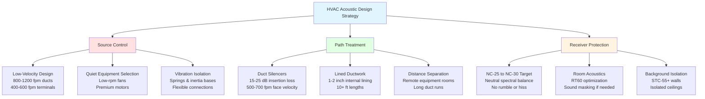

Acoustic performance represents a critical design parameter for HVAC systems in lecture halls and auditoriums. Background noise from mechanical systems directly impacts speech intelligibility, audience concentration, and overall educational effectiveness. Proper acoustic design requires coordinated attention to noise generation, transmission paths, and receiving space characteristics.

## Noise Criteria and Room Criteria Targets

HVAC system noise in educational spaces is quantified using Noise Criteria (NC) and Room Criteria (RC) curves. NC curves specify maximum allowable sound pressure levels across octave bands from 63 Hz to 8000 Hz. RC curves add evaluation of spectral balance to identify rumble, hiss, or other objectionable qualities.

### Recommended NC/RC Levels for Educational Facilities

| Space Type | NC Rating | RC Rating | Application Notes |
|------------|-----------|-----------|-------------------|
| Large Auditorium (>500 seats) | NC-25 | RC-25(N) | Critical listening environments |
| Medium Lecture Hall (200-500 seats) | NC-30 | RC-30(N) | Standard teaching spaces |
| Small Lecture Room (50-200 seats) | NC-30 to NC-35 | RC-30(N) to RC-35(N) | General instruction |
| Conference Room | NC-30 | RC-30(N) | Video conferencing compatibility |
| Music Practice Room | NC-25 | RC-25(N) | Musical performance spaces |
| Recording Studio | NC-15 to NC-20 | RC-15(N) to RC-20(N) | Professional recording |

The (N) designation indicates neutral spectral balance—no rumble (low frequency dominance) or hiss (high frequency dominance). Large auditoriums demand NC-25 to ensure background noise remains 15-20 dB below normal speech levels (60-65 dBA at 1 meter).

## Air Velocity Limits for Low Noise Operation

Air velocity in ductwork and through terminal devices generates aerodynamic noise. Higher velocities produce exponentially greater sound power levels according to:

$$L_w = L_{w0} + 50 \log_{10}\left(\frac{V}{V_0}\right)$$

where $L_w$ is sound power level (dB), $V$ is air velocity, and $V_0$ is reference velocity.

### Maximum Recommended Air Velocities

**Main Duct Velocities:**
- Supply air mains: 1200-1800 fpm (6-9 m/s)
- Return air mains: 1000-1500 fpm (5-7.5 m/s)
- Branch ducts near occupied spaces: 800-1200 fpm (4-6 m/s)

**Terminal Device Velocities:**
- Diffuser neck velocity: 400-600 fpm (2-3 m/s) for NC-25
- Diffuser neck velocity: 500-800 fpm (2.5-4 m/s) for NC-30
- Return grilles: 400-500 fpm (2-2.5 m/s)
- Transfer grilles: 300-400 fpm (1.5-2 m/s)

The relationship between velocity and generated noise is exponential. Doubling velocity increases sound power by approximately 15 dB, making velocity control the single most effective noise reduction strategy.

## Duct-Borne Noise Control

Sound generated by air handling equipment propagates through ductwork to occupied spaces. Attenuation strategies include natural duct attenuation, duct silencers, and plenum chambers.

### Natural Duct Attenuation

Straight rectangular ductwork provides 0.1-0.3 dB attenuation per foot at mid-frequencies, with greater attenuation at higher frequencies. Duct elbows provide 3-5 dB attenuation. For systems requiring NC-25 to NC-30, natural attenuation proves insufficient—engineered silencers become necessary.

### Duct Silencer Selection

Dissipative silencers use fiberglass or mineral wool baffles to absorb sound energy. Insertion loss varies with frequency:

$$IL = 1.05 \cdot P \cdot L \cdot \frac{1}{S}$$

where $IL$ is insertion loss (dB), $P$ is silencer perimeter (ft), $L$ is silencer length (ft), and $S$ is cross-sectional area (ft²).

**Silencer Design Guidelines:**
- Locate silencers 10-15 duct diameters downstream of equipment to allow turbulence dissipation
- Size for 500-700 fpm face velocity to minimize self-generated noise
- Specify 5-10 ft length for 15-25 dB insertion loss at 500 Hz
- Use double-wall construction to prevent breakout noise
- Install upstream and downstream of fans when necessary

### Plenum Chambers

Sound traps or plenum chambers provide attenuation through multiple reflections and absorption. A properly designed plenum with 4-6 inches of acoustic lining provides 10-20 dB attenuation across mid-frequencies.

## Structure-Borne Noise Control

Mechanical equipment vibration transmits through structural connections to building elements, radiating as airborne noise in occupied spaces. Structure-borne transmission often dominates at low frequencies (below 250 Hz) where airborne attenuation is most difficult.

**Vibration Isolation Requirements:**
- Air handling units: 2-3 inch deflection spring isolators or neoprene pads
- Fans: 3-4 inch deflection springs for equipment over 10 HP
- Pumps: Inertia bases with spring isolators
- Piping: Flexible connectors at equipment connections
- Duct connections: 8-12 inch fabric flex connections

Isolation efficiency increases with deflection. A spring isolator provides approximately 95% isolation at frequencies above $f = 3.13\sqrt{1/\delta}$, where $\delta$ is static deflection in inches.

## Terminal Unit Selection for Quiet Operation

Variable air volume (VAV) terminal units generate noise from airflow modulation and pressure reduction. Series fan-powered boxes produce less noise than parallel configurations but consume more energy.

**Acoustic Performance by Terminal Type:**
- Single-duct VAV with damper control: NC-35 to NC-40
- Single-duct VAV with inlet cone: NC-30 to NC-35
- Fan-powered VAV (series): NC-35 to NC-38
- Fan-powered VAV (parallel): NC-38 to NC-42
- Dual-duct VAV: NC-35 to NC-40

For NC-25 to NC-30 spaces, locate VAV boxes outside the auditorium in ceiling plenums or mechanical spaces. Use lined downstream ductwork (10-15 feet minimum) between terminal units and diffusers.

## Diffuser Selection for Noise Minimization

Diffuser acoustic performance depends on throw distance, pressure drop, and geometric design. Manufacturers provide sound power data (NC or dB) at various airflow rates.

**Low-Noise Diffuser Strategies:**
- Specify linear slot diffusers with 0.05-0.08 in. w.g. pressure drop
- Use perforated face diffusers for distributed low-velocity discharge
- Install multiple small diffusers rather than fewer large units
- Maintain 8-10 ft minimum ceiling height for adequate throw
- Avoid high-induction diffusers in critical acoustic spaces

The radiated noise from a diffuser to a space is:

$$L_p = L_w - 10\log_{10}(R) + 10\log_{10}(Q)$$

where $L_p$ is sound pressure level, $L_w$ is diffuser sound power, $R$ is room constant, and $Q$ is directivity factor.

## Equipment Room Location and Isolation

Physical separation between mechanical equipment and acoustically sensitive spaces provides the most cost-effective noise control. Vertical separation proves more effective than horizontal due to structural discontinuities at floor-ceiling assemblies.

**Location Guidelines:**
- Position mechanical rooms one floor above or below auditoriums when possible
- Maintain 30-50 ft minimum horizontal separation for rooftop equipment
- Locate air handling equipment over corridors, storage, or restrooms—never directly above auditoriums
- Design mechanical room walls for STC-55 to STC-60 sound transmission class
- Use floating floors or isolated equipment bases in penthouse locations

**Equipment Room Acoustic Treatment:**
- Install 2-4 inches acoustic absorption on walls and ceiling (NRC 0.80 minimum)
- Seal all penetrations with acoustical caulk
- Use solid-core doors with perimeter gaskets (STC-45 minimum)
- Avoid mechanical room adjacency to auditorium walls
- Install vibration isolation under all floor-mounted equipment

## Commissioning and Verification

Post-installation acoustic testing verifies compliance with design criteria. Measurements follow ANSI/ASA S12.2 standards for background noise in rooms.

**Testing Protocol:**
1. Operate all HVAC systems at design airflow
2. Close all windows and doors
3. Measure 1/3 octave band sound pressure levels at 3-5 locations
4. Calculate room average NC/RC curves
5. Identify and correct deficiencies before occupancy

Achieving NC-25 to NC-30 in large auditoriums requires integrated design—low velocities, strategic equipment location, comprehensive silencing, and effective vibration isolation working together as a system.
