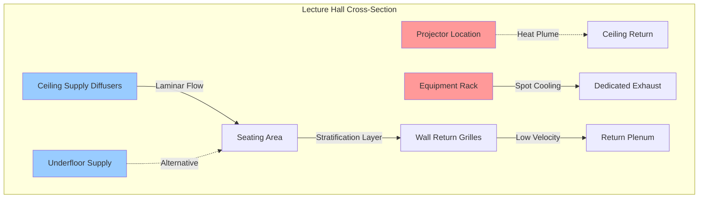
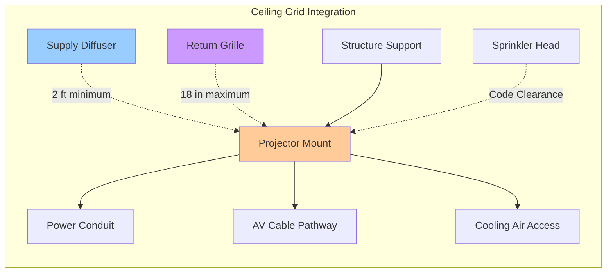

Integration of audiovisual equipment in lecture halls and auditoriums requires careful coordination between HVAC systems and technology infrastructure. Projection systems, amplifiers, lighting controls, and digital displays generate substantial heat loads while demanding acoustic isolation and precise environmental control. Effective HVAC design must address equipment cooling requirements, prevent interference with sound systems, and accommodate cable management constraints without compromising air distribution effectiveness.

## AV Equipment Heat Loads

Audiovisual equipment contributes significant sensible heat gains that must be incorporated into cooling load calculations.

### Projection System Loads

High-performance projectors generate heat loads ranging from 1,500 to 5,000 watts depending on brightness output and technology type.

| Projector Type | Typical Output | Heat Load | Cooling Requirement |
|----------------|----------------|-----------|---------------------|
| LED (6,000 lumens) | 500-800 W | 1,700-2,700 BTU/hr | Standard air |
| Lamp-based (10,000 lumens) | 1,200-1,800 W | 4,100-6,100 BTU/hr | Dedicated exhaust |
| Laser (15,000+ lumens) | 1,500-3,000 W | 5,100-10,200 BTU/hr | Isolated cooling |
| Digital cinema | 3,000-5,000 W | 10,200-17,000 BTU/hr | Separate system |

Projector mounting locations require either ceiling-level air distribution to remove heat plumes or dedicated exhaust fans connected to projector housings. Lamp-based projectors operating above 80°F experience reduced lamp life and color accuracy degradation.

### Equipment Rack Loads

Central AV equipment racks housing amplifiers, processors, switchers, and control systems generate concentrated heat loads requiring focused cooling strategies.

**Typical rack heat loads:**
- Audio amplifiers: 200-800 W per channel (depending on power rating)
- Video processors: 150-400 W per unit
- Digital signal processors: 75-200 W per unit
- Network switches: 50-150 W per unit
- Control processors: 40-100 W per unit

Equipment racks exceeding 3,000 watts (10,200 BTU/hr) benefit from dedicated cooling solutions including in-rack fans, spot cooling units, or isolated ventilation systems. Ambient temperatures within racks should remain below 95°F with relative humidity between 30-55% to ensure reliable electronics operation.

## HVAC Coordination with AV Systems

Mechanical systems must operate without creating acoustic interference or disrupting AV equipment performance.

### Acoustic Isolation Requirements

HVAC noise transmitted into lecture spaces interferes with speech intelligibility and sound system performance.

**Noise control strategies:**
- Specify air handling units with discharge sound power levels below NC-25 (dBA < 35)
- Install duct silencers on supply and return paths within 15 feet of air devices
- Use acoustically rated ceiling diffusers with NC ratings matching room criteria (typically NC-20 to NC-25)
- Locate mechanical equipment rooms away from critical listening areas with minimum STC-60 separation
- Employ vibration isolation for all rotating equipment to prevent structure-borne noise transmission

Low-velocity ductwork design (maximum 1,200 fpm in mains, 600 fpm at terminals) minimizes turbulent flow noise. Round ducts produce 3-5 dB less noise than rectangular ducts of equivalent area.

### Supply Air Distribution Coordination

Air distribution must avoid directing airflow across microphones, projection paths, or sound system speaker arrays.

Displacement ventilation systems supplying air at 65-68°F through floor or low-wall diffusers provide acoustic benefits through reduced air velocities while accommodating cable pathways. Ceiling-mounted equipment benefits from ceiling return air paths that capture heat plumes naturally.

## Equipment Room Ventilation

Dedicated AV equipment rooms and projection booths require independent ventilation systems.

### Design Parameters

Equipment room cooling must address both steady-state heat loads and peak operating conditions during events.

**Ventilation design criteria:**
- Maintain space temperature: 68-75°F
- Relative humidity: 30-55% RH
- Air changes: 15-20 ACH minimum
- Exhaust capacity: 110% of calculated equipment heat load
- Backup ventilation: Battery-powered exhaust for critical systems

Heat loads should account for simultaneous operation of all installed equipment at maximum power draw, not average usage. Equipment manufacturers' thermal specifications provide maximum operating temperatures and required airflow rates.

### Cooling System Options

Several approaches address equipment room thermal control:

**Split system air conditioning:** Provides precise temperature control with sound-isolated outdoor condensing units. Typical capacity ranges from 12,000-48,000 BTU/hr for standard equipment rooms.

**Dedicated exhaust with makeup air:** Cost-effective solution using exhaust fans to remove hot air with passive or mechanically supplied replacement air. Requires tempered makeup air in heating climates.

**In-rack cooling units:** Self-contained cooling modules mounted within equipment racks provide targeted cooling for high-density installations exceeding 5 kW per rack.

## Cable Management Integration

HVAC pathways must accommodate extensive AV cabling while maintaining fire-rated separation.

### Plenum Compatibility

AV cables routed through return air plenums require plenum-rated jackets (CMP or FT6 rated) meeting NFPA 90A combustibility standards. Cable bundles occupying more than 15% of plenum cross-sectional area restrict airflow and require alternative routing.

**Cable management strategies:**
- Dedicated cable trays isolated from HVAC ductwork
- Under-floor cable pathways with raised access flooring
- Wall-mounted conduit systems bypassing ceiling plenum spaces
- Fire-rated penetration seals at all cable pathway boundaries

### Projector Connections

Ceiling-mounted projectors require power, video, and control cables coordinated with supply air diffusers and return grilles.

Maintain minimum 24-inch separation between supply air diffusers and projector intakes to prevent cool air from disrupting projector thermal management systems. Position return air grilles within 18 inches of projector exhaust ports to capture waste heat effectively.

## Lighting System Coordination

Theatrical lighting and architectural lighting controls generate heat loads and require dimmer room cooling.

### Dimmer Room Ventilation

Lighting dimmer racks convert 2-5% of controlled power into waste heat requiring removal. A 100 kW lighting system generates approximately 2,000-5,000 watts (6,800-17,000 BTU/hr) of heat in dimmer equipment.

Dimmer rooms require:
- Dedicated exhaust ventilation at 1 CFM per watt of connected load minimum
- Maximum ambient temperature: 104°F (manufacturer dependent)
- Direct outside air exhaust avoiding recirculation into occupied spaces
- Air intake filtration to prevent dust accumulation on electronic components

### LED Lighting Considerations

Modern LED lighting systems reduce heat loads by 60-80% compared to incandescent systems while concentrating heat at driver/ballast locations. LED drivers require ambient temperatures below 122°F for rated life expectancy, typically achieved through general space conditioning rather than dedicated cooling.

## System Integration Best Practices

Successful HVAC-AV coordination requires early collaboration and ongoing communication.

**Design phase coordination:**
- Include AV consultant in HVAC design reviews
- Identify equipment locations and heat loads during schematic design
- Coordinate ceiling layouts showing all systems before construction documents
- Specify acoustic criteria for all mechanical equipment
- Plan cable pathways avoiding conflicts with ductwork and piping

**Construction phase requirements:**
- Verify actual equipment heat loads match design assumptions
- Test HVAC noise levels before AV system commissioning
- Coordinate startup sequences to prevent simultaneous high-load operation
- Document air balance results in equipment rooms

The interactive nature of modern lecture halls demands HVAC systems that support technology infrastructure while maintaining acoustic performance and thermal comfort. Proper integration ensures reliable AV system operation and optimal learning environments.
