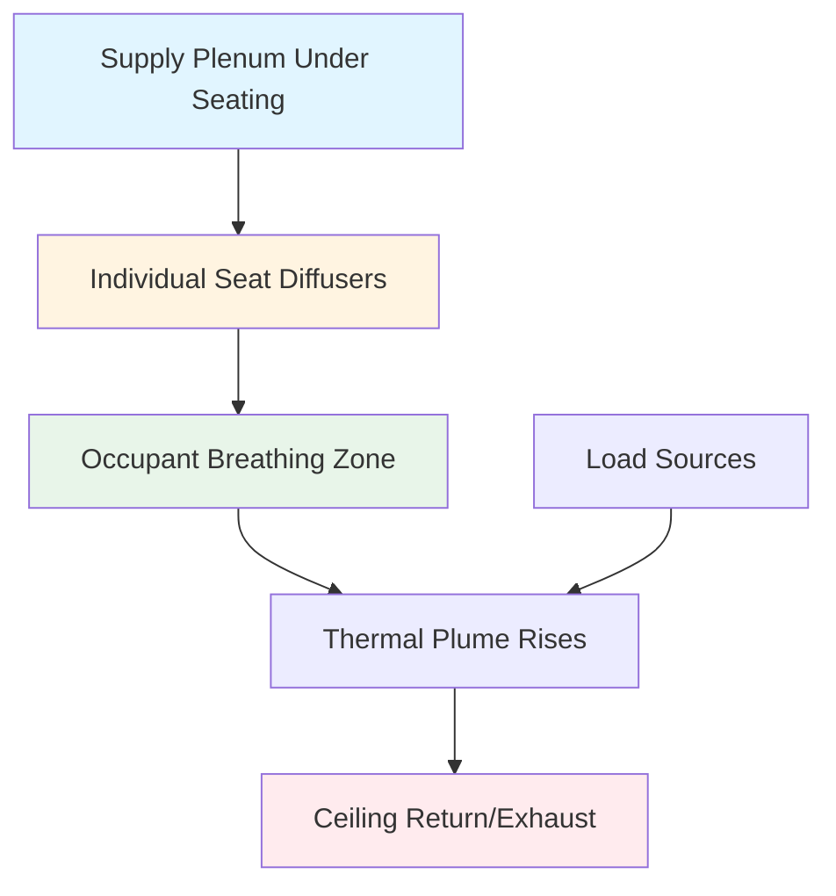
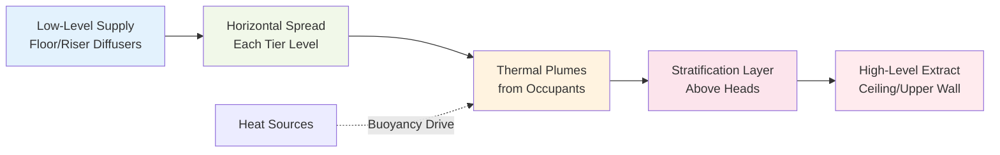
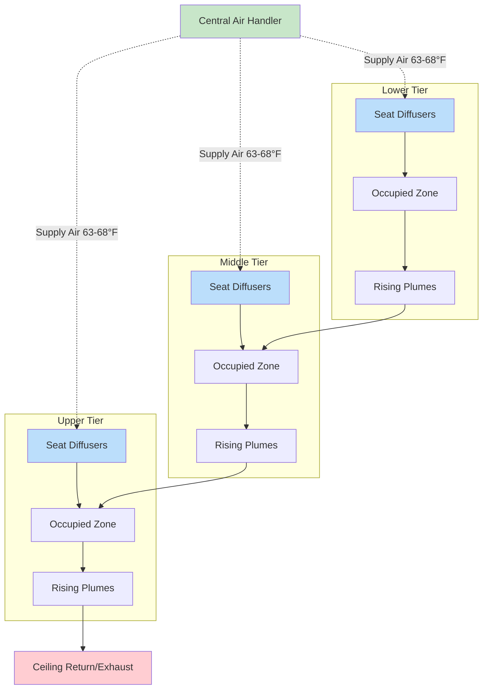

## Overview

Tiered seating venues present unique ventilation challenges due to vertical stratification, variable occupancy densities, and acoustic constraints. Effective ventilation systems must deliver conditioned air uniformly across multiple elevation levels while maintaining thermal comfort, indoor air quality, and low noise levels. Advanced air distribution strategies—including underfloor systems, seat-based delivery, and displacement ventilation—address these challenges through physics-based design principles.

## Air Distribution Strategies for Tiered Seating

### Underfloor Air Distribution (UFAD)

Underfloor air distribution leverages the natural buoyancy of warm air to create vertical stratification zones. Supply air enters the occupied zone at floor level through diffusers integrated into risers or seat pedestals, rising through the space as it gains heat from occupants and equipment.

**Key design parameters:**

| Parameter | Typical Value | Notes |
|-----------|---------------|-------|
| Supply air temperature | 63-68°F | Higher than conventional systems |
| Supply velocity | 30-50 fpm | Low velocity at diffuser face |
| Plenum pressure | 0.05-0.15 in. w.g. | Maintains uniform distribution |
| Stratification height | 6-8 ft above floor | Occupied zone boundary |

**Advantages:**
- Improved ventilation effectiveness (1.2-1.4 vs. 1.0 for overhead mixing)
- Reduced cooling loads due to stratification
- Individual diffuser control at seat locations
- Reduced ductwork in ceiling plenum
- Lower fan energy consumption

**Design considerations:**
- Floor plenum depth requirements (12-18 inches minimum)
- Sealed underfloor construction for pressure maintenance
- Coordination with structural supports and utilities
- Condensation control in humid climates

### Seat-Based Air Delivery

Seat-based systems integrate supply air diffusers directly into seat assemblies, providing personalized ventilation at the breathing zone. This approach maximizes ventilation effectiveness by delivering fresh air precisely where occupants need it.

**Implementation methods:**

1. **Integrated seat diffusers**: Low-velocity air outlets in seat backs or armrests
2. **Swirl diffusers**: Rotating diffuser patterns for improved mixing at breathing zone
3. **Personal air nozzles**: Adjustable directional outlets for individual control

**Typical specifications:**
- Airflow rate: 10-20 CFM per occupant
- Supply temperature: 65-70°F
- Noise criterion: NC-25 to NC-30 at seat location
- Diffuser face velocity: <150 fpm to prevent draft sensation

### Displacement Ventilation Applications

Displacement ventilation exploits thermal buoyancy to create vertical air movement from floor to ceiling. Cool supply air (63-68°F) enters at low velocity near the floor, spreads horizontally, and rises through the occupied zone as it absorbs heat from people and equipment.

**Physical principles:**

The Archimedes number (Ar) governs displacement ventilation flow regimes:

Ar = (gβΔTH) / u₀²

Where:
- g = gravitational acceleration (32.2 ft/s²)
- β = thermal expansion coefficient (1/T_abs)
- ΔT = temperature difference between supply and room
- H = characteristic height
- u₀ = supply air velocity

For effective displacement: Ar > 10

**Tiered seating considerations:**

**Design requirements for displacement:**
- Minimum ceiling height: 10-12 ft for stratification development
- Supply diffuser placement at each tier level
- Low supply velocities: <50 fpm at diffuser face
- Temperature differential: 5-9°F between supply and room
- Extract locations above stratification interface (8-10 ft height)

## Comfort Uniformity Across Elevation Tiers

Temperature stratification in tiered seating creates vertical gradients that can compromise comfort uniformity. Proper system design must account for:

**Vertical temperature gradient management:**

| Elevation Difference | Acceptable Gradient | Maximum Gradient |
|---------------------|---------------------|------------------|
| 0-6 ft (occupied zone) | 3°F | 5°F |
| 6-12 ft (stratification zone) | 5-7°F | 9°F |
| Above 12 ft (exhaust zone) | Unlimited | N/A |

**Strategies for uniform comfort:**

1. **Zone-specific air delivery**: Independent supply to each tier level with dedicated diffusers
2. **Airflow balancing**: Higher supply rates to upper tiers compensating for rising heat
3. **Temperature reset control**: Modulate supply temperature based on tier-specific sensors
4. **Mixed-mode systems**: Combine displacement ventilation with supplemental overhead mixing for peak loads

**Thermal plume interaction:**

In densely occupied tiered seating, thermal plumes from lower tiers interact with occupants on upper tiers. Supply air quantity must account for cumulative heat gains:

Q_tier(n) = Q_base + Σ(Q_plume from tiers 1 to n-1)

Where Q_base represents the local sensible load for tier n.

## System Integration and Controls

**Control strategies for tiered venues:**

- **Demand-based ventilation**: CO₂ monitoring at multiple tier levels adjusts outdoor air intake
- **Occupancy sensing**: Infrared or seat-switch sensors enable zone-specific supply modulation
- **Pre-cooling sequences**: Flush cycles before occupancy reduce initial cooling loads
- **Variable volume control**: VAV terminal units at each tier maintain setpoint with minimum outdoor air

**Acoustic performance:**

Low-velocity air distribution is essential for speech intelligibility:
- Diffuser NC rating: NC-25 maximum during occupied periods
- Duct silencers at branch takeoffs to each tier
- Vibration isolation of air handling equipment
- Low-velocity ductwork design: <1500 fpm in occupied spaces

## Airflow Pattern Visualization

## Conclusion

Tiered seating ventilation requires careful integration of air distribution strategy with architectural geometry and occupancy patterns. Underfloor air distribution, seat-based delivery, and displacement ventilation offer superior performance compared to conventional overhead mixing systems when properly designed for vertical stratification effects. Achieving uniform comfort across elevation tiers demands zone-specific air delivery, thermal plume management, and responsive control strategies that adapt to variable occupancy conditions.

---

*Effective tiered seating ventilation balances thermodynamic principles with practical constraints of acoustics, architecture, and occupant expectations to deliver consistent comfort throughout the venue.*
