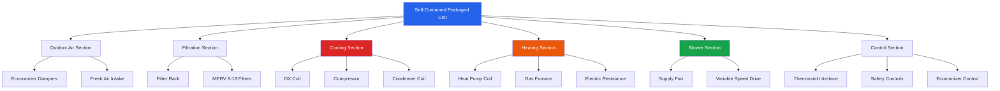

Self-contained HVAC units provide the primary climate control solution for portable classrooms due to their compact design, factory-assembled construction, and simplified installation requirements. These packaged systems integrate all refrigeration components, airside equipment, and controls into a single housing, eliminating the need for split-system configurations that require separate indoor and outdoor units.

## Packaged Rooftop Units

Rooftop-mounted packaged units represent the most common configuration for portable classrooms. These units mount directly to the roof structure through a curb adapter, distributing conditioned air through short duct runs to classroom diffusers. Typical capacities range from 3 to 7.5 tons (10.5 to 26.4 kW) for standard 24-foot by 40-foot portable classrooms.

The cooling capacity requirement follows the sensible heat ratio calculation:

$$Q_{total} = \frac{Q_{sensible}}{SHR}$$

where $Q_{sensible}$ includes heat gain from occupants, lighting, envelope, and solar radiation, and $SHR$ typically ranges from 0.75 to 0.85 for classroom applications.

Rooftop units offer advantages including ground-level space preservation, reduced vandalism exposure, and noise isolation from occupied spaces. However, they impose structural loads requiring adequate roof framing and create potential leak points necessitating proper flashing and curb installation.

## Wall-Mounted Through-the-Wall Units

Wall-mounted packaged terminal units (PTUs) provide an alternative for portable classrooms where roof loading presents concerns or retrofit applications require minimal structural modification. These units mount through exterior wall penetrations, typically in 3 to 5 ton (10.5 to 17.6 kW) capacities.

Through-the-wall configurations minimize ductwork requirements and simplify replacement procedures. The reduced installation height improves maintenance accessibility compared to rooftop installations. Disadvantages include classroom space intrusion, increased noise levels in occupied areas, and limited applicability for larger portable classroom configurations.

## Single-Zone vs Multi-Zone Control

**Single-Zone Systems**

Most portable classrooms utilize single-zone packaged units serving the entire classroom space. A single thermostat controls the unit, providing uniform temperature setpoints throughout the occupied area. This configuration offers simplicity, lower first costs, and straightforward maintenance procedures.

**Multi-Zone Capabilities**

Larger portable classroom buildings or those with distinct functional areas may employ multi-zone packaged units. These systems incorporate multiple zone dampers and thermostats, allowing independent temperature control for different spaces. Applications include portable buildings with separate office areas, storage rooms, or multiple classrooms under one roof structure.

Multi-zone systems require more complex control sequences and additional ductwork distribution. The zone damper positions modulate based on individual zone demands:

$$CFM_{zone} = CFM_{total} \times \frac{Q_{zone}}{\sum Q_{zones}}$$

## Heat Pump vs Gas/Electric Configurations

**Heat Pump Systems**

Air-source heat pumps provide both heating and cooling through refrigerant cycle reversal. These units offer energy efficiency advantages in moderate climates where heating degree days remain below 4,000 annually. Heat pump performance degrades at outdoor temperatures below 32°F (0°C), requiring supplemental electric resistance heating for capacity augmentation.

Heat pump efficiency metrics include:
- SEER (Seasonal Energy Efficiency Ratio): 14-18 typical range
- EER (Energy Efficiency Ratio): 11-13 typical range
- HSPF (Heating Seasonal Performance Factor): 8.2-10 typical range

**Gas/Electric Configurations**

Packaged gas/electric units incorporate gas-fired heating sections with electric-driven cooling. This configuration suits cold climate applications where natural gas or propane availability provides economical heating. Gas heating sections achieve thermal efficiencies of 80% for standard efficiency units and up to 95% for condensing models.

Electric resistance heating represents the simplest and lowest first-cost option but carries the highest operating costs. This configuration applies to mild climates with minimal heating requirements or locations without natural gas infrastructure.

## Economizer Requirements and Integration

California Title 24 and ASHRAE 90.1 mandate air-side economizers for packaged units exceeding specific cooling capacity thresholds (typically 54,000 BTU/hr or 15.8 kW in California). Economizer systems utilize outdoor air for "free cooling" when outdoor conditions permit, reducing compressor operation and energy consumption.

Economizer control strategies include:
- Differential dry-bulb control
- Differential enthalpy control
- Fixed dry-bulb control with high-limit shutoff

The economizer damper modulates outdoor air intake based on the cooling demand relationship:

$$Q_{economizer} = 1.08 \times CFM \times \Delta T$$

where $\Delta T$ represents the temperature differential between outdoor air and space setpoint.

## Maintenance Access Considerations

Portable classroom HVAC units require accessible service panels for filter replacement, coil cleaning, and component servicing. Rooftop units necessitate safe roof access through fixed ladders or ship's ladders meeting OSHA requirements. Fall protection provisions apply when roof heights exceed 6 feet.

Service clearances should provide:
- 30 inches minimum on control and service sides
- 24 inches minimum on all other sides
- Adequate headroom for technician access (minimum 6 feet 6 inches)

Filter replacement represents the most frequent maintenance activity, occurring monthly to quarterly depending on environmental conditions. Accessible filter racks with tool-free panel removal simplify this routine task, reducing maintenance labor costs.

## Energy Efficiency Standards

Federal efficiency standards and regional energy codes establish minimum performance requirements for packaged HVAC units. Current federal minimums as of 2023 include:

| Equipment Type | Cooling Capacity | Minimum SEER | Minimum EER | Minimum HSPF |
|----------------|------------------|--------------|-------------|--------------|
| Heat Pump, Single Package | <65,000 BTU/hr | 14.0 | 11.0 | 8.0 |
| Heat Pump, Single Package | ≥65,000 BTU/hr | 14.0 | 11.0 | 8.0 |
| Gas/Electric Package | <65,000 BTU/hr | 14.0 | 11.0 | N/A |
| Gas/Electric Package | ≥65,000 BTU/hr | 11.2 EER | 11.0 | N/A |

Higher efficiency units provide operational cost savings over equipment lifecycle. Energy modeling should evaluate the payback period for premium efficiency equipment based on local utility rates and annual operating hours.

## Comparison of Self-Contained Unit Types

| Unit Type | Capacity Range | Installation Location | Noise Impact | Maintenance Access | Climate Suitability | Typical Efficiency |
|-----------|----------------|----------------------|--------------|-------------------|--------------------|--------------------|
| Packaged Rooftop Heat Pump | 3-7.5 tons | Roof-mounted with curb | Low (isolated from space) | Requires roof access | Moderate climates | SEER 14-16, HSPF 8.2-9.0 |
| Packaged Rooftop Gas/Electric | 3-7.5 tons | Roof-mounted with curb | Low (isolated from space) | Requires roof access | Cold climates | SEER 14-15, 80-95% AFUE |
| Through-Wall Heat Pump | 3-5 tons | Wall penetration | Moderate to high | Ground-level access | Moderate climates | SEER 13-15, HSPF 7.7-8.5 |
| Through-Wall Gas/Electric | 3-5 tons | Wall penetration | Moderate to high | Ground-level access | Cold climates | SEER 13-14, 80% AFUE |
| High-Efficiency Rooftop HP | 3-7.5 tons | Roof-mounted with curb | Low (isolated from space) | Requires roof access | All climates | SEER 16-18, HSPF 9.0-10.0 |

Selection criteria should prioritize climate conditions, utility costs, structural capacity, noise sensitivity, and lifecycle cost analysis. Modern variable-capacity compressors and electronically commutated motors improve part-load efficiency, addressing the variable occupancy patterns typical of educational facilities.

Proper equipment sizing remains critical—oversized units short-cycle, reducing dehumidification effectiveness and occupant comfort while increasing energy consumption. Load calculations following ACCA Manual J methodology ensure appropriate capacity selection for portable classroom applications.
