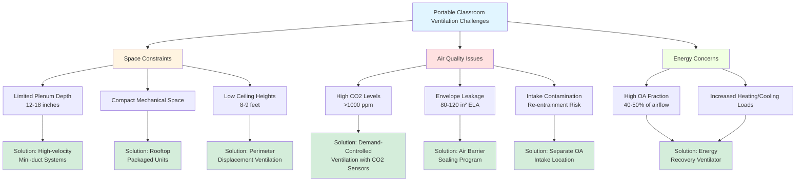

Portable classrooms present unique ventilation challenges that differ significantly from permanent school buildings. These modular structures must meet the same indoor air quality standards while contending with space constraints, construction limitations, and higher occupancy densities relative to their mechanical system capacity.

## ASHRAE 62.1 Requirements in Limited Space

Meeting ASHRAE 62.1 ventilation requirements in portable classrooms requires careful system design within severe spatial constraints. The standard mandates outdoor air ventilation rates based on floor area and occupancy:

$$V_{oz} = R_p \cdot P_z + R_a \cdot A_z$$

Where:
- $V_{oz}$ = outdoor air requirement for zone (cfm)
- $R_p$ = 10 cfm/person for classrooms (ages 9+)
- $P_z$ = zone population (typically 25-35 students)
- $R_a$ = 0.12 cfm/ft² for classrooms
- $A_z$ = zone floor area (typically 800-960 ft²)

For a standard 24' × 40' portable (960 ft²) with 30 students:

$$V_{oz} = (10 \times 30) + (0.12 \times 960) = 300 + 115 = 415 \text{ cfm}$$

This outdoor air requirement often exceeds 40% of the total system airflow in portable classrooms, creating significant challenges for unit sizing, energy consumption, and equipment placement in confined mechanical spaces.

## Outdoor Air Intake Placement Considerations

Outdoor air intake location critically affects system performance and indoor air quality. Portable classrooms face several placement constraints:

**Height Limitations**: Intakes should be located minimum 8 feet above ground level to avoid ground-level contaminants, dust, and vehicle exhaust. Many portables have overall heights of only 12-14 feet, limiting placement options.

**Proximity to Exhausts**: Maintain minimum 10-foot separation between outdoor air intakes and exhaust outlets. The compact nature of portable units often makes this separation difficult, creating potential for exhaust air re-entrainment.

**Prevailing Wind Consideration**: Position intakes away from prevailing winds carrying playground dust, parking lot emissions, or adjacent building exhausts.

**Maintenance Access**: Intake louvers and filters require regular cleaning and replacement. Rooftop or high sidewall locations complicate maintenance access.

Most portable classrooms utilize rooftop packaged units with integral outdoor air intakes, which mitigates ground-level contamination but increases susceptibility to weather infiltration and requires quality damper controls to prevent excessive outdoor air intake during unoccupied periods.

## Envelope Air Leakage in Modular Construction

Modular construction creates inherent air leakage pathways that compromise ventilation effectiveness:

**Marriage Line Joints**: The connection between factory-built modules creates continuous leakage paths along the entire building length. These joints typically exhibit air leakage rates 3-5 times higher than conventional construction.

**Window and Door Installations**: Field-installed windows and doors in portable classrooms often lack the quality of site-built installations, with air leakage rates of 0.5-0.8 cfm/ft² at 75 Pa compared to 0.2-0.3 cfm/ft² for quality permanent installations.

**Floor Penetrations**: Utility penetrations through the floor assembly for electrical, plumbing, and HVAC connections frequently lack proper air sealing.

Excessive infiltration creates multiple problems:
- Reduces delivered ventilation effectiveness
- Increases heating and cooling loads
- Creates moisture condensation risk in wall cavities
- Bypasses filtration, introducing unfiltered outdoor air

Testing of portable classrooms reveals effective air leakage areas of 80-120 in² compared to 40-60 in² for comparable permanent classrooms, indicating 50-100% higher infiltration rates.

## CO2 Levels and Occupancy Density Concerns

Portable classrooms typically have higher occupancy densities than permanent classrooms due to smaller floor areas per student. This concentration intensifies CO2 accumulation:

$$\text{CO2 generation rate} = N \cdot V_{CO2}$$

Where:
- $N$ = number of occupants (30 students + 1 teacher)
- $V_{CO2}$ = CO2 production per person (0.31 cfm for sedentary activity)

Total generation: $31 \times 0.31 = 9.6$ cfm CO2

The steady-state indoor CO2 concentration can be estimated:

$$C_i = C_o + \frac{N \cdot V_{CO2}}{V_{oa} \cdot E}$$

Where:
- $C_i$ = indoor CO2 concentration (ppm)
- $C_o$ = outdoor CO2 concentration (typically 400-450 ppm)
- $V_{oa}$ = outdoor air ventilation rate (cfm)
- $E$ = ventilation effectiveness (0.8-1.0)

For the previous example with 415 cfm outdoor air and 0.9 effectiveness:

$$C_i = 420 + \frac{9.6 \times 10^6}{415 \times 0.9} = 420 + 25,737 = 1,145 \text{ ppm}$$

This exceeds the recommended maximum of 1,000 ppm, indicating potential ventilation inadequacy despite meeting ASHRAE 62.1 prescriptive requirements.

## Ductwork Limitations in Low-Ceiling Spaces

Portable classrooms typically have finished ceiling heights of 8-9 feet with only 12-18 inches of plenum space, severely constraining ductwork design:

**Supply Duct Sizing**: Velocity limitations of 800-1,000 fpm to control noise require larger duct dimensions that often cannot fit in available plenum depths. This forces smaller ducts with higher velocities (1,200-1,500 fpm), increasing noise levels and pressure drop.

**Return Air Pathways**: Many portables use plenum returns due to insufficient space for ducted returns. This approach provides poor air distribution and allows unconditioned air from wall and ceiling cavities to mix with return air.

**Diffuser Selection**: Low ceiling heights limit diffuser throw patterns and mixing effectiveness. Standard four-way ceiling diffusers designed for 9-foot ceilings create excessive drafts in 8-foot spaces.

## Energy Recovery Options for Portable Units

Energy recovery can reduce the substantial energy penalty of high outdoor air fractions in portable classrooms:

**Enthalpy Wheels**: 24-30 inch diameter wheels can fit within rooftop unit housings, providing 60-75% total energy recovery effectiveness. These require factory integration or substantial field modification.

**Plate Heat Exchangers**: Counter-flow plate exchangers provide 50-60% sensible recovery with minimal maintenance requirements. Fixed-plate designs are more suitable for portable applications than rotary equipment.

**Run-Around Loops**: Glycol run-around loops allow separated intake and exhaust locations, accommodating the geometry constraints of portable units. Effectiveness typically reaches 45-55%.

**Economic Considerations**: Energy recovery payback periods of 3-5 years are achievable in climates with heating degree days >4,000 or cooling degree days >2,000. The high outdoor air fraction in portable classrooms improves economics compared to conventional buildings.

## Ventilation Strategy Comparison

| Strategy | Outdoor Air Delivery | Energy Efficiency | Installation Cost | Maintenance | Space Required | CO2 Control |
|----------|---------------------|-------------------|-------------------|-------------|----------------|-------------|
| **Standard RTU with Fixed OA Damper** | 400-500 cfm | Low (no recovery) | $$ | Low | Minimal | Poor (fixed flow) |
| **RTU with Economizer** | 400-500 cfm minimum | Moderate (free cooling) | $$ | Moderate | Minimal | Poor (fixed minimum) |
| **RTU with CO2-Based DCV** | 300-600 cfm variable | Moderate | $$$ | Moderate | Minimal | Excellent |
| **RTU with Enthalpy Wheel ERV** | 400-500 cfm | High (60-75% recovery) | $$$$ | High | Moderate | Good |
| **Dedicated OA Unit + Split System** | 400-500 cfm | High (with ERV) | $$$$$ | Moderate | Significant | Excellent |
| **Displacement Ventilation System** | 400-500 cfm | Moderate | $$$$ | Low | High | Very Good |

**Cost Scale**: $ = <$3,000 | $$ = $3,000-6,000 | $$$ = $6,000-10,000 | $$$$ = $10,000-15,000 | $$$$$ = >$15,000

## Implementation Recommendations

Effective portable classroom ventilation requires integrated design approaches:

1. **Specify minimum ventilation performance requirements** in procurement documents, including CO2 concentration limits (<1,000 ppm) and outdoor air delivery verification
2. **Conduct air barrier commissioning** to seal marriage lines, penetrations, and envelope discontinuities, targeting <0.25 cfm/ft² at 75 Pa
3. **Install CO2 monitoring** in every portable classroom with data logging to verify ventilation adequacy and support DCV operation
4. **Implement energy recovery** for all new portable installations in climates with >3,000 HDD or >1,500 CDD
5. **Establish maintenance protocols** specifically for portable classroom HVAC systems, including quarterly outdoor air intake inspection and damper verification

The compact geometry, modular construction methods, and high occupancy density of portable classrooms create ventilation challenges that require specialized design attention beyond standard classroom HVAC approaches. Successful implementations balance prescriptive code requirements with performance verification to ensure actual delivered indoor air quality meets educational environment needs.
