School cafeteria dining areas present demanding HVAC design challenges due to extreme occupancy variations, with spaces transitioning from empty to 400+ students within minutes during lunch periods. Effective design requires addressing high peak cooling loads, maintaining proper pressure relationships with the kitchen, preventing odor migration, managing thermal stratification in high-ceiling spaces, and controlling noise from HVAC equipment in acoustically sensitive environments.

## High Occupancy Load Calculations

Peak cooling loads in cafeteria dining areas occur during lunch periods when maximum student occupancy coincides with heat transfer from adjacent kitchens and high metabolic heat generation. The total cooling load comprises sensible and latent components from occupants, lighting, envelope gains, and infiltration.

### Occupant Heat Gain

Students seated in dining areas generate metabolic heat at approximately 250 Btu/hr per person (seated, light activity). For a typical 400-student capacity cafeteria, the occupant sensible heat gain is:

$$Q_{sensible} = N \times q_s = 400 \times 145 = 58,000 \text{ Btu/hr}$$

where $N$ is the number of occupants and $q_s$ is the sensible heat gain per person (145 Btu/hr for seated dining at 75°F room temperature).

The latent heat gain from moisture release through respiration and perspiration adds:

$$Q_{latent} = N \times q_l = 400 \times 105 = 42,000 \text{ Btu/hr}$$

where $q_l$ is the latent heat gain per person (105 Btu/hr for seated, light activity). Total occupant load reaches 100,000 Btu/hr (approximately 8.3 tons) at peak occupancy.

### Total Cooling Load

The complete cooling load calculation includes envelope gains, lighting, equipment, and ventilation air:

$$Q_{total} = Q_{occupants} + Q_{envelope} + Q_{lighting} + Q_{ventilation} + Q_{infiltration}$$

For a 5,000 ft² cafeteria dining area with typical construction:

| Load Component | Calculation | Load (Btu/hr) |
|----------------|-------------|---------------|
| Occupants (400 students) | 400 × 250 Btu/hr | 100,000 |
| Solar + envelope | 5,000 ft² × 8 Btu/hr·ft² | 40,000 |
| Lighting | 5,000 ft² × 1.2 W/ft² × 3.41 | 20,460 |
| Ventilation air | 3,000 cfm × 1.08 × 20°F ΔT | 64,800 |
| Infiltration | 5,000 ft² × 0.1 cfm/ft² × 1.08 × 20°F | 10,800 |
| **Total** | | **236,060** |

This yields a total peak cooling load of approximately 19.7 tons. Design practice adds 15-25% safety factor for rapid pulldown and diversity, resulting in a design capacity of 23-25 tons for this example.

## Variable Occupancy Management

Cafeteria dining areas experience the most dramatic occupancy swings of any school space, cycling from zero occupants to full capacity within 5-10 minutes as students are released for lunch periods. This presents challenges for both thermal control and ventilation.

### Occupancy Patterns

Typical school lunch schedules create 3-5 distinct lunch periods, each lasting 25-35 minutes with 5-10 minute turnover between periods. A representative schedule shows:

```mermaid
gantt
    title School Cafeteria Daily Occupancy Pattern
    dateFormat HH:mm
    axisFormat %H:%M

    section Occupancy
    Breakfast (50 students)     :07:00, 07:45
    Empty                       :07:45, 10:45
    1st Lunch (400 students)    :10:45, 11:20
    Turnover                    :11:20, 11:25
    2nd Lunch (400 students)    :11:25, 12:00
    Turnover                    :12:00, 12:05
    3rd Lunch (350 students)    :12:05, 12:40
    Empty                       :12:40, 14:30
    After school (100 students) :14:30, 15:15
    Empty                       :15:15, 18:00
```

This occupancy profile demands HVAC systems capable of rapid response to sudden load changes while minimizing energy waste during unoccupied periods.

### Demand-Controlled Ventilation

ASHRAE Standard 62.1 specifies outdoor air ventilation rates of 7.5 cfm per person for food and beverage service areas. At peak occupancy of 400 students:

$$Q_{OA,design} = 400 \times 7.5 = 3,000 \text{ cfm}$$

However, conditioning this outdoor air volume during unoccupied periods wastes significant energy. Demand-controlled ventilation (DCV) using CO₂ sensors or occupancy detection reduces outdoor air to code minimum (typically 0.06 cfm/ft² or 300 cfm for a 5,000 ft² space) during low/no occupancy.

Annual energy savings from DCV can be calculated by comparing constant ventilation energy to variable ventilation:

$$E_{saved} = (Q_{OA,constant} - Q_{OA,avg}) \times 1.08 \times DD \times 24$$

For a school in a climate with 5,000 cooling degree-days, assuming average occupancy of 20% (occupied only 2 hours per 10-hour school day):

- Constant OA: 3,000 cfm
- Average OA with DCV: (3,000 × 0.2) + (300 × 0.8) = 840 cfm
- Savings: (3,000 - 840) × 1.08 × 5,000 × 24 = 280 million Btu/year

At $0.10/therm heating cost, this represents $2,800 annual savings for a single dining area.

### Rapid Response Strategies

To accommodate 5-10 minute occupancy transitions, the HVAC system must respond quickly to prevent temperature drift:

**Equipment oversizing**: Design cooling capacity 20-30% above calculated peak load to provide rapid pulldown capability when 400 students suddenly occupy a previously empty space.

**Supply air temperature reset**: Lower supply air temperature by 3-5°F during the initial 10 minutes of occupancy to provide additional sensible cooling capacity without increasing airflow or noise.

**Anticipatory control**: Program building automation systems to begin pre-cooling the space 10-15 minutes before scheduled lunch periods, reducing space temperature to 72°F before occupancy.

**Zoned control**: Separate serving line areas from main dining zones, as serving areas maintain higher continuous occupancy throughout lunch periods.

## Kitchen-to-Dining Pressure Relationships

Proper pressure differentials between kitchen and dining areas prevent odor migration while maintaining safe door operation. The pressure hierarchy follows:

**Adjacent corridors** (0 Pa reference) → **Dining area** (-2.5 to -5 Pa) → **Kitchen** (-7.5 to -12.5 Pa)

This cascade ensures air flows from cleaner to less clean areas. The pressure differential across the kitchen-to-dining boundary prevents cooking odors, grease aerosols, and humidity from migrating into student dining spaces.

### Pressure Control Implementation

Achieving stable pressure relationships requires balancing exhaust, supply, and transfer air:

$$Q_{exhaust,kitchen} = Q_{supply,kitchen} + Q_{transfer} + Q_{leakage}$$

For a kitchen requiring 8,000 cfm exhaust (Type I and Type II hoods combined):

- Supply air to kitchen: 6,000 cfm
- Transfer from dining: 1,500 cfm
- Infiltration/leakage: 500 cfm

The dining area must be designed to provide the 1,500 cfm transfer without creating excessive noise through door undercuts or transfer grilles. Transfer grille sizing follows:

$$A_{grille} = \frac{Q_{transfer}}{V_{face}}$$

where face velocity $V_{face}$ should not exceed 400-500 fpm to limit noise. For 1,500 cfm transfer:

$$A_{grille} = \frac{1,500}{450} = 3.33 \text{ ft}^2$$

This requires a 2'×2' grille or equivalent distributed area. Install transfer grilles near the ceiling on the dining area side to prevent direct odor flow into occupied zones.

### Monitoring and Verification

Install differential pressure sensors between zones to verify proper pressure cascade:

- **Corridor to dining**: +2.5 to +5 Pa (dining negative to corridor)
- **Dining to kitchen**: +5 to +7.5 Pa (kitchen more negative than dining)

Building automation systems maintain these differentials by modulating supply and exhaust fan speeds. When pressure differentials deviate beyond setpoints, the BAS adjusts damper positions or fan speeds to restore proper relationships.

## Odor Migration Prevention

Beyond pressure control, additional strategies minimize odor transmission from kitchen to dining areas:

**Physical separation**: Locate serving lines as a buffer zone between kitchen and main dining area. The serving line operates at intermediate pressure (-5 to -7.5 Pa) between dining and kitchen.

**Vestibule design**: Create airlock entries between kitchen and dining with self-closing doors on both sides. The vestibule exhaust maintains negative pressure relative to both adjacent spaces.

**Dedicated ductwork separation**: Never connect kitchen exhaust and dining area return/exhaust systems. Cross-contamination through shared ductwork defeats all pressure control efforts.

**Exhaust discharge location**: Position kitchen exhaust terminations downwind of prevailing winds and at least 25 feet from any building air intake. Mount exhaust stacks 3-5 feet above roof level with upward discharge to promote dilution.

**Air curtains**: Install air curtains at serving line openings to create a high-velocity air barrier (500-800 fpm) preventing odor migration during peak service periods when doors remain open.

## High Ceiling Stratification Control

Many school cafeterias feature ceiling heights of 16-24 feet to create open, acoustically controlled environments. These high ceilings promote thermal stratification during both heating and cooling modes.

### Stratification Physics

The temperature gradient in stratified spaces follows:

$$\frac{dT}{dz} = \frac{T_{ceiling} - T_{floor}}{H}$$

where $H$ is ceiling height. For a 20-foot ceiling with 10°F stratification, the gradient is 0.5°F per foot of height. This stratification wastes energy by:

- Overheating ceiling spaces during winter, increasing envelope heat loss
- Under-cooling occupied zones during summer while over-cooling ceiling spaces
- Creating uncomfortable conditions at the 4-6 foot occupied zone height

### Air Distribution Design

Combat stratification through proper supply air distribution:

**High-induction diffusers**: Use linear diffusers or high-induction square diffusers mounted 12-18 feet above floor level. These diffusers discharge air at 800-1,500 fpm, inducing room air entrainment to create mixing before air reaches the occupied zone.

The throw distance should reach 75-85% of the floor-to-diffuser height:

$$L = \frac{V_t}{50} \times K$$

where $L$ is throw to 50 fpm terminal velocity, and $K$ is the diffuser coefficient (1.5-2.0 for high-induction units). For 15-foot mounting height:

$$L = 0.75 \times 15 = 11.25 \text{ ft minimum throw}$$

**Supply air temperature**: During cooling mode, supply air temperature should not exceed 15°F below room temperature to prevent dumping. For 75°F space temperature, maximum supply is 60°F. During heating, maintain supply temperatures below 95°F to prevent excessive stratification.

**Air changes**: Provide 6-10 air changes per hour during occupancy to maintain mixing. For a 5,000 ft² cafeteria with 20-foot ceilings:

$$Q_{supply} = \frac{5,000 \times 20 \times 8}{60} = 13,333 \text{ cfm}$$

### Destratification Fans

Ceiling-mounted destratification fans provide supplemental mixing during heating season. Size fans for 4-6 air changes per hour:

$$Q_{fans} = \frac{100,000 \times 5}{60} = 8,333 \text{ cfm}$$

This translates to 6-8 fans rated at 1,000-1,500 cfm each, spaced evenly across the ceiling at intervals not exceeding 1.5 times ceiling height (30 feet maximum spacing for 20-foot ceilings).

Operate fans in reverse (upward discharge) during cooling season to reduce stratification without creating drafts in occupied zones.

## Acoustical Considerations

School cafeterias rank among the noisiest educational spaces, with background noise levels during lunch periods reaching 75-85 dBA. HVAC systems must not significantly contribute to this acoustic environment.

### HVAC Noise Criteria

ASHRAE Applications Handbook recommends NC-35 to NC-40 for dining spaces. This translates to maximum HVAC-contributed background sound of 40-45 dBA. During unoccupied periods (testing, food service setup), limit HVAC noise to NC-30 (35-40 dBA).

### Duct System Acoustic Design

Minimize HVAC noise through:

**Low face velocities**: Limit diffuser face velocity to 400-500 fpm. High-velocity diffusers (800+ fpm discharge) should reduce to below 300 fpm face velocity through induction mixing before reaching the occupied zone.

**Duct velocities**: Main ducts 1,200-1,800 fpm maximum, branch ducts 800-1,200 fpm, runouts to diffusers 400-600 fpm.

**Duct silencers**: Install 3-5 foot silencers in supply and return mains within 20 feet of air handling units. Silencers should provide minimum 15 dB insertion loss at 125-500 Hz octave bands where fan noise predominates.

**Flexible connections**: Install 4-6 inch flexible duct connectors at all fan connections to prevent structure-borne vibration transmission.

**Vibration isolation**: Mount air handling units on spring isolators (1.0-1.5 inch deflection) with inertia bases for units exceeding 2,000 cfm.

### Return Air Pathway Design

Return air transfer grilles and louvers must not create noise hotspots. Size return grilles for maximum 300-400 fpm face velocity:

$$A_{return} = \frac{Q_{return}}{V_{face}} = \frac{13,000}{350} = 37 \text{ ft}^2$$

Distribute this area across multiple grilles rather than concentrating in single large grilles. Wall-mounted return grilles should be located away from high-traffic pathways and student seating areas.

## HVAC System Types and Selection

Several system configurations suit cafeteria dining areas, each with specific advantages:

| System Type | Advantages | Limitations | Typical Application |
|-------------|------------|-------------|---------------------|
| Packaged rooftop units | Low first cost, simple maintenance, good for single-story | Limited humidity control, noise concerns if not ducted properly | Elementary schools, <6,000 ft² |
| Built-up air handlers | Excellent control, humidity management, lower noise | Higher first cost, requires mechanical room space | Middle/high schools, >6,000 ft² |
| Split systems (multiple units) | Zone control, redundancy, phased installation | Coordination complexity, refrigerant piping runs | Renovations, phased construction |
| Dedicated outdoor air system + local units | Superior IAQ, energy recovery, independent ventilation/thermal control | Highest first cost, complex controls | New construction, high-performance schools |

### Equipment Sizing Summary

For a representative 5,000 ft² dining area serving 400 students:

- **Cooling capacity**: 20-25 tons (240,000-300,000 Btu/hr)
- **Heating capacity**: 300,000-400,000 Btu/hr (assumes 70°F indoor, 0°F outdoor design)
- **Supply airflow**: 8,000-10,000 cfm (3.2-4.0 cfm/ft²)
- **Outdoor air**: 3,000 cfm at peak occupancy, 300-500 cfm minimum
- **Exhaust/relief**: 500-1,000 cfm continuous (toilet exhaust, pressurization relief)

## Controls Integration and Scheduling

Coordinate dining area HVAC with kitchen exhaust systems and building occupancy schedules:

**Pre-occupancy setup**: Begin HVAC operation 30-60 minutes before first lunch period to stabilize space conditions. Pre-cool to 72°F during cooling season, pre-heat to 70°F during heating season.

**Occupancy modes**: Switch to high-occupancy mode (full outdoor air, maximum cooling capacity) based on lunch period schedule or CO₂ sensor indication >800 ppm.

**Unoccupied setback**: Between lunch periods, raise cooling setpoint to 78°F and reduce outdoor air to minimum. During extended unoccupied periods (after school hours), set to 85°F cooling/65°F heating.

**Weekend/holiday mode**: Maintain space at 55°F heating setpoint during winter to prevent freeze damage to serving line equipment. Disable cooling except for high-limit protection (90°F).

**Pressure control interlock**: When kitchen exhaust operates, maintain dining area supply at designed transfer airflow rate. When kitchen exhaust is off, balance dining area supply/return to neutral building pressure.

These strategies create comfortable, odor-free dining environments while minimizing energy consumption across the diverse operating schedule of school cafeterias.
