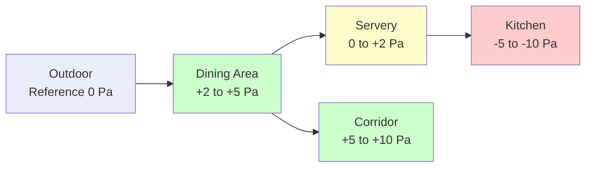
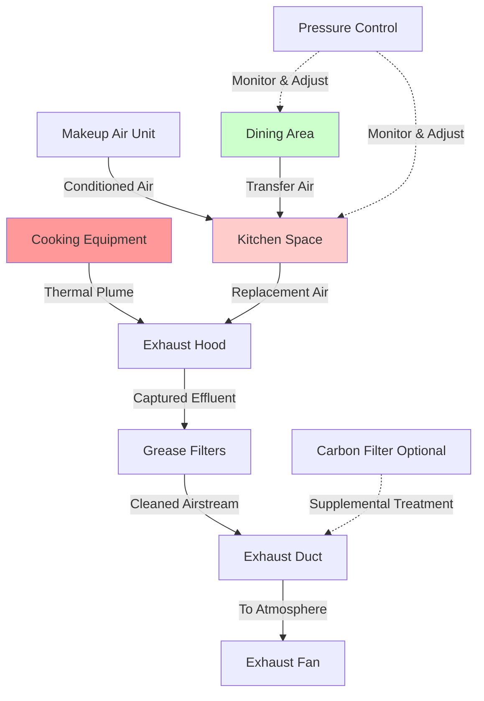

Effective odor control in school cafeterias requires coordinated design of exhaust systems, makeup air delivery, and pressure management to prevent cooking odors from migrating into adjacent corridors, classrooms, and dining areas.

## Kitchen Exhaust Hood Sizing

Hood sizing must provide adequate capture velocity and volumetric flow to contain and remove cooking effluent before it escapes into the occupied space.

### Capture Efficiency Principles

Exhaust hoods achieve capture efficiency through:

- **Canopy overhang**: Hood extends 6-12 inches beyond cooking equipment on all open sides
- **Mounting height**: Lower hoods (6.5-7 feet AFF) improve capture with reduced exhaust volume
- **Hood depth**: Minimum 24 inches from front to back for adequate plume containment
- **Side panels**: Full or partial end panels reduce required exhaust by 15-20%

The required exhaust flow for Type I grease hoods depends on hood type, appliance duty, and configuration:

$$Q_{hood} = A_{hood} \times CFM/ft^2$$

where $A_{hood}$ is the hood face area in square feet, and the CFM per square foot varies by application.

### Exhaust Rates by Equipment Type

| Equipment Type | Light Duty (CFM/ft²) | Medium Duty (CFM/ft²) | Heavy Duty (CFM/ft²) |
|----------------|----------------------|-----------------------|----------------------|
| Ovens (convection) | 200 | 250 | 300 |
| Ranges (gas) | 250 | 300 | 400 |
| Griddles (flat) | 250 | 300 | 350 |
| Fryers (open deep) | 300 | 350 | 400 |
| Charbroilers | 300 | 400 | 500 |
| Steamers | 200 | 250 | - |
| Combi ovens | 250 | 300 | 350 |
| Dishwashers | 150 | 200 | - |

Wall-mounted canopy hoods typically require 200-300 CFM per linear foot, while backshelf hoods need 300-500 CFM per linear foot due to their proximity-based capture mechanism.

## Makeup Air Balance

The makeup air system must replace exhausted air to prevent building depressurization, which causes door closure problems, backdrafting of combustion appliances, and infiltration of unconditioned outdoor air.

### Air Balance Calculation

For proper operation, makeup air should equal 80-100% of total exhaust:

$$Q_{MUA} = 0.8 \times Q_{exhaust,total}$$

The remaining 10-20% comes from transfer air from adjacent dining areas, creating the desired pressure cascade.

### Makeup Air Delivery Methods

1. **Direct-fired makeup air units**: Deliver tempered air directly into kitchen, most energy-efficient
2. **Dedicated makeup air units**: Provide conditioned air, higher operating cost
3. **Hood-integrated supply**: Air curtain or perforated plenum supply, improved capture
4. **Displacement supply**: Low-level or side-wall delivery with reduced throw velocity

Makeup air discharge velocity should not exceed 500 FPM at 5 feet from outlet to avoid disrupting hood capture.

## Kitchen-to-Corridor Pressure Relationships

Proper pressure control prevents odor migration while maintaining adequate ventilation rates.

### Pressure Cascade Design

The optimal pressure hierarchy for school cafeterias:

This arrangement ensures:

- Kitchen operates negative relative to all adjacent spaces
- Dining area slight positive to corridors prevents infiltration
- Servery transitional pressure prevents excessive airflow velocities
- Corridor positive pressure limits outdoor air infiltration

The required differential pressure:

$$\Delta P = \frac{Q^2 \times \rho}{2 \times C_d^2 \times A^2}$$

where $Q$ is airflow through opening, $\rho$ is air density, $C_d$ is discharge coefficient (typically 0.65), and $A$ is opening area.

## Transfer Air from Dining to Kitchen

Transfer air provides controlled airflow from dining areas to kitchens, contributing to kitchen ventilation while maintaining proper pressure relationships.

### Transfer Air Design Criteria

Maximum recommended transfer air percentages:

- **20-40%** of kitchen exhaust from dining area
- **Louver or transfer grille** minimum 350 FPM face velocity
- **Wall location** above 7 feet AFF to avoid occupant discomfort
- **Acoustical treatment** required to prevent sound transmission

The transfer opening area required:

$$A_{transfer} = \frac{Q_{transfer}}{V_{face}}$$

For 2,000 CFM transfer air at 400 FPM: $A = 2000/400 = 5.0$ ft²

## Activated Carbon Filtration

Activated carbon filters remove odor-causing compounds when direct outdoor exhaust is impractical or when additional odor reduction is required.

### Carbon Filter Performance

Activated carbon adsorbs volatile organic compounds through:

- **Surface area**: 500-1,500 m²/g provides adsorption sites
- **Residence time**: Minimum 0.1-0.2 seconds contact time
- **Face velocity**: 250-500 FPM through carbon media
- **Bed depth**: 2-4 inches for commercial applications

Removal efficiency for typical cooking odors ranges from 70-90% with fresh media, declining to 40-60% at end of service life (typically 6-12 months in school applications).

### Application Limitations

Carbon filtration works best for:

- Recirculating hoods over light-duty equipment (warmers, steamers)
- Supplemental treatment of kitchen general exhaust
- Situations where outdoor exhaust is restricted

Not recommended as sole treatment for grease-producing appliances due to fire code requirements for grease duct construction.

## Grease and Particulate Capture

Capture effectiveness directly impacts odor control, as particulate-bound odor compounds must be removed before entering the ductwork.

### Grease Removal Methods

1. **Baffle filters**: 60-80% grease removal, most common in schools
2. **Cartridge filters**: 85-95% removal, higher maintenance
3. **Water-wash systems**: 90-98% removal, water treatment required
4. **Electrostatic precipitators**: 95%+ removal, high initial cost

The relationship between capture efficiency and hood design:

$$\eta_{capture} = 1 - e^{-\frac{V_{face} \times L}{V_{plume} \times H}}$$

where $V_{face}$ is face velocity, $L$ is hood depth, $V_{plume}$ is plume rise velocity, and $H$ is distance from cooking surface to hood.

## System Integration

Complete odor control requires coordination of all components:

### Balancing Procedures

Commission the system by:

1. Verify exhaust airflow at each hood (pitot traverse or flow hood)
2. Measure and adjust makeup air delivery to achieve 80-90% of exhaust
3. Check pressure differentials with all doors closed
4. Test transfer air pathways under normal operation
5. Verify no reverse flow from kitchen to dining during occupied periods

Continuous monitoring using differential pressure sensors across kitchen/dining boundary provides operational verification and alerts maintenance to filter loading or fan failure.

## Energy Recovery Considerations

Kitchen exhaust contains significant sensible and latent energy, but grease content complicates heat recovery.

Viable approaches for school cafeterias:

- **Glycol runaround loops**: Separate airstreams, moderate efficiency (45-60%)
- **Heat pipe exchangers**: No moving parts, lower efficiency (40-50%)
- **Dedicated outdoor air system**: Recover from general exhaust, not grease-laden hood exhaust

Energy recovery from hood exhaust requires placement downstream of grease removal and regular maintenance to prevent fouling.