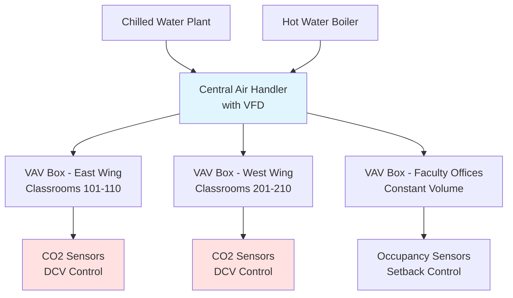
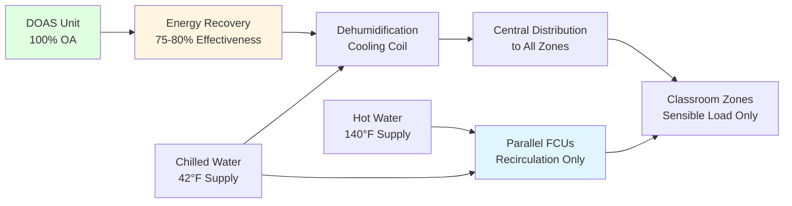

## Overview

University and college classroom buildings present unique HVAC challenges due to fluctuating occupancy patterns, diverse space types, and scheduling complexity. Unlike dedicated lecture halls or laboratories, these mixed-use facilities house standard classrooms, seminar rooms, faculty offices, computer labs, and collaboration spaces within a single building envelope. Proper HVAC design must accommodate rapid occupancy changes between class periods, widely varying thermal and ventilation loads, and energy efficiency requirements during unoccupied periods.

## Scheduling Diversity and Load Variation

### Occupancy Patterns

Classroom buildings experience dramatic occupancy swings throughout the day:

- **Peak periods**: 10:00 AM - 2:00 PM with 80-90% space utilization
- **Off-peak periods**: Early morning and late afternoon with 20-40% utilization
- **Evening use**: Selected classrooms for continuing education or graduate programs
- **Weekend operation**: Minimal use, typically under 10% occupancy

This scheduling diversity creates opportunities for energy savings but requires sophisticated control strategies. A building sized for peak cooling loads will operate at partial load 60-70% of operating hours.

### Load Calculation Considerations

Design loads for classroom buildings must account for:

| Load Component | Design Value | Diversity Factor |
|----------------|--------------|------------------|
| Occupancy | 20-25 people per classroom | 0.75-0.85 building-wide |
| Lighting | 1.0-1.3 W/ft² | 0.80 simultaneous use |
| Receptacle loads | 0.5-1.0 W/ft² | 0.70 diversity |
| Ventilation | Per ASHRAE 62.1 | Variable with DCV |

**Critical**: Apply diversity factors only at the central plant or air handler level, never at individual zone calculations. Simultaneous peak conditions in multiple zones occur frequently during class changes.

## HVAC System Configurations

### Variable Air Volume Systems

VAV systems dominate classroom building applications due to their ability to match varying loads:

**System characteristics**:
- Central air handlers with 40-60% minimum airflow during heating
- CO2-based demand controlled ventilation in each classroom
- Pressure-independent VAV terminals for precise control
- Hot water reheat coils for simultaneous heating/cooling capability

### Dedicated Outdoor Air Systems

DOAS configurations separate ventilation from space conditioning:

**Advantages for classroom buildings**:
- Decoupled ventilation allows independent control of fresh air delivery
- Energy recovery reduces conditioning load on outdoor air
- Fan coil units provide quiet, responsive zone control
- Reduced duct sizes in ceiling plenums
- Superior humidity control in humid climates

### Hybrid Systems

Many modern classroom buildings employ hybrid approaches combining different systems based on space function:

- **Classrooms**: VAV with DCV for flexibility
- **Faculty offices**: Fan coil units or split systems for individual control
- **Computer labs**: Constant volume systems for equipment cooling
- **Corridors**: Transfer air systems or minimal conditioning
- **Restrooms**: Dedicated exhaust with makeup air from corridors

## Demand Controlled Ventilation

### Implementation Strategy

ASHRAE 62.1 requires outdoor air ventilation rates of 10 CFM per person plus 0.12 CFM/ft² for classrooms. With occupancy ranging from 0 to 35 people in a typical 750 ft² classroom, ventilation requirements vary dramatically:

**Minimum condition** (unoccupied):
- Area component: 750 ft² × 0.12 CFM/ft² = 90 CFM

**Maximum condition** (35 students):
- People component: 35 × 10 CFM/person = 350 CFM
- Area component: 90 CFM
- **Total required**: 440 CFM

DCV systems modulate outdoor air based on real-time CO2 measurements, typically maintaining 1,000-1,200 ppm setpoints. Energy savings range from 25-40% compared to constant ventilation at design occupancy.

### Sensor Placement and Calibration

Proper CO2 sensor installation is critical:

- Mount at breathing zone height (4-5 feet above floor)
- Locate away from windows, doors, and supply diffusers
- Install in return air path or representative room location
- Calibrate sensors annually to outdoor air baseline
- Use dual-beam NDIR sensors for long-term accuracy

## Control Sequences and Strategies

### Scheduling and Setback

Classroom buildings benefit from aggressive setback strategies tied to academic schedules:

**Occupied mode** (15 minutes before classes):
- Temperature setpoints: 72°F cooling / 70°F heating
- Full ventilation per ASHRAE 62.1
- Lighting systems energized per occupancy schedule

**Unoccupied mode** (nights and weekends):
- Temperature setpoints: 78°F cooling / 65°F heating
- Minimum outdoor air for building pressurization only
- Systems operate at reduced capacity

**Warm-up/cool-down mode**:
- Starts 1-2 hours before occupancy based on outdoor temperature
- Maximum heating or cooling output
- Minimal outdoor air during pull-down

### Zone-Level Control Logic

Individual classroom VAV boxes employ the following sequence:

1. **Normal cooling**: Damper modulates from minimum to maximum airflow based on zone temperature
2. **Deadband**: Damper remains at minimum position, no heating or cooling
3. **Heating**: Damper remains at minimum, reheat valve modulates to maintain setpoint
4. **Unoccupied**: Damper closes to minimum position (typically 30% for ventilation), setback temperatures active

### Central Plant Optimization

Building-level strategies reduce overall energy consumption:

- **Economizer operation**: Use 100% outdoor air when conditions permit (typically OAT < 55-60°F)
- **Supply air temperature reset**: Increase SAT from 55°F to 60-65°F when no zones require full cooling
- **Static pressure reset**: Reduce duct static pressure setpoint when VAV boxes are not fully open
- **Chilled water temperature reset**: Increase CHW supply temperature based on building load

## Energy Code Compliance

### ASHRAE 90.1 and IECC Requirements

Modern classroom buildings must meet stringent energy efficiency standards:

**Ventilation**:
- Demand controlled ventilation required for spaces > 500 ft² and > 40 people/1,000 ft² (ASHRAE 90.1-2019)
- Energy recovery ventilators required when outdoor air > 5,000 CFM (varies by climate zone)

**HVAC equipment**:
- Fan power limitations: 0.9-1.1 W/CFM depending on system configuration
- Variable speed drives on all fans > 7.5 HP
- Economizers required in most climate zones for systems > 54,000 BTU/hr cooling

**Controls**:
- Automatic setback during unoccupied periods
- Zone temperature controls with ±2°F accuracy
- HVAC system shutoff when spaces unoccupied > 30 minutes

## Acoustic Considerations

Classroom environments demand low background noise for speech intelligibility:

- **Design criterion**: NC 30-35 for standard classrooms
- **Supply air velocity**: Limit to 400-500 FPM at diffusers
- **VAV box noise**: Use acoustically lined boxes or remote-mounted units
- **Duct design**: Avoid high velocity ductwork near diffusers; use 1,500-2,000 FPM maximum duct velocities
- **Vibration isolation**: Mount all rotating equipment on spring or neoprene isolators

## Special Considerations

### Technology-Enhanced Classrooms

Modern active learning classrooms require additional cooling capacity:

- Add 0.5-1.0 W/ft² for projection systems, displays, and control equipment
- Provide dedicated cooling for equipment racks
- Consider raised floor systems for cable management and underfloor air distribution

### Flexible Learning Spaces

Movable partitions and reconfigurable rooms present control challenges:

- Use pressure-independent VAV boxes that maintain accurate airflow regardless of system pressure
- Provide individual zone control even for dividable spaces
- Design for maximum occupancy in each configuration
- Install CO2 sensors in each subdividable area

### Future Adaptability

Design systems for changing educational delivery models:

- Provide 20-30% excess capacity in ductwork and piping distribution
- Use modular air handling equipment for easy expansion
- Install control infrastructure supporting future integration
- Design electrical and mechanical rooms with space for additional equipment

---

**Reference Standards**:
- ASHRAE 62.1: Ventilation for Acceptable Indoor Air Quality
- ASHRAE 90.1: Energy Standard for Buildings
- ASHRAE Handbook - HVAC Applications, Chapter 7: Educational Facilities
