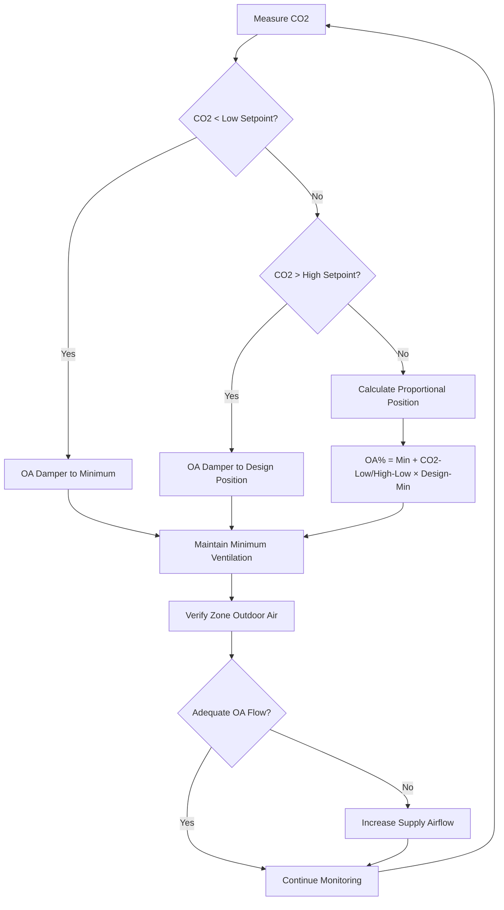
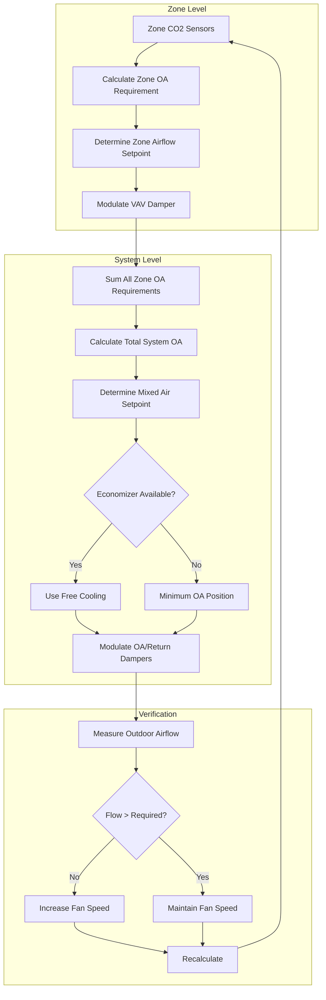

Demand control ventilation adjusts outdoor air delivery based on measured CO2 concentration, serving as a proxy for actual occupancy in classrooms and other educational spaces. This approach reduces ventilation energy consumption by 30-50% compared to constant outdoor air systems while maintaining ASHRAE 62.1 compliance and acceptable indoor air quality.

## ASHRAE 62.1 Requirements for DCV

ASHRAE Standard 62.1 Section 6.2.7 establishes specific conditions under which demand-controlled ventilation is permitted for educational facilities.

**Mandatory Compliance Requirements:**

1. **Minimum Ventilation Rate**: The system must continuously deliver the area component (Ra × Az) during all occupied periods, regardless of measured CO2 levels. For classrooms, this equals 0.12 cfm/ft².

2. **CO2 Setpoint Limit**: Indoor CO2 concentration must not exceed outdoor concentration by more than 700 ppm. With typical outdoor levels of 400-450 ppm, the maximum indoor setpoint is 1,100-1,150 ppm.

3. **Sensor Performance**: CO2 sensors must meet minimum accuracy specifications and maintain calibration per manufacturer requirements. Non-dispersive infrared (NDIR) technology is required for reliable detection.

4. **Zone-Level Control**: Each thermal zone with independent outdoor air control requires dedicated CO2 measurement. Multi-zone systems averaging CO2 across zones do not meet the standard unless each zone receives proportional outdoor air distribution.

5. **Design Documentation**: The ventilation system design must demonstrate that minimum ventilation rates are maintained at all occupancy levels and that controls prevent CO2 from exceeding prescribed limits.

**Ventilation Rate Calculation:**

The required outdoor air for classroom zones follows:

Voz = Rp × Pz + Ra × Az

Where:
- Voz = Zone outdoor airflow (cfm)
- Rp = 10 cfm/person for classrooms (ages 9+)
- Pz = Design occupancy (people)
- Ra = 0.12 cfm/ft² for classrooms
- Az = Zone floor area (ft²)

For a typical 960 ft² classroom with 32 students:
- People component: 10 cfm/person × 32 = 320 cfm
- Area component: 0.12 cfm/ft² × 960 = 115 cfm
- Total design outdoor air: 435 cfm

DCV reduces the people component proportionally to measured occupancy while maintaining the area component of 115 cfm at all times.

## Energy Code DCV Requirements

The International Energy Conservation Code (IECC) and ASHRAE Standard 90.1 mandate DCV for specific applications in educational facilities.

**ASHRAE 90.1 DCV Triggers:**

Demand-controlled ventilation is required when ALL of the following conditions exist:

- Design occupancy ≥ 25 people per 1,000 ft² of floor area
- System design outdoor air capacity > 3,000 cfm
- Air-side economizer is present in the system

Classrooms for students ages 9 and older have a default occupancy density of 35 people per 1,000 ft² per ASHRAE 62.1, exceeding the 25 people/1,000 ft² threshold. Multi-classroom air handlers serving more than 7-8 typical classrooms exceed 3,000 cfm outdoor air capacity, triggering the DCV requirement.

**Exceptions:**

DCV is NOT required for:
- Systems with energy recovery ventilation capturing ≥ 70% of sensible and latent energy
- Multiple-zone VAV systems with zone-level ventilation optimization controls per ASHRAE 62.1 Section 6.2.7
- Spaces with 24-hour occupancy patterns

**IECC Provisions:**

Recent IECC editions (2018 and later) align with ASHRAE 90.1 requirements, mandating DCV for high-occupancy educational spaces unless exempted by energy recovery or advanced ventilation controls.

## CO2-Based Control Fundamentals

Carbon dioxide concentration provides an effective occupancy indicator based on human metabolic CO2 generation rates.

**Steady-State CO2 Relationship:**

At equilibrium conditions:

Css = Coa + (N × G) / Voa

Where:
- Css = Steady-state indoor CO2 (ppm)
- Coa = Outdoor CO2 (typically 400-450 ppm)
- N = Number of occupants
- G = CO2 generation rate per person (0.0052 cfm at sedentary activity)
- Voa = Outdoor airflow rate (cfm per person)

**Example:**

For 10 cfm/person ventilation rate:
Css = 450 + (1 × 0.0052) / (10/1,000,000) = 450 + 520 = 970 ppm

At full design occupancy with proper ventilation, classroom CO2 should stabilize between 900-1,100 ppm above outdoor levels.

**Dynamic Response:**

CO2 concentration changes follow exponential approach to steady state:

C(t) = Css - (Css - C0) × e^(-t/τ)

Where:
- τ = Time constant = V / Voa (room volume / outdoor airflow)
- C0 = Initial CO2 concentration

For a 960 ft² classroom with 10-foot ceilings and 435 cfm outdoor air:
τ = (960 × 10) / 435 = 22 minutes

The space reaches 95% of steady-state CO2 in approximately 3τ or 66 minutes, explaining the lag between occupancy changes and CO2 response.

## DCV Control Sequences

Effective DCV implementation requires properly structured control logic that maintains code compliance while maximizing energy savings.

### Proportional Control Algorithm

**Control Equation:**

OA_position = OA_min + [(CO2_meas - CO2_low) / (CO2_high - CO2_low)] × (OA_design - OA_min)

Where:
- OA_position = Commanded outdoor air damper position (%)
- OA_min = Minimum position for area component ventilation
- OA_design = Full design position for maximum occupancy
- CO2_low = Lower control threshold (typically 800 ppm)
- CO2_high = Upper control threshold (typically 1,100 ppm)
- CO2_meas = Measured CO2 concentration (ppm)

**Setpoint Selection:**

| Parameter | Recommended Value | Rationale |
|-----------|------------------|-----------|
| CO2_low | 750-850 ppm | Minimum occupancy threshold |
| CO2_high | 1,050-1,150 ppm | ASHRAE 62.1 compliance (700 ppm above outdoor) |
| Dead band | 50-100 ppm | Prevents control oscillation |
| Sampling interval | 3-5 minutes | Balances response time with stability |

### Multi-Zone VAV Control Sequence

Systems serving multiple classrooms require coordinated zone-level and system-level control:

**System-Level Calculation:**

Total system outdoor air requirement:

Vtot = Σ(Voz,i) / Ez

Where:
- Vtot = Total system outdoor air (cfm)
- Voz,i = Zone outdoor air for zone i
- Ez = Zone air distribution effectiveness (typically 1.0 for overhead supply)

The system outdoor air damper modulates to deliver Vtot while individual zone dampers adjust to provide each zone's required Voz based on local CO2 measurements.

## Sensor Specification and Placement

Reliable DCV performance depends on properly specified and positioned CO2 sensors.

**Technical Specifications:**

| Parameter | Minimum Requirement | Preferred Specification |
|-----------|-------------------|------------------------|
| Technology | NDIR (non-dispersive infrared) | Dual-wavelength NDIR |
| Range | 0-2,000 ppm | 0-5,000 ppm |
| Accuracy | ±75 ppm or ±5% | ±50 ppm or ±3% |
| Response time (T90) | <3 minutes | <2 minutes |
| Drift | <100 ppm over 5 years | <50 ppm over 5 years |
| Calibration | Manual or automatic | Automatic background calibration |
| Operating temperature | 32-122°F | 0-140°F |
| Operating humidity | 0-95% RH non-condensing | 0-95% RH non-condensing |

**Automatic Background Calibration:**

Most modern sensors implement ABC logic, which assumes the sensor periodically experiences outdoor CO2 levels (approximately 400-450 ppm). The sensor tracks the minimum CO2 reading over 7-14 days and calibrates to this baseline. This approach works well for schools with unoccupied weekends and holidays but may fail in continuously occupied spaces.

**Placement Requirements:**

1. **Height**: Install 3-6 feet above finished floor in the breathing zone where occupants are seated

2. **Location**: Position centrally within the occupied space, avoiding:
   - Supply air diffuser influence zones (minimum 6-foot separation)
   - Direct exhaust or return air paths
   - Locations near exterior doors or operable windows
   - Direct sunlight exposure (affects sensor electronics)
   - Heat-generating equipment (computers, projectors)

3. **Coverage**: One sensor per independently controlled ventilation zone. Large spaces (>2,000 ft²) benefit from multiple sensors with averaged readings.

4. **Accessibility**: Mount sensors where they can be easily inspected and calibrated without requiring ladders or special access.

**Classroom-Specific Considerations:**

In typical classrooms, mount sensors on a side wall approximately 15-20 feet from the entry door at seated head height (42-48 inches above floor). Avoid the front wall near the teacher's desk or the back wall near the door to prevent non-representative readings from localized occupancy patterns.

## Energy Savings Analysis

DCV reduces three energy components: heating, cooling, and fan power.

**Heating Energy Savings:**

Qheat = 1.08 × ΔVoa × (Tin - Tout) × Hocc / ηheat

Where:
- Qheat = Heating energy saved (Btu)
- ΔVoa = Average outdoor airflow reduction (cfm)
- Tin = Indoor temperature setpoint (°F)
- Tout = Average outdoor temperature during heating season (°F)
- Hocc = Occupied hours during heating season (hours)
- ηheat = Heating system efficiency (decimal)
- 1.08 = Conversion factor for cfm × °F to Btu/hr

**Example Calculation - Chicago Climate:**

School parameters:
- 30 classrooms, 960 ft² each
- Design outdoor air: 435 cfm per classroom
- Average occupied outdoor air with DCV: 190 cfm (44% average occupancy)
- Outdoor air reduction per classroom: 245 cfm
- Total OA reduction: 30 × 245 = 7,350 cfm

Heating analysis:
- Occupied heating hours: 1,400 hours/year (October-April)
- Average outdoor temperature during occupied heating hours: 28°F
- Indoor setpoint: 70°F
- Heating system efficiency: 82% (gas-fired boiler)

Qheat = 1.08 × 7,350 × (70 - 28) × 1,400 / 0.82
Qheat = 527 MMBtu/year

At natural gas cost of $1.20/therm (0.1 MMBtu):
Heating savings = 527 / 0.1 × $1.20 = $6,324/year

**Cooling Energy Savings:**

Cooling savings include both sensible and latent components:

Qcool,sens = 1.08 × ΔVoa × (Tout - Tin) × Hcool

Qcool,lat = 4,840 × ΔVoa × (Wout - Win) × Hcool

Where:
- W = Humidity ratio (lbwater/lbdry air)
- 4,840 = Latent heat conversion factor

For the same 30-classroom school:
- Occupied cooling hours: 900 hours/year (May-September)
- Average outdoor temperature during occupied cooling hours: 78°F
- Average outdoor humidity ratio: 0.0115 lbw/lbda
- Indoor setpoint: 74°F
- Indoor humidity ratio: 0.0095 lbw/lbda

Qcool,sens = 1.08 × 7,350 × (78 - 74) × 900 = 28.5 MMBtu
Qcool,lat = 4,840 × 7,350 × (0.0115 - 0.0095) × 900 = 64.2 MMBtu
Qcool,total = 92.7 MMBtu

At chiller COP of 4.2 and electricity cost of $0.13/kWh:
Cooling electrical energy = 92.7 MMBtu / (4.2 × 3.412 MBtu/MWh) = 6,470 kWh
Cooling savings = 6,470 × $0.13 = $841/year

**Fan Energy Savings:**

Reduced outdoor airflow decreases system static pressure, reducing fan power:

Pfan = 0.1175 × ΔVoa × ΔPsys × Hocc / ηfan

Where:
- ΔPsys = System static pressure (inches w.c.)
- ηfan = Fan total efficiency

Assuming:
- System static pressure: 4.5 inches w.c.
- Fan total efficiency: 0.62
- Total occupied hours: 2,300 hours/year
- Effective fan hours at reduced flow: 40% of occupied hours (920 hours)

Pfan = 0.1175 × 7,350 × 4.5 × 920 / 0.62 = 5,896 kWh
Fan savings = 5,896 × $0.13 = $766/year

**Total Annual Savings:**

$6,324 (heating) + $841 (cooling) + $766 (fan) = $7,931/year

**Payback Analysis:**

DCV implementation costs for 30-classroom school:
- CO2 sensors: 30 sensors × $400 = $12,000
- Control programming: $8,000
- Commissioning: $5,000
- Total installed cost: $25,000

Simple payback = $25,000 / $7,931 = 3.2 years

This payback improves in colder climates with higher heating loads and longer heating seasons.

## Implementation Strategies

**New Construction:**

1. Specify CO2 sensors in all classrooms, lecture halls, cafeterias, and assembly spaces with design occupancy ≥ 25 people/1,000 ft²

2. Program DCV control sequences in the building automation system with proportional modulation between minimum and design outdoor air

3. Provide system-level outdoor airflow measurement stations to verify total outdoor air delivery

4. Commission DCV operation by verifying sensor accuracy, control response, and minimum ventilation compliance

**Retrofit Applications:**

Existing schools can add DCV if:
- The HVAC system has modulating outdoor air dampers with actuators (not fixed minimum position dampers)
- The building automation system can accept sensor inputs and execute control logic
- Outdoor airflow can be measured or calculated from fan curves and damper positions

Retrofit installations typically achieve 2-4 year payback periods in heating-dominated climates.

## Common Implementation Issues

**Sensor Drift:**

Uncompensated sensor drift causes ventilation under-delivery. Solution: Specify sensors with automatic background calibration and implement annual verification against a calibrated portable CO2 meter.

**Inadequate Minimum Ventilation:**

Controllers programmed with incorrect area component values deliver insufficient outdoor air at low occupancy. Solution: Calculate and verify minimum ventilation (0.12 cfm/ft² for classrooms) during commissioning.

**Poor Sensor Placement:**

Sensors in supply air streams or near return grilles read non-representative concentrations. Solution: Follow placement guidelines and verify during functional testing.

**Control Oscillation:**

Excessive control gain or short sampling intervals cause damper cycling. Solution: Implement 3-5 minute sampling intervals, 50-100 ppm dead bands, and damper position rate limiting (maximum 10% change per minute).

**Economizer Conflicts:**

DCV and economizer controls must coordinate to prevent simultaneous reduction of outdoor air (DCV) and increase of outdoor air (economizer). Solution: Program economizer as override that takes priority when conditions permit free cooling.

## Performance Verification

**Functional Testing:**

1. **Sensor Calibration**: Compare installed sensor readings to calibrated portable meter at outdoor air (400-450 ppm), unoccupied (400-500 ppm), and occupied (900-1,200 ppm) conditions

2. **Minimum Position Test**: Verify outdoor air damper delivers required area component (0.12 cfm/ft² × zone area) when CO2 is below low setpoint

3. **Proportional Response**: Confirm damper position increases linearly as CO2 rises from low to high setpoint

4. **Maximum Position Test**: Verify damper reaches design position when CO2 exceeds high setpoint or approaches ASHRAE limit

5. **Trend Analysis**: Log CO2 concentration, damper position, and outdoor airflow over multiple occupied days to verify proper operation

**Long-Term Monitoring:**

Implement fault detection and diagnostics (FDD) to identify:
- Sensors reading constant values (failed sensor)
- CO2 consistently exceeding setpoints (undersized ventilation)
- Dampers not responding to CO2 changes (control failure)
- Outdoor air below minimum requirements (damper or fan issue)

Properly designed and maintained CO2-based demand control ventilation systems provide substantial energy savings in educational facilities while ensuring ASHRAE 62.1 compliance and acceptable indoor air quality for student learning environments.
